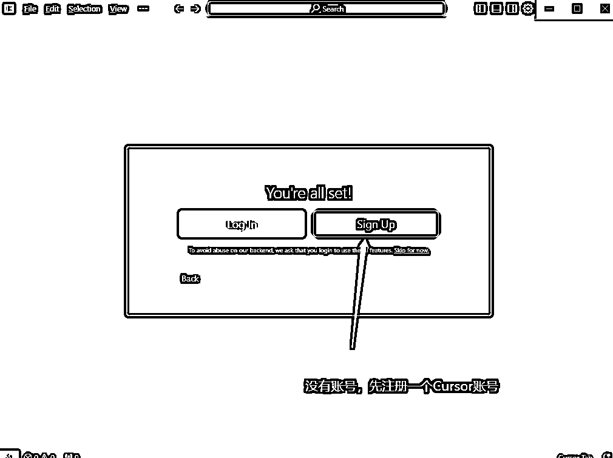
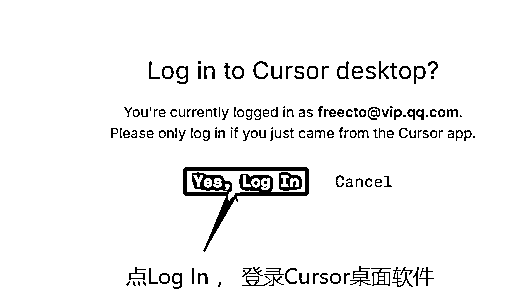
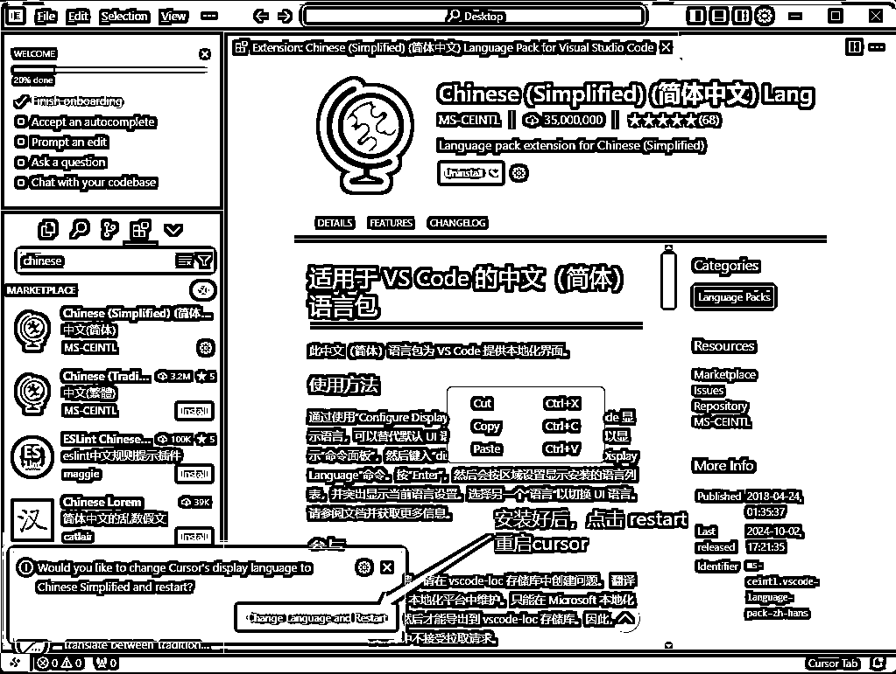

# Cursor零基础入门保姆级教程，Cursor按图生成网站代码，Cursor制作谷歌插件，人人都是程序员

> 来源：[https://qoc4h6bgpc.feishu.cn/docx/UNU9drWbBoFaWmx636ycB9wAnXg](https://qoc4h6bgpc.feishu.cn/docx/UNU9drWbBoFaWmx636ycB9wAnXg)

大家好，我是码叔，最近因为做用户增长运营师的考证项目，拿了官方的考证授权代理资格。然后需要做一个公司官网，证明自己是官网授权的（官方会有授权机构链接到这个站），推广这个考证项目，顺便做一下百度的SEO，多一个流量入口。本来原计划是找设计师，自己制作产品原型图，然后安排设计师外包，制作高保真的UI设计稿，然后安排前端开发写前端代码，然后开发后端代码，完成这个网站开发。碰巧最近看到Cursor这个新技术，看介绍说可以一行代码不写，直接生成代码，立马找资料学习，体验了一下，确实不错，设计费和前端开发费立省几千。

# 一、网站制作准备工作

首先，码叔找了一个参考的竞品网站，用谷歌浏览器的截图插件，把竞品网站的页面截图，一个简单的企业网站一般4个页面搞定：1、首页 2、文章列表页面 3、文章详情页面 4、搜索页面，把这4个页面的截图先保存，等会会用到。

# 二、从零了解Cursor

## 1、Cursor是什么？

Cursor 是一款基于人工智能的代码编辑器，创建了一个集成开发环境 （IDE）。旨在帮助开发人员编写代码，并与 AI 进行实时互动，提供代码建议、错误检测和自动补全功能。

与传统编程工具相比，Cursor 最大的特点是将 AI 技术深度嵌入到编辑器的各个功能点中。这种深度集成使 AI 功能不再是简单的附加组件，而是成为编辑器的核心部分，为用户提供更自然、更高效的编程体验。

## 2、Cursor 的优势

相较于 GitHub Copilot 等其他 AI 编程助手，Cursor 的优势主要体现在以下几个方面：

### 1.多模型支持

Cursor 提供多个 AI 模型供用户选择，并允许用户对 AI 进行个性化调整，以匹配自己的编程风格和偏好。

最近一段时间 cursor 的翻红，尤其是近期接入 claude sonnet 3.5 后，生成的代码质量和成功率大大提高了。

### 2.基于整个代码库的智能提示

不同于传统工具仅基于当前文件进行代码补全，Cursor 能够分析整个项目的代码库，提供更加精准的智能提示。

### 3.实时代码分析与修复

Cursor 能够实时分析代码，识别错误并给出修复建议，大大提高了代码的准确性和开发速度。

### 4.高级 AI 对话功能

用户可以通过自然语言与 AI 助手进行对话，询问编程相关问题或要求执行特定任务，这极大地提升了代码重构、优化和理解的体验。

### 5.Tab 光标位置预测和多行编辑

Cursor 能够智能预测用户下一步可能修改的位置，使代码浏览更加流畅。同时，它的多行编辑功能允许一次性对多行代码进行修改建议，这在进行大规模代码格式调整时特别有用。

### 6.隐私和安全性

考虑到代码安全的重要性，Cursor 提供了隐私模式，并已通过 SOC2 认证。用户可以选择不在服务器上存储代码，从而增强数据的安全性。

# 三、安装Cursor

## 1、下载安装包

打开Cursor官网 https://www.cursor.com ，点击 “Download for Free” ，下载Cursor 安装包，支持 Windows 和 Mac 系统。

## 2、双击安装，用默认设置，点继续

双击安装Cursor，Language for AI，这里的空格填： 中文 ，然后点“Continue”

## 3、点Use Extensions

## 4、选Privacy Mode，点Continue

## 5、点Sign Up，注册账号

## 6、点Sign up, 注册账号

## 7、输入姓名，邮箱，点Continue

## 8、选中复选框，真人验证

## 9、输入密码，数字+字母+特殊字符

## 10、查收邮件里的验证码

## 11、QQ邮箱不正常显示，点纯文本

## 12、复制cursor邮箱验证码

## 13、点“Yes,Log In”，登录桌面端

## 14、提示登录成功

## 15、成功进入Cursor首页

# 四、安装Cursor中文插件

## 1、点File>Preferences>Extensions

## 2、输入chinese，安装插件

## 3、点restart重启，菜单变中文

# 五、Cursor生成代码

## 1、输入生成网页的cursor提示词

帮我制作一个博客网站，需求如下：

1、共4个页面

首页: index.html

文章列表页面: category.html

文件详情页面: article.html

文章搜索页面 search.html

2、页面风格简洁大气

3、样式文件 style.css 放入 css 文件夹

4、文章搜索和文章列表页面带分页功能。

5、生成的4个页面，网页内容帮我填充一些样例数据。

## 2、点Accept all，更新代码

## 3、点复制路径，在浏览器中预览代码效果

## 4、生成的博客首页

## 5、生成的文章列表页

## 6、生成的文章搜索页

## 7、生成的文章详情页

## 8、点Add File to Cursor Chat，上传图片，根据图片生成前端代码

## 9、图片找一个样例网站，用截图插件截图整个网页

这里拿了码叔昨天刚做的一个官网举例，这个网站的前端代码都是cursor帮我生成的，后端用了码叔自己开发的后台管理系统。

## 10、选中刚截图的网页图片，上传

## 11、上传网页截图，输入提示词

帮我按照这个图片，制作文章详情页面，要求如下：

1、生成的网页内容，头部，底部，布局，样式，都和图片里的一模一样。

2、图片用占位图片占位，确保布局和图片里一样。

3、字体的颜色，样式，确保布局和图片里一样。

## 12、复制刚生成的网页代码，保存到article.html里，刷新浏览器，重新预览

## 13、根据图片生成的网页效果，不错了，80分

## 14、顶部logo，搜索，导航菜单样式不对，继续优化提示词

生成的网页内容有问题，请修复如下问题：

1、logo图片请用1个空图片占位

2、搜索按钮和搜索提示的布局和样式，请和刚上传的图片保持一致。

3、顶部的导航菜单的背景和字体颜色样式，请和刚上传的图片保持一致。

## 15、复制刚生成的新代码，刷新页面，不错，90分了

## 16、搜索、面包屑导航、文章内容底部样式不满意，继续发提示词优化。

生成的网页内容有问题，请根据图片，修复如下问题：

1、“最近热搜”的内容是在搜索框的下方。

2、顶部左侧缺少logo图片，请用一个占位符图片。

3、面包屑导航里的文章标题也是1个超链接。

## 17、复制刚生成的新代码，刷新页面，不错，95分了

不满意的地方，针对这一个小问题，继续和Cursor对话，改进小细节，直到满意为止。

# 六、Cursor生成网站操作视频

# 七、Cursor生成谷歌插件操作视频

用Cursor制作一个简单的谷歌插件，网页截图。

在Cursor的Compose提示框中输入如下提示词：

帮我做一个谷歌插件，需求如下：

1、点击插件，弹出popop窗口，放一个按钮“网页截图”

2、点击按钮“网页截图”，可以对当前网页截图。

3、截图文件保存到下载目录，并且新开1个标签页打开这个图片，预览截图。

我们做一个复杂的谷歌插件或应用，可以把复杂应用任务拆解，拆解成1个个小任务，然后用Cursor解决这些小任务，最终拼接成一个复杂应用。码叔开发的这个截图插件，还是有点复杂，有4个功能：当前屏幕截图、选中区域截图、完整屏幕截图、当前位置截图，这些代码也都是Cursor一步步反复提问，优化生成的。今天也发布到了谷歌应用市场中，审核中。注册了域名、服务器、开发谷歌插件、上架谷歌应用市场，跑完整个流程。

Cursor制作网页截图的谷歌插件操作视频如下：

# 八、Cursor生成谷歌插件官网

因为发布谷歌插件，需要用到一个插件官网，码叔又用Cursor制作了一个谷歌插件的官网。

在Cursor的Compose提示框中输入如下提示词：

我要制作一个网页截屏的谷歌插件的官网，功能如下：

1、整个官网就1个页面，功能有：

插件介绍，插件安装，插件演示视频，插件常见问题，联系我们，版权信息。

码叔用Cursor生成了插件网站的中英文版本，第一次生成的代码不满意的地方，反复提问，优化代码，最终成品效果如下：

# 九、Cursor使用心得

我们整理好自己的开发需求，发送需求给Cursor，然后根据Cursor生成的代码，预览效果，不满意的地方，针对局部细节，继续提需求提问题，让Cursor继续完善代码，这样完全可以做到不写一行代码，全靠发送中文提示词指令给Cursor，完成一个网站的开发。

因为码叔是个程序员，网站后台代码有现成的，后台管理系统可以不改代码，直接拿过来用，可重复使用。这里就只用Cursor来完成前端代码的开发。当然，Cursor也可以直接生成后台管理系统的代码，不过后台就比较复杂了，需要安装Java环境，Idea，数据库，Redis，难度会大一些。

类似上面这样一个完整的后台管理系统，让Cursor来一步步完成，调试花的时间估计会很多。用Cursor来制作一个简单的网页，谷歌插件，微信小程序，APP代码等，比较合适，程序员学会Cursor，也可以极大的提高开发效率，产品经理、UI设计师、前端开发、后端开发、测试工程师等，都可以用Cursor来编程，人人都是产品经理，人人都是程序员。

码叔最近用Cursor制作了谷歌插件、微信小程序、网站等，也在录制Cursor编程课程，计划录制100个Cursor实战项目视频，已录制10个Cursor实操视频，等完善好了，再来分享，对Cursor感兴趣的，欢迎链接交流。

感谢大家的观看，今天码叔的分享就结束了，我们下次见。