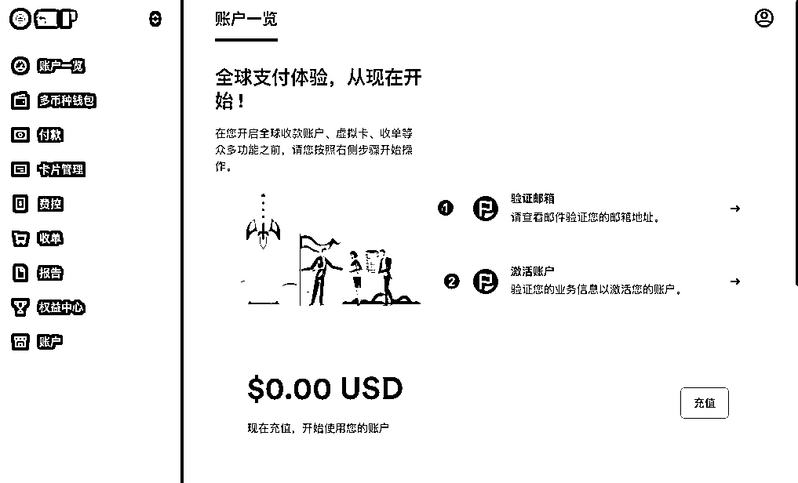
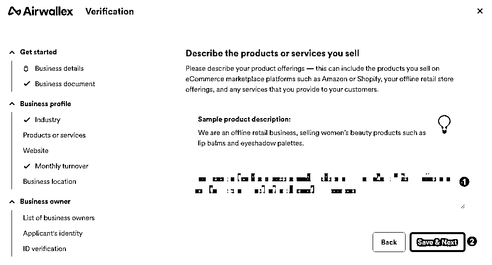

# 出海网站经验总结手把手实现出海网站收款全流程

> 来源：[https://jkmm9rrxfa.feishu.cn/docx/UmczdKLg5ohXa4xgBcLcy0gSnbg](https://jkmm9rrxfa.feishu.cn/docx/UmczdKLg5ohXa4xgBcLcy0gSnbg)

旨在分享在开发海外网站过程中积累的经验。无论您是刚开始计划将业务拓展到海外，还是已经在这个领域有所尝试，希望这里的内容能为您提供有价值的参考。

这个项目源于个人在开发海外网站和设立跨境业务过程中的实践经验。我们深知这个过程中可能遇到的各种挑战和困惑，因此希望通过分享自己的经验，为同样在这条路上探索的朋友们提供一些参考和帮助。

本内容将持续更新，包括但不限于海外公司注册、银行开户、支付系统对接、法律合规以及网站开发的技术细节等方面。

# 海外公司注册

1.  全流程的概况

### 全流程的全景图

要实现海外网站收款全流程，我们需要完成几个重要的前置行动，如图：

注意：

*   「实益所有权信息报告」我注册的时候，只要 9 美元，现在涨价了，需要 25 美元。

*   公司备案费用也涨价了，原来是 100 美元，现在需要 104 美元。

*   所以上面的图片中，159 美元 -> 179 美元。

*   大家需要注册的话，还是尽早行动起来吧。

### 花费时间

这是我第一次走完全流程，花费时间比较长，从 6 月 2 日申请注册公司开始，到 7 月 22 日激活 Stripe，一共花费了 51 天！这期间走了不少弯路（尝试了两次水星银行），遇到不少坑（比如 IRS 把公司法人名字写错了），主要时间都是等待上。

我这种情况比较特殊，大家应该不用这么多时间，下面是正常流程大概花费的时间，仅作参考。

注意： 以上所列天数均为工作日，不包括周末和法定假日。

1.  注册海外公司

在这篇文章中，给大家介绍怎么注册一个海外公司，我注册的是美国的公司，所以这里就以美国公司为例了。

### （1）注册地址

👉 wyomingagents （再推荐一个国内的海外公司注册平台，大家有兴趣可以了解一下 IngStart）

wyomingagents 是一家提供美国怀俄明州公司注册和管理服务的代理机构，怀俄明州的税收很低，适合小团队或者个人注册公司，成本低。

### （2）注册流程

*   选择「Form a Company」（成立公司）

*   这里显示注册公司只需要 $150，下面有一个「实益所有权信息报告」选项需要加上，届时再做说明。

*   不用先注册登录这个网站，在后续的流程中，会让你注册网站的。

*   填写信息

① Desired Company Name (期望的公司名称)：填写你的公司名称（英语公司名称）

② Alternative Company Name (备用公司名称)：填写你的公司备用名称，这是为了防止上面的公司名称不可用的情况下，可以选择这个备用公司名称来注册。

③ Business Entity Type (企业实体类型)：我们是个人公司，所以选择 LLC（单一成员有限责任公司）就可以了。

④ Notify Your Attorney of a Lawsuit (通知您的律师有关诉讼)：选择 NO，因为我们没有律师。

⑤ "We'll file your Beneficial Ownership Information for you" (我们将为您提交实益所有权信息)：强烈建议这里直接勾选上，「实益所有权信息报告」是美国联邦法案要求大多数新成立和现有的美国公司向美国财政部的金融犯罪执法网络（FinCEN）报告其实益所有人的信息。另外，提供实益所有权信息可以增加公司的透明度，许多银行在为公司开设账户时会要求实益所有权信息。提前准备这些信息可以使开设银行账户的过程更加顺利。如果这里忘记勾选了，后面公司注册成功之后，可以再申请，或者找第三方渠道申请，这样太麻烦，不如这里直接勾选上。

* * *

① 费用选项：LLC 的公司就这一个选项，默认即可。涨价了，100 美元 -> 104 美元。

② Member or Manager Managed (成员或管理者管理)：默认即可。

③ Member #1 (成员 #1)：我们是一人公司，公司成员自然只有我们自己，填写自己的名字即可，拼音，比如张三，那么，First Name 是 san，Last Name 是 zhang。

④ 如果有合伙人，点击「Add Member」添加即可。

* * *

① First Name、Last Name（姓名）：跟上面一样，填写自己的姓名拼音。

② Phone Number（电话号码）：填写自己的真实手机号码。

③ Country（国家）：China（国籍是哪个国家就选择这个国家）。

④ Physical Address（物理地址）：填写真实地址，这一步很重要，一定要填写自己的真实地址，我填写的是住址，租的房子。建议把中文地址写一遍（平时收快递的地址），然后用 AI 翻译成英语表达的方式即可。

⑤ City（城市）：填写自己长期居住的城市，用拼音。

⑥ State / Province（州/省）：同理，填写自己长期居住的省或者市，用拼音。

⑦ Zip / Postal（邮编）：同理，填写自己长期居住地的邮政编码。

* * *

① Email（电子邮件）：这个步骤是注册 wyomingagents 网站的。填写自己最常用的邮箱即可。

② Password（密码）：密码，一定要按照要求填写密码，密码要求比较复杂，自己保存好，别忘了，公司相关的文档都会保存在这个网站，方便随时查卡。

*   密码必须至少8个字符

*   密码必须包含至少一个大写字母

*   密码必须包含至少一个数字

*   密码必须包含至少一个特殊字符

③ Confirm Password（确认密码）：确认密码，要求两次输入密码必须一致。

* * *

① Wyoming Business Presence Package（怀俄明州商业启动套餐）：这个套餐包含：

*   1 年免费域名（价值最高 25 美元）：后面会让你提供一个公司域名，然后会自动使用 WordPress 搭建一个很简单的公司官网，几乎没法用，需要自己去后台修改。

*   电子邮件和电话服务：会提供一个免费试用的美国怀俄明州的电话号码，有 APP，可以接收短信（亲测有效，但是电报的验证码收不到，问了官方，他们说应该是可以的，但我没收到，可能是网络或者其他原因，不纠结了），网络电话好像不太好用，几乎也用不着。

② Annual Report Compliance（年度报告合规）：默认选上，免费的，这是一项法律要求，每个公司都必须在其成立周年日提交。不遵守可能导致公司被州政府解散，后果很严重。

③ Tax ID (EIN) Service（税务ID（EIN）服务）：EIN 非常重要！后续申请美国银行卡，激活 Stripe 都用得着。但是这里我就不够选了，太贵了，美国国籍只需要 75 美元，但是非美国籍需要 250 美元，差别太大，太贵了，可以自己去美国国税局官网或者第三方找人申请，后面《2、申请 EIN 税号》文章中会详细说明如何操作和避坑。

④ 其他的，比如 Corporate Supplies（公司用品）、Trademark Service – $499（商标服务 – 499美元）、Trade Name (DBA) – $225（商业名称（DBA）– 225美元）等，一般都不需要，就不用勾选了。

* * *

① 填写支付信息，确认账单，用国内的 Visa 信用卡就行，我用的是招行的 Visa 信用卡。

② 确认无误之后，点击提交订单，收到扣款短信（今年 6 月是 159 美元，现在涨价了），说明注册公司的订单成功了，接下来只需要等待就行，一般情况 3 天左右就能注册下来了，还是很快的。

### （3）确认注册信息

完成以上注册公司订单之后，信息填写部分就完成了，接下来，登录网站，确认订单上填写的公司信息，过程就比较简单了，我就把当时的截图贴一下吧。

*   红色框里的内容都是需要确认的。

*   接下来，点击「Continue」，验证各种信息。

*   信息确认完之后，会给一个公司在美国的代理地址，这个地址就是公司注册地址，很多地方都用得到，记下来。

至此，怀俄明州美国公司的注册申请就算完成了，静静等待就行，过几天来官网看一下，公司注册成功之后，可以在网站上看到公司相关的文档：Operating Agreement（运营协议，重要文件）、Initial Resolution（初始决议）、Formation Document（成立文件）

### （4）其他

*   上面注册过程中，套餐里包含网站，手机号，商业电子邮件等信息，大家可以登录网站后台查看。

*   公司网站是 WordPress 部署和发布的，后台有给账号和密码，自己登录 WP 修改官网，第一年是免费的，后面需要付费，可以在后台取消续费。

*   公司邮箱账号也是一样，可以登录邮箱后台，收发邮件。

*   美国手机号，下载他们的 APP，登录即可收发短信。

*   商业电子邮件、SSL、电话和网站在免费试用期结束后，每月每项收费 9 美元。域名将在 1 年免费试用期后，根据域名的市场价格每年收费 25 美元。续订服务和注册代理服务将按年收费。

1.  说在最后

以上就是注册美国公司的基本操作流程了，还是挺简单的，如果大家有需要，我建议尽早注册，避免再次涨价，一人公司，能省一点是一点。

需要注意的是，如果需要开通空中云汇的支付，那么请一定要去注册英国公司，我也是后来才知道的，美国公司申请不下来，除非你有美国身份。但是能够开通美国银行卡，有了银行卡就可以接收 Stripe 的支付了。

在申请银行卡之前，需要先申请公司的 EIN，请前往 2、申请EIN

# 推荐一个国内的海外公司注册平台

*   网址：IngStart WEB：英格斯特

我最近了解到 IngStart 这个平台，感觉挺有意思的。它主要是帮人在美国、香港、英国和新加坡这些地方注册公司，还提供一些合规和税务方面的服务。

用起来好像挺方便的，你可以在网上注册账号，然后就能在线完成整个注册流程。他们还会帮你搞定代理地址和股东信息之类的事情。

我觉得它的好处就是把所有事情都集中在一起了，管理起来也比较简单。而且它有中文服务，对咱们来说挺友好的，价格也很有竞争力，重点是： 一条龙服务，省事！

如果你对这个感兴趣的话，可以去他们网站上问问客服，应该能了解更多详细信息。总的来说，感觉是个还不错的选择，特别是对那些想在海外开公司但又不想太麻烦的人来说。

# 申请 EIN

1.  什么是 EIN？EIN 能干什么？

EIN 是 Employer Identification Number 的缩写，中文通常翻译为“雇主识别号”或“雇主识别码”。这是一个由美国国税局（IRS）发放的 9 位数字的唯一识别号码，相当于企业的社会安全号（SSN），是企业在美国的税务身份证。我们通常也简称为“税号”。

EIN 的主要用途：

*   税务报告：用于提交联邦税务申报表。

*   开设银行账户：大多数银行要求企业提供 EIN 才能开设商业银行账户。

*   以上两点，对我们比较重要，EIN 还有其他用途，请自行 Google。

总之，有了 EIN 之后，好多事情都好办了。

1.  申请 EIN

请注意，要想申请 EIN，首先必须要有公司。1、海外公司注册 中说到，申请公司的时候，如果带上 EIN 申请的话，非美国籍公民，费用很贵，秉着“省一笔是一笔”的原则，我们可以通过其他方式来申请 EIN。

有网友的经验是，自己去 美国国税局（IRS）官网 在线申请，我大概看了下，需要填写的信息还挺多的，比较麻烦，好处是免费，并且据说如果申请符合所有要求，系统能够自动验证通过的话，能够立即收到 EIN。

我没有去自己申请，是在 Fiverr 上找人办理的，输入关键词 “EIN”，就能找到很多办理 EIN 申请的代理人，找一个评分比较多且高的代理人就行。大部分价格相差不大，有的可以办理其他业务，所以显示价格比较高，点进去选择仅申请 EIN 就行。

联系上之后，代理人都会告诉你需要提供哪些材料，其实就是注册公司成功之后的一些资料信息。提交完成之后，先付一部分费用，等完成之后再付剩余的费用，接下来只需要等待即可，一般情况下，7 个工作日左右就能下来。但是我这次就遇到了一个“坑”。

我是 6 月 4 日提交的材料，代理人说大概需要 8～12 天能申请下来 EIN。

6 月 13 日，代理人说 IRS 在确认信上把公司的法人名字写错了，代理人说之前遇到过类似问题，但比较少，说是 IRS 那边的工作人员工作压力比较大，会出现各种问题，但是代理人名字写错还是很罕见的，不好解决。

6 月 13 日 ～ 6 月 20 日，这期间代理人不断跟 IRS 的工作人员进行沟通，一开始是写邮件说明，后来又要求写纸质邮件进行补充说明，前后花费了 8 天时间。

6 月 21 日，代理人告诉我 EIN 终于申请下来了！

前前后后一共用了 18 天，不过倒没有耽误啥事，因为这期间我一直在开发网站，暂时还用不上 EIN。

1.  说在最后

其实在 Fiverr 上找代理人申请 EIN 挺合适的，价格不贵，关键是省事，而且还有人帮你检查一些重要信息，Fiverr 平台挺靠谱的，在这个平台能找到很多可以代办的事情，比如公司注册 + EIN 全套服务等。

好了，至此公司和 EIN 都下来了，接下来就是申请一张美国商业银行卡了。请前往 3、申请美国银行卡

# 申请美国银行卡

1.  为什么要申请美国商业银行卡？

*   激活 Stripe 要求是商业银行卡，不建议使用个人银行卡。

*   分离个人和商业财务，可以规避一些税收等问题。

*   还有其他好处，请自行 Google。

1.  选择开通银行卡的机构

对于出海同学来说，可能听到最多的是“水星银行”了，“水星银行”其实不是银行，是一家靠谱的金融机构，水星的卡特别适合小团队和个人公司，便捷且费用低。

但是现在水星银行对国内的用户好像越来越严格了，我申请了两次，都没有通过，邮件询问官方，也没有给出具体原因，资料都是按照要求提交的。

后来，我放弃了申请水星银行。了解到“空中云汇”也可以开通美国商业银行卡，于是就去申请了。

1.  开通“空中云汇”的美国商业银行卡

请注意，如果需要开通“空中云汇”的支付功能的话，请一定要申请英国或香港公司，或者申请之前跟官方人员沟通一下。

### （1）地址

👉 Airwallex 空中云汇

### （2）开通流程

① 注册公司所属国家：美国

② 和 ③ 公司的法人姓名，也就是你自己的名字，这里填写中文姓名即可。

④ 手机号：填写自己正在使用的手机号即可。

⑤ 密码：登录“空中云汇”的密码，牢牢记住。

⑥ 企业邮箱：我填写的是注册公司的时候申请的邮箱。

* * *

选择开通“空中云汇”的用途，一般情况下，选择「收单、接收转账、多币种换汇」这 3 个就够了。

* * *

① 验证邮箱：比较简单，点击进去，然后去验证就行了。

② 激活账户：这一步有一些繁琐，一共分为 10 个小模块，需要填写的信息比较多，下面来一一介绍。

* * *

① Entity（实体类型）：选择「Company」。

② Legal entity name（法定实体名称）：公司的名称，比如：ABC LLC。

③ EIN（雇主识别号）：这里就是 申请 EIN 中申请的税号了。

④ Principal place of business address（主要营业地址）：填写当前自己常住的有效地址，跟申请注册公司一样就行。

⑤、⑥、⑦ 很简单，填写地址对应的城市，省/市和对应的邮政编码即可。

* * *

① 这一步就是需要上传 海外公司注册 里的公司注册文件，下载下来，上传即可。

* * *

① 选择你的公司主要经营的行业，根据自己主营的行业来选择就行。

* * *

① 这里填写你的公司产品或服务描述，按照实际情况填写就行，按照例子的写法，简单清晰明了即可。

* * *

① 填写你的网站地址，注意是已上线的网站，可以是自己公司官网，网站不要过于简陋，像个正常的网站，最好是跟自己前面填写的业务相关。也可以是电子商务平台上的在线商店、应用商店下载链接和社交媒体资料。可以添加多个网站，毕竟是人工审核，资料越详细越真实，就越容易通过。

* * *

① 选择你的公司产品或者服务的月收入或者营业额，如果还没有收入，选择第一个最少的那个就行了。

* * *

① 选择你的业务开展的地区，最多选择 5 个地区，如果是面向全球的业务，选择几个主要国家即可。

* * *

① 填写你的公司实际控制人，一人公司就填写自己的名字，如果还有合伙人，继续添加即可。

* * *

这里填写的是申请人的信息。作为申请人，我们还需要完成在线实时身份确认步骤。点击 “Submit” 后，系统会引导我们上传身份证复印件，并通过简单的视频互动来验证我们的身份。

①～⑤ 填写自己的姓名。，职位，出生日期和国籍等信息，不再赘述。

⑥～⑨ 填写政府身份证件：“空中云汇”目前只接受中国公民的中国身份证。如果不是中国公民，需要提供中国境外发行的身份证件。我们直接提选择个人身份证即可，这里选择，等到在线实时身份确认的时候，会让你拍照的。

⑩～⑭ 填写我们当前常住的地址信息，这里可以直接填写中文地址。

⑮ 点击「Submit」提交之后，会跳转到在线身份验证部分，按照提示进行操作验证即可，比较简单。

* * *

上面的信息填写完成之后，我们就可以看到“激活账户”变成「审核中」状态了。

1.  说在最后

再啰嗦一下，如果需要“空中云汇”的支付功能，那么请注册英国或香港公司，美国公司几乎行不通（除非你有美国籍），这是我跟官方沟通过的结果。

不过，我们一般也不用“空中云汇”的支付功能，能开通美国银行来收款就可以了，支付功能我们直接激活 Stripe 就行。

申请填完“空中云汇”流程之后，我们接下来等待就行，一般 3～5 个工作日，“空中云汇”的工作人员会打电话给你，就是确认一些信息，以及说明美国公司要想开通“空中云汇”的全部功能，需要哪些条件和资料。

我们当时没有沟通清楚，我以为美国公司不能开通“空中云汇”了，正准备去找其他替代方案了呢，结果过了几天之后，收到短信，账号开通成功了。

然后，我们登录“空中云汇”网站，去后台开通选择和开通美国商业银行卡就可以了。

1.  至此，我们终于完成了美国商业银行卡的开通，接下来就是出海网站收款全流程的最后一步了，请前往 激活Stripe

# 激活 Stripe

相信大家如果做出海网站，多少都听说过 Stripe 了吧，Stripe 安全可靠，容易上手，费用相对较低，客户支付体验好，可以说是出海网站支付首选了。

看到这的同学应该都已经准备好公司，EIN 和海外商业银行卡了吧，如果还没有准备好，请先看下下面的 3 篇文章参考一下吧。 1、海外公司注册 2、申请EIN 3、申请美国银行卡

下面我们开始一步一步来激活 Stripe 吧。

1.  激活 Stripe

### （1）地址

👉 Stripe 官网

### （2）激活 Stripe

① 业务所在地：美国，选择自己注册公司真实所在国家。

② 商家类型：选择 Company 即可。

③ 公司结构：Single-member LLC，选择实际公司的类型。

* * *

① 法定商家名称：填写自己注册的公司名称。

② 雇主识别码（EIN）：填写公司的税号 EIN。

③ 商家注册地址：这里填写注册海外公司时给的公司海外地址。

④ 行业：选择公司实际的业务或服务所属的行业。

⑤ 公司网站：这里可以填写申请公司时搭建的公司官网，但是太简单的话不行，可以是已上线的其他网站，我填写的是刚上线不久的 AI 图片网站：https://imgai.ai

⑥ 产品描述：填写网站提供的功能，如实简洁描述即可。

* * *

① 法定名称：这个步骤是来验证公司法人信息的。这里填写自己的姓名，中文就行。

② 邮件地址：填写自己常用的邮箱即可，建议 Google 邮箱。

③ 出生日期：填写自己的出生日期，和身份证上的保持一致即可。

④ 家庭住址：填写自己当前常住地址即可。

⑤ 电话号码：这里我填写的是注册公司时买的美国号码，如果没有，填写中国手机号应该也可以。

⑥ 个人身份证号码：选择中国（CN），然后填写自己的身份证号码。

* * *

这部分是对客户提供的公司公开详情，这些信息可能会显示在付款说明、账单或者收据上。

① 对账单描述符：直接填写公司名称就行。

② 客服电话：我填写的是公司的电话，可以关闭在收据和账单上显示。

③ 客服地址：我填写的是公司的美国注册地址。

* * *

① 选择您的银行账户：这里直接填写 3、申请美国银行卡 申请开通的美国商业银行卡信息即可。

② 选择您的提现计划：自定义选择提现计划，自动或手动都可以。

* * *

① 这一步是 Stripe 账号的两步验证，按照要求进行操作就行了，挺简单的。

* * *

① 选择税款计算方式，我选择的默认方式：一般 - 以电子方式提供的服务。你也可以看一下其他方式，哪种适合自己就选择哪种，不知道哪种合适，就选择默认的。

* * *

截止到这一步，信息填写部分基本就完成了，直接点击「同意并提交」，然后应该就会跳转到一个「补充身份验证资料」的页面，前面还记得填写过身份证号吗？这里就需要上传或者拍照上传身份证照片了。

* * *

这一步就是「补充身份资料验证」了，选择自己方便的方式上传身份资料就行，最好是提前准备好身份证的正反面照片，然后直接上传即可。

* * *

完成以上所有步骤之后，就会跳转到「激活成功」页面，这时候我们的 Stripe 激活就算是完成了！剩下的就是我们自己按照 Stripe 文档，把支付对接到我们的网站就可以啦！

1.  说在最后

好了，到这里，我们就走完了出海网站收款的全流程了，走之前感觉挺麻烦的，但自己必须要走，走的过程中，我遇到各种问题，各种意外情况，尝试摸索着，走完整个流程，前后花费了一个多月时间。

现在回过头来看，这些经历挺值得的，只有自己走过一遍，才知道是这么回事，下次再走，就简单了许多。

如果这些经历能够对你有所帮助，那我可就太开心啦！

最后的最后，祝大家也祝自己：出海之路，乘风破浪，一帆风顺，收获满满！