# 「适合新手」作为实习志愿者，我收获了什么？

> 来源：[https://wiz662adgxu.feishu.cn/docx/VP7QdhrmPoFAmkx6l3RceuhNnMg](https://wiz662adgxu.feishu.cn/docx/VP7QdhrmPoFAmkx6l3RceuhNnMg)

# 一、前言

大家好，我是西里，先简单介绍一下自己。

## 个人简介

在做什么？

1.  2024 年 3 月成功转行新媒体运营涨薪，目前负责公司小红书运营。

1.  2024 年 8 月开始运营公司教资引流账号，2 个月累计引流 2500+教师，单日最高突破 300 人。

## 生财经历

我和生财有术的缘分从今年的 5 月开始。

1.  2024 年 5 月：正式加入生财有术社群。

1.  2024 年 6 月：参加小红书百货航海项目，在航海结束时成功跑通 MVP，实现 GMV 500+。

1.  2024 年 9 月：第一次担任小红书教育资料引流航海的志愿者，开启了新的挑战。

## 航海小组目标

这次的航海小组成绩

作为志愿者，我负责的小组在这次航海中取得了以下成绩：

*   小组共计 20 人，15 人上岸，上岸率 75%。

*   组内 1 位船员打卡 21 次，成为 “行动的巨人”。

*   14 位船员打卡 12 + 次；3 位船员跑通 MVP。

*   “荣”获小组排行榜倒数第一。

虽然我们小组在这次航海中"荣获"小组倒数第一，但还是很高兴能船员一起成长，帮助船员跑通了 MVP。

## 个人目标

这次的航海目标，我主要有下面的这 4 点：

1.  参与实战，尝试一个新的赛道：在航海期间，我打卡了 16 天，没有能够跑通项目，目前已经重新规划好了重新开始，今天开始更新第一篇笔记啦～

1.  链接有趣的朋友：在这次航海中，我添加了 33 位船员好友，到航海结束时，链接到了 52 位圈友，其中约 10 位是我主动添加的，有几位大佬还给了我非常实用到建议～

1.  提升社群运营能力：之前我是没有接触社群运营的小白，这次作为志愿者参与进来有很大的收获啦。之前的我连群发消息只能发给 9 个人，怎么确认人员进群都不知道，到现在熟练转发消息、确认成员进群等运营技巧，效率提升非常多。

1.  深度参与航海志愿者体验。这次志愿者深入参与到航海中，作为志愿者也对航海的开展有了更深刻的认识啦，如果突然要我做一场活动的社群运营，起码知道要怎么开始，筹备期，执行运营期和结束的事情，不至于抓瞎。

下面是我的航海纪念票，这次也解锁了志愿者经历～

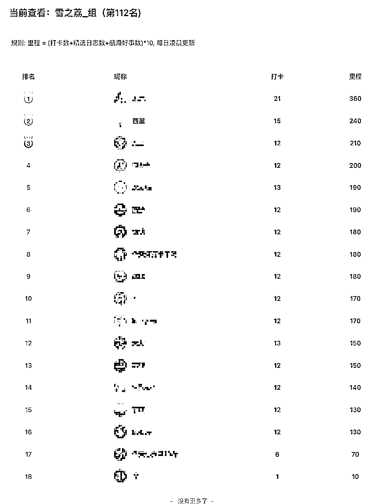

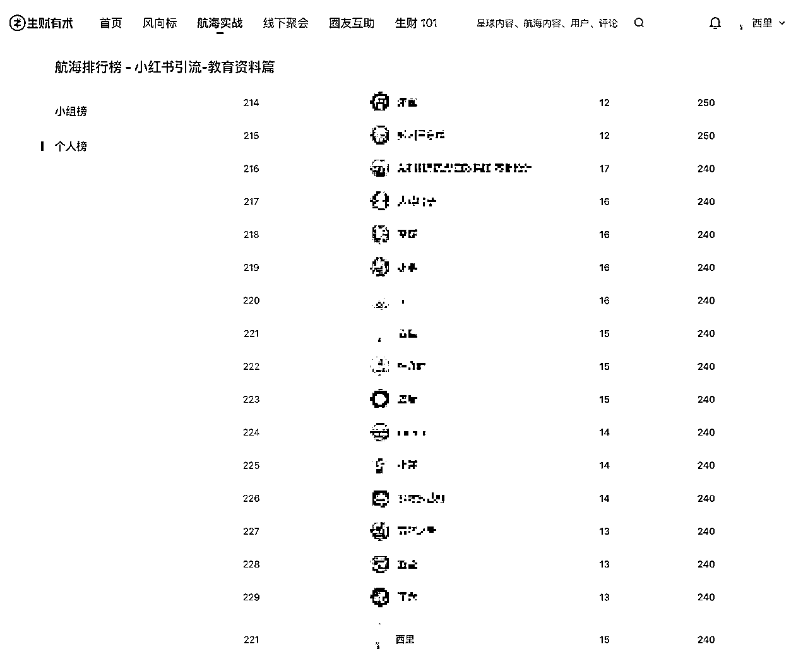

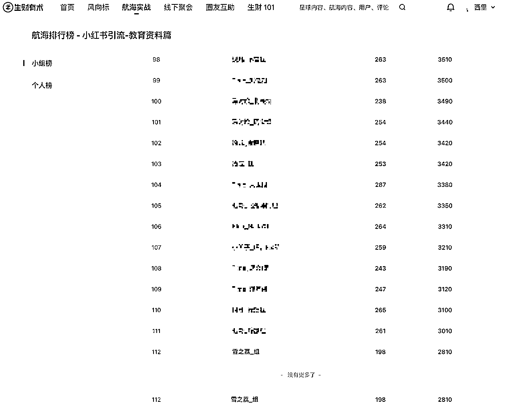

再贴一下我的纪念船票和志愿者档案。非常开心能和船员一起成长，这次也解锁了志愿者经历～

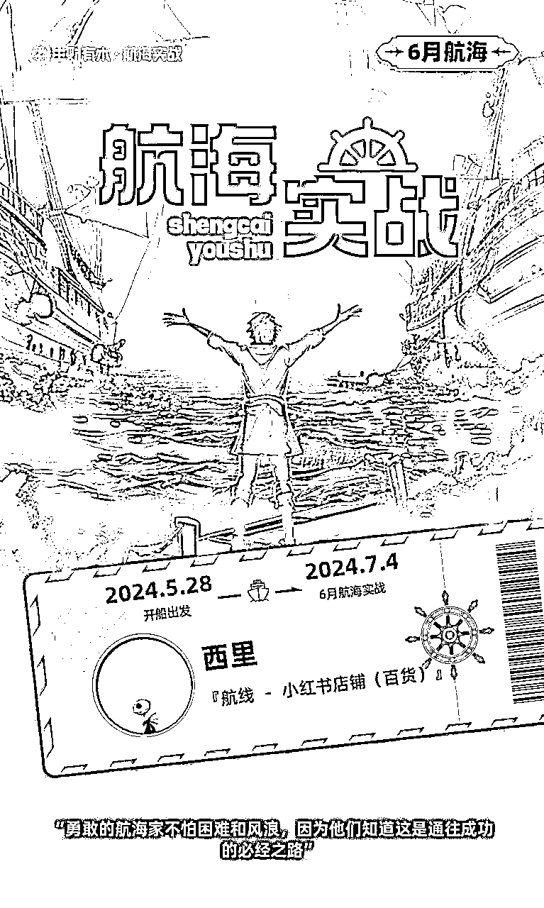


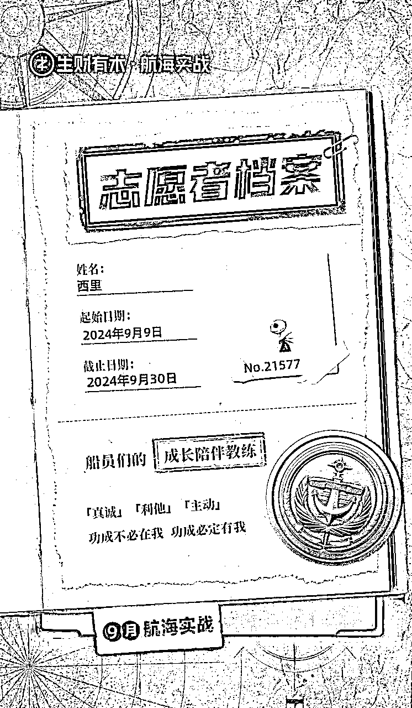

接下来，我将分享一下我作为志愿者的经历、收获、一些踩的坑和一些感悟～

# 二、为什么我会成为志愿者？

因为我自己做过账号，知道一个人太难太容易放弃了，有一点小结果～

1.  做引流账号：在 8 月中旬由于工作需要独自摸索了教育资料引流的账号，1 个月时间引流了 1000 多人（免费送的，白嫖的比例就没办法统计了）。

1.  做账号太累了：1 个人做账号独自学习太折腾太累了，没准自己可以分享一下帮助到更多人。

所以我就有了成为志愿者的动力。

做过资料引流账号：

1.  这段经历让我积累了一定的实战经验。

1.  感觉自己的经验可能对其他人有帮助。

分享避坑经验：

1.  分享自己的经验，没准可以帮助更多人少走弯路。

1.  一起走比独自摸索更快，才能走的远。

嗯嗯，抱着试一试，没准我可以入选的心态，花了三四个小时看了招募要求，写报名的介绍，然后我就……就入选了。

所以我们有时候需要跳出自己的舒适圈，多尝试新的事物，没准就成功了呢，事实证明这段期间收获非常多，成长了很多！

# 三、我是如何做志愿者的？

## 1.梳理好固定事项

开船前后，大致要明白做志愿者需要经常做的事情，然后梳理清楚，这样就不会经常遗忘。

下面是我梳理出来的和我大致的几项：

1\. 小组群消息查看

既然是志愿者，那当然就要注意领队在群内的工作沟通和其他船员的交流。

2\. 日志点评推荐

航行开始后，每周都有固定的时间进行日志点评，这个时候需要志愿者根据标准对船员的日志查看进行推荐了。

3\. 船员日志查看

我大多数时候都会在晚上固定时间段去查看船员的日志，了解一下大概的情况，进行点赞，有些会进行评论（做的不够好还可以更好的，主要是每天点评的船员数不够，也不是每天都去评论）。

4\. 船员打卡沟通

这部分我主要是会看到船员日志里面有困惑的问题、懈怠了的船员、打卡次数不足的船员，根据日志去催打卡沟通。

5\. 领队反馈

我主要是航海前和领队雪荔姐反馈多一点，开船后领队在群里面群接龙反馈了（又 Get 到的一个运营技巧）。

6\. 船员消息通知反馈

这个部分主要是开船前航海规则、保证金沟通，高手领航直播，日志点评船员这些事情会要发送消息，多数情况下，我要么是群发消息后再私聊提醒一下，要么消息会加上昵称，尽可能降低一下是群发消息的感受（还有待提升空间）。

有了志愿者 SOP 手册，为什么还是要记下来呢？

因为在忙碌的情况下，不记下来就会经常遗忘导致有些事情没有执行。

所以我开船前简单梳理了一下要做的固定事项（还是有偶尔遗忘提醒打卡的情况了，唉）。

## 2.阅读志愿者资料

在航行前确认自己被录取后，直至开船前这段时间，仔细阅读志愿者培训手册、志愿者手册以及志愿者 SOP。

对于那些难以记住或印象不深的内容，我会多看几遍，以便更加熟悉流程（尽管还是容易忘了，实操了才是自己的）。

下面这些手册值得收藏并反复阅读：

## 3.添加船员微信

开始加人后，志愿者社群分享了很多的提效方法。

但我之前没接触社群运营，时间有限，我尝试了十多分钟后。

我就选择了"最笨"的方法，手动复制粘贴去搜索添加船员，然后做好标签，因为学习那些提效方法的工具没准都早加完了。

不管高效低效，当时我只想确保在时间点前完成它。

我的最大感受是：行动起来比一直拖着不做好，不管什么办法，先完成了再说，完成了再研究提效。

## 4.微信描述的使用

在航海前后，会经常与船员沟通，以便了解船员的情况，进行日常摸底。我除了会同步信息到志愿者后台，还会将重要内容写到微信描述里。

毕竟志愿者们不常查看志愿者后台，而微信却是天天都看。

关于怎么更好的摸底，我就是多私聊一对一的沟通，这样能更好的拉近和船员的关系。具体实现沟通更好摸底的方法我也还需要学习呀～


## 5.船员分层运营+日志查看针对催促

航行过程中都需要慢慢对不同的船员采取不同的策略，根据调整沟通的频率和关注。

航海规则同步

*   新船员：航行前后重点通知航海规则和保证金规则，频繁沟通了解进度，要特别关注。

*   老船员：对航海规则较为熟悉，无需频繁的提醒。

航行初期（第 1-2 周）策略

*   第 1 周

1.  确保每位船员至少打卡 4 次

1.  把握提醒间隔，按约定进行打卡提醒

*   第 2 周

1.  评估船员打卡情况

1.  重点关注打卡次数少的船员，特别是之前 0 打卡的成员

1.  分析原因：可能忙于其他事务、执行力不足或认为时间尚早

航行中期策略

*   针对剩余休息时间仅 2-3 天的船员重点关注

*   常用的催促方式：

1.  日志问题反馈

1.  表情包

1.  志愿者群分享的话术

航行中后期策略

*   船员分类：

*   全勤打卡船员

*   休息天数 1-2 天的船员

*   休息天数 3-4 天的船员

*   休息天数 5 天及以上的船员

*   掉海船员

*   关注重点：

*   重点关注全勤打卡和休息 1-2 天的船员

*   密切关注休息 3-4 天的船员

*   对老船员和自制力强的船员（通常打卡天数 3-5 天）保持关注就可以

对于怎么让船员积极主动打卡，帮助他们更好的拿到 MVP，我就有非常大的学习空间。

这部分我还看到了志愿者范磊老师的航行日志提到的分组运营就很好很实用，感谢大佬的分享（我航行结束才注意到）。

# 四、志愿者航海实战的收获和踩坑

这次航海实战中，真的学到了很多，有了非常多的收获，也踩了一些坑，我们先看下收获：

## 1.社群运营技巧

### 技巧 1：群接龙

在涉及多人协作需要跟进进度的场景中，就可以用群接龙。

常见的几个好处：

1.  信息集中：所有成员的进度都在一个接龙消息中。

1.  便于查阅：团队的成员可以随时点开接龙消息，快速浏览所有人的最新进度。

1.  便于追踪：接龙减少了反复询问进度，遗漏更新的情况，发起人可以直接就看到整体情况。

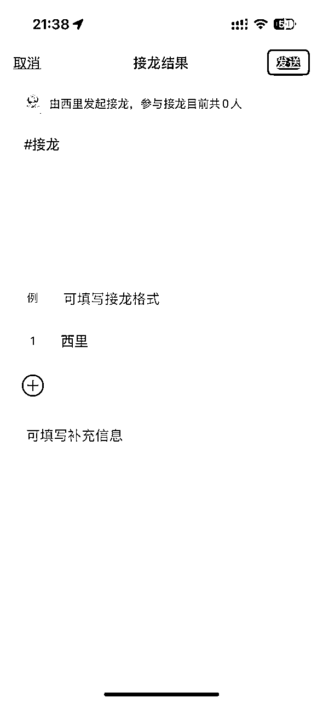

### 技巧 2： 群发消息

这次航海学会了 2 种群发消息的方式，群发助手、搜索昵称群发。

「群发助手」

1.  使用方法：在我一设置一通用一辅助功能一群发助手一开始群发一新建群发就可以。

1.  注意事项：

1.  一次群发只能发单条消息

1.  可以群发文字、图片、视频和自己视频号发布的内容

1.  不能转发视频号直播卡片，也不能转发语音


「手机/电脑搜索昵称转发」

1.  使用方法：长按一>多选一>转发一>逐条转发一>搜索昵称一>发送，可以发送单条消息和多条消息（包括图文混合

1.  推荐使用：通过搜索昵称转发比较高效的，最多可以一次性转发 9 个人～


### 技巧 3 ：备注分类

在标签里加上「序号+统一关键词+航海名字+昵称+其他信息」的格式很好用。

为什么要加上序号？

微信群发最多只能发 9 个人，遇到群发消息的时候就可以直接搜索序号来发啦，就很适合要给多个人发送消息都时候快速搜索选择。

如果我们直接搜索备注关键词会遇到的问题

*   每次搜索关键词后，结果显示的顺序会变化

*   容易混淆区分哪些船员已经收到转发的消息，哪些还没有。

*   建议：可以用表格或者其他方式记录好已经发送的船员

### 技巧 4：确认船员入群

1.  进入微信群：

1.  点击群聊右上角的「···」。

1.  选择「查看更多成员」。

1.  使用标签搜索：

1.  在成员列表中，找到并点击「+」号。

1.  点击出现的搜索框（显示"搜索"字样）。选择预先设置的「标签」。

1.  群成员状态标记：

1.  已入群成员：显示为灰色背景，带有绿色阴影。

1.  未入群成员：正常显示，无特殊标记。

### 技巧 5：船员群发互动技巧

如果最近刚和船员聊过天，我会在群发消息前加上类似"对了" "还有啊" "接下来我们......"这样的内容放到群发消息开头。

这样群发的话术会显得更加自然 ，减少群发消息的生硬感，给人一种延续之前对话的感觉。

除了上面提到的这些，我还学到了一些社群运营的技巧，比如：

1\. 航海活动设置交流群和禁言群

2\. 如何利用"拍一拍"互动反馈

3\. 在群内固定时间发送待办事项提醒

4\. 如何确认船员是否已修改群昵称

……

## 2.笔记制作提效制作（电饭煲老师启发）

自从看了电饭煲老师的分享后，我产生了"原来还可以这样做的感叹"，一下打开了我的思路。

而我知道再好的提效流程都要有实际的应用场景，要能贴合自己的习惯～

所以结合我自己的情况做出了调整，再次感谢电饭煲老师的分享。

### 我想实现的效果：

1.  手动筛选同一个选题的爆款笔记，可以不断增加自己的网感，了解用户的需求，同行的情况。

1.  让 AI 对封面标题、笔记标题、话题标签根据原来的爆款笔记进行拆解重组，尽可能不做修改，主打一个怎么省心怎么来。

1.  作为“懒”人，那正文笔记肯定也希望 AI 能根据原来的爆款笔记来写一下。

1.  使用的账号主要是用来发布大字报的图文笔记。

### 目前实现的效果：

1.  封面标题拆解重组：根据原文的封面标题进行关键词拆解和重组，拆解避免改变原来的意思，比如“羊群效应”不会变成“羊群”和“效应”。

1.  封面标题添加连接词和修饰：会加上一些连接词和修饰词保证衔接通畅，比如又，靠

1.  正文会进行改写，内容字数基本在 350-600 这个区间

1.  多批次输出，同一个 Markdown 格式输出，默认一次最多输出 5 篇笔记，如果超过 5 篇会进行分批次，会询问并等待你回复“继续”再继续输出。

1.  一篇笔记是同一个 Markdown 表格的一行内容

⚠️一点注意事项：

1.  我自己基本一次使用不会生成太多篇，所以 10 篇以上的内容我没有去测试。

1.  本来想一次性输出所有的笔记，但 Claude 没办法一次输出完毕。

### 目前没解决的问题：

1.  笔记标题字数可能会不止 20 个字

1.  一次性生成多篇笔记，可能不止会提取收集爆款笔记里面的封面标题，还会提取参考笔记标题

1.  一次性写多篇笔记，封面标题效果会差一些，需要自己再润色一下

1.  我自己的习惯是同 1 个封面会拆分为 3 组内容，第 3 组会进行润色，有关键词是Claude 自己添加的

### 使用场景

我自己的使用流程是这样的，如下：

1.  收集爆款笔记：小红书上手动收集，记录封面标题，笔记标题，笔记正文，话题标签

1.  后续的批次可能会再次出现表头的问题

1.  Claude 改写：使用提示词进行改写，将封面标题和笔记标题进行提取关键词，拆解重组，加上连接词和修饰词，改写笔记正文。

1.  用 Claude 或者豆包提取出每一篇的笔记标题、笔记正文和标签，然后复制粘贴到公司汇总的飞书知识库文档（公司要求啊）

1.  然后用稿定设计批量创建大字报封面

现在处理完，基本上满足了我的要求，但是这里前调整 Prompt 的时候走入了一个误区。

直接让 AI 输出包括封面标题，笔记标题，正文和话题标签的内容，再提取划分好的封面标题转换为 Markdown 表格拿去批量制作大字报封面，对 AI 的难度应该会低很多。

但我是已经调整差不多了才反应过来的🤐

### 使用效果展示

直接将 Prompt 发给 Claude ，然后将收集到文件发过去，告诉它要写几篇就可以了。

可以实现多批次输出，一次性输出多篇笔记和一次性输出一批笔记，明显后者要连贯很多好一些。


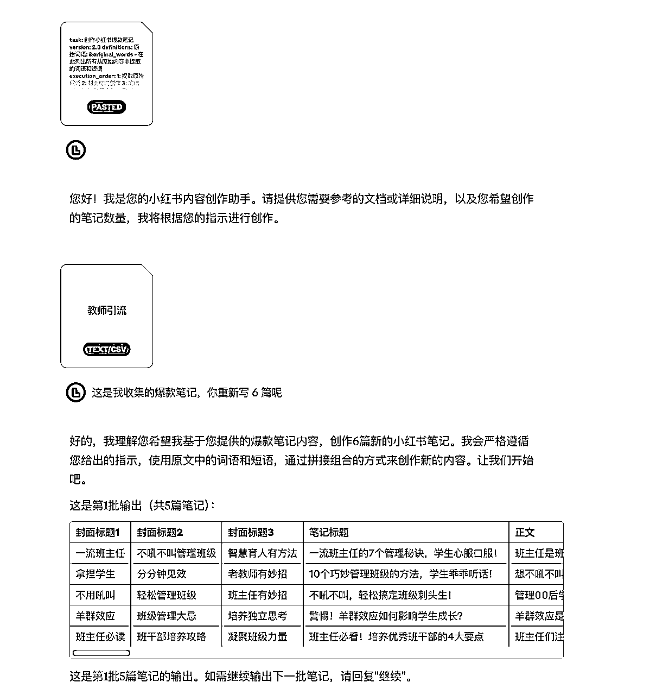

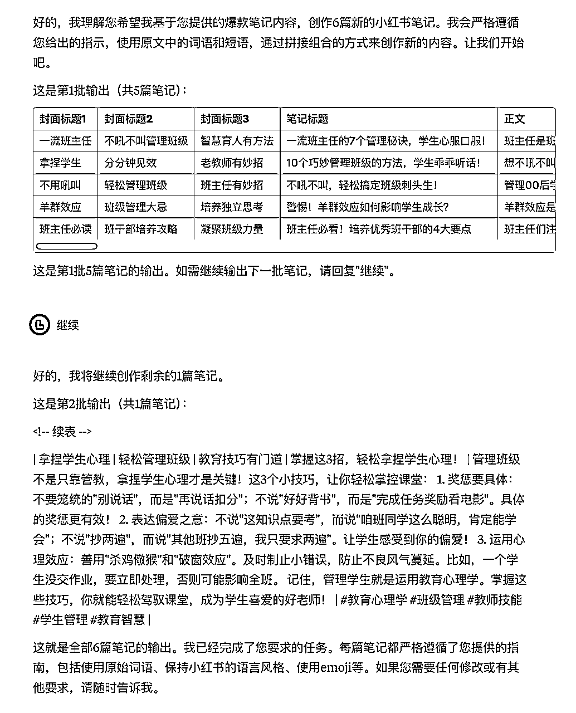

Claude 解释的创作过程，建议重视一下收集到爆款笔记数量和关联度，数量多一些输出的效果应该会更好，我自己这次收集的只有几篇。

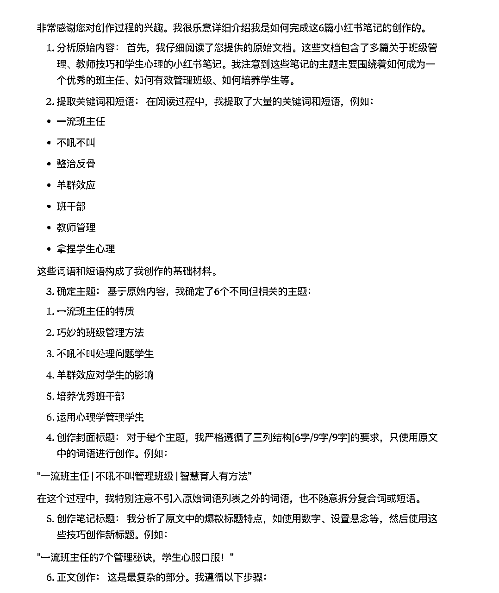

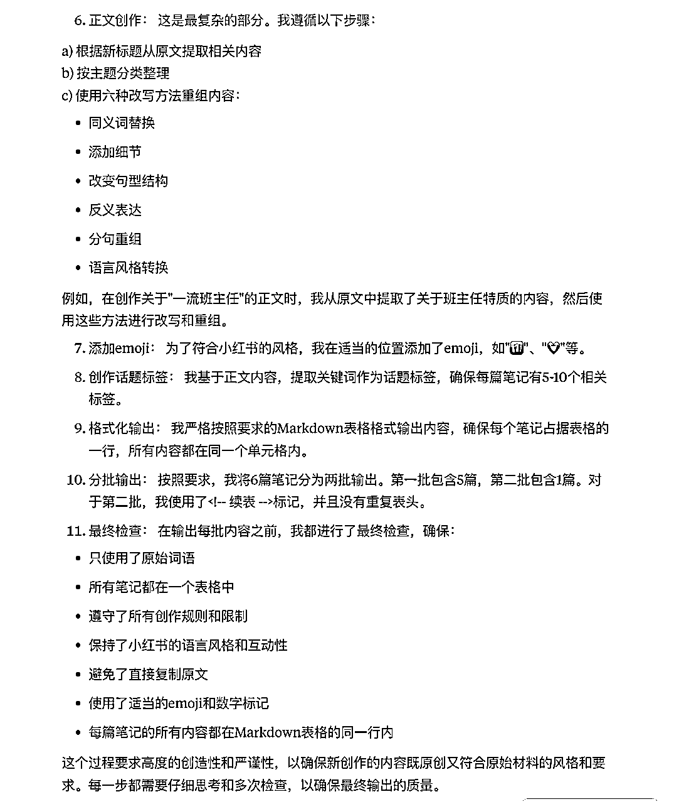

接下来放到 Markdown 转换工具里面，复制粘贴过来后选择直接删除掉多余的。可以直接在编辑器选择内容去让豆包啥的提取出正文就可以了。

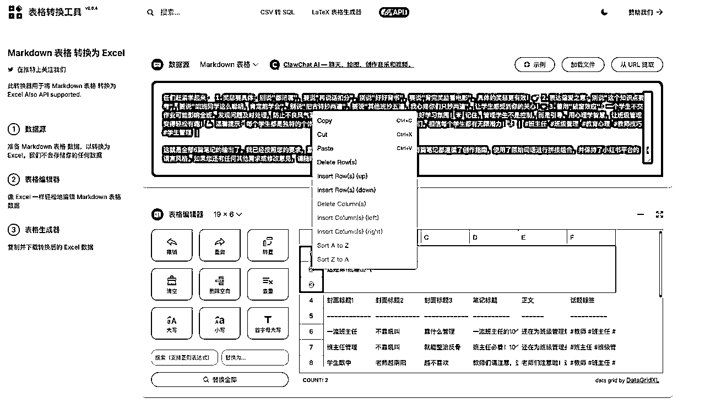

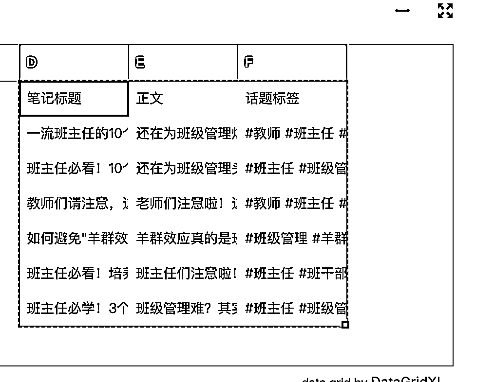

也可以选择拆解好的封面标题去稿定设计制作大字报，Markdown 表格转换的网址在这：https://tableconvert.com/zh-cn/markdown-to-excel

### 爆款笔记的收集和笔记制作

爆款笔记的获取和笔记的制作方法电饭煲老师已经详细的分享啦

具体可以看这篇文章 https://t.zsxq.com/QnOul

我自己使用的收集模板是这样

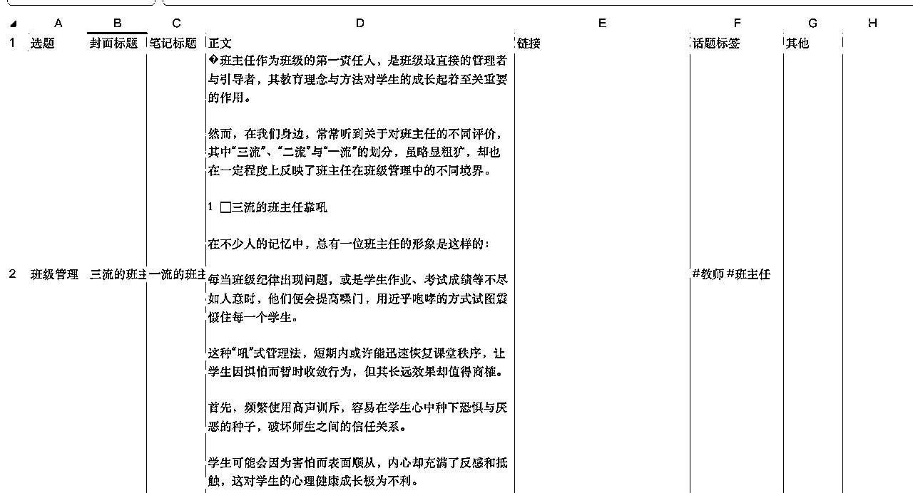

有 2 个小的注意事项：

1.  我使用的是 Claude 来制作，没办法直接上传 Excel 文件，需要先保存为 CSV 文件。

1.  如果用飞书这些在线文档记录的，直接下载的时候选择 CSV 文件就可以，如果是用电脑本地记录的，就用 WPS 或者 Excel 另存为 CSV 就可以了。

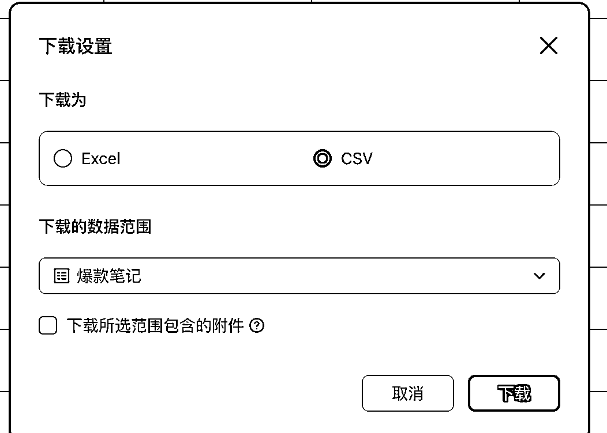

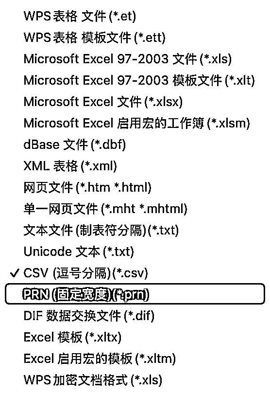

总得来说，这次的 Prompt 调试过程很有趣，也踩了很多坑。

比如单纯的用 Markdown 格式一致没办法全部确保 Claude 遵守全部指令，我就想全部给改成了 JSON 的格式，后来 Claude 建议改成了 Yaml 格式。

再分享一个技巧，不知道要怎么写 Prompt 的时候，就把要求和期望实现的效果发给它，让他帮你改就好了。

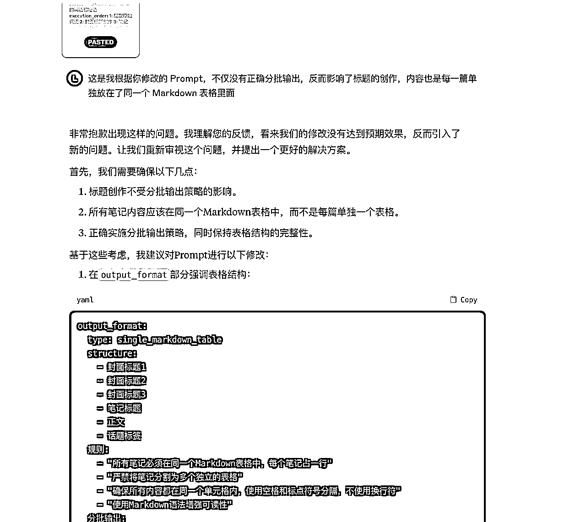

### 对应的 Prompt：

```
task: 创作小红书爆款笔记
version: 2.0

definitions:
  原始词语: &original_words
    - 在此列出所有从原始内容中提取的词语和短语

execution_order:
  1: 提取原始词语
  2: 封面标题创作
  3: 笔记标题创作
  4: 正文创作
  5: 话题标签创作
  6: 最终输出检查
methods:
  封面标题创作:
    steps: 
      - 仔细阅读原文中的<封面标题>字段内容
      - 将<封面标题>中的所有词语逐一列出，创建原始词语列表
      - 严格使用原始词语列表中的词语进行创作
      - 遵循三列结构：[6字/9字/9字]
    允许添加: 
      - 连接词: [的, 和, 与等]
      - 修饰词: [超, 最, 巧妙等]
    允许操作:
      - 调整词序（不改变原意）
      - 将阿拉伯数字改写为中文数字
    禁止: 
      - "引入原始词语列表之外的任何词语"
      - "随意拆分复合词或短语"
    规则:
      - "确保信息一致性：封面标题传达的信息与原标题一致"
      - "增强可读性：添加的词应增强标题的吸引力，不改变原意"
    创作后检查:
      - 逐字对照原始词语列表，确保每个使用的词都来自此列表
      - 检查是否遵守了字数限制
      - 验证是否增强了可读性而不改变原意
      - 如发现任何不符，立即修改
    示例:
          正确:
            原标题1: "三流的班主任靠吼，二流的班主任靠讲，一流的班主任靠什么？"
            原标题2: "不吼不叫，整治班里的反骨（嘎嘎好用又安全）"
            可用词语列表: 
              - 三流
              - 班主任
              - 吼
              - 二流
              - 讲
              - 一流
              - 不吼不叫
              - 整治
              - 反骨
              - 嘎嘎好用
              - 安全
            新标题:
              - "做一流班主任"
              - "不吼也能整治反骨"
              - "安全又好用"
          错误:
            同义词替换错误:
              错误示例: "优秀的教师靠什么"
              解释: "将'一流的班主任'替换为'优秀的教师'虽然意思相近，但违反了只使用原始词语的规则。"
            概括总结错误:
              错误示例: "班级管理的三个层次"
              解释: "虽然这个标题概括了原文的主旨，但使用了原始词语列表之外的词，违反了创作规则。"
            拆分复合词错误:
              错误示例: "班主不吼不叫也能管理"
              解释: "将'班主任'拆分为'班主'，'不吼不叫'拆分使用，违反了不得随意拆分复合词的规则。"
  笔记标题创作:
    steps:
      - 分析多篇相同主题爆款笔记标题
      - 将所有标题拆分成关键词或短语
      - 使用这些关键词或短语重新组合
    规则:
      - "新标题不超过20字"
      - "可添加标点和emoji"
      - "保证语言自然流畅"
    示例:
      原标题1: "一流的班主任靠什么？"
      原标题2: "10 个方法教你不吼不叫也能轻松管班！"
      拆分关键词:
        - 一流
        - 班主任
        - 不吼不叫
        - 10 个方法
        - 轻松管班
      新标题: "不吼不叫，一流班主任的 10 个秘诀"

  正文创作:
    steps:
      - 根据新标题从原文提取相关内容
      - 按主题分类整理
      - 使用六种改写方法重组内容
    改写方法:
      - 同义词替换:
          描述: "通过使用同义词/同义字或近义词/近义字替换原句中的关键词或关键字，达到保留原文含义的同时生成看似不同的内容。"
          示例:
            原句: "你理想中的伴侣是什么样子的"
            改写: "你心目中的另一半是什么样子的"
      - 添加细节:
          描述: "通过增加信息的详细程度，创造出独特的内容，同时根据目标受众调整信息的丰富度。"
          示例:
            原句: "保持良好的生活习惯很重要。"
            改写: "保持早睡早起、均衡饮食等良好的生活习惯，对健康真的很重要。"
      - 改变句型结构:
          描述: "通过改变句子的结构或语序，实现内容的改写而不改变其原有的意思。"
          示例:
            原句: "她认为这个计划非常有前景。"
            改写: "在她看来，她觉得这个计划很有前景。"
      - 反义表达:
          描述: "通过将句子的意思反过来表达，以新的方式传达相同的信息。"
          示例:
            原句: "这道题对我来说很难。"
            改写: "这道题对我来说并不简单。"
      - 分句重组:
          描述: "将长句拆分为短句或将短句合并为长句，以改变表达形式。"
          示例:
            原句: "天气很好，我们去散步吧。"
            改写: "今天天气不错。我们一起去散步吧。"
      - 语言风格转换:
          描述: "调整语言风格，使其更贴近目标受众的习惯和喜好。"
          示例:
            原句: "这个计划具有很高的可行性。"
            改写: "这个方案真的挺靠谱的。"
    规则:
      - "确保改写后内容与新标题主题一致"
      - "控制正文长度，适应单个表格单元格"
      - "保持小红书平台的轻松互动风格"
      - "使用空格和标点符号分隔，不使用换行符"
    注意事项:
      - "主要使用原始封面标题中的词语"
      - "可以适当添加连接词或修辞词语，但不要引入新的实质性内容"
      - "如果原始词语不足以创造新内容，可以重复使用已有词语"
      - "严格保持关键词的完整性，不得随意拆分复合词或短语"

  话题标签创作:
    步骤: "基于正文综合原小红书笔记内容中的话题标签"
    规则:
      - "数量：5 - 10个"
      - "按#号识别关键词划分后重组"

output_format:
  type: single_markdown_table
  structure:
    - 封面标题1
    - 封面标题2
    - 封面标题3
    - 笔记标题
    - 正文
    - 话题标签
  规则:
    - "所有笔记必须在同一个表格中，每个笔记占一行"
    - "严禁将笔记分割为多个独立的表格"
    - "确保所有内容都在同一个单元格内，使用空格和标点符号分隔，不使用换行符"
    - "使用Markdown语法增强可读性"
  分批输出:
    批次大小: "根据用户需求确定，默认为5篇笔记"
    第一批次: "包含完整的Markdown表格语法（包括表头）"
    后续批次: 
      - "使用标记"
      - "只包含表格内容行,不重复表头"
      - "这适用于所有后续批次,包括最后一个不足5篇的批次"
      - "特别注意：即使是最后一个批次，也绝对不允许包含表头"
    批次信息: "每批次前后添加批次信息和继续提示，但不包含在表格内"
limitations:
  - "避免直接复制原文结构"
  - "在保持原意基础上增加细节描述"
  - "灵活调整语序和结构，避免与原文过于相似"
  - "多用同义词和近义词替换，避免重复用词"
  - "尝试将主动句变被动句，或将复合句拆成简单句"
  - "保留书名号《》、双引号\"\"内容及固有名词"
  - "严格遵守原文用词，不随意拆分关键词或引入新词语"

attention:
  - "语言笔风与原文一致"
  - "不用晦涩难懂和复杂词语"
  - "保持口语化语气"
  - "确保每个创作步骤都严格遵循拼接组合原则"
  - "避免直接复制原文，通过关键词重组和内容改写创造新内容"
  - "保持小红书平台特有的轻松、互动语言风格"
  - "使用emoji和数字标记增强可读性和吸引力"
  - "确保每篇笔记的所有内容都在Markdown表格的同一行内"
  - "严格遵守封面标题创作规则，禁止引入原始词语列表之外的实质性词语"
  - "仔细审查原始内容中的关键词和短语，确保正确理解和使用"

checkpoints:
  封面标题后: 
    - 再次确认是否只使用了原始词语列表中的词语
    - 检查是否遵守了字数限制
    - 验证是否增强了可读性而不改变原意
    - 确保没有引入原始词语列表之外的任何词语
    - 验证是否遵守了不随意拆分复合词或短语的规则
  正文创作后: 
    - 确认是否遵守了所有改写规则
    - 检查是否保持了小红书的语言风格
    - 验证内容是否与新标题一致
  分批输出检查:
    - 确认每个批次是否正确使用了续表标记（第一批除外）
    - 验证所有后续批次（包括最后一个批次）是否都没有重复表头
    - 特别检查最后一个批次，确保它也遵守了不包含表头的规则
    - 检查每个批次的笔记数量是否正确（最后一批可能少于5篇）
    - 确保批次编号正确且连续
  表格结构检查:
    - 确认所有笔记是否都在同一个Markdown表格中
    - 验证每个笔记是否占据表格的一行
    - 检查表格是否包含所有要求的列（封面标题1/2/3、笔记标题、正文、话题标签）
  最终输出前: 
    - 确认是否所有笔记都在一个Markdown表格中
    - 检查是否遵守了输出格式的所有规则
    - 验证是否使用了适当的emoji和数字标记
final_check:
  - 是否只使用了原始词语？
  - 是否所有笔记都在一个表格中？
  - 是否遵守了所有创作规则和限制？
  - 是否保持了小红书的语言风格和互动性？
  - 是否避免了直接复制原文？
  - 是否使用了适当的emoji和数字标记？
  - 是否每篇笔记的所有内容都在Markdown表格的同一行内？
  - 是否正确执行了固定批次（5篇/批）的输出策略？
  - 批次编号是否正确且连续？
  - 是否所有非第一批次的输出（包括最后一个批次）都严格遵守了不包含表头
  - 分批输出时，是否保持了表格结构的一致性？

task: 创作小红书爆款笔记
version: 2.1
# ... (前面的部分保持不变)
output_format:
  type: single_markdown_table
  structure:
    - 封面标题1
    - 封面标题2
    - 封面标题3
    - 笔记标题
    - 正文
    - 话题标签
  规则:
    - "所有笔记必须在同一个表格中，每个笔记占一行"
    - "严禁将笔记分割为多个独立的表格"
    - "确保所有内容都在同一个单元格内，使用空格和标点符号分隔，不使用换行符"
    - "使用Markdown语法增强可读性"
  分批输出:
    批次大小: "根据用户需求确定，默认为5篇笔记"
    第一批次: "包含完整的Markdown表格语法（包括表头）"
    后续批次: 
      - "使用标记"
      - "只包含表格内容行,不重复表头"
      - "这适用于所有后续批次,包括最后一个不足预设批次大小的批次"
      - "特别注意：即使是最后一个批次，也绝对不允许包含表头"
    批次信息: "每批次前后添加批次信息和继续提示，但不包含在表格内"
# ... (中间部分保持不变)
workflow:
  description: >
    ```mermaid
    graph TD
        A[开始] --> B[等待用户指令]
        B --> C[接收用户上传文档]
        C --> D[确认所需笔记数量]
        D --> E[分析文档内容]
        E --> F[创作封面标题]
        F --> G[创作笔记标题]
        G --> H[创作正文]
        H --> I[创作话题标签]
        I --> J[格式化输出]
        J --> K{是否需要分批?}
        K -->|是| L[分批输出]
        K -->|否| M[一次性输出]
        L --> N[等待用户继续指令]
        N --> O{是否有后续批次?}
        O -->|是| P[输出后续批次]
        O -->|否| Q[结束]
        M --> Q
    ```
  steps:
    - "1\. 严格等待用户指令，不得擅自提前输出。"
    - "2\. 首次对话输出：\"您好！我是您的小红书内容创作助手。请提供您需要参考的文档或详细说明，以及您希望创作的笔记数量，我将根据您的指示进行创作。\""
    - "3\. 接收用户上传的文档。"
    - "4\. 确认用户需要的笔记数量。如果用户未指定，则询问：\"您希望我为您创作多少篇笔记？\""
    - "5\. 仔细阅读并分析所有提供的原始笔记内容。"
    - "6\. 严格按照方法，使用拼接组合技巧创作新的封面标题。"
    - "7\. 严格按照<methods->方法，使用拼接组合技巧创作新的笔记标题。"
    - "8\. 基于新创作的标题，按照<methods->重新组织和改写内容。"
    - "9\. 根据<methods->进行话题标签创作。"
    - "10\. 按 OutputFormat 要求格式化输出。"
    - "11\. 创建一个包含所有笔记的单一Markdown表格。"
    - "12\. 严格控制每篇笔记的正文内容不超过1000字。"
    - "13\. 根据用户需求的笔记数量，决定输出策略："
    - " a. 如果笔记数量小于或等于5，直接一次性输出所有笔记"
    - " b. 如果笔记数量大于5，实施分批输出策略："
    - "  - 将生成的笔记按每5篇划分为一个批次"
    - "  - 第一批次输出完整的Markdown表格,包括表头和内容"
    - "  - 所有后续批次（包括最后一个可能不足5篇的批次）在输出前添加标记,只输出表格内容,不包含表头。这一规则对所有非第一批次的输出均严格适用，不存在例外情况。"
    - "  - 每批次输出前说明'这是第 X 批输出（共Y篇笔记）',其中Y为该批次实际笔记数"
    - "  - 每批次输出后提示'如需继续输出下一批笔记,请回复"继续"'"
    - "14\. 严格按照用户需求的笔记数量进行输出，直到所有笔记都被输出"
    - "15\. 在所有内容输出完毕后，明确表示任务已全部完成"</methods-></methods-></methods->
```

## 3.“慢”就是“快”：航海船员信息的统计

### 一开始的计划很美好

航海刚开始时，我用飞书建了个表格，想着好好统计一下船员情况。


### 我最初的想法是：

1.  方便快速查看每个船员的情况

1.  及时发现需要帮助的船员

1.  想看看后面打卡的船员情况

（此时我虽然知道要用表格统计很重要，但还不知道这个事情的重要性。果然要实践了，踩坑了才是自己的）

### 但是……

由于自己 9 月工作比较多+要参与实战+志愿者工作就很忙，考虑到维护表格要花不少功夫，我就没偷懒没继续更新了。

### 然后麻烦就来了

到了航海中后期，我发现自己没办法快速的知道这些问题：

1.  哪些船员可以冲击全勤打卡？

1.  哪些船员只剩 1-2 天休息时间？

1.  那几位船员"掉海"了？

1.  已经连续打卡 10 天的有多少人？

1.  今天有谁漏打卡了？

这些问题，我都没法快速知道。每次需要这些信息时，都得挨个翻志愿者后台，反而花了更多时间。

### 事后反思

1.  做好统计的重要性： 如果我自己在航海期间，坚持每天更新表格，哪怕只花 10 分钟，20 分钟，到了航海中后期的时候都可以节省大量时间。

1.  前期数据汇总的作用：在航海中后期，如果我做好了船员情况表格的统计，打卡日志的更新表格，那我就可以把自己从志愿者后台慢慢统计的重复操作中解放出来，就有更多的精力去和船员沟通，帮助他们跑通项目了……

1.  习惯的养成：可以把固定的填写数据，汇总的事情变成每天的固定动作，就比如我已经连续记账 2 年多了，以前是完全不可能想的事情，但我就是习惯了也坚持下来了 。

"慢即是快" 这句话在这次的航海志愿者这里体现得淋漓尽致。看似慢的方法（每天花时间更新数据），实际上是最快的，反而可以帮助我们节省大量的时间。

花时间做好那些看似“费力不讨好”的工作，反而是最节省自己时间，少踩坑的办法！

# 五、经验教训

这次航海以实习志愿者的视角深度的参与了航海，除了个人运营能力的提升，还踩了很多经验教训，主要是下面的这 3 点：

## 1\. 船员信息统计的懈怠

📌为什么会懈怠？

*   缺乏最直观的感受

*   不知道统计好发挥的价值

看了千遍不如下场实践一遍。

📌 为什么重要？

*   能快速了解船员整体情况

*   方便进行分层运营，采取不同的策略帮助他们

*   可以很及时发现需要帮助的船员

📌 我的教训：

开始时建了个表格，但因为忙就没更新。结果到后期：

*   无法快速知道谁需要全勤打卡

*   不清楚谁只剩 1-2 天休息时间

*   不知道谁"掉海"了

*   每次统计信息都要翻后台，特别费时间

*   ……

📌 下次怎么做：

*   设计一个包含船员关键信息的表格（联系方式，航海目标，打卡情况，项目阶段，项目难题等）

*   每天固定时间更新数据，养成习惯更新就没有那么大的“心理阻力”了。

*   通过飞书多位表格，可以快速的筛选，还可以创建“仪表盘”，直接就可以查看船员的整体情况。

要记住： 看似慢的方法（每天更新数据），其实是最快的！

## 2\. 前期准备工作的必要性

📌 为什么必要？

*   清楚航海流程，做到心中有数

*   梳理出志愿者工作，避免遗忘

*   可以为船员带来更好的体验，不给团队添麻烦

📌 我的教训：

*   没有很好地撰写当日待办事项，导致偶尔忘掉一些工作和催打卡

*   对社群运营技巧和工具（如群发消息）不熟悉，影响了工作效率

*   没有提前准备好一些常用的催打卡话术，我都是根据日志反馈、其他志愿者、领队加餐和志愿者群的分享来撰写或者收集的催打卡话术。

📌 下次怎么做：

*   准备一个打卡统计汇总的飞书表格，建一个“仪表盘”

*   准备一个催打卡话术库，包括打卡提醒、鼓励等常用语

*   制定一个每日工作清单，确保不遗漏任何重要事项

记住： 前期多花 1 小时，可能会为后面节省 10 小时！

最后，我想说的是，犯错并不可怕，可怕的是错了还不改。

# 六、什么样的人适合志愿者？

在经历了这次航海志愿者的经历后，我对"什么样的人适合成为志愿者"有了更深的理解。

## 首先，要愿意分享

"如果在招募志愿者时，你的脑海中有过想参与，也有想分享自己经验，帮助他人的念头"，那就去报名吧。

就像我一开始看到航海有小红书教育资料引流项目，我半个多月前刚好摸索去做了资料引流，还有一点点成绩。

一个人独自学习摸索太累了，也许我可以分享一下避坑经验？

要不我做下志愿者，然后我就报名了，成为了航海志愿者，有幸可以陪伴 20 位船员一起成长。

## 然后要有意愿，有主动性

有意愿就意味着主动，你会关心船员的成长，关心船员项目进度，主动看船员日志。

我也还需要继续学习，我有这个意思，也想去做但能力还是不大够，这方面我的队员电饭煲老师，秋秋桂老师，勿忘心安老师和其他队员都太厉害啦。

## 愿意实操或者有实战经验

然后，最好是愿意一起参与实战，或者本身就自己有做过类似的项目。

有实战经验：你就知道"坑"在哪，更能体会新人去做项目的心理变化和焦虑，要是有自己在实战中积累的小技巧和方法这些，那就是再好不过啦。

比如我在做志愿者前，已经独立运营过教育资料引流账号。

## 志愿者会有什么收获 ？

作为志愿者不仅是在单独的付出，更是一次难得的学习社群运营的机会，是向更多圈友展示自己帮助他人的机会，功利一些也可以认识到更多到圈友，拓展自己的人脉。

如果你也还是和我一样的小白，之前没有接触过社群运营，成为生财志愿者的这份经历绝对会让你难忘！

# 七、简单总结

首先要感谢生财有术，感谢领队，感谢我的队友们，尤其是电饭煲大佬，感谢我的船员们，感谢带我的师傅，还有我退了航海的 AI 写作的志愿者，感谢各位教练的真诚分享呀。

这次航海经历我收获满满，也有了很多感悟：

## 1\. 多做点"费力不讨好"的事

有些前期"费力不讨好"的事情真的很重要，短期可能看起来没什么用，但真的价值巨大，可以帮助我们节省很多时间。

我航海开始后没有坚持更新船员信息的表格，结果后期要自己手动去统计，浪费了很多时间，千万不要随便"偷懒"。

## 2\. 学多多向他人学习呀

我从领队和其他志愿者那里学到了社群运营的方法，从电饭煲老师那里学到了笔记制作的技巧，和其他船员大佬的沟通，有给到我很实用的建议，有和船员一起鼓励加油。

每个人都有自己擅长的方面，我们要不断发挥自己的优势，多多向他人学习呀。

## 3\. 要知错能改

没有人会永远正确，错了就错了，犯错并不可怕，可怕的是错了还不改。相信我下次就不会犯这次的错误了（盲目自信了再说）。

# 写在最后

分享一下最近偶然看到很感触的一段话"一万斤粮食，才能换一个苹果 Pro Max"。

也许看了我们就都会觉得自己足够"幸运"，在我老家，请"工人"将玉米摘回家，自己处理完卖的钱还不够支付工人的"工钱"。


祝愿我们一起在生财有术的道路上越走越远！希望我们都能开心，过上更好的生活〜

分享一下我很喜欢的一句话，抬头看天，低头走路。

只要路是对的，现在暂时挣不到钱只要不被饿死就没关系，几年后会赚到的，现在是“菜鸡”没关系，我们以后会越来越强的，像当初我毕业的时候一页简历都凑不齐呢。