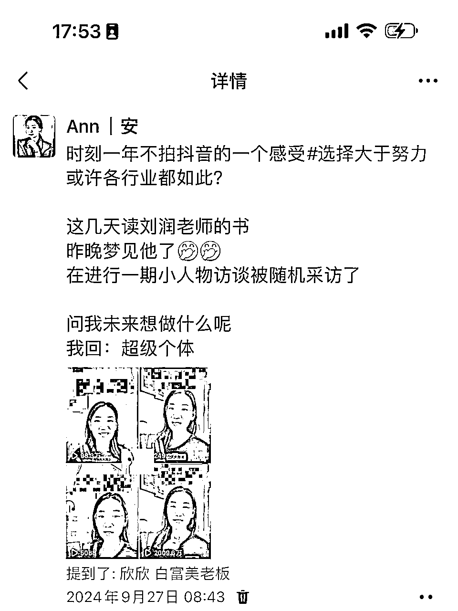

# AI教育+抖音，1个月接7条广告过程分享。

> 来源：[https://e2j5qnvjvf.feishu.cn/docx/W7NndRMBAoI6W0xVViwcHoFVn4f](https://e2j5qnvjvf.feishu.cn/docx/W7NndRMBAoI6W0xVViwcHoFVn4f)

大家好，我是 Ann，三年圈友

周一亦仁发了一个帖子，讲到 AI 自媒体。

其中提到接 AI 相关的广告，正好是我最近正在做并且受益的，已接广告8条。

现将整个过程分享出来，希望对你有帮助。

先说完整变现闭环：

发布抖音AI教育内容——被广告主看到——接星图广告——接星广推广——持续收益发布再推广——被更多AI广告主看到——接更多商单。

### 一、项目背景：

我做过的项目有点多。。这个抖音号之前跟着航海做过 IP 和直播，在少儿英语启蒙方面有过变现和收益。

基础粉丝2w，但从去年年底，此号断更，因心力转移到视频号带货，日佣金过万时，便舍弃了收益低的项目。

今年年初，我在抖音发了两三条关于 ChatGPT 用于和小朋友英语对话的视频，播放量几万。

而平时准备的英语相关只有一两千。

之后引流微信数百人询问 ChatGPT 下载安装

看到异常值，但不知道如何抓住它，焦虑中一直观望查看AI相关。。

### 二、开展行动

上个月9月，发现豆包用于检查作业、和小朋友互动不错，便在抖音发布几条相关视频，起初未考虑变现。单纯就是想分享给家长们这个好用的app。

发布约 4 条后，有广告主询问是否接广告。

9 月对话时，我未接过星图广告，让对方参考定价，2 万粉丝和几百播放量给 500 元，反正都是要发的，同意。

这条视频流量达到 2000 多万，口播视频。

对方要求二次去重发星广。

星图和星广的区别：

星图是一口价，发布即给钱；

星广需左下角挂组件，有人下载才赚钱。

这里忍不住感慨了一下

我最向往的生活就是超级个体，有2-3个人，一起积极向上

做自己喜欢的事情，顺路赚钱

边带娃，边赚钱。

或许赚得并不多，但压力也小。

期待在生财能遇到同频的姐妹，一起。

### 三、持续收益

目前两方面持续收益：

1⃣️发布的星广，只要有下载，我就有收益。真的是太香了。

如果发布的视频，播放量不错，对方趁热连续投放多次星图和星广，至今已接豆包广告约七八条，写分享时仍在谈下一条广。

也可以主动和对方聊，是否需要追加？

2⃣️接豆包推广效果好，被另一广告主看到，又开始接其他 AI 广告。

### 四、如何接广告及报价等

1⃣️个人观点：传媒公司、广告主也有自己的圈子，先融入很重要。

如果首次有人找上来，先合作成功比一个高价吓退要好得多。

我首次报价，是让对方出的价格，500元。

星图和星广，我认为除非大博主，素人博主的话，如果视频优质，星广的后期收益反而比一口价的星图要多得多。

先接广，有广告主投流的情况下，很容易被更多他们的AI圈子看到，源源不断。

2⃣️星图开通后没事多刷刷，看看有什么适合的任务，直接报名

3⃣️修改星图的任务列表偏好，更有针对性，要不里面广子太多，很容易漏掉

4⃣️主动询问广告商，是否追投一下？他们也是人心肉身，有时候会忘掉一些人

我们适当主动，也是可以的。

### 五、其他

1·看到亦仁发关于 AI 自媒体接广子的风向标，才知很多广告主现在是在在尝试投放阶段，有红利。

2·新手最好去看看有什么AI能和现有业务结合的。

比如我的组合是AI+教育

就比单独介绍AI要有优势，如果单独介绍AI，有太多大牛了，打不过。

3·有星图广告权限后，可在后台查看申请相关 AI 广告，我刚报名了剪映的星图。

（如何开通相关权限，我相信难不倒聪明的圈友们，自行AI一下就知道啦）

4·收益方面，有条豆包收益变现 1 万加，虽对老手不多。但付出的时间、精力、成本少，只有4条视频。

5·期待 11 月的大航海，更专业团队带领更多人分这波红利，趁热，做就行了。

6·往期贴，只有一个，关于航海数次每条船出成绩的一些分享https://t.zsxq.com/kFjkE 真是对不起航海家的称谓了，惭愧。