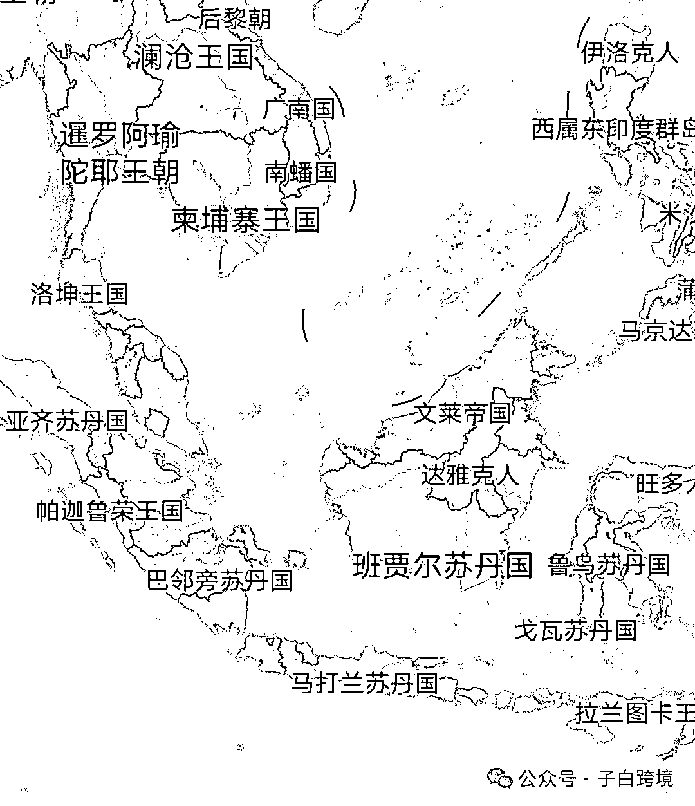
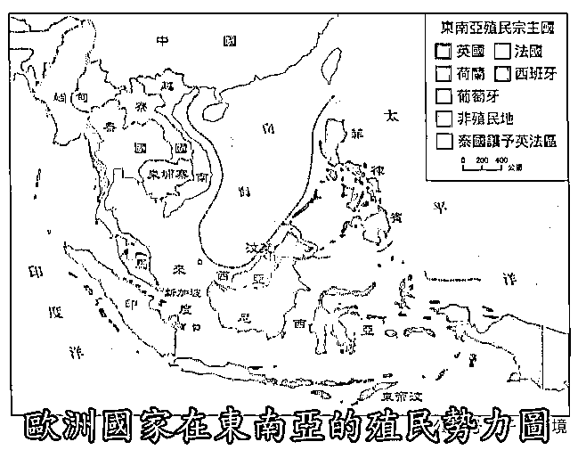
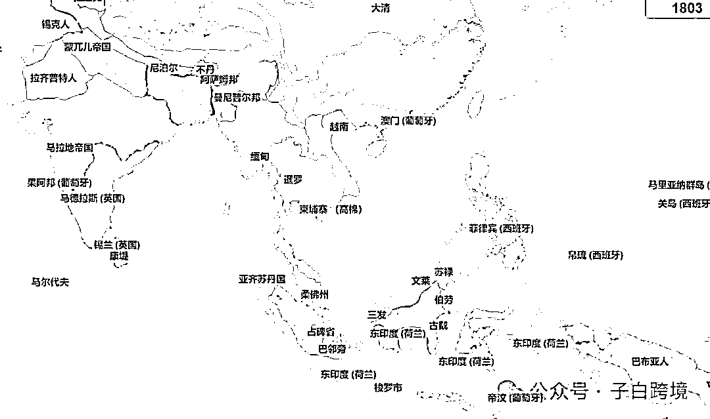
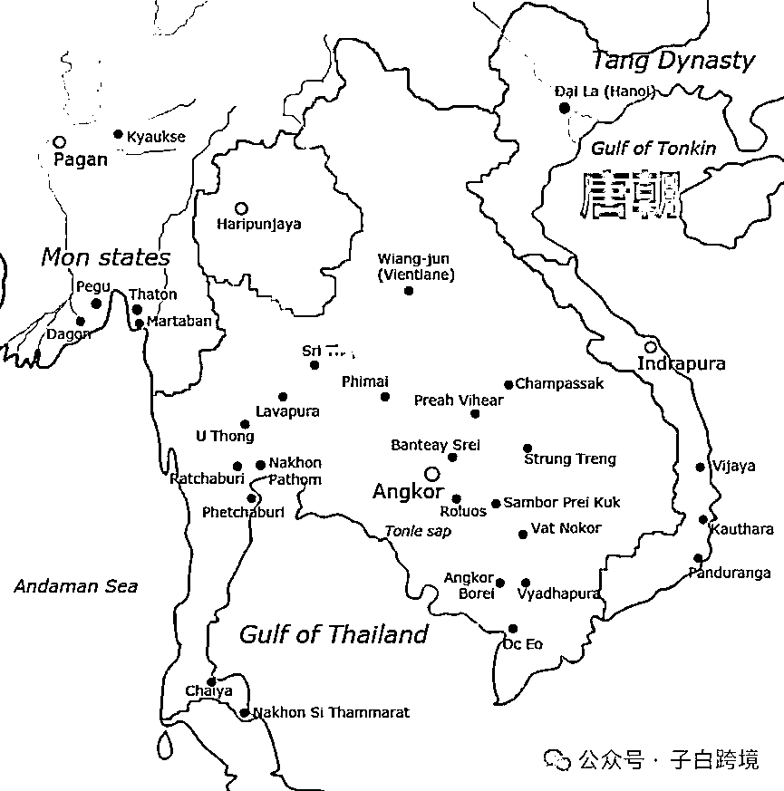
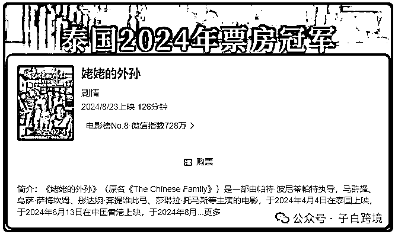
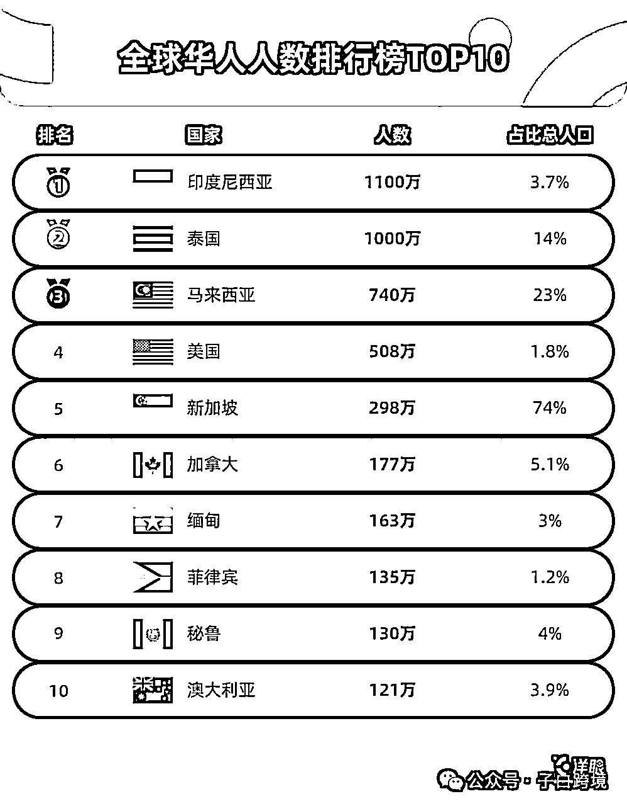
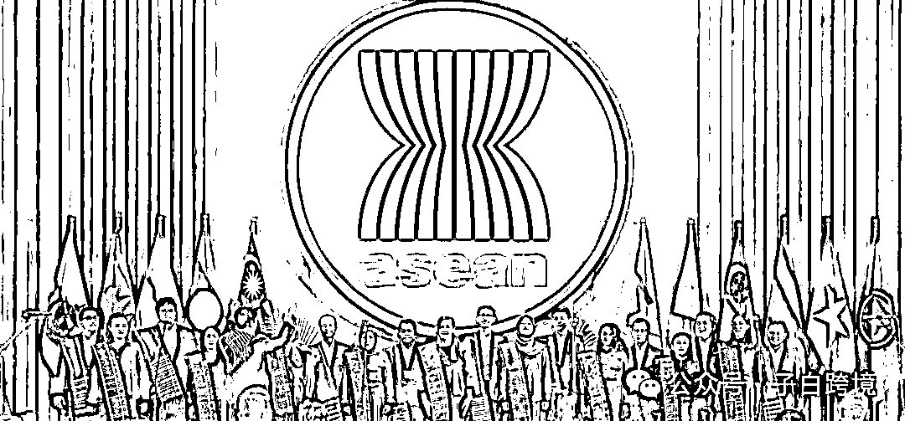
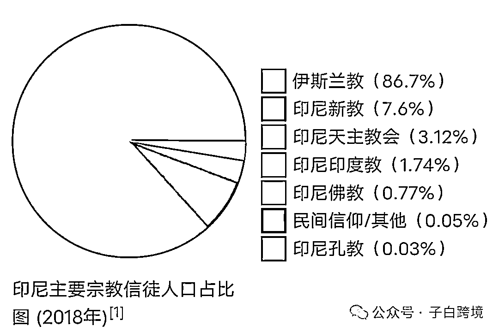

# “东南亚市场”真的存在吗？

> 来源：[https://zcndrp2kur9p.feishu.cn/docx/VRGKd2lvHoiVPNxeewTcfXOKn1f](https://zcndrp2kur9p.feishu.cn/docx/VRGKd2lvHoiVPNxeewTcfXOKn1f)

东南亚（SoutheastAsia），即近代华人所称“南洋”，位于亚洲东南部，包括中南半岛和马来群岛两大部分。共有11个国家：缅甸、泰国、柬埔寨、老挝、越南、菲律宾、马来西亚、新加坡、文莱、印度尼西亚、东帝汶，面积约457万平方千米。——百度百科

近代东南亚

现在的东南亚，基本是二战盟军为了行军方便，设定的东南亚战区的延续。今天公认的东南亚11国，是因为美军70年代的战略规划，才成为通用标准。所以东南亚的划定都是战争在推动，这11个国家最大的共同点只有地理上离得近。这些国家的人民从不认为自己是东南亚人。

近代东南亚除了泰国（暹罗）之外，全是殖民地。有英属缅甸（现缅甸），英属海峡殖民地/马来亚/北婆罗洲（现马来西亚/新加坡/文莱）；美属菲律宾（现菲律宾）；荷属东印度（现印尼）；法属印度支那（现老挝/柬埔寨/越南）；葡属东帝汶（现东帝汶）。

殖民时代，一个巴达维亚（现印尼首都雅加达）知识青年对于地球另一边的荷兰的了解，远多于东南亚其他国家。最新数据，在泰国常住的印尼人仅三千多人，却有170万印尼人在荷兰。

语言和文化

中国作为东亚的文化宗主国，东南亚大部分地区也受到了中国文化影响。此外，泰国，柬埔寨，缅甸，老挝受印度文化影响深远，且被吴哥王朝直接统治过。但实际上互相认同的只有老挝和泰国，同语同族，即使这样。文字也没有统一。（秦始皇牛逼）

如果你是泰国人，那么缅甸和柬埔寨就是“陌生邻居”，泰国每个人都知道泰国王室来自缅甸的孟族，皇家泰语受到高棉语极大影响，除此之外呢？泰国人根本不了解。更远的菲律宾、印尼，就像外星一样遥远。

新加坡、马来西亚、文莱的英文/马来文社区因为殖民历史、种族和经济的关系是可以玩到一起去的。

但实际上印尼才是最大的马来语国家，所以印尼的音乐可以席卷马来西亚这几个国家的榜单，但新加坡马来裔几乎完全不听。而且因为现实和历史的隔阂，印尼和这几个国家的认同很少。

其他内容产品，泰国电影在老挝、缅甸接受度很高，但对越南、马来西亚、新加坡几乎没有影响力。今年《姥姥的外孙》是泰国票房冠军，也是马来西亚历史票房最高的泰国电影，但连马来西亚历史票房前100都进不去。

在美国的大学里，新加坡/马来西亚学生一起玩是常态，也有带文莱学生玩的，但都不会跟印尼学生玩。

所以内容产品不存在东南亚市场这个概念，各个国家是各个国家。

说个题外话，华人比较有意思，文化上从未真正融入过东南亚的哪个国家（文化宗主国的自傲），大多只跟华人抱团。人数不少，有三千多万，又有钱，算是东南亚隐藏的上层阶级。

经济和贸易

印尼最大的贸易伙伴是中、美、日，东盟内部最大的贸易伙伴马来西亚只占它5.19%的进口和4.82%的出口。菲律宾最大的贸易伙伴是美、中、日，印尼只占菲律宾7.26%的出口份额。

东盟比欧盟是个更松散的组织，不像欧盟有共同对外关税区，每个国家的关税标准，进出口法律，会计准则都是用自己那一套。

在泰国建了仓又怎样？能覆盖马来西亚吗？能覆盖菲律宾吗？我在越南用的法务，会计以及人力外包资源能在新加坡复用么？还是从头再来。

所以对商品贸易而言，东南亚的完整市场也不存在。

以上是从整体看，如果细看内部，更割裂:

印尼最牛逼，二战后的缝合怪，把荷兰在东南亚的所有殖民地糅合在一起，由一万七千多个岛屿组成，国土看着挺大，实际海面比陆地还多，交通不便，人种都不一样，更别说宗教，文化，社会环境了。

荷兰殖民者又不如英国那么牛逼，文化殖民基本没做，荷兰的语言和宗教都没普及。导致现在印尼有5种主流宗教（86%是穆斯林），300多个民族，742种语言及方言。最大的爪哇族只占40%，爪哇语使用率不够，只能用廖内方言为基础的马来语，即印度尼西亚语作为官方语言，其实马来族只占印尼人口的3.7%。

马来西亚，西马三大族裔各有自己的文化，看似在同一个国家，生活方式完全不同，马来人占70.1%，华人占22.6%，印度人占6.6%。而东马不同族裔之间又是中间态。

这些国家连内部的统一市场都不存在，更别说东南亚的整体市场了。

很多老板不了解东南亚，觉得我在马来西亚能成，所以我在越南也能成，实际上根本就是不同的市场，要因地制宜，每个国家都不一样。