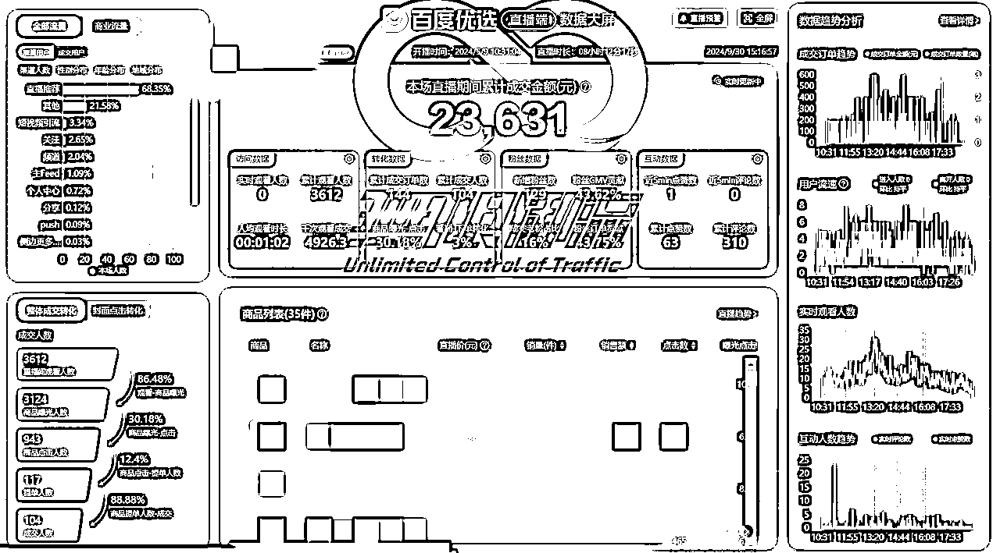
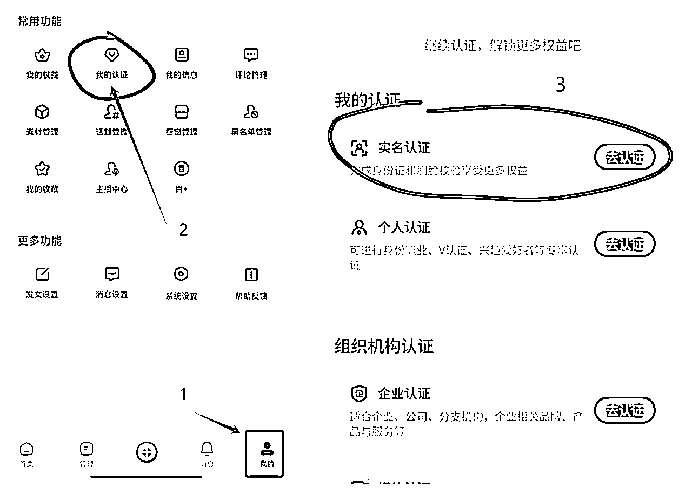
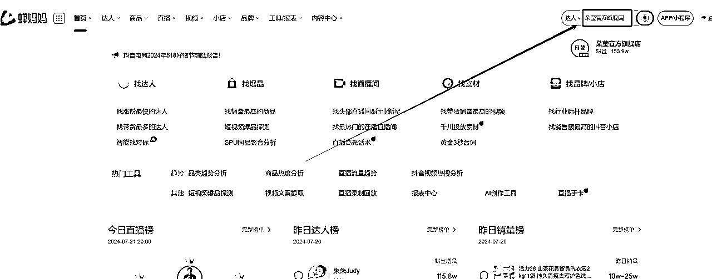
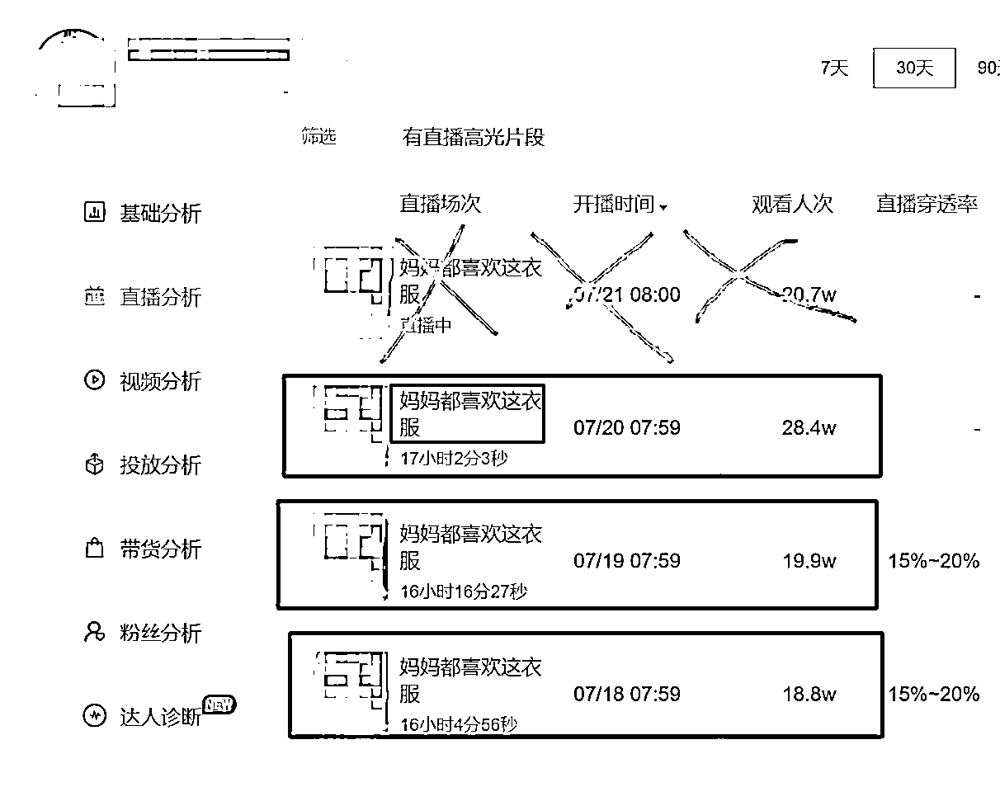
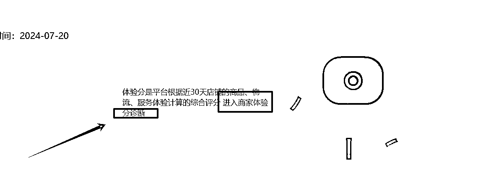
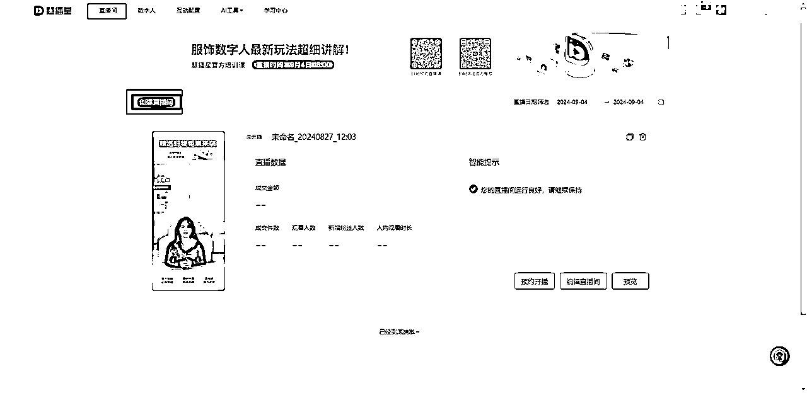

# 百度AI数字人直播丨从0-1保姆级攻略

> 来源：[https://fcnkpev7kpfd.feishu.cn/docx/NwhmdoMHEoVkYRxpZLRc1wKPnUh](https://fcnkpev7kpfd.feishu.cn/docx/NwhmdoMHEoVkYRxpZLRc1wKPnUh)

大家好呀，好久不见~

上半年分享了一个全平台无人直播玩法，也有很多小伙伴找我交流玩法，相信大家或多或少都拿到了不错的结果。

最近半年在深耕“百度”平台的直播带货，作为一个刚开始大力推广商业化直播的平台，半无人/纯无人/废号流等玩法自然是很多，但一味对抗平台并不是长久之计，顺应发展，符合平台利益才可以更稳定、长久的赚钱。

不断试错与踩坑后，我们团队结合AI数字人的玩法，总结了一套适用于新手小白从0到1的完整实操流程，并附带项目考察、优劣判断等真实思考过程，希望能在经济下行的环境中，给大家带来一些不一样的案例和经验~

目录：

1、百度直播介绍

2、项目优劣盘点

3、团队真实数据

4、实操完整流程

5、玩法细节思考

6、百度项目总结

* * *

# ---全网首发丨国庆特供---

* * *

# 一、百度直播介绍

相信有很多小伙伴看到“百度直播”以后会比较懵圈，我也是一样的🤣之前我们在做抖音和视频号平台的直播带货，平常也晒一晒自己的数据大屏，刚好有个朋友跳槽到百度，做直播板块的负责人，就来邀请我们入驻。

内心OS：百度还有直播带货？啥时候出来的？

百度直播官网：

https://live.baidu.com/

百度直播手机端：

百度直播商家端：

百度直播要到底要怎么做呢？无非就这三种

1、自己开店，自己开播带货

2、自己开店，找达人带货

3、自己不开店，带别人店的货

我们梳理下条件

*   1、2需要2000保证金（各平台开店必备）；

*   1、3需要300作者保证金（各平台达人开播必备，抖音是500）；

*   1需要负责上商品、开播带货，同时要负责上品发货售后；

*   2需要有靠谱的主播带货，或者有一定的学员基础，同时要负责上品发货售后；

*   3需要有靠谱的商家，且需要建立合作，后台开通佣金分成，只带货即可。

路径和抖音是一样的，可以理解为，百度是在补足直播带货板块，而不是在做创新，所以之前接触过任意平台带货玩法的伙伴都能快速理解“百度直播”的项目逻辑。不过百度是新直播平台，经过我们实测，上述路径中的2、3都处于发展中阶段，不是很成熟，且特定的条件不适合我们去实操，我们团队商量后，决定分析下优劣，然后再看是否入场。

# 二、项目优劣盘点

互联网上的项目，可以按变现路径分为两种，即公域项目和私域项目。

公域项目：内容-流量-变现整个链路在各个平台内完成，例如直播带货、短视频带货、商单广告等

私域项目：内容在平台，流量和变现在微信/公众号/小程序等平台完成，例如大健康、私域IP、私域知识付费等

百度直播带货，很明显是一个公域项目，我们考察公域项目的点如下：

*   是否足够稳定和长久？

*   是否能做矩阵放大？

*   是否能低成本变现？

*   做哪个赛道的变现？

1、是否足够稳定和长久

每个平台玩法刚出来的时候，都会有一段红利期，比较容易赚钱。百度也一样，我们当初预估大概会有1-2年的红利期，现在已经自营半年左右，期间各种规则频出，但总体是利好，不止百度APP，百度旗下所有平台都在将流量大量倾斜于直播带货板块。

所以，稳定、长久这一点，在我看来，最少一年内是没问题的。

2、是否能做矩阵放大？

我朋友讲，他去过一个百度直播公司，大概做了几十个真人直播间、上百个数字人直播间，矩阵是完全可行的。

那其实问题不大，只需要增加账号、设备即可，毕竟谁也不想每个业务只跑通个0-1就结束了，能顺应平台赚更多肯定是好的。

3、是否能低成本变现？

我算了下，起步阶段的成本是开店+3个账号，成本在3000保证金，百度直播的回款周期是11-21天，还可以。

4、做哪个赛道的变现？

我朋友推荐“服饰鞋包”、“日用百货”这两个类目，也是百度流量比较好的赛道

在做之前其实也挺犹豫的，因为我们在抖音卖的女装，退货率高达70%，虽然也赚，但只能赚一点点。不过转念一想，百度竞争不大，又比较好起量，可以小成本试试看，大不了退一下3000块保证金，也不亏。

【实测下来，百度的退货在20%-45%，算是还可以的，利润在GMV的四分之一】

# 三、团队真实数据

历经半年的下场实战，不光成功完成了项目的0-1，也找了合伙人一起开公司放大业务，目前在10-100阶段

9月

8月

7月

6月

5月

# 四、实操完整流程

实操流程很长，可以拉到最后看我对这个项目的总结和细节点思考

### 1、准备工作丨硬件

#### 设备：

*   手机

随便什么手机，能登录账号扫码就OK。

*   电脑（能直播就OK）

I5CPU11代以上

显卡1050ti 以上

内存16G 以上

硬盘512G以上

租赁主机：一台150-250左右，打开闲鱼看一下同城的租赁店铺【如果不懂这块，联系我参考】

#### 账号：

同一个人实名的百度号+百家号，算是一个账号【无需千粉】

#### 电脑网络：

宽带100M以上（只要直播不卡就行）

### 2、准备工作丨开通账号

在手机上下载“百家号”和“百度”两个软件

#### ① 百度实名

打开百度app,点击右下角“我的”，选择进行注册，手机号注册需获取验证码（注意：需勾选用户协议才能注册/登录），注册成功后，按下方步骤进行实名认证。

#### ② 百家号实名

百度实名完成后，打开百家号APP，使用百度APP授权登录同一个账号，再次进行认证

#### ③ 开通直播权限

打开百家号网页版，用百家号扫码登陆后，点击左侧我的权益--申请条件--直播商品卡--去缴纳，交300块保证金即可开通直播权限

百家号网页版：https://baijiahao.baidu.com/builder/rc/home

### 3、准备工作丨开通店铺

开店路径：https://kaidian.baidu.com/mallshop/merchantLogin/

① 用百度APP扫码，登陆后选择“综合电商”进行开通店铺。

② 填写好营业执照上的名称，点击“去认证”，用微信或支付宝扫码后，输入执照密码（默认123456），授权后，在网页端申请认证。

确保经营范围包含服装销售，互联网销售

③ 认证通过后，上传身份证正反面，点击“下一步”，填写店铺信息。

④ 店铺信息填写（按图所示）

⑤ 填写好其他信息后，提交审核，工作日审核大概2-6小时，最慢48小时

⑥ 开通店铺后，再进行店铺设置：

### 4、准备工作丨店铺设置

#### ① 店铺与商品

店铺开好，缴纳保证金2000元（退店可退），就可以绑定账号了，在经营里面绑定好（号店一体），这样子就能开播了，如果自己有多个账号，其他的选择右侧蓝框【账号授权】进行绑定即可，总共可以绑1主号+3绑定号进行开播。

#### ② 自己开店铺的达人模式：

超出3个后再用达人模式，在达人带货这里选择立即开启，开通分销后，设置佣金：0%

### 5、准备工作丨如何选品&找对标

#### 拿女装来举例，品类推荐

半身裙＞连衣裙＞T恤＞衬衫＞时尚套装＞裤子【夏天推荐】

连衣裙＞冲锋衣＞卫衣＞其他【秋冬季推荐】

### 如何选品

刷抖音直播间，或者在数据工具（婵妈妈）找相似达人，找到后，在直播间看前两个要求：

1、在线人数500+

2、单品热卖1000+（人货场优秀的可放宽到500+）

3、直播间售卖的是单品（或衣服裤子2件）

4、直播时间，越长越好【12小时以上最佳】

5、开播稳定【每天都在直播】

后三个要求，去婵妈妈确定，要是没有的话，闲鱼搜一下，大概80块一个月（共享号），190一个月（专享号）

### 婵妈妈数据查询：

1、在右上角输入抖音主播名称，点击名字进入它的详细页面

2、点击左侧“直播分析”，再点右侧“直播记录”

3、重点来了，这个地方，要看（下图）

① 近一周的开播时间，检查判断是否“稳定开播”

② 近一周的开播时长，检查判断是否“开播时间长”

如果，它不是稳定每天开播、开播时间少于6小时、频繁在一天内多次上下播，建议换下一个对标来参考。

4、重点2，看直播商品，需要看近三场直播的商品详情，打黄×的是正在直播，正在直播的这场不要看，看下面三场即可。点击直播间的名字（蓝框所示）或直播间封面，即可进入该场次直播的详情。

5、进入对应场次直播详情后，点击左侧商品分析，再滑轮滑动到商品的区域，来分析商品

① 如图所示，是一个标准的对标，虽然本场挂了很多品，但是只讲解了第一个，也只卖了第一个，是不错的对标

② 如果遇到只讲解一个品，但其他品类也在出单，不用管，因为客户会自己下单（在爆款直播间较为常见）

③ 如果遇到图二这种，每个品在出单，大部分品都有讲解，就不用考虑了

看到所有数据后，综合分析，例如上面这个对标，它数据是

*   直播间1000人在线

*   热卖2000+

*   近一周每天稳定开播

*   近一周每天开播16个小时以上

*   近三场直播只播单品

是个非常优秀的对标，但出单能赚多少呢？往下看

6、审核完对标的直播数据，接下来，还有最后一步，看利润

打开抖音，把商品主图截图下来，打开拼多多，搜索主图，看下整体售价大概的区间，核算利润

利润低于30%【不考虑】

利润大于30%【还行】

利润大于50%【优秀】

这里的利润算法是 (直播间售价-拼多多售价)÷直播间售价

### 6、准备工作丨店铺评分【重中之重】

店铺评分，会因为商品质量、物流、服务进行综合打分，十分重要，可以在首页中间点击蓝色字体进行查看详细数据

影响评分的几个点：

1、商品质量分数低（有预售的同学必开预售，可以免去这一项考核）

2、物流更新低

3、客服回复不及时（上面说过，关闭客服工作台）

店铺评分很重要，很重要，它决定了：

1、【出评分】是否可以绑定多个账号（1主号+3绑定号）

2、【4.2分以上】是否可以用其他号进行达人带货（更多矩阵号）

3、【4分以上】直播间是否有流量

4、【评分高】是否可以T+1回款

#### 流量扶持

这块儿的流量扶持一定要拿下，方便前期获得平台的推荐

### 7、准备工作丨上架商品

上架前补缴2000元保证金，不然全店库存只有20件

上品路径有2个，一个是手动创建，一个是一键复制，推荐手动，熟练了很快，一键复制经常需要权限，比较复杂。

点击创建商品后，这里传1张主图即可，二级类目按照自己的品来决定，连衣裙选连衣裙，套装选套装，T恤选T恤

#### 上品细节

1、按抖音主播卖的价格上，不要改价，因为主播会频繁说价格

2、主图补满3张，商品卖点必须要写全3个，写常用语即可，例如“轻薄舒适”、“高档面料”、“柔肤材质”、“奢华尊贵”、“法式新款”等（如下图所示）

3、带红色*号的是必填，按抖音商品填好，其他的随意填，不知道填什么就自己手打“常规”，如上图红框所示

4、尽量把能填的空都填完，不懂怎么填的来问我，这样能增加商品质量分，绿色优秀是最好，不要有蓝色和红色图标出现，不然会扣店铺评分（如上图所示）

5、商品规格的细节（如上图所示）

① 第一行是颜色，所以第一行填好颜色后，尽量把对应颜色的图片也传下

② 第二行是尺码，按照抖音的商品复制即可

③ 发货时效，若是对标直播间没有写这里，说明是现货，切记，如果你在拼多多看到这个商品也是现货，不要为了省事空着，现货也要写5-7天发货，给自己留发货时间，否则不按时间发货会扣店铺分，还有罚款，这也是有预售功能的优势

④ 尺码信息那个，不用填

6、价格库存这里，进行批量设置（上图红框）

① 售价，按抖音的来，不要改

② 库存，全部9999

③ 重量，0.1

④ 报警阈值，不用填

⑤ 起购数量，1

设置好后，点击右侧批量设置即可。

7、图文详情

① 素材图片右侧三个（上图上方红框）一定传，可以保留一些通用图片放这里【点开下方图片直接截图就行了】，例如7天无理由、温馨提示、材质问题等；

② 传完素材图片，会自动放到下面预览区，不用在下面添加这几张图片；

③ 上图蓝色框是商品图片，可以放1-3张，拖拽到通用图片前面即可。

8、服务与资质

① 发货时间选择48小时

② 商品资质选择“暂不上传”

③ 运费模板

运费一定不要选择系统默认版本，它是全世界包邮，坑死，我很多新疆和香港、美国的单子没法发货导致扣分扣钱。在右侧红框处选择新建运费模板，然后按照下图进行设置

如下图所示，选择“全款预售发货模式”，发货时间选择为“买家付款后”、“XX天发货”，这里的XX天根据自己货源情况进行设置，例如，抖音和拼多多都是现货，那我挂个5天，或者7天，如果抖音主播挂的是15天预售，这里也是15天预售。

### 8、准备工作丨数字人

百度数字人官网：https://huibo.baidu.com/#/signinguide

准备一个可以进行直播的百度账号，需要进行缴纳保证金以及完成实名

注册码填写6219

#### 对标主播的录播

录制两个小时左右的对标主播的直播素材，为了后面话术能够有充足素材进行获取

录播素材需要放入剪辑软件之中进行剪辑，需要1080*1920像素的素材，素材大小要在1G以内，时长要在3-20分钟之间，视频格式只能是mp4格式。其他需要可以查看后面数字人制作需求

大家可以使用【剪映】进行剪辑

这里是剪映的地址：https://www.capcut.cn/

#### 数字人上传

##### 1.实景数字人

百度搜索【百度直播】，然后打开下图所示直播工作台，

登录之后点击如图所示【数字人】，点击【去新平台体验】

进入慧播星界面，点击上方【数字人】，再点击如图所示【上传视频】

点击【制作实景数字人】

上传我们准备的剪辑后的录播素材，注意看途中的注意事项！！！

需要1080*1920像素的素材，素材大小要在1G以内，时长要在3-20分钟之间，视频格式只能是mp4格式

上传完成之后点击【开始制作】，制作一个数字人需要6个小时左右的时间。

##### 2.绿幕数字人

点击左边绿幕数字人上的【上传视频】

点击制作【绿幕数字人】

和制作实景数字人步骤其实差不多，要求也是一样的

需要1080*1920像素的素材，素材大小要在1G以内，时长要在3-20分钟之间，视频格式只能是mp4格式

#### 文案的提取

##### 1.直播间话术

我们需要提取直播间的话术来搭建直播间，这里我们使用飞书的【飞书妙记】功能来实现

如下图所示，依次点击【更多】【应用中心】

在搜索框搜索【飞书妙记】

进入之后点击【上传本地文件】

将所选视频文件上传进飞书中。

这里选择我们录制的2小时的视频。

点击【提交】，等待视频上传成功。

解析成功之后，打开可以看到右方有解析出的文字记录，我们可以从中摘取部分话术进行对我们对标直播间商品的介绍。

重点：这里需要摘取至少2000个字的商品介绍，不需要有欢迎词，打招呼的语气词等。

##### 2.直播间问答

回到慧播星界面，点击【互动配置】，再点击【Excel导入】，将我们配置好的问答内容导入其中

如果不知道该怎么设置问题的，可以在右边【推荐问题】下方寻找不同问题并填入与直播间有关的回答

### 9、准备工作丨数字人直播间搭建

#### 装修直播间

点击左上角【直播间】，进入直播间搭建界面

在创建直播间主界面添加我们需要售卖的商品，下方选择我们创建好的数字人。

选择好之后点击右下角【开始制作】

之后会跳转到下方界面，点击箭头所指，也就是你选择的商品。

点击之后会在中间画布出现系统自动给你初始配置的直播间布景。

在这里我们将所有其余组件全部删掉，只留下数字人就可以了。

如果是绿幕数字人的话就将数字人拉大至把画布大小尽量填满

如果是实景数字人就把实景数字人整体拉大到与画布大小相同，即1080*1920像素

之后点击上图所示，【居中】【中部】，将数字人居中画布即可

#### 脚本设置

将直播间装修好之后，我们进行直播间数字人话术脚本设置。

点击左侧【脚本】进入脚本设置界面

我们将之前在【飞书妙记】中摘取的商品介绍话术复制进播报脚本下方的框中，字数至少2000字

下方左边可以选择不同音色，我们可以进行试听来选择适合对标主播的音色，可以多听一些来确认精准点，越适合对标主播效果越好。

在选择音色左下角【语速】可以按照个人需求修改为1X（原倍速）或者1.1X（1.1倍速）。

选择好之后就可以点击右下方确认确认成功。

选择完成之后可以点击右方【试听脚本】，听一下脚本效果，再根据个人情况进行适当调试，可以在数字人说话途中进行【标注读音】或者【插入停顿】，使得数字人脚本展现更加自然。

【标注读音】作用是：部分多音字数字人会读错，我们可以修正数字人的读音来实现读音的正确。

【插入停顿】作用是：数字人在部分句子中不会有类似正常人的停顿，所以我们需要进行插入停顿来修正。

#### 回答设置

问答设置这里我们可以进行通用设置以及针对该商品的问答回复设置。

这方面大家应该都有各自的模版，这里不过多赘述。

### 10、准备工作丨预约开播

上述工作一切完成之后，点击右上角【预约开播】

进入预约开播界面

其中【标题】和【直播简介】可以使用ai辅写，前提是需要在之前直播间脚本中有足够量的文本，他会从其中提取关键词写入其中

封面只需要一张横版图片

分类需要自己选择对应的分类，例如：服饰鞋靴/女装

标签需要将5个标签全部填写，这样可以最大程度将直播间展现给目标用户

直播时间方面，如果你想一直直播下去，不要下播，在【直播时间】选择【不重复】，后面日期即为开播以及下播时间

如果想每天固定时间开播，如下图即为每天早上八点开播，晚八点关播

其他设置和我选择一样即可，将三条选项全部勾选

### 11、如何借助短视频扩大流量渠道？

先说结论，起号阶段，短视频+低客单引流款+拉时长

先看下方素材

拆解：

上面视频为两个模块，一是背后的视频，二是前面的文字

#### 视频如何拍？

找个附近的服装店，进去拿手机录制，一定按我上述视频的角度，拿着走一段路，视频素材时长为7-10s最佳

可以一家店拍一个视频，不用非要7s结束一下拍摄。比如拍10分钟，回去把不能用的部分去掉，把能用的部分按7s一个剪出来就行

！！！【剪辑后的视频不要露出任何品牌商标】！！！

视频拍摄参考：

#### 视频如何制作？

很多人嫌文字太多了看的麻烦，那就录个视频👇

#### 视频如何发布？

发布前，一定确认把所有的百家号昵称+百家号ID发给我报白过，这样不会限流和封禁

1、打开百家号网址：https://baijiahao.baidu.com/

2、点击左侧发布，选择视频，上传视频

3、视频标题统一“不卖了，送一些给大家”

4、选择定时发布（按主播的时间来）

#### 要发多少条？

这里如果主播开播时间稳定的话，可以全部定时发送，节省人工

开播前10分钟发一条

开播后发一条

开播后每一小时一条（进人少就半小时一条）

# 五、玩法细节思考

### 1、关于流程

实际上操作起来很简单，但是考虑到社群有不少小白，所以把每个步骤都做了截图和指引，方便观看

### 2、关于下单/发货/售后

可以借助erp工具对接供应链，方便快捷的处理所有订单，也可使用代购软件，解放双手，我们用的软件是

### 3、关于资金

做电商，一定需要压资金在平台。用户在你这里下单，你需要去供应链或者pdd下单，给用户发货，不发货不就成了zp了嘛，如果自己有朋友在做也方便，可以商量延缓打钱，给自己留周转资金。如果有花呗借呗信用卡更好，采购的时候用这些来付款的话，等还款周期到的时候基本上平台也把对应的款项打回来了，可以理解为空手套白狼。

### 4、账号会封禁吗

不会，我们0死号0封号，这是顺应官方平台的玩法，没有对抗平台就不会封号。

### 5、实际收益如何

假设GMV是100，那么退货去掉50%，买货成本再去掉50%，剩下的就是利润，也就是说，总GMV的四分之一就是纯利润。

# 六、百度项目总结

数字人，是百度的独特玩法，平台不管控，可以理解为正版无人直播，一台电脑也可以开N个数字人来带货，一场直播10天10夜很正常。对于其他早已卷烂的平台来说，百度还算是新的直播平台，知道的人少，竞争少，正反馈也比较快，还是很适合有一定理解和执行力的伙伴去实操的。

好了，密密麻麻7000多字，写出了我们从0-1的所有流程和玩法细节，献给社群的圈友们，一起努力前行！