# COZE外挂：自建克劳德插件（3000字保姆级拎包教学教学）

> 来源：[https://aiawaken.feishu.cn/docx/ZKevd3IAioOeMzxaZZbcq85OnYg](https://aiawaken.feishu.cn/docx/ZKevd3IAioOeMzxaZZbcq85OnYg)

# 关于我：

大家好，我是周知，持续探索与AI协作的方式，觉醒更强大的自己，以下是我的介绍：

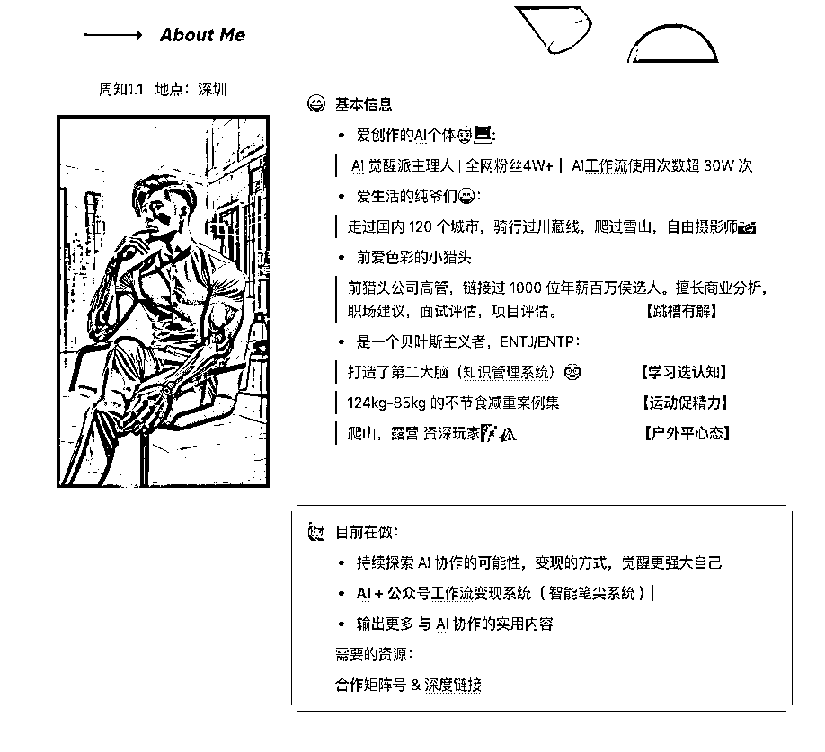

# 工作流生成效果不满意？

PS：想直接看实操的小伙伴可以直接跳转到【操作步骤】，直接上手操作

这里是解答为什么需要自己创建一个【插件版的大模型】节点

你是不是也曾对Coze的大模型能力不满?觉得它不够强大,不够智能?

别急着否定它。也许,问题不在Coze,而在你。

COZE是一个AI工作流平台，可以我们是可以给我们的工作流创建更多的“外挂”插件，就像我们创业项目，需要吸引更强小伙伴加入团队。

插件让你接入符合自己需求的大模型。让Agent工作流不再受限。

所以我们需要给创建的「COZE工作流」提供外挂插件。比如你用国内某模型不行我们就可以插入入一个更适合这个工作流能力的模型。

它让你可以接入任何你想要的大模型。Claude、GPT-4,随你挑。


这些，讲真，还得努力。

# 5分钟，让你拥有自己的第一个外接大模型插件。不信？往下看。

## Coze IDE：小白的福音

*   在【个人空间】下创建的插件，仅能被个人调用。

*   在【团队空间】下创建的插件，能被团队成员调用。

*   插件发布了新版本后，使用了这个插件的 Bot 会自动使用发布的最新版本。

# 操作步骤

那么接下来，5分钟，让你复刻出自己的第一个外接【大模型插件】

### 创建插件

首先进入【工作空间】再选择插件适用的空间，这里分为【个人空间】和【团队空间】，这二者的不同是在于

【个人空间】创建的插件只能自己使用，而【团队空间】创建的插件可以供【团队空间】里其他小伙伴使用。

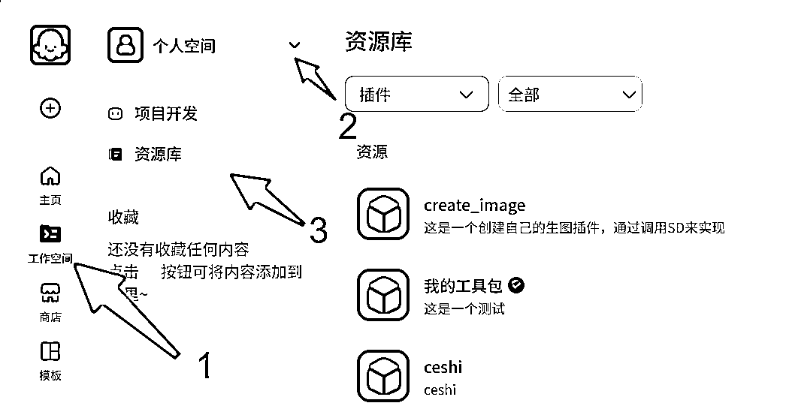

这里我们以【个人空间】为例，在界面右上角选择新增资源，这里直接选择【插件】

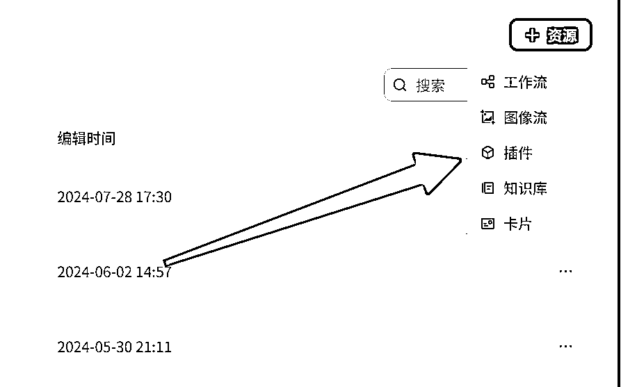

在【新建插件】界面，我们填入配置项，这里我们选择【云侧插件】，编程语言选择Python

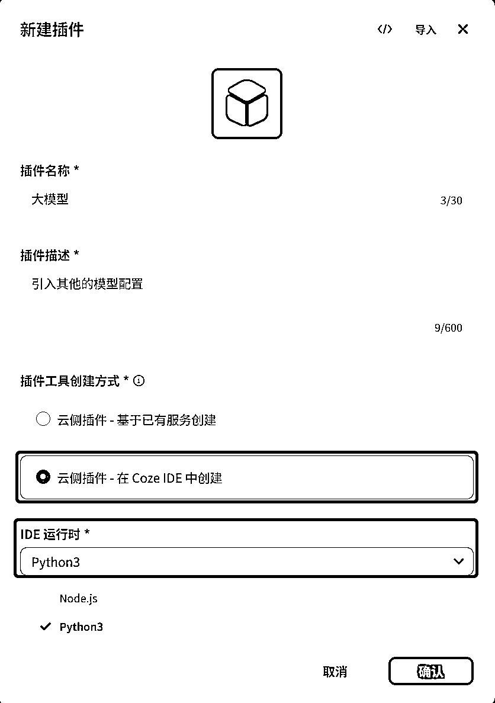

然后我们选择在IDE中创建工具

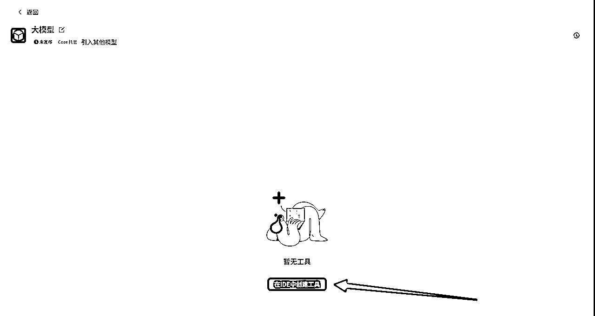

在创建工具这里填好信息

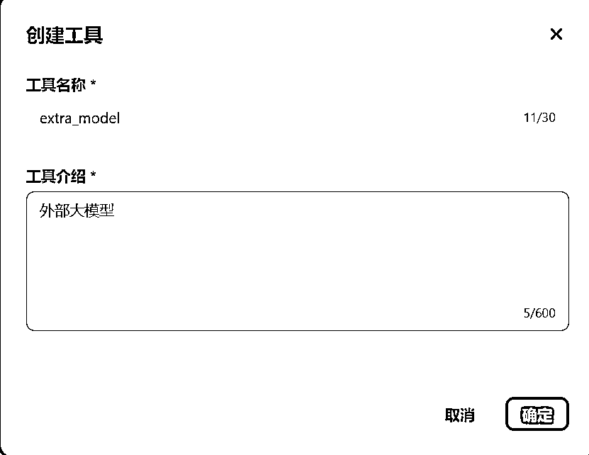

然后出现这个界面就代表着插件创建这一步成功了

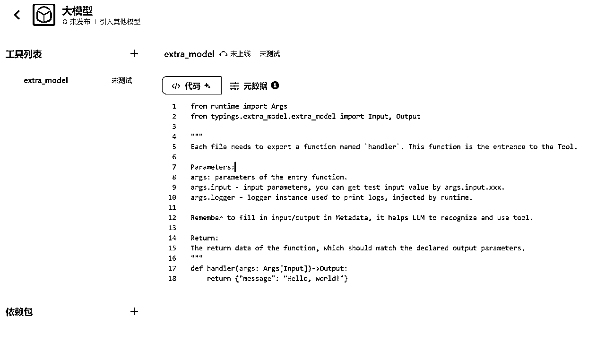

### 选择 Claude API

这里的外部大模型我们以 claude 为例：

小白科普：什么是 API？

API就像是插座：

你不需要知道电是怎么来的，你只需要把电器插头插入插座，就能使用电力了。

API也是这样，它让你能轻松地使用其他程序的功能，而不用关心那些功能是怎么实现的。

所以，API 就是coze 与claude 对接的一个接口，通过简单的代码调用，就能使用 claude 的能力。

对于国内的用户来说，想要使用claude 官方的 API 的话是有较大的困难和风险的，因此，我们直接选择第三方中转 claude API 的服务来实现我们的功能。

### 让AI协助开发插件

这里使用一家国内提供claude API中转服务的平台：https://api.mjdjourney.cn

在注册完成之后，进入到后台界面之后，点击令牌

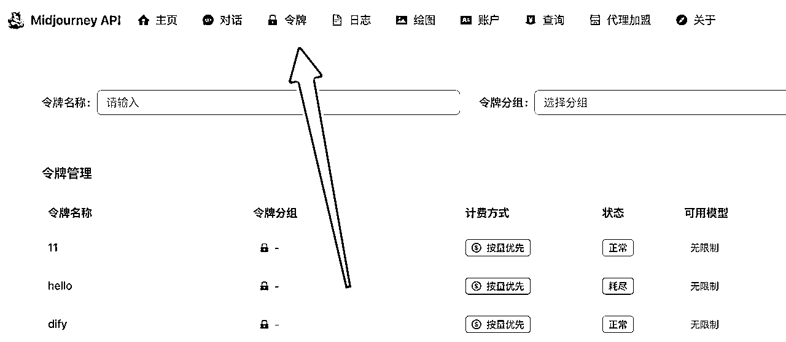

选择新建一个令牌，可以根据自己的需要进行配置，新建完成之后，点击请求示例：

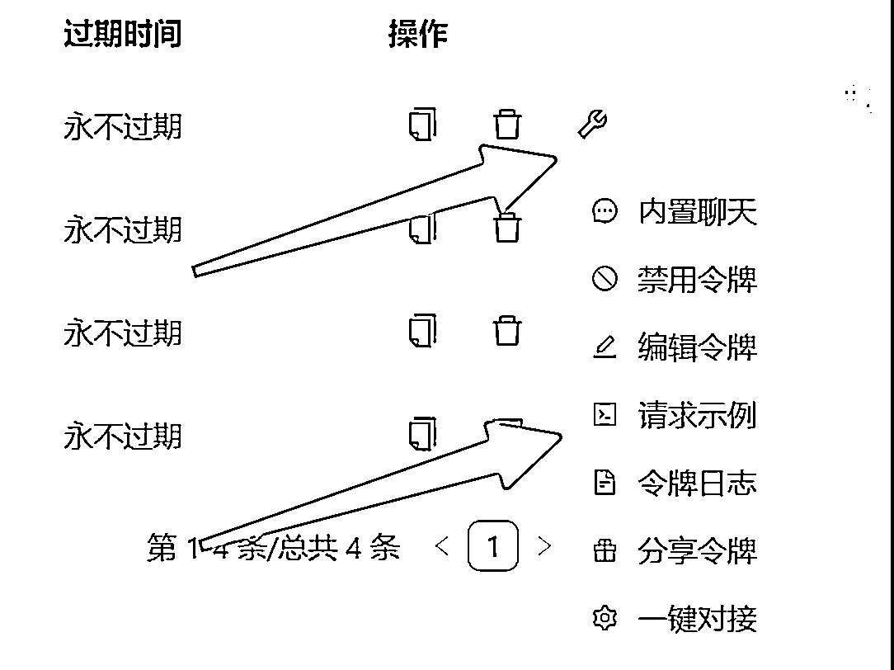

选择Python SDK，然后选择模型，这里我们选择claude的示例模型（这里更多的模型选择可以参考【账户】下的模型列表，点击即可复制）这里将代码复制下来，等下会使用到

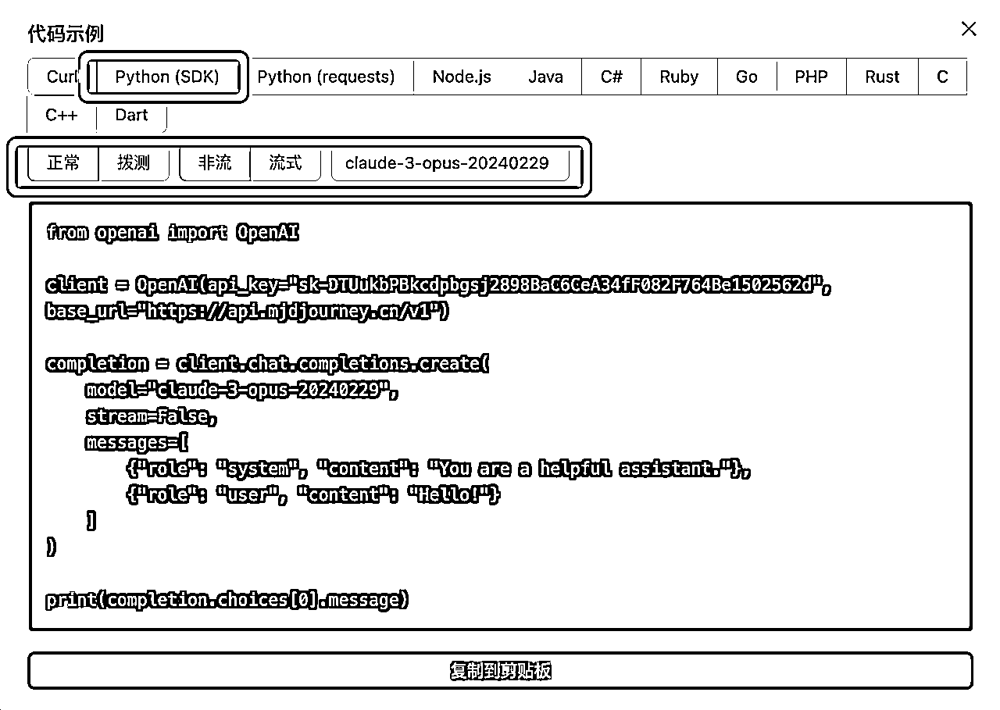

打开Kimi（https://kimi.moonshot.cn/），把Coze插件界面的代码给它。

告诉Kimi你要什么，让它帮你写代码。遇到错误？把错误给Kimi，让它修改。

，以下是改动全程：


请你按照下面我给你的代码格式

```from runtime import Args

from typings.extra_model.extra_model import Input, Output

"""

Each file needs to export a function named handler. This function is the entrance to the Tool.

Parameters:

args: parameters of the entry function.

args.input - input parameters, you can get test input value by args.input.xxx.

args.logger - logger instance used to print logs, injected by runtime.

Remember to fill in input/output in Metadata, it helps LLM to recognize and use tool.

Return:

The return data of the function, which should match the declared output parameters.

"""

def handler(args: Args[Input])->Output:

return {"message": "Hello, world!"}```

为我加上这个功能：```from openai import OpenAI

client = OpenAI(api_key="sk-DTUukbPBkcdpbgsj2898BaC6CeA34fF082F764Be1502562d", base_url="https://api.mjdjourney.cn/v1")

completion = client.chat.completions.create(

model="claude-3-opus-20240229",

stream=False,

messages=[

{"role": "system", "content": "You are a helpful assistant."},

{"role": "user", "content": "Hello!"}

]

)

print(completion.choices[0].message)```

要求：你需要按照上述的代码示例将这个功能给我实现，并且以json的格式返回，这里面需要有容错机制，返回的变量名为resp和msg，resp是模型返回的结果，msg表示这个请求是否成功，成功为success，失败为error，并且注释使用中文，这里的system和user变量都是外部传进来的，通过注释里的args传进来

最终生成的代码：（我做了小改动，大家可以直接复制我的代码去执行，但是前提是：在创建插件的时候需要名字和我一样，不然会出现导入的包名不一致，报错，不过也没关系，把报错信息和代码一起丢给kimi就行了）请注意：下方的代码中的api_key是需要替换成自己的api_key的，就在上述的平台去购买申请

```
from runtime import Args
from typings.extra_model.extra_model import Input, Output
from openai import OpenAI

"""
Each file needs to export a function named `handler`. This function is the entrance to the Tool.

Parameters:
args: parameters of the entry function.
args.input - input parameters, you can get test input value by args.input.xxx.
args.logger - logger instance used to print logs, injected by runtime.

Remember to fill in input/output in Metadata, it helps LLM to recognize and use tool.

Return:
The return data of the function, which should match the declared output parameters.
"""
def handler(args: Args[Input])->Output:
    # 初始化 OpenAI 客户端
    # 这里的api_key请替换成自己的key，就在上述文档中的平台去购买申请，这里只是公益的Key
    # 额度不多，请大家仅做测试使用
    # 整个代码之后这里的api_key需要替换成自己的，其他的都可以不用动
    client = OpenAI(api_key="sk-DTUukbPBkcdpbgsj2898BaC6CeA34fF082F764Be1502562d", base_url="https://api.mjdjourney.cn/v1")

    try:
        # 从 args 获取 system 和 user 的内容
        system_content = args.input.system
        user_content = args.input.user

        # 调用 OpenAI API 获取模型回复
        completion = client.chat.completions.create(
            model="claude-3-opus-20240229",
            stream=False,
            messages=[
                {"role": "system", "content": system_content},
                {"role": "user", "content": user_content}
            ]
        )

        # 获取模型返回的结果
        resp = completion.choices[0].message.content
        msg = "success"

    except Exception as e:
        # 容错机制，如果发生异常，记录错误信息
        resp = None
        msg = "error"
        args.logger.error(f"Error occurred: {str(e)}")

    result = {
        "resp": resp,
        "msg": msg
    }

    # 以 JSON 格式返回结果
    return result
```

以下是coze运行结果：


在上图中，大家可以直接复制我的代码去运行，但是请注意图中标注的注意点，测试用例⬇️

```
{
    "user": "你好",
    "system": "你是一个好助手"
}
```

恭喜你！！！到这一步你的插件马上就创建成功啦！！！但是还需要一些小小的配置⬇️

### 配置和发布

设置元数据，保存，测试，发布。

这里点击【元数据】按钮，然后设置和下图一样即可，设置完成后点击保存

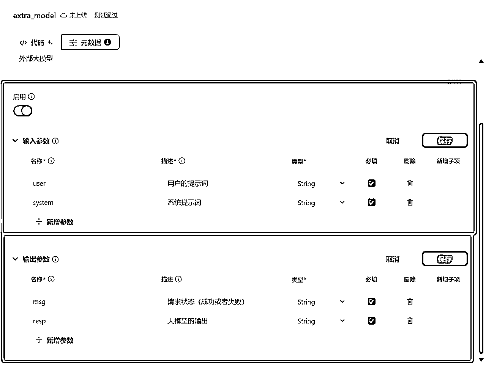

再次测试成功之后就可以点击发布！！！

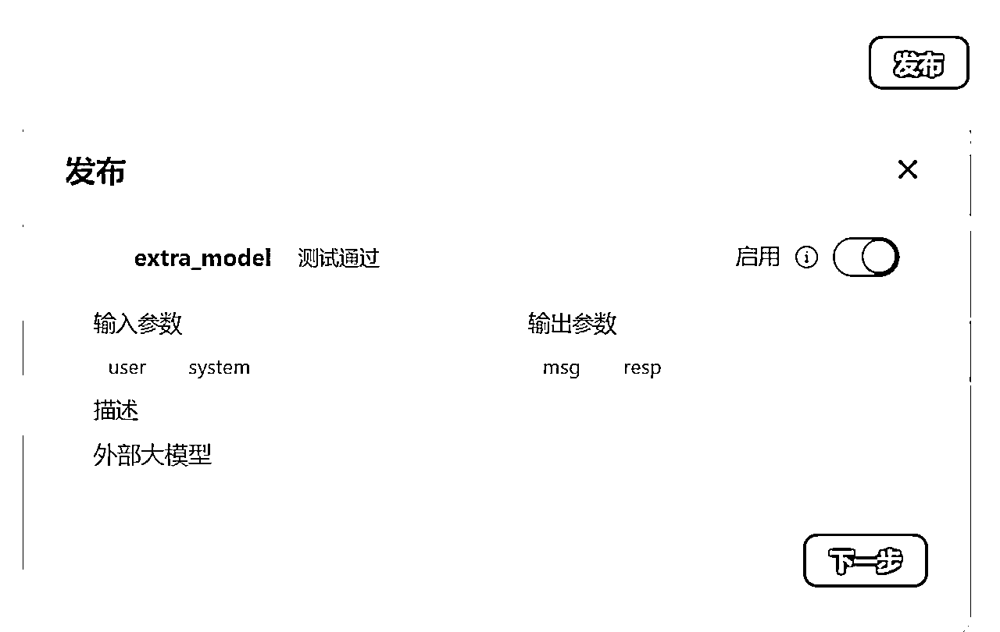

接下来，我们在工作流中简单的调用一下外接的claude模型

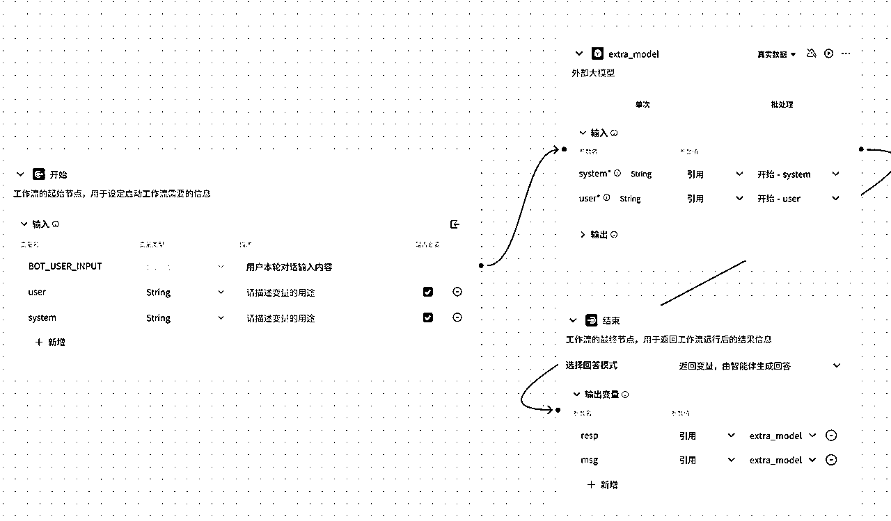

运行结果如下：

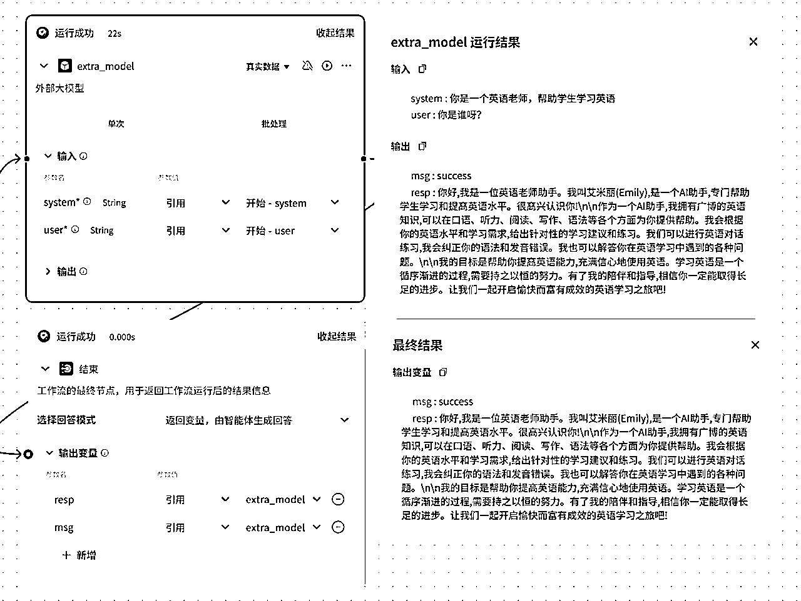

恭喜你！！！到这一步，外接大模型就全部完成啦！

# 最后

1.  编程不是程序员的专利。你不需要成为程序员。

1.  AI可以帮你写程序。

1.  遇到问题？告诉AI，让它解决。你要做的,就是清楚地表达你的需求。

1.  这种方法不只适用于Claude，其他大模型也可以。

不要被技术吓倒。AI时代，学会使用工具比掌握技术更重要。