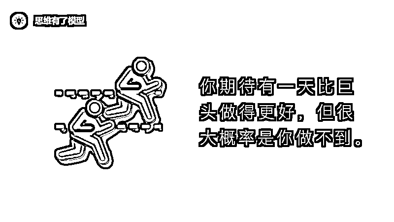

# 职场陷阱：如何在竞争中保持独特优势

> 原文：[`www.yuque.com/for_lazy/zhoubao/unix2vkbixbd8dk5`](https://www.yuque.com/for_lazy/zhoubao/unix2vkbixbd8dk5)

## (50 赞)职场陷阱：如何在竞争中保持独特优势

作者： 兰陵王

日期：2024-11-20

**前言故事：** 前一段时间收到一位读者的私信，她跟我说，要是早点看到这几篇文章就好了。工作几年了，一直在换岗位，没有在一个领域深耕细作，无法积累不可替代的优势，最后错过了晋升机会。

替她感到惋惜。这绝对不是个案，很多人进入职场后都会掉进这样的陷阱里，慢慢磨灭了希望，变得平庸。

所以我把它作为前言故事分享出来，希望你们在职场里可以保持警觉。

以下正文

**与其更好，不如不同。**

这句话成就了我，现在我把它分享出来，希望也能成就你。

我们人有个很致命的缺陷——**太喜欢随大流，太喜欢在人潮拥挤的地方拼得头破血流。** 好像只有在人潮拥挤的地方成为第一，才能彰显自己超越众生，否则就感觉自己被群体抛弃了似的。

就好像在大学的时候，所有人都一致认为学生会很牛逼，最好能当上学生会主席，那就威风八面了。

后来，又有人说打比赛很荣耀，于是又挤破头去参加各种比赛，挑战杯、建模大赛……

然后大家都说考研才有前途，于是大家又挤破头去考研，一战不行二战再来。

工作之后，很多人说公务员是铁饭碗，国企有保障，世界 500 强才有出路，北上广机遇多，XXX 行业是未来，XXX 职业很吃香……于是大家又一股脑的往里挤。

可是我们都忽略了一件更重要的事——**个体差异** 。用自己的弱势去跟别人的优势竞争，你很难成为第一，而无法成为第一，就容易平庸。

这就是为什么我们今天大多数人都很平庸的原因，不是你没有天赋，而是你抛弃了你的天赋，选择了一条人潮拥挤的道路。

跟很多人一样，曾经我也迷恋在人潮拥挤的地方成为第一。大一刚进入学校的时候，超级想做班长，想做学生会主席，想打比赛，想考研……想在一切人潮拥挤的地方引人瞩目。

幸好我太菜，没有成为班长，也没有成为学生会主席，不然我现在可能正在为找工作发愁。

到了大二，有一天突然看到乔布斯的一句话「**Think different** 」。

那是我第一次从哲学的层次重新理解叛逆，理解特立独行，理解格格不入，理解人云亦云，理解疯子与天才。

从那以后，我毅然决然的选择了不考研，专心看“闲书”，专心输入输出。

这在同学眼中是难以被理解的，就连我一些朋友也经常很疑惑的问我：“你在做什么？你不考研吗？写作能赚钱吗？”诸如此类的话题。

我理解他们的疑惑，因为我曾经也认为人潮拥挤的地方才是正道。

如果你在做一件与众不同的事情的时候，最好不要去跟别人解释，因为认知不同，解释了人家也不懂，你只需要坚定的把事情做好就行了。

事实证明我是对的，在大三的时候，我已经可以说我是全校做自媒体做得最牛逼的人。而这个第一，给我带了人脉、资源、影响力等等。

然后我仅靠这一项，就拿到了北辰青年的实习 offer；再然后在北辰青年实习的时候，被领导看重，准备委以重任；但是期间我隐约感觉到我找到了自媒体的本质，所以我又毅然决然辞掉了工作，出来做自己想做的事情；在这期间，出版社、机构组织、商业人士纷纷向我汇聚而来，希望跟我发生连接……

这是我和与众不同的故事。

这背后的逻辑是，我跳出了那个红海战场，重新开辟了一条新的战场，由于是新的战场，我很轻松就能在一个小圈子里成为第一，为别人提供价值，从而获得了阶段性的成功。

## **为什么要与众不同**

自从懂了这一法则之后，我就一直在思考一个问题，为什么它如此行之有效？这背后符合怎样的生存原理？

后来我在很多人那里得到了验证，并且逐渐揭开了这背后的本质。

在以色列，有一本书被犹太人奉为“圣经”，至死研读，这本书叫做《塔木德》，在《塔木德》里有这样一句话**「世间的事非常奇怪，越是难做的事，越容易做成」** 。

我后来才明白，因为容易走的路人潮拥挤，竞争力太大，难走的路没人愿意走，所以难做的事情反而更容易做成。

后来我在《定位》中看到了这样一句话**「不要对市场领导者进行正面攻击。绕过障碍要比穿过它好得多，**最好是选择一个别人没有完全占据的定位**」**
。

与此对应的是管理学大师德鲁克的一句话**「小企业的成功绝对不是去在大企业里面硬分一杯羹，**而是它能够找到一个属于它自己的生态位**，哪怕这个生态位暂时很小」**
。

混沌大学把它提炼为一个思维模型，叫做“错位竞争”。善友教授说**「有一句话直到今天我仍认为是对的，就是****‘与其更好，不如不同’****，这八个字是我用血与泪的教训换来的，是创业的第一法则」**
。

我把以上这些牛人的思想总结为下面几点原因：

**一、与众不同竞争力小**

在《兄弟》的封底，余华庄严的引用耶稣的教诲，写下了这样一段话「我想无论是写作还是人生，正确的出发都是走进窄门，不要被宽阔的大门所迷惑，那里的路没有多长」。

这段话对我影响极大。

我们太着迷于在人潮拥挤的地方出类拔萃，这一特点深深的根植于我们的基因中。

但是每一个人潮注定只能有一个第一，第一之下都是陪跑。那么多优秀的人，你凭什么那么自信你就是那个第一呢？

画一个图大家立马就懂了。

 Lk4HqEQJVdgDYyJ2)下面这条路特别好走，没有障碍，笔直且宽阔。上面那条路崎岖而绕远，荆棘密布，还有豺狼虎豹。

我们的第一直觉是走下面这条路，而且一旦你看到大多数人都在走这条路，你会生怕错过什么，于是也争先恐后的跟着人潮走去。

**我们都以为豺狼虎豹最难搞，其实真正最难搞定的是人啊。**

上面那条路虽然充满阻碍，但是因为人少，竞争力小，反而最容易成为第一；下面这条路看起来一帆风顺，但因为人潮拥挤，竞争力大，反而很难成为第一。

这正是塔木德那句**「世间的事非常奇怪，越是难做的事，越容易做成」** 所想传达的意思。

这是最简单不过的道理。

**二、与众不同创造价值**

你一定要明白一个最最简单的道理，**你之所以能取得成功，是因为你能给别人提供价值。**

如果这个领域已经有超级巨头霸占了，你再去做同样的事情，你的价值在哪里？

这个道理虽然浅显，但是却很少人意识到。

我在做知乎的时候就发现，这一道理无处不在。同一个问题之下，有上千个回答，此时你来回答问题，你怎么做才能让自己的回答排在前五？

两条路：如果前五名回答很垃圾，你很自信你能够写得比别人好太多，那可以写你最想写的回答；而如果前五名回答都是大 V，他们的点赞量已经破万，这个时候你即使很想写跟他们一样的角度，也不要这样做，明智之举是想一个全新的角度切入。

更明智之举是选择新的问题，去新的生态位。

因为你要懂得，如果你写的东西跟别人一样，而且还写得没人家好，那么你的价值在哪里？

你去观察那些知乎回答，有些回答虽然不够惊艳，但因为它提供了新的角度，也会排在前面，因为它为读者提供了新的价值。

做自媒体也是，做企业也是。如果这个领域已经有超级巨头，停下来想一想你的价值在哪里？

基于这一道理，你就不难理解什么是“错位竞争”，为什么“与其更好，不如不同”了。

因为当你模仿巨人，做跟他同样的事情，你在很长一段时间根本干不赢人家。巨头有规模优势，你没有；巨头资本雄厚，你入不敷出；巨头资源、渠道、人脉都远胜于你，你菜的抠脚……

**所以很长一段时间，你是无法给用户提供价值的，而这段时间已经足够你死很多次了。**

所以更好的战略是“与其更好，不如不同”，当你做跟巨头不同的事，你立马就能给用户提供价值，这就是成功法则。

《定位》的作者在书中如此嘶声力竭的提醒道「**要想同 IBM 已经确立的地位直接发起挑战，根本没有成功的指望，你只有大胆去做不同的事才能取胜，历史证明这是一个真理** 」。

理解了这一道理，就能理解德鲁克为什么会说「**小企业的成功绝对不是去在大企业里面硬分一杯羹，而是它能够找到一个属于它自己生态位，哪怕这个生态位暂时很小，但是它能在这个生态位里边取得某种领先地位** 」。

硬分一杯羹代表着跟巨头硬扛，这几乎没有胜算；但是如果你去新的战场，你就能在那个新的战场很快成为第一，为用户提供价值。

这就是错位竞争。

**三、这是自然生存法则**

德鲁克那句话极为牛逼，他提到一个词，叫做「**生态位」** 。

前两天看到一个讲生物进化的视频，突然顿悟，它极有可能就是这个自然界最底层的生存法则。

PS：此处本来是有一个超级精彩的视频，但因为腾讯视频没有，放不上来，所以我会分享在读者群。

下面请跟我一起来思考一些宏大的问题。

这是一个群落，里面有很多物种。现在问题来了：

①为什么地球上会进化出如此繁多的物种？不这样会怎样？

这是个很“傻”的问题，但我们平时就是因为从不问这样的“傻”问题，才看不破事物的本质。

思考一下，所有生物一开始都是从一个单细胞生物进化而来，为什么最后这个单细胞生物进化出了如此繁多的物种？如果不这样会怎样？

②同一个群落中为什么会有不同的生态位？

植物中为什么会有乔木、灌木、草本？

动物中为什么会有水生、陆地、空中？

③我们的祖先曾经全部生活在海洋里，是什么原因驱使它们上岸？

结合本文的思维模型，现在停下来思考一下上面的三个问题。

下面是我的思考过程：

1、在同一个生态位中资源有限。

2、每个生物要生存就需要足够的资源。

3、有限的资源+生存的需要=激烈的竞争。

4、物种之间存在差异，有强有弱。

5、强者霸占了更多资源，弱者要想生存只能开辟新的生态位。

6、新的生态位就是“深耕细作+与众不同”的本质。

如果一个种群或者物种，与另一个更强的种群或者物种处在同一个生态位，它最终的结局一定是灭绝。

为了生存它必须去新的生态位，与强者保持错位竞争。

这是生物法则：一个稳定的群落中占据了相同生态位的两个种群，其中一个种群终究要灭亡。**但在一个稳定的群落中，如果各种群在群落中都有各自的生态位，种群间就能避免直接的竞争，从而保证了群落的稳定。**

《生物学思想发展史》如此描述描述这一生物法则「在很多情况下，取得成功仅仅是由于变得与众不同或者更加不同，这样就减少了竞争」。

这是生物学给我们的启示。

大到组织，小到个体，都遵循这个生存法则。

每个企业、每个人都有属于你的生态位，如果你所处的这个生态位已经有巨头存在，最好的办法就是去找到一个新的生态位，在那个新的生态位你是绝对的霸主。

生存之道就在其中，成功之道亦在其中。

## **什么是与众不同**

一句话解释：去开辟新的生态位，在新的生态位成为第一。

这正是美团 CEO 王兴那句话「**互联网领域竞争规律的本质，不是在原有的领域把原来的人挤掉，而是新的战场扩大，新的玩家占住了新的战场** 」。

看到了吗？关键词**“新的战场”** 。这个新的战场指的就是新的生态位。

成功之道不在原有的生态位，而在新的生态位。

来，再看一下管理学大师德鲁克的这句话「小企业的成功绝对不是去在大企业里面硬分一杯羹，**而是它能够找到一个属于它自己的生态位** ，哪怕这个生态位暂时很小，但是它能在这个生态位里边取得某种领先地位」。

是不是顿悟了？

成功之道不在原有的生态位，而在新的生态位。

如果你还是有点蒙，我画个图给你看。

一开始一个市场是空白的，这就是我们所说的风口，或者蓝海。

然后被一个高瞻远瞩的人发现了，他成了第一个吃螃蟹的人。这个人的好处是，它可以贪心的霸占整个市场，可以啥都做。

比如阿里巴巴，比如腾讯，比如百度，比如亚马逊，比如 IBM。

如果这个领域已经有了绝对的霸主了，后来者应该怎么办？

**第一，深耕细作，在霸主不擅长的领域成为第一。**

比如已经有了淘宝，但是你可以做当当网，你只卖书，把它做到极致，成为第一，这个时候你对用户就是有价值的。

**第二，与众不同，开辟新的生态位，在新的生态位成为第一。**

比如已经有了淘宝，你想再做一个淘宝，只有死路一条。但是你可以做一个美团，解决人们吃的问题；或者做一个携程，解决人们行的问题。

记住，不要被人潮所迷惑，那里已经有霸主了，你要去新的战场，那里才是你的主场。

生存之道就在其中，成功之道亦在其中。

## **与众不同和深耕细作的关系**

我的文章是连着的，它是一个体系，「与众不同」和「深耕细作」都是成为第一的方法论。

用一张思维导图呈现出来大概是这样一种关系。

注意！！！

深耕细作和与众不同并不是二元对立的，它们其实是一体两面。

**在层级之间体现为深耕细作，在同级之间体现为与众不同。**

比如下面这个群落，草本植物、灌木、乔木对于整个群落来说是深耕细作；但是草本植物、灌木、乔木这三者之间的关系是与众不同。

再比如，对于全品类的淘宝来说，当当网就是深耕细作；但是对于当当网来说，盒马就体现为与众不同。

生存之道就在其中，成功之道亦在其中。

**怎么做到与众不同**

要想知道怎么做，首先需要明白与众不同的本质是什么。

前面已经讲了，与众不同的本质是开辟新的生态位。

所以，通往与众不同的方法论就是构建生态位，然后在层级之间深耕细作，在同级之间与众不同。

构建生态位的工具，我叫它**框架思维** 。

所谓框架思维，就是利用**MECE 原则** ，给事物分类，形成结构化的框架；所谓 MECE 原则，就是尽量让你的分类做到**不重复、不遗漏** 。

比如电商平台，你可以分为海外和国内。

比如电商平台可以分为服装和非服装，服装下可以分为男性和女性；服装下可以分为母婴和非母婴。

最后，我们一起来思考一个问题：为什么京东，特别是拼多多，能在淘宝的眼皮子底下做起来？

答案是：因为它们开辟了新的生态位，远离了淘宝的生态位，淘宝想打也打不了，因为人家跟你不在一个生态位。

我们分别来看看京东和拼多多的生态位。

看看这张图，京东与淘宝是两个完全不同的生态位，京东是自营生态位，对应的是质量保证、物流迅速、售后放心；而淘宝是非自营生态位，对应的是品类齐全、价格便宜。

它们之间从生态位来说，是无法直接打架的，这就是京东当年能从淘宝眼皮底下做起来的底层逻辑。

拼多多就更牛了，在电商平台种类繁多，淘宝、京东坐庄的情况下，还能找到新的生态位——**团购** 。

真的是牛逼，目前拼多多的市值达到了 876 亿美元，已经超过了京东和百度。它的创始人黄峥，也一跃成了身价仅次于马化腾和马云的人物，达到了 300 亿美元。

来，我们从生态位的角度再来看看，为什么拼多多能在淘宝和京东的眼皮子底下做起来？

发现了吗？拼多多的生态位跟淘宝和京东完全不同，拼多多的用户是对价格极度敏感的低端消费者，他们大多分布在三四线城市，不追求品牌，只追求性价比。

我是农村人，深深的了解这群人的购物习惯，真的是只看价格，啥便宜买啥。比如买袜子，他们根本就不在乎好不好看，甚至都不在意舒不舒适。

另外，拼多多的商家也是被淘宝和京东等抛弃的商家，他们大多来自低端供应链，没有品牌，质量一般，但是价格便宜到你不敢相信。

你看，拼多多的生态位，跟淘宝和京东是完全不同的。

所以当它起来的时候，这两个巨头只能眼睁睁的看着它长大，而无可奈何，因为它们不在一个生态位。

而这，也是为什么地球上有数以亿万的物种，却还能相安无事地稳定发展的原因。

因为每一个物种都有独属于自己的生态位，从而避免了跟数以亿万的物种产生直接竞争，得以稳定的繁衍。

生存之道就在其中，成功之道亦在其中。

以上，就是如何做到与众不同的全部内容，我为你举了几个案例，供你参考。

其实，找到独属于你的生态位并不难，难的是克服你心中的**贪婪。**

不要总是啥都想做，不要被人潮所迷惑，那里面的路并没有多长。

最后送给大家一首蔡志忠的哲学小语：

小鸟对长颈鹿说，虽然你长得很高，但是我会飞。我们都太在意很多项目输给很多人，其实我们只需要关心，我们有哪一项赢过全世界？

* * *

评论区：

忧愁小松鼠 : 谢谢，有所启发，与其更好，不如不同，打造差异化，发挥自身优势，我有你没有。

兰陵王 : 💪

知秋 : 头皮发麻

兰陵王 : [嘿哈]

芯谅 : 那个视频在哪里呢

曼巴 : 说的太棒了

星星✨ : 太对啦，要找到属于自己的一方天地，爱好+擅长

兰陵王 : 公众号里可以看，这里上传不了，不好意思，忘记告诉大家了～