# 生财同城夜校航海复盘（0 基础小白的上岸之路）

> 原文：[`www.yuque.com/for_lazy/zhoubao/zv02ge617at4pwrf`](https://www.yuque.com/for_lazy/zhoubao/zv02ge617at4pwrf)

## (25 赞)生财同城夜校航海复盘（0 基础小白的上岸之路）

作者： 桔

日期：2024-11-19

本文主题：没做过推荐流量（小红书 视频号 抖音）的 0 基础新手的 30 天打怪升级历程

1，我参与同城夜校的核心原因

2, 0 基础做流量的弯路

3，如何集众人之所长来优化自己的引流与转化流程（有彩蛋）

注意📢，因为我知道起码有 2 位同学的复盘一定是实操细节干货满满，堪比航海项目手册，本文基本不会说太多实操干货，想学习干货的宝子可以退出了。。。（这个宝子是我们对夜校用户的称呼，用了一个月，改不回来了。。。）

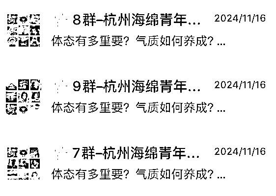

大家好，我是桔子🍊，之前主做搜一搜，累计注册 2000+公众号 1000+小程序，一直在舒适区，难以迈出做推荐流量（小红书抖音视频号等）的第一步

碰巧看到天盈教练的同城夜校帖子，直接触动了我的眼球（**同城项目** ），然后发现要开线下航海，我就很兴奋的一边看相关帖子一边期待着，然后定好晚 8 点闹钟，第一时间就去报名了，我清楚记得，在 20:05 左右，就已经报名了 30+个名额~

### **一，我参与同城夜校的核心原因**

报名后有个电话筛选考核，教练电话问我，为什么参与这个线下航海？

我说，我现在有被动项目，也没有负债，去线下 1 个月学习是没有压力的，并且我人在杭州，对同城私域非常感兴趣，之前也专门做过杭州闲置群，也有一点杭州同城私域。然后经过几天的苦等，终于等到了通知。

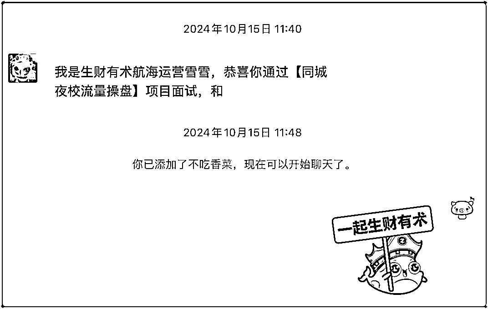

对了，在此之前出现了插曲，第二期报名同城夜校的伙伴一定记得接电话！！！并且没有接到电话，一定要去联系下~机会不容错过！

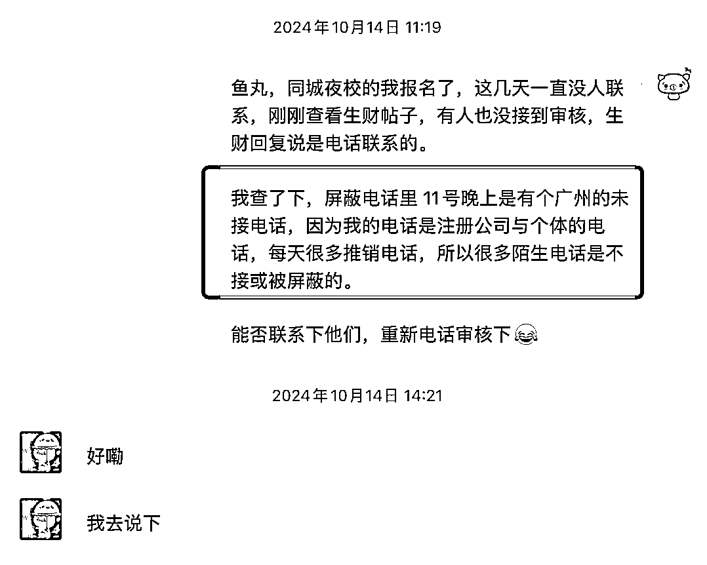

### **2, 0 基础做流量的弯路**

同城夜校航海要求，每人至少 3 个账号，我怕在杭州办的卡来广州异地停机，所以来广州当天下午就跑了营业厅办了 4 张卡（联通 1 主卡+3 副卡）

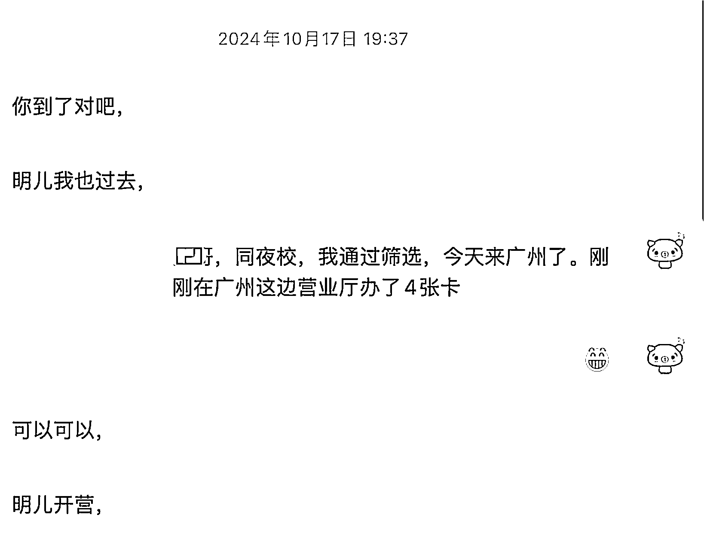

开工培训后，我们是小红书发图文，视频号与抖音同步发短视频。

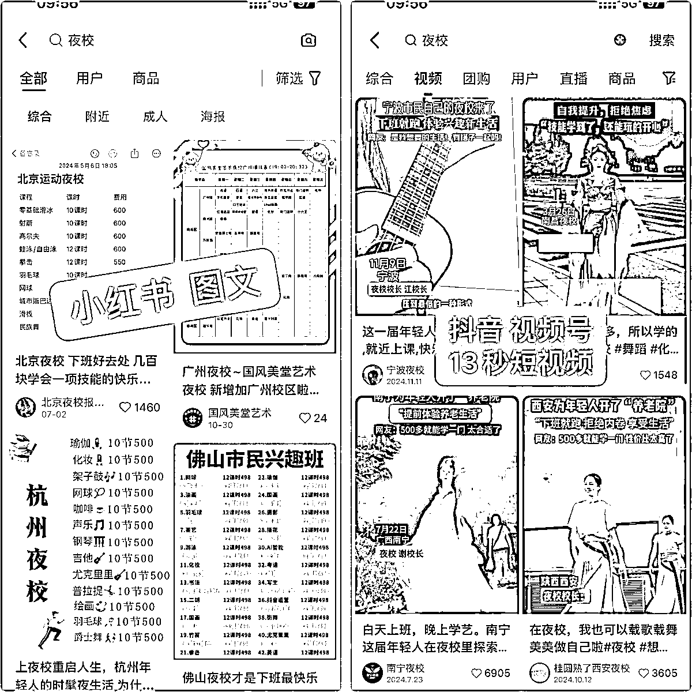

教练天团也给我们打预防针了，账号需要积累权重每天日更 3 篇，流量会慢慢起来，没想到突发事件发生了！

学员中有伙伴第 1 天正式航海视频号发的视频，直接大爆到 6w+播放，流量直接接不过来~（10 月 19 日是我们航海第 2 天，实操第 1 天）

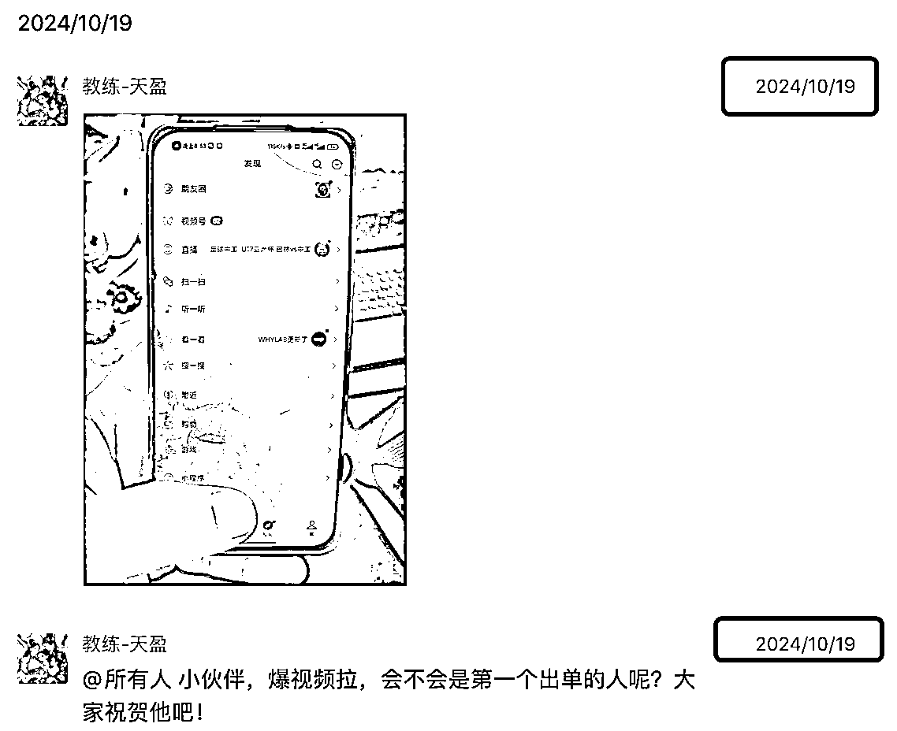

然后，我自己的视频也在第 2 天爆了，破几万，私信几百条，加微 99+通知，最终跑到了 10w+

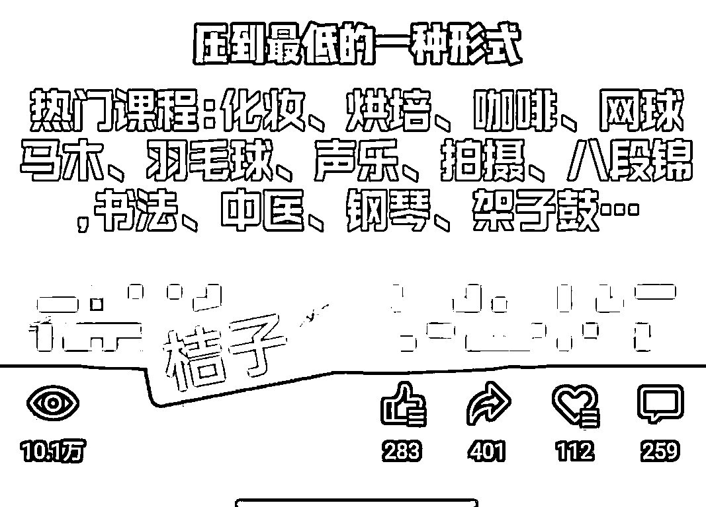

然后，我的问题由此出现了，教练说，小红书流量精准，转化率高，前期要好好运营，但是我因为视频号接连爆，然后流量接不过来（不敢多加好友，怕被限制），导致前几天一直在通过客户好友与聊天，然后极大了忽略了小红书的积累与成长（不用心做笔记，只是单纯的每天 3 篇/号）

时间一天天过去，视频号的爆发终止了，最终基本很难爆了（几千-几万）流量锐减，且视频号用户是因为感兴趣（视频内容）加好友的，转化率比较低且聊天耗时间长。

时间大概到航海第 10 天左右，每天新增好友基本不到 10 了，我开始慌了~正巧厦门团队的伙伴从一开始流量都不好，到用心运营，小红书流量开始起量与出单。

于是我就去和他们请教，伙伴们分享不藏私，给我讲他们是如何操作运营小红书的，然后我也对教练所说的对标同行模仿爆款有了更深的理解，也开始用心好好做小红书。（小红书同城夜校实操方法细节会有同学复盘分享，所以这里我不多说~）

（下面是当天出单截图）

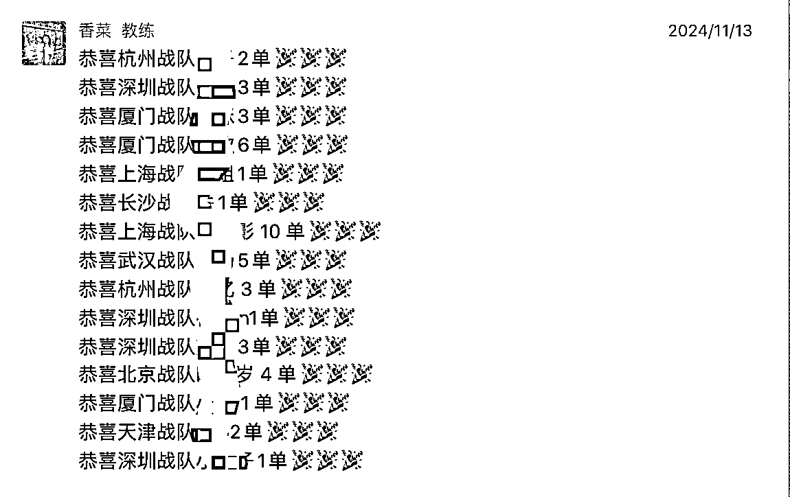

截止到航海结束，我的小红书几个群累计 163 人，差不多是最后 10 多天的结果~平均每天 10 几人吧

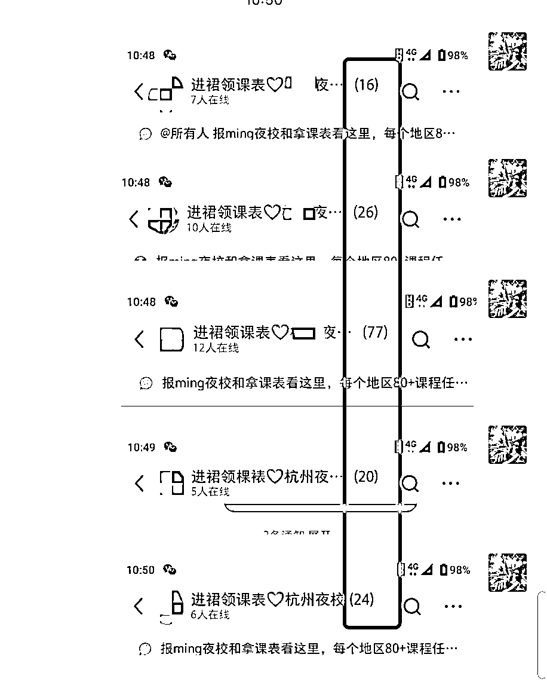

回顾这一个月，从推荐流量实操 0 基础小白，到做出一定结果，我是非常满意的，因为我的期望值就是同城项目+从 0 学习与实操推荐流量，我的收获我自认为是非常大的，K 教练的流量思维，香菜教练的私域运营思维，天盈教练的格局思维都在不同维度给与了我很多收获与启发，还有很多经常交流流量
社群 私域 夜校项目探讨 其他延伸交流等的同学们就不一一而说了，以上种种将对我以后的创业之路产生深远影响~

我的这个复盘还是挺适合像我一样对推荐流量（抖音 视频号 小红书）没怎么实操过的新手伙伴可以借鉴的，核心其实就几点

1，听话照做，严格按照教练们的项目实操流程去做

2，多学习多咨询多互动，有些伙伴本来就实操过相关玩法，经验丰度，一定要多去交流咨询（请吃个饭，别白嫖）

3，遇到问题找教练，是各种问题包括不限于流量 转化 技术 情感 吃饭等等，教练天团是我们最好的后盾~

我很羡慕第 2 批参与同城夜校的伙伴，因为一期有大结果的伙伴，不少都留在公司了，你们通过最新同城夜校项目教程+第一期伙伴（做助教）随时可请教，大家的起点直接进入半山腰了，真的羡慕~~

你以为我的复盘结束了？复盘是结束啦，但是还有最后一个环节呢，总得分享点小干货呢

### **3，如何集众人之所长来优化自己的引流与转化流程**

流量干货和转化干货都会有做的好的伙伴分享，这里我只分享我们在用的一个很不错的激活用户的私域方式。

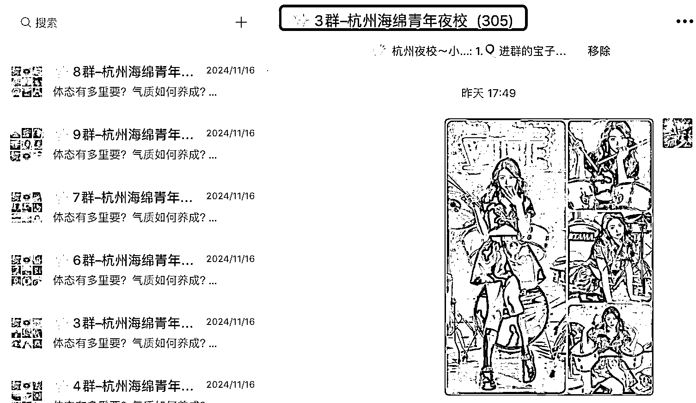

是这样的，用户触达分为私聊-朋友圈-群聊

朋友圈容易折叠，所以不是最佳触达用户方式（但是一定要发，因为新用户加你好友后，能了解你的，只有你的朋友圈）

私聊，每天用户加的太多的话，也很难私聊的完与再次触达，

所以，群聊是最佳触达用户方式，我们当我们用户多了后，就会拉群。

一开始建群，我写了 3 群，让用户意识到我们有 2 个满人群，起码有 1000 人，当然，你第一个群写 9 群 19 群都行，随你，在私域的身份是你自己给的~

最开始流量多，很快就满 300 人了，然后我的流量锐减，我也不想把新用户拉这个大群了，毕竟群不能禁言，怕炸群（我们有个伙伴的群因为把群二维码发到朋友圈，导致有的没有+她好友的用户进群，然后发黄图黄视频。。。）

因为流量少，如果直接拉小群进的人少，觉得不方便，迟迟没有拉新群，偶然我看到深圳战队曾丽小伙伴的操作，瞬间打通了我的任督二脉！

建新群，把群名称，群公告 管理员等信息都设置好，再拉不在你的大群的用户。

这是我的群公告，模仿公司的群的，仅供参考👇🏻

1.🎈进群的宝子可以进我们小程序👉🏻#小程序://海绵青年/F7NNwO0UyB9oGHD 找到自己想要的课哈（每周更新），想上什么或者有疑问找群主小闲😃

2.🎯课程覆盖：杭州各个大区💫

3.🎗课程种类：乐器、运动、副业、手工、自我提升、活动沙龙等🎉

4.💰课表分为私教课、团课，除了运动类，其余都是 498 有 8-12 节课，私教团课一个价格💸

5.🎁另外体验卡目前为总部广州地区专属（可以每种课程体验一次），不要急，杭州也会开放~也希望大家提出宝贵建议🥰。

📢注意：目前杭州在每天上架新课程，且所在地区没有想要的课程可以私聊群主小闲或购买通用课程链接，我们有专属人员负责在一周内帮助大家安排合适课程~

📢特别注意❗❗❗⚠️群里不允许发布任何形式广告链接，⚠️私加群友等不文明社群行为⚠️如果发现直接移除群哦

我们通过的好友，一般起码会有个标签，在我们只有一个群，想开 2 群的时候，我是这样操作的，

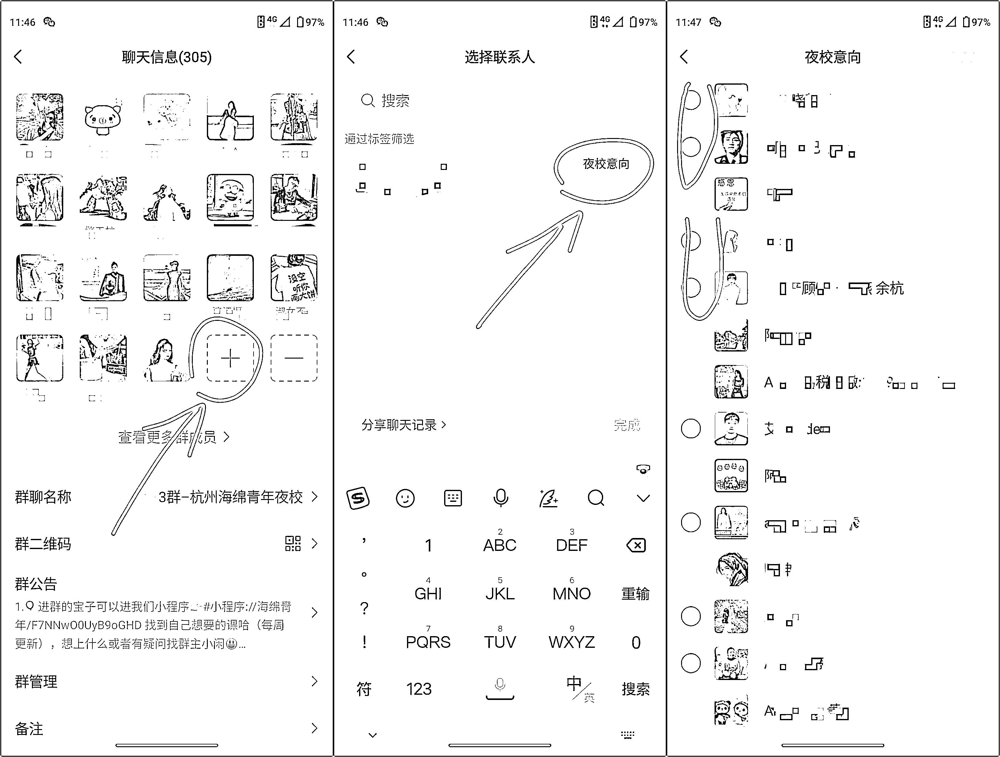

图 1，只有一个群，邀请好友加群

图 2，选择已经备注标签的用户（如果这个号都是用户，那无所谓打标签）

图 3，空格的都是不在这个群的用户，自己手机截图或另个手机拍照，然后去建新群拉新群即可。

一次性邀请不超过 40 人，（如果自己群里有 2 个自己号，那就最多拉 38 人），时间久了，你会发现有人删除了你，导致群里不足 40，可能是 35 或 32，那么这个小群依然可以单独拉人进群，只要群不超过 40 人都可以拉人
不用给用户发邀请链接。（注意📢：我基本都是电脑拉人进群，手机拉人很少，如果小群 40 人以下拉人出现需要发邀请链接，请用电脑拉人）

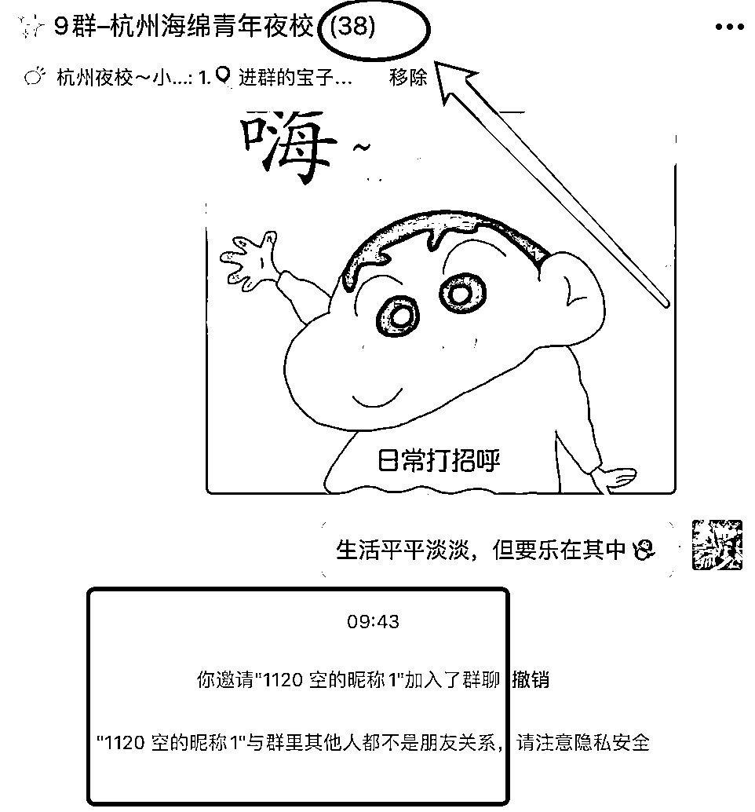

什么时候需要拉小群？

答：1，在你的大群满 100-300 人时，你觉得怕爆群，就可以拉新群， 2，不进群或退群的用户多，拉新小群。

为什么要拉小裙？

答：1，怕炸群
2，总有些不加群或退群的用户，我们基本很难再次触达，拉裙发广告，是最高效率的推广触达方式，没有之一。一直拉到他们把自己删除拉黑，，不成交的用户就不是铁粉，只是好友数据。

如果你已经建了多个群，怎么以后在拉小群？（核心）

这个问题其实很好搞定，就是查看用户，是否和你有共同群聊，如果没有，意味着没有进你群或退出你群了，

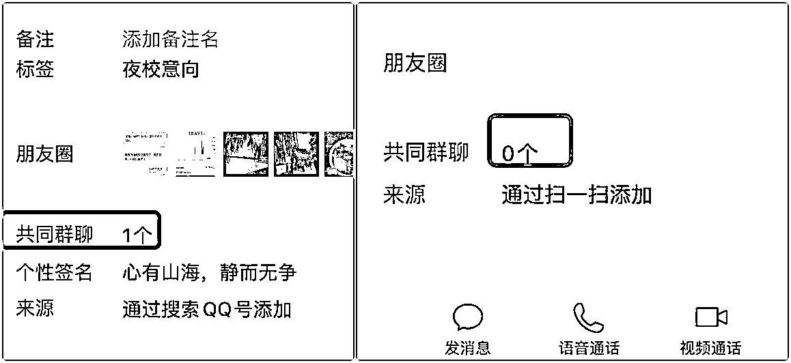

问题是，当自己好友已经大几百 几千时，手动一个一个操作肯定很麻烦哇，那怎么办呢，

思考了下，其实解决很简单，就是通过 rpa 自动化去操作即可~（按照手动如何辨别是否共同群聊的方式去设置 rpa 即可，刚加入同城夜校伙伴不用急，这个方式起码你有大几百上千好友后才会用到）

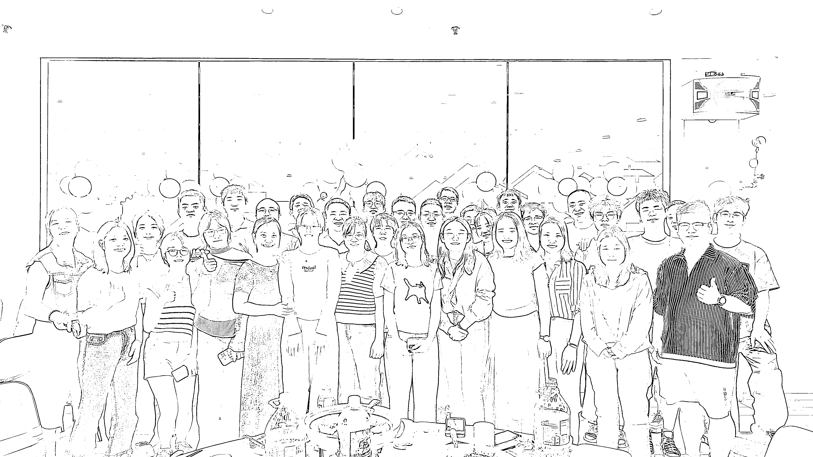

最后，结营仪式上，我拿着话筒说，我是真心的感谢生财与同城夜校的教练们，我们这批学员中，起码近 3 分之 1 是 30 岁以上的，想学新的互联网项目，去其他公司上班，可能吗？基本不可能，去付费学习，能保证诚心交付吗？不能保证，

但是，因为我们在生财，又因为我们参与了生财线下航海，我们才有机会在 0 基础的情况下，跟着教练学习实操，和同学们一起奋战
早 9 到晚 11 点，从而有了可能改变自己接下来人生的机会~

其他不多说了，1000 个人有 1000 个哈姆雷特，起码我认为本次生财同城夜校之旅，超值，疯狂点赞！！！

生财同城夜校航海第一期杭州战队成员桔子🍊，复盘结束~像我一样推荐流量 0 基础的新手小白们，不要怕！勇敢冲！

* * *

评论区：

奶油 : 桔子哥冲冲冲[得意]

天盈 : 真棒！！！！！

Bella 一曹 : 这篇内容看完收获满满，谢谢分享[强]

许老师～生财投资孵化 : 很用心的复盘，敢于走出自己的舒适区，桔子太牛了，期待接下来拿到更大成绩！

易芝🧀 : 太棒了， 期待我也有这么一次精彩的旅程

曾丽@丽丽曾 : 这次去广州的收获之一，是遇见桔子真好啊哈哈哈哈