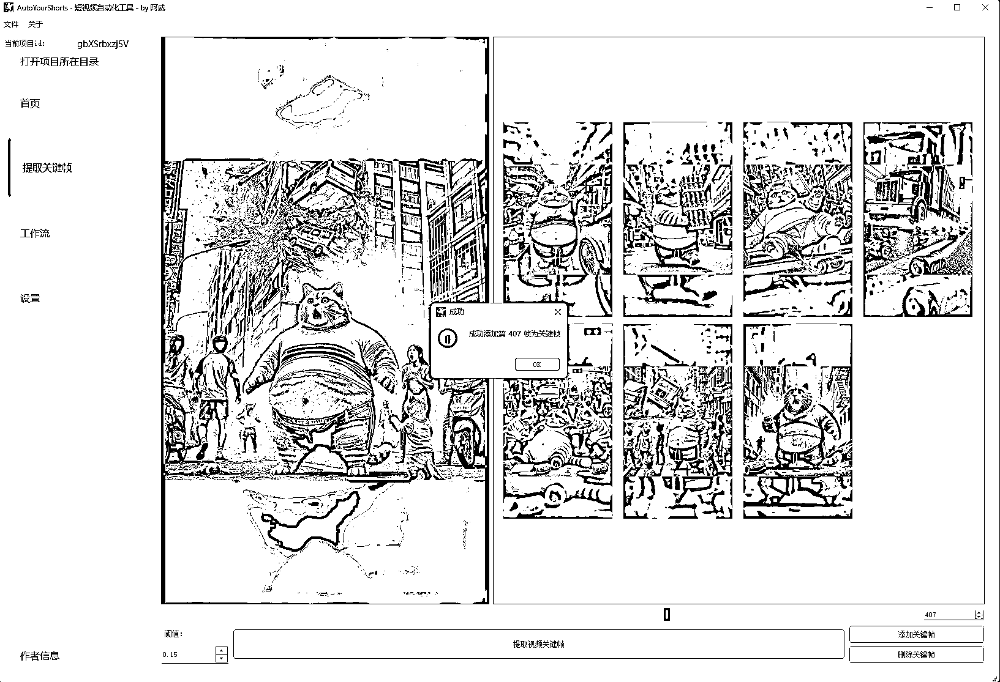
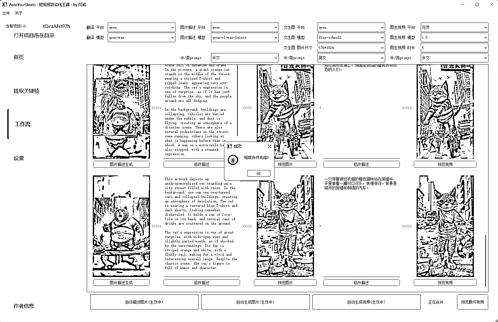
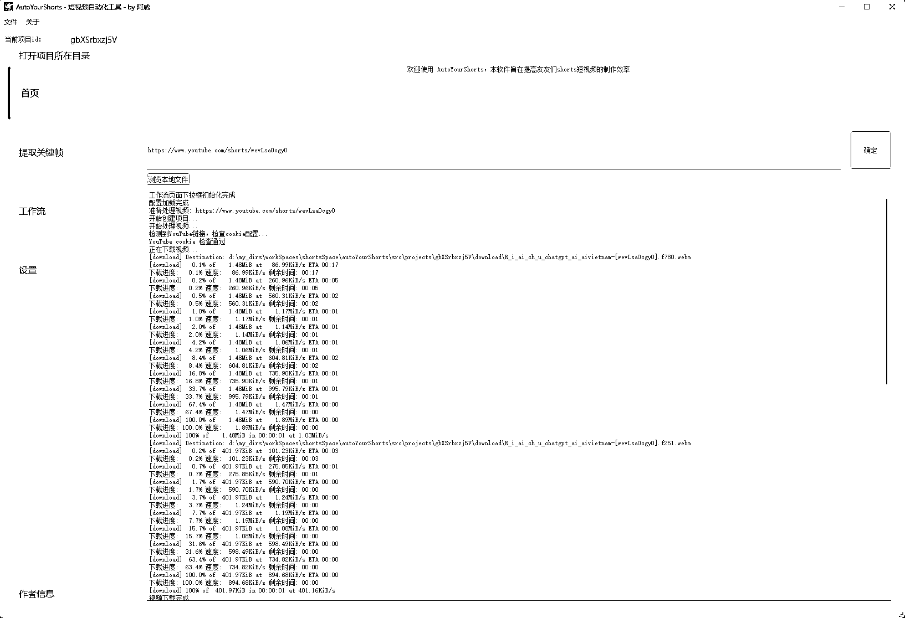

# 利用 cursor 辅助，爆肝 10 天做了款 shorts 自动化制作工具

> 原文：[`www.yuque.com/for_lazy/zhoubao/cf32sgzphf0e1ak1`](https://www.yuque.com/for_lazy/zhoubao/cf32sgzphf0e1ak1)

## (46 赞)利用 cursor 辅助，爆肝 10 天做了款 shorts 自动化制作工具

作者： 阿威

日期：2024-11-19

大家好，我是阿威，来生财一个多月了，学到了很多东西，也开始学着实操起来

今天给大家介绍一下这段时间我做的一款软件，用于 shorts 视频复刻

也是受到亦仁老大的超级标 shorts 短视频的影响，以及众多大佬分享的文章的启发，@叉叉敌，@钱塘江鲤，@老马内容出海，@土豆君，@方妮波，@竹子，@星吟 Singing，@python 大大，@大铭等等，这里我就不一一列举了

写的仓促，我这里主要介绍了下软件怎么使用的，后面如果大家有兴趣，我再分享一些细节

话不多说，飞书链接呈上：[`wqm8iq5gs4a.feishu.cn/docx/YzrFdUfypoGEHLx8i2lc7jZvnvb?from=from_copylink`](https://wqm8iq5gs4a.feishu.cn/docx/YzrFdUfypoGEHLx8i2lc7jZvnvb?from=from_copylink)

#youtube #shorts

附上几张软件的截图： 

* * *

评论区：

龙 : 好牛！！！我只模仿马哥的思路刚开发出一个批量采集的，后面还没整，圈友的思路对我后面继续开发很有启发！

龙 : 移动方块抽取关键帧+自动设置间隔抽帧，感觉好妙，既可以自动化也可以手动选择

阿威 : 不用人为干预是最好最理想的，我想实现这个，但是目前很难做到每次都百分百提取完整并且无重复，所以我不仅加了自动化提取功能，还给了手动调整的空间

cc : 我第一个，下载油管视频就卡住了。cursor 搞了一晚上，都没搞出来。被油管的人机校验给拦住了。不知道咋解决，，，

龙 : 下载油管视频，是不是可以用官方 api 提取视频 url，然后再模仿钱塘江鲤大佬的思路，用 cursor 自己开发一个通过 url 提取视频和音频的工具，这样就可以全自动化？

cc : 官方有这 api 的吗，

阿威 : python 有现成的 yt-dlp 库可以用

龙 : 有，你看一下这个帖子[`t.zsxq.com/eEzZv`](https://t.zsxq.com/eEzZv)