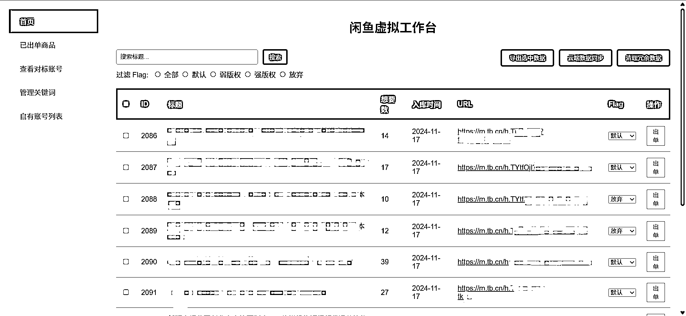
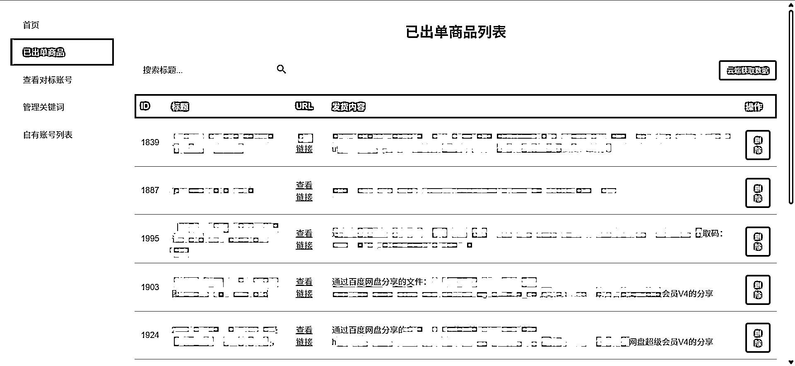
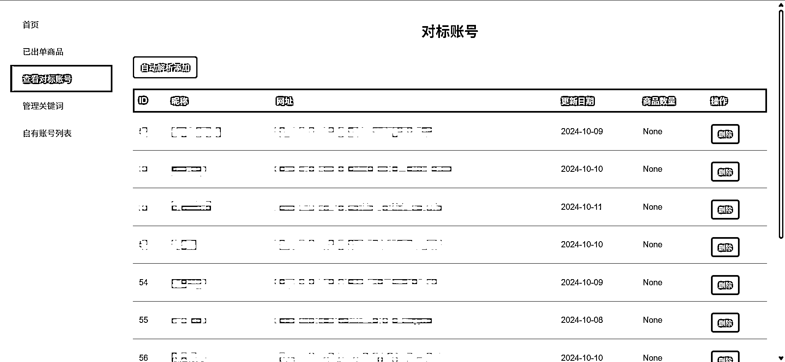

# 闲鱼虚拟项目自动化选品上品工具分享及开发思路复盘

> 原文：[`www.yuque.com/for_lazy/zhoubao/ssak1s7y6ftcreyw`](https://www.yuque.com/for_lazy/zhoubao/ssak1s7y6ftcreyw)

## (精华帖)(82 赞)闲鱼虚拟项目自动化选品上品工具分享及开发思路复盘

作者： Rand0mWalk

日期：2024-11-19

新的一期航海马上就要开始报名了，看到有闲鱼虚拟的项目，正好前段时间自己用 Cursor 和影刀做了一个关于闲鱼虚拟项目的自动化选品和上品的工具，分享给大家。

## 一、工具介绍

这套工具主要有三部分组成：

1.  工作台，主要用 Cursor 开发，可以管理对标账号、对标品、选品关键词以及对自己闲鱼多账号的管理

2.  自动选品，主要使用影刀开发，分为两个部分

3.  针对选品关键词自动搜索并筛选出符合选品需求的品

4.  针对对标账号自动筛选出符合选品需求的品

5.  自动上品，这部分同时使用了 Cursor 开发的代码和影刀，主要使用阿奇索的功能来实现自动上品

部分截图：

完整阅读移步飞书：[`fiazd3hbob.feishu.cn/docx/T7uFd8OGQoPH4cxly7LcMxBqnsb`](https://fiazd3hbob.feishu.cn/docx/T7uFd8OGQoPH4cxly7LcMxBqnsb)

* * *

评论区：

百哥 : 厉害了

米勒 : 厉害，需要一段时间消化，如果能做成成品就更好了

漫步云端 : 牛人

大愉 : 想问一下，在上品前是否有用 RPA 批量给图片水印这个步骤，有的话你是如何批量去水印的，看了其他帖子说是接 API 去水印，也没找到是接哪个，期待回复

Rand0mWalk : 水印分两种，一种是闲鱼平台自动给加上的，另一种是卖家自己在上传图片之前自己 ps 加上的。
第一种情况用我的 rpa 可以搞定，主要实现是在 download.py 里。 第二种情况下载下来图片后需要手工处理，这个我没做。
另外，其实无论是上边说的哪种情况，只要不是强版权的资料，就算不去水印自己用，问题都不大。只是看起来不好看。多去观察一下虚拟资料的品，有不少爆了的品的图片里都有别人闲鱼账号的水印，经过我这边的测试，对曝光影响不大，不过我一般发现这种情况也都会手工处理一下。

Rand0mWalk : 另外你提到的接 api 去水印，我没有去找这个相关的，去水印我一般用亨亨猫，但测试发现有一些闲鱼链接亨亨猫会解析失败，所以我才自己写的代码不对，是 Cursor 写的哈哈

叶冲 : 感谢分享，另外想问下，最后一步：影刀源码如何导入自己的账号使用中，A 账号和 B 账号的操作好像没有涉及您分享的代码的导入，是需要将 A 账号的 xbot_robot 替换成您分享的吗？

Rand0mWalk : a 账号就相当于我的账号，b 账号相当于你的账号，我分享的影刀源码相当于从 a 账号里复制出来的。