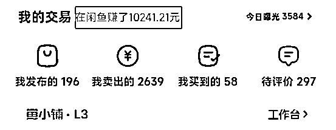
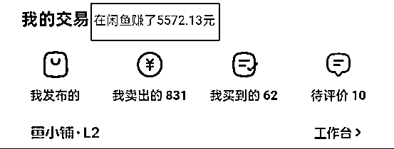

# 闲鱼虚拟资料实操经验分享：选品策略、收益最大化与避坑指南

> 原文：[`www.yuque.com/for_lazy/zhoubao/fgrm6oii5fxtk3r8`](https://www.yuque.com/for_lazy/zhoubao/fgrm6oii5fxtk3r8)

## (58 赞)闲鱼虚拟资料实操经验分享：选品策略、收益最大化与避坑指南

作者： 初阳

日期：2024-11-21

大家好，我是初阳，生财第 8 期的新圈友，一名刚大学毕业初入职场的菜鸟

第一次在生财分享内容，希望这篇闲鱼虚拟资料的实操分享可以帮助到即将参加闲鱼航海的伙伴

闲鱼虚拟资料是非常适合新人赚到第一块钱的项目，我进入生财的门票就是靠闲鱼虚拟资料赚到的

我是在七月初接触到的这个项目，通过两个月的时间变现了有 1.2w+的收益（两个闲鱼账号）

今天我将从以下 5 大重点方向和大家进行分享

1.  店铺类型

2.  选爆品方法

3.  扩大收益的方法

4.  闭坑指南

5.  账号运营心得

完整版大家请移步飞书阅读👉  [`q46sa8ckj6.feishu.cn/docx/G3iPdW29LoBnR0xZxwKcpVSXnAb?from=from_copylink`](https://q46sa8ckj6.feishu.cn/docx/G3iPdW29LoBnR0xZxwKcpVSXnAb?from=from_copylink)

* * *

评论区：

钻石宝地 _ : 精华[强][强]

奕蒙 : 虚拟资料，很多人都回来咨询内部细节问题，这种要怎么应对？除了在商品介绍图里尽可能详细。

初阳 : 问上家，空白闲鱼号不仅是用来找上家进货的，还有买家来找你问问题，你不知道的时候，你就可以去问上家，让上家给你解答

姜团圆 : 感觉这样很浪费时间

Real : 能卖的虚拟资料基本都有版权，只卖弱版权相关的是这样吧？[微笑]

Real : 虚拟资料基本都是一两块钱，这些是不是都靠网盘拉新来挣钱的

丹丹 : 选品之后的上架图去哪里找呢？需要自己买一份然后自己编辑图片上架吗？还是直接抄上家的？

初阳 : 初期直接抄即可，操作熟练后，首图尝试去自己重新做一下，可以参考小红书虚拟中的图片伪原创