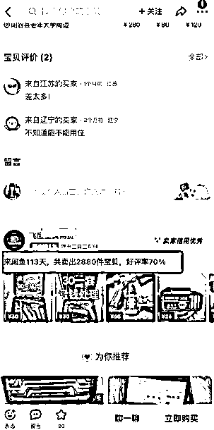

# 闲鱼做了 5 年，分享团队选爆款产品思路，适合小白入门选品贴

> 原文：[`www.yuque.com/for_lazy/zhoubao/qodbifcmspge8m8m`](https://www.yuque.com/for_lazy/zhoubao/qodbifcmspge8m8m)

## (37 赞)闲鱼做了 5 年，分享团队选爆款产品思路，适合小白入门选品贴

作者： 杨小六

日期：2024-11-18

大家好，我是杨小六，一个 2019 年做闲鱼的老咸鱼，账户 420+，10 月销售额已完成 200 万+

很多生财的朋友让我写一下我们团队闲鱼选品的思路，带给更多人启发。

我想，这不是人人都会都知道的么，什么好卖什么不好卖。

后来学员告诉我我才知道，很多东西，你自己知道是惯性或者已经训练成了本能反应。

看到没见过的产品，或者我想要高的产品，第一反应去拼多多搜同款，去搜索框搜索其他同行，然后截图，看我想要变化，看动态是不是没关闭，看销量截图，然后次日在返回去看一下。然后打开微信，找到运营群，发图片过去，发让运营测试这个产品如何。

一切都快成了肌肉反应，而你，我的朋友，你还没形成。所以今天这篇帖子，就帮助你如何找到心仪的产品！并且知道如何根据自己的实际情况正确选品！

选品决定了闲鱼运营的百分之 70 的成败！

不同的选品策略决定了你的订单量，和客服接待时间，售后处理麻烦程度。

为了大家阅读舒适搞了一个带段落要点提炼的，大家可以移步飞书阅读，喜欢口语化书写的可以继续看本篇。

[`zf7r28t8wa.feishu.cn/docx/Y3I7dUD5doHJi6xYP6IcsY2snLg?from=from_copylink`](https://zf7r28t8wa.feishu.cn/docx/Y3I7dUD5doHJi6xYP6IcsY2snLg?from=from_copylink)

接下来是正文。

**一、明确闲鱼的核心属性，找准选品方向**

首先先了解下闲鱼平台！必须知道平台属性才更容易搞定选品。

不用摊开数据来讲了，大家只需要知道闲鱼本质就是一个二手交易平台！

拆解一下，二手！交易！平台！三个属性

二手：选择具备二手交易属性的在闲鱼更加吃香

交易：可以在闲鱼完成交易

平台：全品类交易平台

一切尽量要往二手上靠，因为大部分的购物还是不会最开始就选择闲鱼！因为不知道还有卖新的产品的！来闲鱼购物的，基本都是要淘二手宝贝的！什么具备二手交易属性什么就吃香。你要想什么东西，具备二手交易属性。

**二、结合自己的实际情况，以及自己的目标定规划！**

我们团队目前只做标品，什么是标品，图书，计算器，晾衣架这就是典型的标品，大部分的人不会在乎外面的样子，在乎他的使用！因为功能上面本质没有任何区别。

购买顾客不需要大量去寻找宝贝，前几页，就够了，就可以促成顾客下单了。

非标品是什么，女生的衣服，逛 3 条街都没有选中的。购买决策长，而且容易产生退货，毕竟网上看的模特图和现实的她差了 50 斤。

闲鱼我们团队全部都是标品在卖。

标品有什么，我们就去研究什么。目前只做高客单价格的，因为利润率基本固定了。

除非很小类目，有很大的利润空间，但是不能支撑我们团队进去抢市场。

同时，非标品的属性太多，对于员工的培训比较繁琐。

我们结合自己的情况去做团队，大家结合自己的情况去做选品。

**首先结合自己的时间情况** ，我见得学员大概分两种，

第一种是有白天零散时间，晚上集中时间，类似上班摸鱼，宝妈带娃。顺带可以看下手机，没有太多集中的时间，中午的时间基本刚够吃饭。

第二种就是有大量的集中时间，孩子已经上学了，大学生没事做，或者把闲鱼当做项目去做的。

第一种呢，我给大家附带说操作模式，如果上班有电脑的话，可以用指纹浏览器登录闲鱼网页端，直接百度进去就行。然后电脑可以回复消息了，指纹浏览器网页可以错开，几个账户开几个网页，手机如果是安卓的话可以双开，2 个闲鱼号，整的差不多了，一月多个 3000 块没太大问题。苹果的话，一个号，如果不能满足的话，就买个二手摩托罗拉，可以 6 开。然后吧优质的账户扫码登录网页端，进行消息回复。

上班不建议进货和上品，主业和副业还是要分清楚的。

产品怎么选择呢，建议大家去选择低客单价的标品，咨询少，转化高！例如斧锯，螺丝电钻，角磨机，小型花架。

首先，我说的这些品类，咨询少，基本都是知道他的功能的，如果你的上品写的清楚的话，基本可以解决百分之 99 的问题。你上班回复的时间可以减少，也可以避免很多麻烦。其次转化高，基本上，大差不差，你的价格跟同行差不多，或者高一些，也不会太影响顾客的下单决策。

晚上进行上品和进货，中午有时间的话可以吧上午的订单中午下单，晚上统一填写发货单号就可以了。

第二种就是全职，有大量时间的，这里结合一下可用资金。

如果是全职有点资金的没问题，如果是学生，生活费固定，花呗信用卡能不动的尽量不要动，很多控制不住自己的，闲鱼的卖货的钱花完了，信用卡的钱还没钱还。我有遇到极个别这样的情况。

建议大家专款专用，可以花利润，本金是肯定不要动的。

这种我建议去卖一些大件，因为大件相对于来说，客单价更高，如果利润率固定的情况下，大件更赚钱一些。

大件的好处在于客单价高，利润大，但是同时顾客的购买决策时间长，毕竟几百块上千块，在闲鱼花出去，会多家对比的。主要常见的有，电动车，山地车，洗衣机，冰箱，运动器材等等。

其实本质上大件更具备二手交易属性，因为贵。

以上就是根据自己的时间选品，**下一个就是指定合理目标规划**

如果你打算兼职月入过万，本质上闲鱼不适合，其他的项目更好。

闲鱼能赚钱么，能，但是我想说句实话，就是我的员工 30 多人，单人产出很少能过万的。

极个别人，极个别时间可以，其他不行。

我们全职 8 个小时这样，你指望稍微的努力，还不够。

全职可以，闲鱼本质赚的多就是拼时间，我们员工正常 8 个小时，学员基本可以干 11 个小时左右。过万就简单了。

所以先定好你想要什么？

我拥有多少账户，有多少资金，想要赚多少钱，我的时间是怎么样的。

例如
杨小六，目前是一个打工族，早九晚六，上班操作电脑，工资 5k，有些积蓄，想操作 3 个账户，卖大百货，中午有时间手机进货，晚上没事，可以发布产品，和选品。想赚个 3k，我感觉这个是有合理规划的。

没有规划的就是

小雪，打工族，上班能玩电脑，但是不能玩手机，没有积蓄，想赚钱，越多越好。。。晚上有时间可以上品，消息不能及时回复。不知道卖啥好。

**三、定好了自己的规划，如何去看这个市场上有没有卖的好的对标。**

因为前面我们定了规划，就要看你这个品，卖的不错的能赚到多少钱，你做到头部，能不能满足你的目标，如果错错有余就可以做了。

首先是同行观察法，同行肯定不给我们说数据，就靠观察了，我们主要分为两块观察。

1、动态，动态这个大家基本都知道，会显示这个用户的所有数据，上品的可以删除，动态和销量是删除不掉的，这个商家如果开放的话，就可以看到，如果销量突破到了一定数量，则最多显示 30 多个。

**再给大家扩展一下，如何找到它的货源，看他的评价，评价里面有图片，拿着直接拼多多识别图片即可，过程不会超过 2 分钟。**

 images.zsxq.com/FhSIDPC92CibETtHnhvNO2KEQ7Tc) images.zsxq.com/FvVmn7DjQdHtdNjaMoGuKiup7lo3) images.zsxq.com/Fp7WZrDCv2ZmE2r_jrmXD7UT1E6i)

2、很多人直接把动态隐藏了，怎么解决？

看销量，每日截图一下，昨天的截图，今天的截图就行了。两个图一减，或者看他注册例如 113 天，销量是 2880 件，相当于每天销售量大概在 30+
一单利润 4 元，一天赚 120 元，单个账户，心里就有个大概，如果我做到了他的规模，我赚 120 月入 3600 是否能满足，如果可以，直接上架干。

第二个就是拼多多等平台观察。拼多多卖的不错的，闲鱼基本也可以起飞。

建议大家还是根据多逛逛闲鱼，看到合适的产品，拼多多对比下价格，在看一下闲鱼的日销售量，如果可以的话，直接就安排测，每天给自己定任务，每天找到多少个产品。

到最后，所有的产品都打上去的时候，后面可以一直吃红利，一个产品除非应季的，不然基本都是经久不衰的。

我每天都要逛闲鱼一个小时。

感觉不错的产品直接扔给运营上架就可以了。

测试的成本很低，错过的损失很大。

**就是要不要做应季产品？**

我的建议是有余力则做。因为季节性产品，不能持续带来稳定利润，导致，有可能第一波确实赚到钱了，下一波就没赶上，感觉又不赚钱了，或者自己不行了，放弃了闲鱼。这样来说得不偿失。

最好有几个稳定的产品和账户，感觉自己时间精力还够，在多开几个账户，卖应季产品。

应季产品具备高爆发的特点，所以后端也要接住，最好产品自己买回来一个看一下，一天真出 100 单，如果后端没卡号，售后将会崩溃。

* * *

评论区：

苏玲 : [鼓掌][鼓掌][鼓掌]

张张 : 感谢分享！发货是自己囤货发货，还是代发呢？

杨小六 : 稳定后可以囤点，量不要多，代发最好

苏玲 : 闲鱼真的很适合普通人去做，很容易拿到成果。[强][强][强]一个月 200 万+真的很厉害！

杨小六 : 是的 闲鱼目前对新手还是很友好的，基本一个多星期就可以看到收益了

百哥 : 感谢分享，有收获，想看评论：想看您分享您这 420 个账号是怎么统一管理的，比如说弄了多少台社保，多少台手机卡，闲鱼币怎么推广，是否超级爆光，每天擦亮是手动还是设备等等这些多账号运营管理细节

杨小六 : 了解 下次有时间写写，我之前有个文章，写的团队搭建的，你也可以看看

百哥 : 好滴，感谢