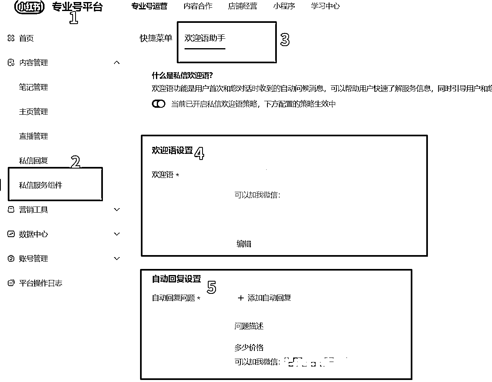
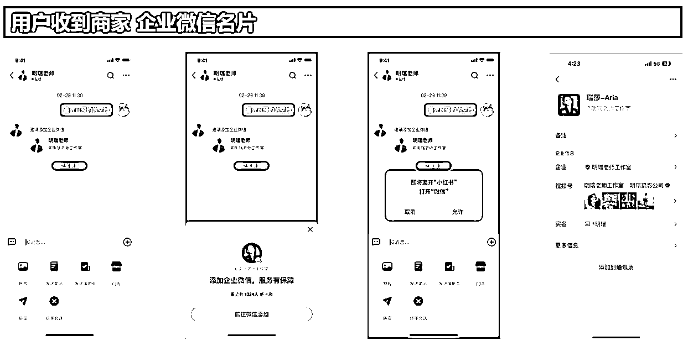
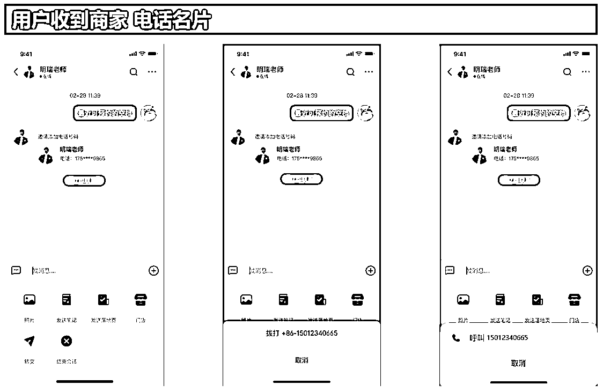
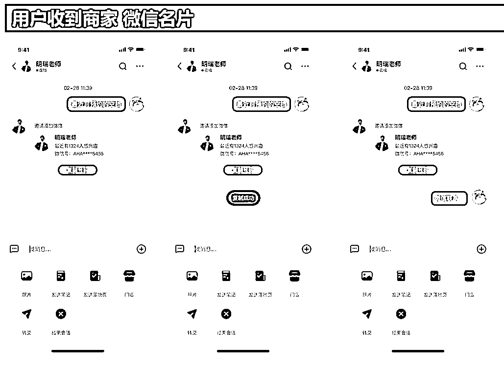
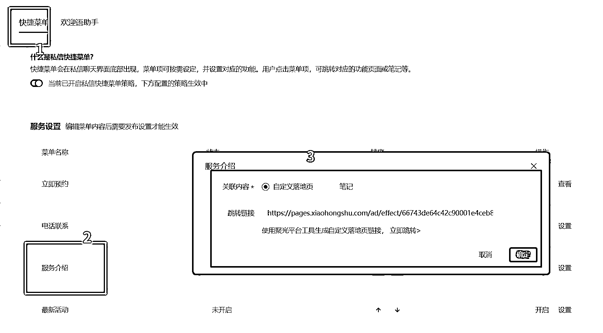
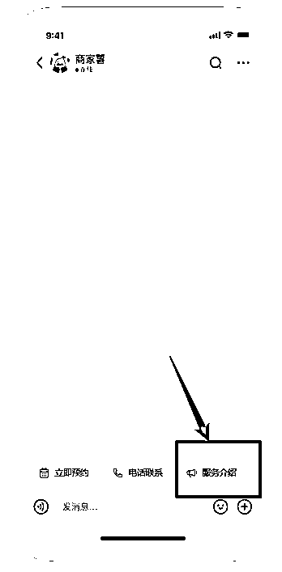
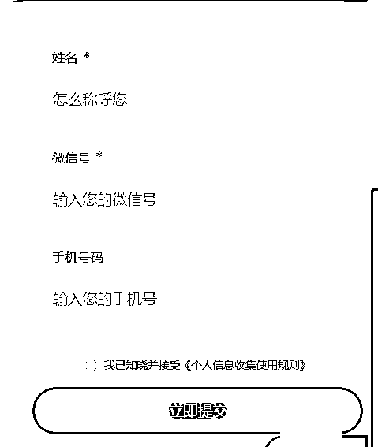
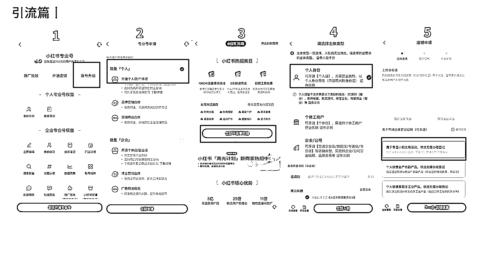
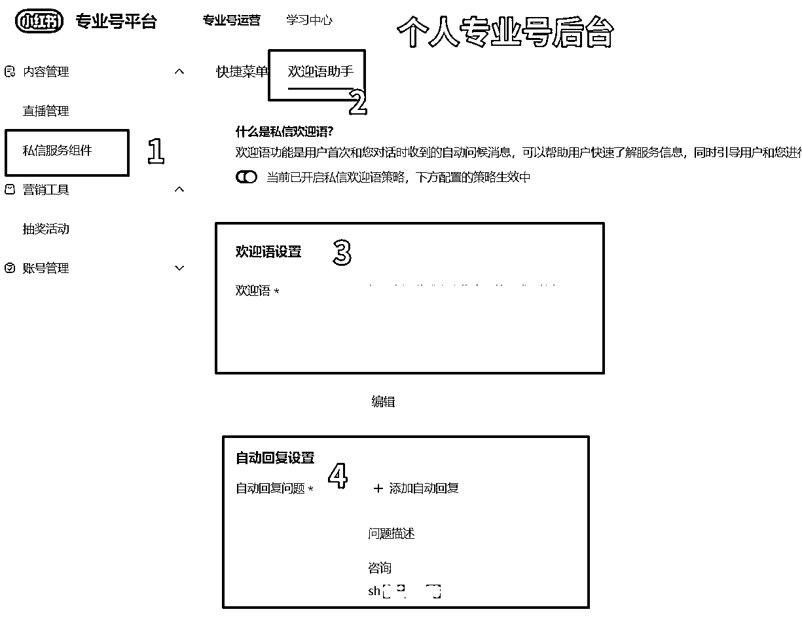

# 小红书 企业号-个人号官方功能引流教程

> 原文：[`www.yuque.com/for_lazy/zhoubao/ka9seg4gblg2ycsy`](https://www.yuque.com/for_lazy/zhoubao/ka9seg4gblg2ycsy)

## (38 赞)小红书 企业号-个人号官方功能引流教程

作者： 金坐

日期：2024-11-21

大家好，我是金坐

小红书对引流严打的越来越厉害了，现在可以说是所有平台里面对私下引流打的最严的一个平台，即使是企业专业号，没有按照正确的流程来走，也是照封不误

市面上常见的小号引流、群聊引流、主页简介、表情包引流都还可以用，但也都存在着风险，无非是概率问题

这篇文章就统一性的讲一下如何利用官方的工具去安全的引流。分企业版和个人版，一共 4 个渠道。大家可以看一下:

> 目录：
> 
> 企业版 - 自动回复
> 
> 企业版 - 微信名片
> 
> 企业版 - 免费表单
> 
> 个人版 - 自动回复

**这里先放一下，会用到的两个网址:**

专业号后台网址：_[`pro.xiaohongshu.com/`](https://pro.xiaohongshu.com/)

小红书聚光后台:_[`ad.xiaohongshu.com/`](https://ad.xiaohongshu.com/)

# 企业版 - 自动回复

1、认证**专业号（认证费用，年审 600 元）** ，**开通聚光**

2、30 天内消耗**满 1000 元**

3、次日中午 12 点之后，去专业号后台刷新，即可看到：私信服务组件

4、设置欢迎语助手，也就是自动回复

两个红框框的地方，都可以直接写微信号：

**注意事项：**

1、消耗满 1000 之后会自动加白，不需要找代理或者直客手动开白名单。加白之后，后续在私聊中发微信，也不会被判做引流。但是有小概率被误判，需要手动捞回来

2、这个自动回复欢迎语，只针对首次进入对话的用户。非广告进入的用户也可触发

3、后续，聚光每个月的广告消耗低于 1000 或者没有消耗，**那么私信发微的白名单会取消，但是这个自动回复仍然可以使用**

# 企业版 - 微信名片

1、认证**专业号（认证费用，年审 600 元）** ，**开通聚光**

2、消耗**1000 元以上**

3、找直客，或者代理加白名单（在谁那里开的户，就找谁加白，这个账号之前不能违规过）

4、设置企微、个微或者电话名片

**注意事项：**

1、企微名片和电话名片的门槛相对较低，**每个月保持稳定消耗** 即可加白，个微名片的门槛较高

2、在内测中，原本预期十一月份放开，目前还未真正完全放开，需要手动加白

3、需要手动加白，但是并不需要额外付费。如果市面上有让你花钱买加白的，都是二道贩子

# 企业版 - 免费表单

1、认证**专业号（认证费用，年审 600 元）** ，**开通聚光**

2、30 天内消耗**满 1000 元**

3、次日中午 12 点之后，去专业号后台刷新，即可看到：私信服务组件

4、去聚光后台，创建橙子表单

5、复制表单链接，放在私信服务组件的快捷菜单

**注意事项：**

1、落地只创建最基础的信息就好，不用改得太复杂

2、和自动回复一样，只要开通了死幸服务组键，后续截止消耗停了，功能仍然在。聊天的时候，引导他点菜单就可以

3、如果没有保持每个月的最低消耗，聊天的时候还是不要出现“微信、WX、weixin”之类的关键词。比如“点下面菜单，可以加我微信”，这种话千万不要发，可以改成
“点下面菜单联系我”

4、还有更简单的方法是，设置立即预约按钮，不需要落地页，客户也可以直接填写手机号码

5、落地页的链接，不止可以在企业专业号使用，个人号引流的时候转发落地页链接，也可获取客资且不违规

# 个人版 - 自动回复

1、**个人账号实名认证**

2、进创作中心点专业号中心升级，账号升级升级成**个人专业号** ，领域选自己感兴趣的即可

3、进专业号中心，点击开店，开通**个人店铺** （需要刷脸）

4、登录电脑版专业号中心，打开私信服务组件

5、设置自动回复，后续流程参考企业 - 自动回复

注意事项：

1、认证专业号的时候，一定别选错了，是个人专业号，别一不小心把自己弄成企业号了

2、只有首次进入私信的用户，可以触发自动回复，在欢迎语和自动回复问题，两个地方都可以写微信号

3、个人号因为没有聚光消耗，不存在加白的说法，不要在私信沟通中出现微信相关字样

4、如果是使用自动回复来加微，那么个人开的这个店铺不需要上传商品，也不需要交保证金

5、如果想使用个人专业号，私信服务组件里面的快捷菜单功能，那么需要在店铺里面上架至少一件产品

* * *

以上 4 个就是使用官方工具去引流的方法，只要规则还没变动，就 100%安全，有点门槛，但是不高，比死号方便

如果是矩阵打法，可以用其中的一两个账号作为安全引流工具，而其他账号则批量铺内容搞流量，互相打配合

小红书的用户很优质，现在正值风口期，但是因为小红书商业化的快速发展，平台规则迭代速度也很快，上半年还能用的一些免费引流方法，下半年违规的风险越来越高

用正确的方法，大家的项目也可以做的更顺

我是金坐，祝大家天天爆粉，天天爆单

* * *

评论区：

暂无评论