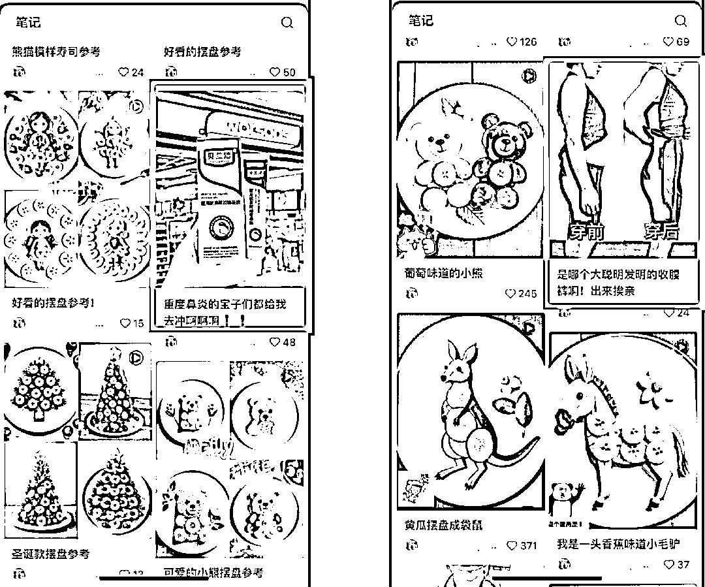

# 小红书商单新玩法，借助 AI 做果蔬摆盘矩阵号，批量操作攻略

> 原文：[`www.yuque.com/for_lazy/zhoubao/lveqh2vtgys3s7u3`](https://www.yuque.com/for_lazy/zhoubao/lveqh2vtgys3s7u3)

## (23 赞)小红书商单新玩法，借助 AI 做果蔬摆盘矩阵号，批量操作攻略

作者： 高鹏圈

日期：2024-11-19

大家好，我是高鹏。

今天继续分享一个热门玩法。

用 AI 做蔬果摆盘的作品，这种号最近流量非常不错。

商业化模式也有很多。

第一种就是接商单，可以看到我截的这个号，它就是专门接商单的，他发的果蔬摆盘的作品中间会穿插一些商单的内容。

第二种就是去带一些健康餐，或者健康类相关的一些产品，自己去带货。

第三种就是去收小弟，有人想跟着你学这种模式，收一个门槛都是可以的。

关键这种玩法它是借助 AI 来生成的，不是自己一个一个去摆。那样就很复杂了，要准备食材，还要动手去摆，然后再拍照。

而现在借助 AI，像这种非常真实效果的摆盘作品很容易就搞定了，所以完全可以多做一些号同时接单，这样的话就形成一个商业化的规模。

我们做这种号的话，基本上有四个步骤。

第一步就是要去找选题，不管是摆大公鸡也好，摆小企鹅也好，都要有相关的这种题材和灵感。

第二个就是我们根据这些选题，写出来对应的 AI 绘画的提示词。

第三步有了提示词，要用 AI 根据提示词来生成相应的图片。

第四步就可以去接商单了。

接下来一步一步来说，首先是找选题，找选题很简单，直接去搜关键词就可以了，比如说蔬果艺术摆盘，各个平台上都有很多。

有的是实物摆的，有的可能是 AI 生成的，我们根据数据，播放量等等，去选择爆款的作品，作为我们的选题。

第二步就是根据选题来写出对应的 AI 绘画提示词，这个提示词有三大部分组成。

第一部分就是给摆盘规定一个背景，比如我说的是：白色盘子放在纯色背景的桌子上，这就是我们摆盘的一个背景。

第二大部分相对来说比较简单，就是摆盘的各部分的材质的描述，比如说要摆一个大公鸡，我就说：盘子里用西兰花拼成一个大公鸡的身体，用胡萝卜拼成大公鸡的爪子，眼睛是用黑色的谷物拼成，鸡冠、鸡嘴都用什么，分别是什么颜色的，都规定好。

最后一部分就是一个固定的句式，提示 AI 要注意光影的效果，不要卡通的风格，要真实风格。

所有作品的提示词基本上都是这三部分，第一个背景和最后的一个固定句式不变，只变中间的各个部分的材质和颜色的描述。

有了提示词之后，接下来就是用 AI 根据提示词来生成对应的图片。

还是用到之前给大家分享的这款超好用的 AI 工具，打开首页之后，点绿色的加号，就是创建新项目的意思。

然后进入这个页面，我们选择第一个，就是照片。

接下来它会出一个对话框，把提示词填到里边的，直接点生成就可以了。

可以看到我刚才给的这个大公鸡的提示词，它生成了两张图片。

这个图片效果还是非常不错的，包括真实的材质的表现，以及光影的效果。

最后是号起来之后如何接商单，某书上去接商单的话，需要至少 1000 个粉丝，才能够开通蒲公英。

开通之后，在后台有两种接单的模式。

第一种就是你把信息填好之后，等着品牌来找你。有非常多的品牌它需要这种合作，你挂上去之后，基本上三天两头就会收到这种合作的信息。

第二种就是主动去报名，主动的去参加一些品牌组织的活动。

不管哪一种，都要把你的作品质量提升上来，把粉丝量涨上来之后，不愁接不到单子。

好，今天的分享就到这里了。目前用 AI 来做果蔬摆盘的玩法呢，做的人还不多。

关于刚才提到的 AI 绘画工具提示词，以及蒲公英后台如何去接单，统一都放到文档里了：

[`svj4gxvm0v3.feishu.cn/docx/JdeMdkxX1o0OoWxaFSQckDm1n4d?from=from_copylink`](https://svj4gxvm0v3.feishu.cn/docx/JdeMdkxX1o0OoWxaFSQckDm1n4d?from=from_copylink)

我是高鹏，深耕网创 9 年，这是我拆解的第 693 个落地项目玩法，更多项目玩法，欢迎找我聊聊呀~

* * *

评论区：

亦仁 : 如果你的拆解里面，多增加一些对变现端数据的拆解，价值就会增加很多。

高鹏圈 : 好的，老大，明白您说的，具体变现数据这些确实在很多地方都比较敏感，我后面尽量尝试给生财这边加上[抱拳]

LJ : 在小红书看到一个博主，把畅销书的内容做成解读视频很受欢迎。请问圈友这类视频是用什么工具？如何制作？ 77 缪斯 Musae 发布了一篇小红书笔记，快来看吧！ 😆 1zkJcsQ84Zvyu7f 😆 ，复制本条信息，打开【小红书】App 查看精彩内容！
大神，能不能也分析一下这个博主[`xhslink.com/a/2pxZOLf0XPo0`](http://xhslink.com/a/2pxZOLf0XPo0)