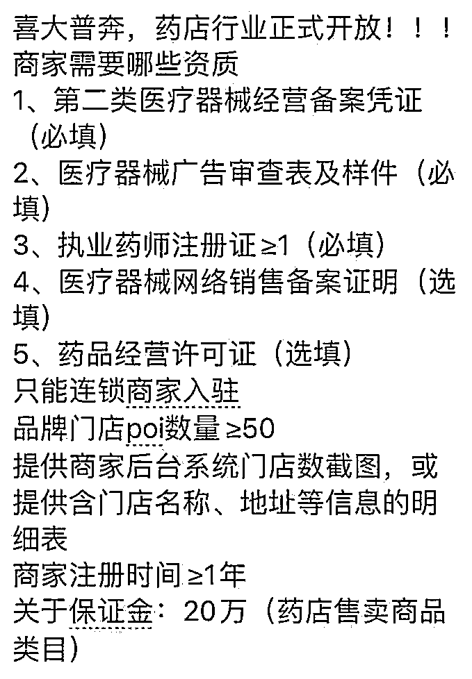
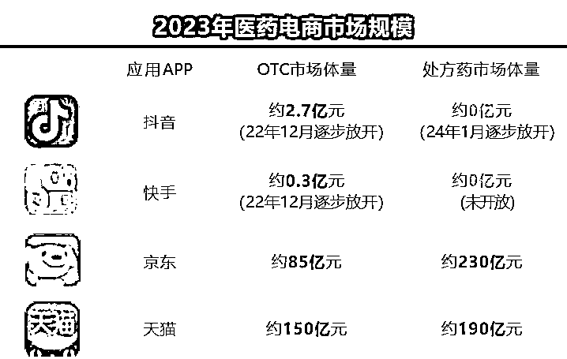

# 抖音本地生活：医药和大健康门类的红利分析

> 原文：[`www.yuque.com/for_lazy/zhoubao/gbk82zkn601gnix1`](https://www.yuque.com/for_lazy/zhoubao/gbk82zkn601gnix1)

## (20 赞)抖音本地生活：医药和大健康门类的红利分析

作者： 楚川

日期：2024-11-20

大家好，我是楚川，是本地生活的实战派，天鹅到家单月 GMV 破 7000 万的操盘手，超 6000+实体企业服务经验。_**并建立了一套可复制、可持续的本地生活方法论。_**

温馨提示：本篇文章文字比较多，但内容很干，建议大家一定要坚持认真看完。_

没有继年初开放处方药后，最新的消息，抖音将开放中医馆和药房准入。

这意味着，过去只能靠线下广告或美团等平台拓客的中医馆和药店生意马上变成能**用短视频引流，线下进店履约** 。

这将可能是抖音本地生活又一次影响行业的重大开放。对此，楚川想说的是：**医药和大健康品类本地生活的大红利来了！**

**为何？有数据为证！**

**Part1 这是医药和大健康的大红利**

首先，医药传统获客方式将拥抱全新的流量窗口，**那就是抖音。**

为什么？我们直接对比传统电商平台数据。

2023 年医药电商市场规模，京东 OTC 市场体量是 85 亿，处方药 230 亿；天猫 OTC 市场体量是 150 亿，处方药 190 亿；

**京东/天猫的药品市场规模分别是抖音的 200 多倍。**

但我们如果看日活，抖音是京东+天猫近 10 倍。

而且有数据显示，抖音电商的医药健康内容已经吸引**超过 5.9 亿的用户关注，其医药业务日均搜药增长 3.6 倍，月均搜药增长 20%** 。

对于庞大的医药市场，抖音一旦陆续开放医药健康行业的品类和营销限制，所释放的平台流量红利一定是惊人的。 images.zsxq.com/Fg1nC8G1JDNCFEkL_wjucJCQPy_a)

可以想象一下，大健康品类在抖音新的市场机遇到底有多大。

其次，为什么是中医院馆和药房。

**中医馆近一年从 8000 家到 12000 家的增长** ，而药房则是医药品类线下交付的最绝佳形态。他们都**代表了需求的增长和机会，多出来的空间跟抖音流量匹配。**

第三，结合抖音本地生活的打法，**短视频内容种草，线上获客再到线下交付，抖音标准的人货场生态链** ，中医药馆和药房就是最好的体验场景，所以本次选择开放他们也不足为奇了。

**Part2 真正的机会点有哪些**

第一，首先是中医馆。众所周知，在强医生的 IP 影响下让中医连锁没有太大的发展空间。

比如单个老中医的影响会虹吸一个品牌所有的流量，导致复制做连锁的空间几乎没有，能到 10 家都是中医馆大品牌了。

但楚川在最近线下沟通了几个中医馆业态的创业者，还是发现了不少新的机会。

其中朱雀中医的创始人雨泽有聊到如何做复制的问题，**他在最近几年做门店经营就一直在网罗青年中医，尽量避免老中医。** images.zsxq.com/Fj_etg5wW4r-UkMU7V9h_LN9g4px)

在中医馆的运营上从选址装修、体验感、售前售后做到远高于同行的水平，**目前在广州成功开了 3 家社区中医馆。**

**尤其是在没有布局任何本地生活平台（美团都没上）的情况下，就取得了非常好的成绩。**

朱雀中医未来的速度会持续加快，因为青年中医的基础大，筛选出好苗子的空间也更大，结合抖音本地生活开放的红利，对于中医馆的拓店来说是绝对利好；

另一个案例则是**榕树家创始人刘宇** ，榕树家选择养身馆为标的，借助 AI 模型提升医学硬实力，从 1 家店到 1600 家能看出模式的可取性。 images.zsxq.com/FiW_ZbHSC_zB2XwGoim3yMFmWZWc)

今年刘宇总站出来做 IP 将会迎来更大一波门店数量增长，**从品牌故事、创始人的成长故事能吸引更多思想同频的加盟店** ，比过去 3 年的筛选机制强上 3 个维度。

第二，连锁药房的流量困境，尤其是本地到店的流量，客户主动上门逻辑越来越难，流量和广告通道太窄，现在可以用内容引流获客就是一个利好，能主动触达客户，让他们到店。

尤其是抖音提出的全域兴趣电商概念的推出，医药行业看到了新的增长点。全域兴趣电商不仅打通了货找人和人找货的双向路径，而且还结合了内容场和货架场的优势，为医药品牌提供了一个全新的营销舞台。

**Part3 要如何抓住这些机会点**

怎么样抓住这次的红利机会？楚川认为，做好以下关键几点：

第一，两个大类要做的一定是**抖音搜索流量，做好 seo** 。

生病是随机的，没有直接的需求激发。那就是在于触达次数、用户自发搜索产生的排名情况，影响下单就是门店评分和基建。

第二，找好引流产品，**中医馆以引流和药膳为主** ，精准打用户特点。药店以**保健品、健康食品** 等方式获客。

第三，专业度和长期用户运营是最关键，抖音只是流量渠道，核心在于留客能力。

第四，**营销矩阵的建立** ，第一阶段一定用自然流量触达精准用户，第二阶段去放大。

第五，提前布局，机会一定是留给有准备的人，如果你有想法，也欢迎找楚川聊聊。

**Part4 风险点**

**第一，赛道在流量轰炸下会面临的问题：** 加盟品牌在于拓店速度过快。在品牌知名度尚未广泛形成时，加盟店面临与周边老店竞争的压力，导致获客难度较大。如果品牌方仅着眼于短期利润，收取高额加盟费却不投入帮扶，一旦闭店率过高（如 2-3 年达到 40%），将对品牌造成严重影响。

**第二，用自媒体流量放大的时候会出现的体系失控：** 品牌方秉持互联网思维，通过投资补贴模式，前期可牺牲利润甚至投入运营成本，为加盟店提供流量支持，如补贴获客方法。但这可能导致财务模型不稳定，甚至单客户成本过高，在加盟热潮过后出现增长疲软。那就需要明确品牌定位，针对睡眠、疼痛、老年人慢病管理等细分领域的中医连锁店，或者是用 AI 等工具增加品牌溢价、降低人工成本。

**第三，政策性风险：药店和中医馆都是到店客咨逻辑，存在升单环节，付费是走什么通道是一个深思的问题。比如有的门店是直接刷医保卡，这种操作在宣发推广的时候是有可能踩到雷区，面临是平台的处罚和监管部门的处理。这是一个敏感区，特别要注意。**

* * *

评论区：

申姐全域营销 : 太棒了，怎么链接您老师我的微信是 18618117293 谢谢