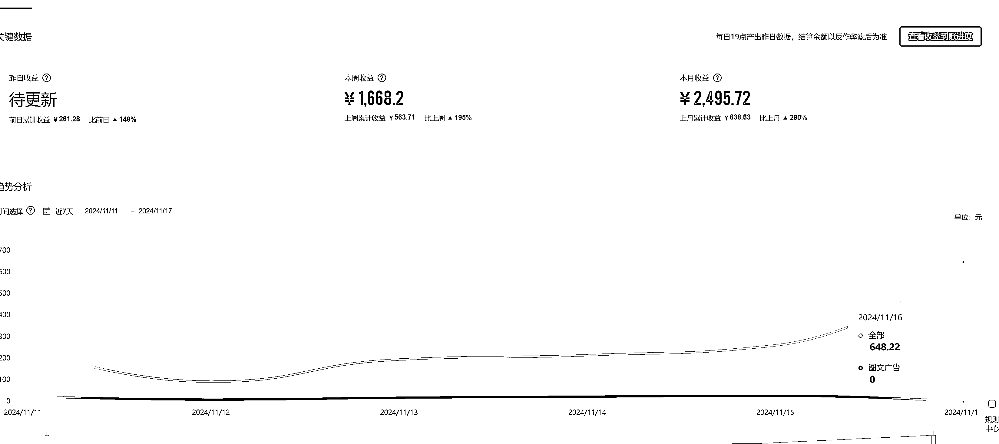
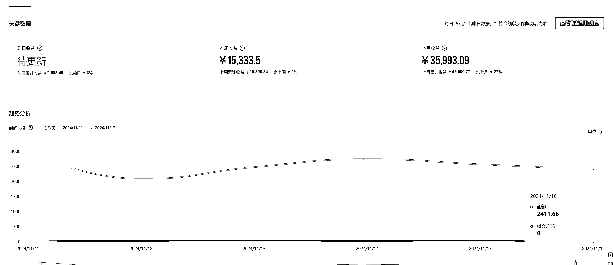
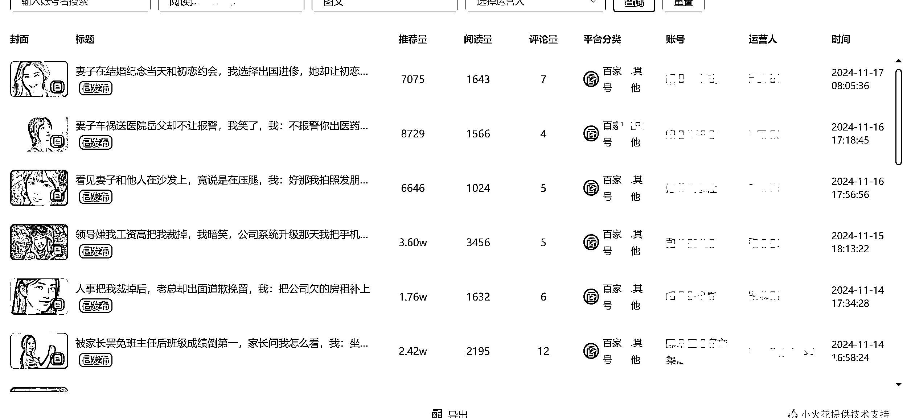
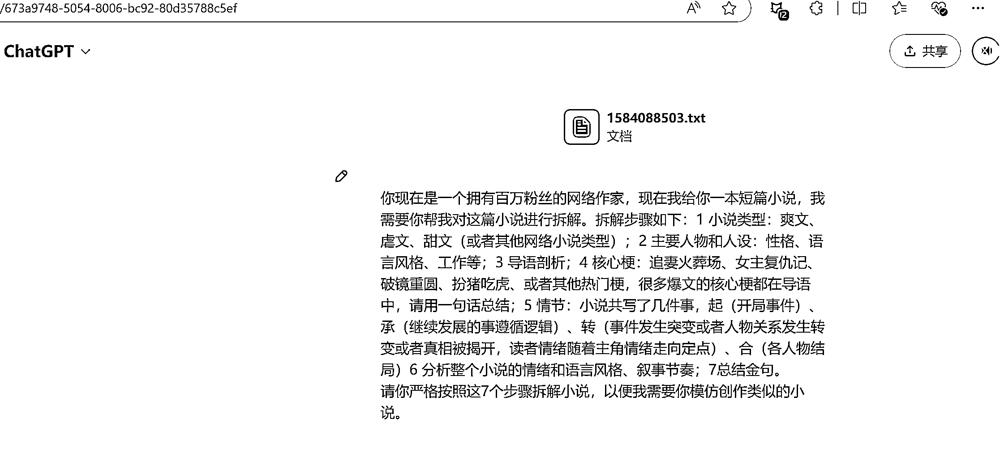
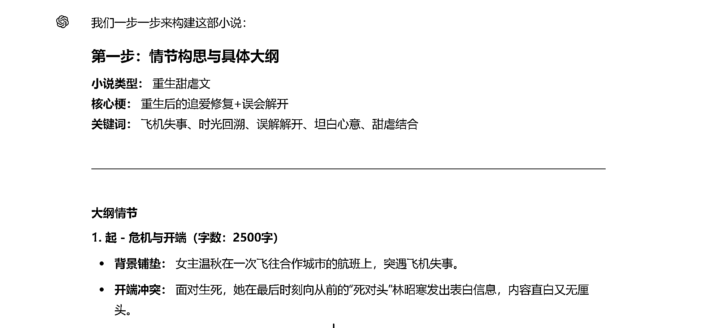
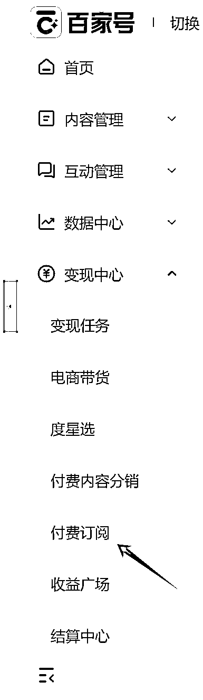
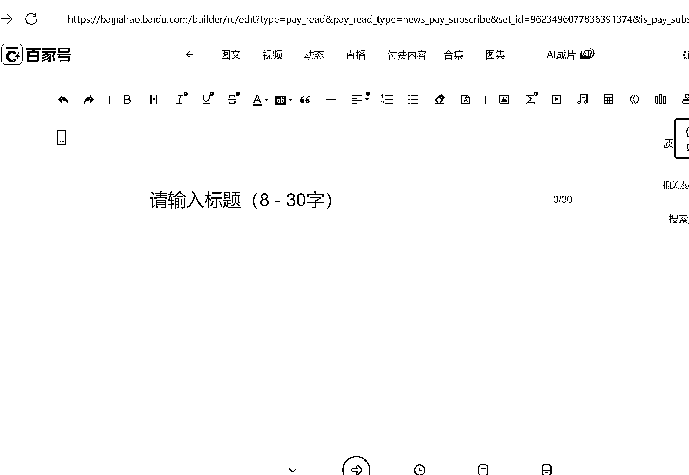
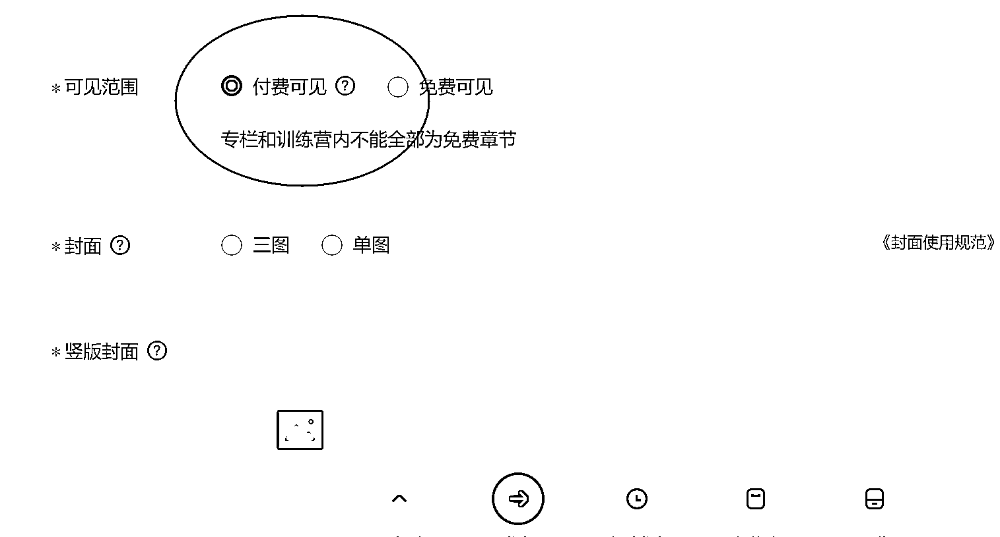

# 靠写短篇小说慢慢变富，百度付费写作保姆级教程来了

> 原文：[`www.yuque.com/for_lazy/zhoubao/abeudcfr1il5rmgf`](https://www.yuque.com/for_lazy/zhoubao/abeudcfr1il5rmgf)

## (26 赞)靠写短篇小说慢慢变富，百度付费写作保姆级教程来了

作者： 盟主君

日期：2024-11-18

好久不来发帖了，上次发文还是在五一期间，半年过去了，盟主君汇报一下最近在干嘛？

最近在做一个百家号的付费订阅项目，听得很高大上，其实就是写短篇小说发在百度的付费专栏上，有人想看就需要付费订阅。

你想问免费小说那么多，有人真的会付费看吗？

我先用数据回答你，这是一个账号的后台收益，这是普通小白写的

这是大神写的

我是介于小白和大神之间的人，那我怎么才能靠小说赚钱呢？

答案只有一个，像做微信爆文一样做，大量生产优质短篇小说，量变达到质变。

每一个阅读都意味着付费读完小说的可能性。而且百度现在采用的是默认连续扣费的模式，假如你花 19,9 订阅了付费内容，90%的人都会选择默认续订，你的收益也会像滚雪球一样增长

由于之前我做过自媒体矩阵，所以手里有将近 100 多个百家号，在百度推出付费订阅功能后，我就直接把百家号转型

付费订阅项目。

如果你也想玩这个项目，还有机会吗？

有机会，众所周知的原因今年的百度广告收益非常低，做自媒体靠广告流量变现已经很难了。那么这个付费订阅项目，只要你有优质内容，用户肯付费观看，那么你和百度就达到双赢了。

不会写小说，怎么玩？

用 AI，一步一步教大家

第一 创作小说（1 万字）

我们不能单纯使用 AI 进行伪原创，那样平台会封号。我们应该用 AI 辅助创作，比如我们找到一个小说，让他分析小说情节和写作手法，然后再让他重新构思一个小说大纲，最后逐步写出整个小说。

这里还需要一系列的提示词来控制 AI 输出的文字避免 AI 味道，如果你用 Claude 3.5 来写，基本看不出来任何 AI 创作的痕迹，你只需要把小说的大纲构思好即可。

第二步，上传小说

现在百家号付费订阅标准是 100 个粉丝以上，发过一篇文章即可申请付费订阅，但是自己申请过不过是个玄学，当然这也有方法。

打开百家号后台，选择变现中心的付费订阅

hi

然后点击发布图文，将小说复制到这里，排版优化，添加一个图片，写好标题

在发布之前检查是否为付费文章，一定要选择

最后上传好有吸引力的封面即可发布。

一般百度对文章的标题审核非常严格，建议采用三段式标题，准确概括全文，引起读者点击兴趣

例如

#### **看到妻子从老男人车上走下，我拿起电话直接质问，她竟然怪我多疑**

#### **邻居投诉我家乱丢成人垃圾，在出差的我选择离婚，她却跪求原谅**

这个标题决定点击率，所以我会在接下来单开一篇讲怎么写标题。

第三步 刻意练习 不断重复

普通人想赚钱，我们就要不断重复以上 2 个步骤，平均一个小时就能完成一篇小说发布，一天至少发布 5 篇，一个月以后你会发现会有神奇的事情发生。

最后再留给你一个问题

那我们辛苦创作一篇文章，能不能一鱼多吃呢？实现收入倍增呢？

* * *

评论区：

绢绢满愿学堂 : 肯定能啊，确实是个好主意

绢绢满愿学堂 : 怎么申请付费订阅呢

盟主君 : 百家号 100 粉丝以上可以申请

老彭 : 油管音乐号还在运营吗

绢绢满愿学堂 : 我 500 了已经 谢啦

鲸鱼 : 请问新号注册后通过发文章慢慢涨粉，然后开订阅吗？