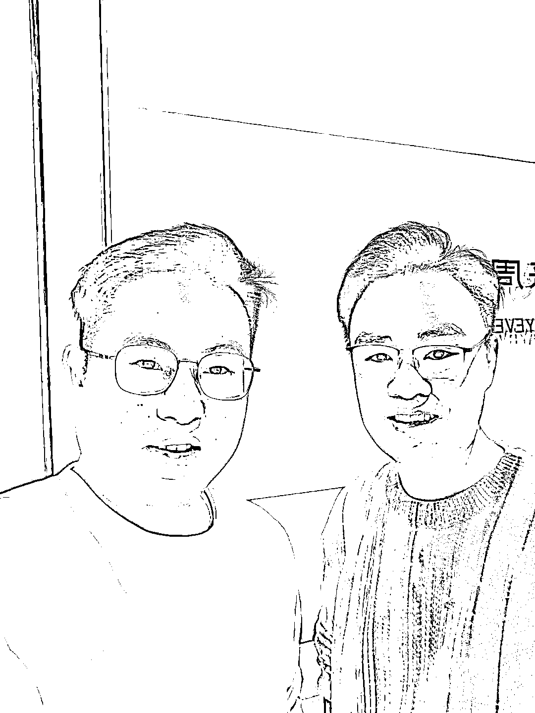

# 花了 7 颗龙珠，约亦仁进行了一次深度的商业咨询

> 原文：[`www.yuque.com/for_lazy/zhoubao/ntrua3mlsrth2tpu`](https://www.yuque.com/for_lazy/zhoubao/ntrua3mlsrth2tpu)

## (126 赞)花了 7 颗龙珠，约亦仁进行了一次深度的商业咨询

作者： 书豪

日期：2024-11-15

大家好，我是一直在努力提升利润的龙珠圈友书豪，也是小红书店铺和直播航海教练。

11 月 7 号，花了 7 颗龙珠，找亦仁，深度做了一次商业咨询。沟通了 150 分钟。

花钱是一种见识，找亦仁做深度的商业咨询，一来为解开现在的创业困惑，得到一些增长的思路。

二来，为少走一些弯路，我自己的视野和商业思维有限，请教一下亦仁。

刚好处在创业五年，来杭州创业也整整两年的这样一个时间节点。

**一、关于现有项目如何突破千万的瓶颈。**

**  **

亦仁： 你现在做的是小红书店铺卷标品的店群，一定会越来越卷。

第二个项目抖音短剧 CPS，这也是属于信息差红利项目。

属于门槛不高，只能吃一两年红利且天花板低的赛道。

书豪：目前在做的小红书店铺和抖音短剧 CPS 项目，都是属于团队难以扩大，利润也非常难突破的项目，我自己的体感是非常难突破利润翻倍的增长。收入波动性很大。

亦仁：我给你的一个建议是：

去做付费投放+私域+IP+非标品+复购+高客单这样的一些赛道。

标品一定是越来越卷，电商无货源赛道一定是天花板比较低的，你想突破千万这个瓶颈，就一定要走普通人不好轻易切入的赛道。

付费投放本质上是切资金的优势，非标品是切同行少的优势。

**二、关于创业粉知识付费赛道**

**  **

书豪创： 关于创业粉知识付费赛道是不是一个好赛道。

亦仁：创业类知识付费赛道并不是一个好赛道，第一是因为创业知识付费赛道，整个赛道的天花板比较小，第二个是这个赛道很拥挤，做的人太多了。

并且创业类知识付费赛道，结果是很显性的，交付并没有那么好做。

不像身心灵赛道家庭教育赛道的培训，结果是比较隐性的。

**三、关于投资**

关于投资，这个话题比较敏感，涉及到很多个人隐私。

我得到了我的答案。

暂且不表，希望大家理解。

投资是非常反人性的事情，这是一条比创业更难的路径。

**四、关于团队**

**  **

书豪： 怎么理解管理优势？

亦仁：10 个人以下的团队，很难有管理优势。

比如你最高带过二三十个人的团队，你才有一定的管理能力带来的创业优势。

上升团队规模，管理团队，都是创业向上要突破的瓶颈，也同样是每个创业的人要交的学费。

生财有术团队每年的团队人员开支在两三千万，这是我愿意下注投入，且能帮生财建立壁垒和门槛的投入。

**五、生财的后续发展**

**  **

**  **

书豪： 我从生财里挖掘到了很多的项目，2020 年加入的，那个时候不到 2000 的价格，最近生财又涨价到了 3365 元。

生财为什么在大环境艰难的当下，去涨价。

亦仁：价格首先代表了你要服务的客户人群。

就像苹果手机这样的产品一样，定价的背后一定有生财整个服务体系。

像生财的内容、航海、风向标、线下活动，以及我发布的超级标等综合性的服务提升带来的价值增量，决定了我要涨价。并且生财会越来越贵。一定是价格越来越涨价。

很大一部分生财圈友的心中是觉得生财的门票是便宜的。

还有很大一点是生财的价值也在提升。

服务越高端的客户，决定了价格是一道筛选门槛，客户越高端，交付相对会更好交付。

**六、有必要花钱把市面上大部分的私董会都报一遍吗？**

书豪：我最近报了一些私董会，有必要把市面上所有的私董会都报一遍吗？

亦仁：没必要。

市面上所有的私董会产品，我基本都在。

报私董会对我的意义而言，就是去体验别人的产品。

保持对所有的信息开放，这是对的，除非去复制别人的生意。但是好的生意特别蓝海且可以复制的生意，没有人会在公开场合说出来。

特别是你要寻找的定位是付费投放+非标品+高客单+复购+IP 的生意，本身就是非常蓝海的方向，属于自己闷声发财的生意没有人会在公开场合暴露。

**七、你会焦虑吗？以及生财的后续发展**

**  **

**  **书豪： 你会焦虑吗？你怕竞争对手复制下一个生财有术吗？

亦仁：我不焦虑。

想复制生财有术，先投入 1000 万起步。

但，愿意拿出且能拿出 1000 万现金去投入的人，一定有自己的生意，很难会再愿意去投入 1000 万起步去做生财。

生财的内容，以及生财的体系，以及我在生财圈友中的独特的 IP 威信，是大多数人复制不了的。

**八、对书豪的个人建议**

亦仁：你现在经历的这个阶段我个人经历过，我也做过很多个项目。

你现在赚到过几百万，已经非常好了，在中国能白手起家 30 岁之前能攒到几百万已经是人中龙凤了。

保持心力，往 1000 万去突破。

保持现在的生意的情况下，去寻找 付费投放+私域+高客单+复购的生意，这是一个黄金公式，我看到的绝大部分千万以上的案例都是这个黄金公式。

不要做太多，从 0 到 1 重复建设的项目，去做至少能有三年以上深耕期的生意，天花板一定要高。你当前做的项目小红书店铺和抖音短剧 CPS 以及知识付费，这些天花板都不高。

需要去看到更大的世界，摸索新的赛道。

大钱，往往都在三年后开始出现。

赚大钱，往往拼的都不是能力，而是趋势。

你能在创业过程中，解决多少行业问题，就能赚到多少钱。

可以在摸索的过程中，遇见了不错的项目，再过来和我一起讨论。

你愿意花**7 颗龙珠的钱找我做深度的商业咨询，这本身就很可贵难得，这也会是你商业新天花板的开始。**

**  **

**  **书豪： 行行，那今天差不多了

亦仁：还值吗

书豪：值值值（简直太值了，帮我少走很多弯路！！！）

我找亦仁咨询，是因为我问遍身边的人，我得不到我想得到的答案，因为大家都和我赚钱差不多。

找一个十倍于自己的人，去做一次商业咨询，跳开我自己狭窄的视野，去看到更大的世界，我认为是很值得的。

亦仁哥，比我以为的亦仁厉害多了，我和亦仁的谈话当然不限于此，我只是把适合公开分享的分享了出来，有很多私人性的分享，就不在公共场合分享了。

要说，我有一个很强很深的感悟，一个人牛逼不牛逼，其实和修养真的关系很大，见了亦仁哥很多次，这一次我深度沟通下来，亦仁比我想象的要平和的多。

感谢亦仁！

* * *

评论区：

周彦充 : 学习了，付费+私域+高客单+复购+蓝海，无敌公式。 我感觉啥也不缺了，缺好产品，好产品也许也不缺吧，只是没有用心。

橘子脑袋 : 值

老彭 : 值

吴秉晖 : 我们相当于间接赚了 7 颗龙珠的价值[强][强] “突破千万就要走普通人不好切入的赛道”也就是这个牌桌的投入普通人无法参与。
50 万是个坎，100 万是个坎，1000 万又是一个坎。 跨过去，眼界，思路就又开阔了。

霖溪 : 学习了➡️“找一个十倍于自己的人，去做一次商业咨询，跳开我自己狭窄的视野，去看到更大的世界”

大屋顶 : 付费投放+私域+高客单+复购

小六六 : 感谢豪哥分享！

书豪 : 很值得