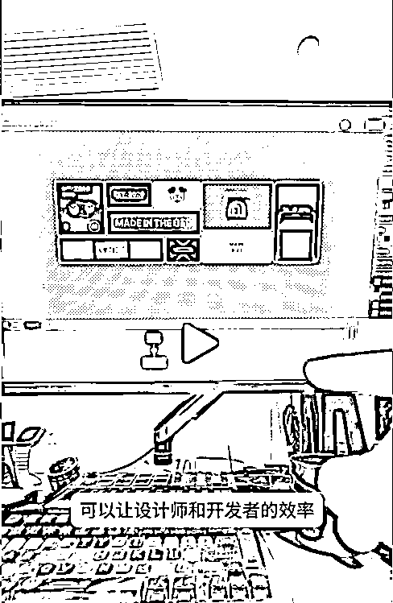
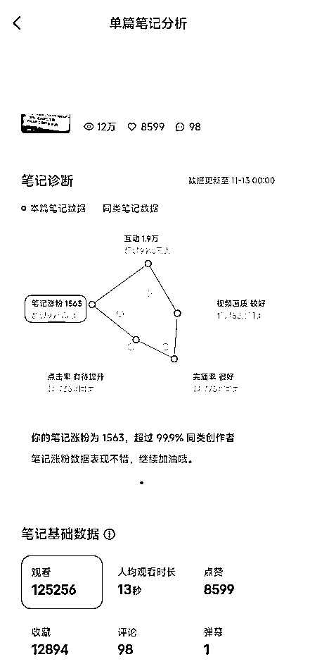
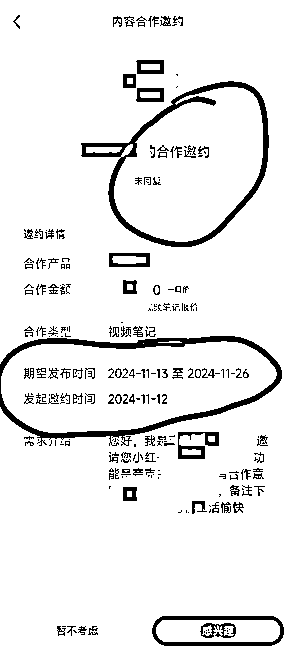
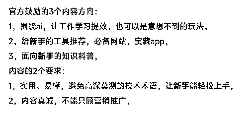

# ai 自媒体，新号，8 个视频，接到 2 条广告

> 原文：[`www.yuque.com/for_lazy/zhoubao/hu7c5w16go1dk6k1`](https://www.yuque.com/for_lazy/zhoubao/hu7c5w16go1dk6k1)

## (精华帖)(142 赞)ai 自媒体，新号，8 个视频，接到 2 条广告

作者： 顺利

日期：2024-11-13

【修改了文章顺序，删掉了废话，增加了实操】

【想看实操的，直接跳到**5、6，干货都在这里** 】

【**7-10** 是写给**新手** 和**长期失败** 的哥们看的，给哥们做个心灵按摩，老手可以直接跳过】

1，视频类型：对着电脑屏幕讲 ai 资讯、ai 工具，真人配音，没有真人出镜，

类似抖音博主“赛文乔伊”这种形式：

2，20 天时间，做了 8 个视频，发在了抖音、快手、视频号、b 站、小红书，结果如下：

抖音，播放**5 万** ，涨粉**70** ，

快手，播放几千，涨粉个位数，

视频号，播放几千，涨粉个位数，

b 站，播放几百，涨粉 0，

小红书，播放**20 万** ，涨粉**2000** ，

小红书和抖音的涨粉效率，相差极大，同样的流量，小红书就是更精准，可能因为小红书是观众自己点进去的吧，

3，小红书，就在前几天，有一条视频小爆几万播放，涨了 1000 多粉，直接帮我开通了蒲公英，

4，10 号涨到 1000 粉，开通了蒲公英，填报价的时候，就填的系统推荐的 200，

11 号接到第 1 个广子，12 号接到第 2 个，

 Xkw)

5，一个“捷径”，是我无意中摸索出来的，目前有 2 条爆款，都是 2 万+赞藏，都是用这个方法做的选题，

是的，小红书最重要的就是选题，其次是封面和标题，

你要做的就是用这个方法找到好的作品，然后去搜索这个选题，找到几个同样讲这个选题的爆款，参考它们封面和标题里的关键词，然后再进行后续的创作，

后续我都会按照这个方法来做选题，找对标，相信我这是最快出结果的方法了：

【注意：下面给出的筛选标准，不是死的，是活的，你可以根据自己的观察，来灵活调整筛选的标准，】

【补充：避开蓝 v 账号，这类公司账号，很多都会投流的，抄他们的爆款没意义，这是以前圈友的经验】

1️⃣用手机端，在小红书搜“ai”“ai 工具”“ai 工具分享”“ai 工具排行/合集”等等类似的关键词，

2️⃣在搜索结果里，筛选点赞量＞1000，粉丝量＜1000，发布日期 1 个月以内的**图文作品** ，

【这几乎是最严格的标准，能找到近期最容易爆的作品】

【如果找不到合适的，粉丝量可以放宽到 5000，不要超过 1 万，时间可以放宽到 2 个月】

【如果搜出来作品特别多，那就要收紧标准，找近半个月、一周的爆款】

【越严格的标准找出来的作品，你对标这个作品，你就越容易爆】

3️⃣看看这条图文笔记讲了什么，你把核心内容整理成文案，拍成视频形式，【可以自由发挥增加你觉得合适的内容】

4️⃣重点：封面里的标题，以及下方的小标题，一定要参考爆款的，不要自己瞎想一个，这些标题里有些核心的关键词，是一定不能丢的，一定要带上，小红书作品就是靠关键词来吸引观众眼球的，

你可以好好感受一下，到底是哪个关键词吸引了你的阅读，吸引了观众的眼球，如果你不会看，就丢给 ai，让它帮你看，

6，小红书鼓励的内容方向，这是官方账号“科技薯”最近发布的一条笔记，基本上概括了 90%的爆款笔记特征，我“翻译”了一下：

可以看到官方着重强调了“新手”这个关键词，因为新手是受众最广的人群，做出能让新手感兴趣、看得懂的内容，才有爆的可能，

原笔记：

37 【服了，把 AI 搞那么复杂干嘛😓 - 科技薯 | 小红书 - 你的生活指南】 😆 aaw3eMoD4eH3hmK 😆  [`www.xiaohongshu.com/discovery/item/67163c950000000026037080?source=webshare&xhsshare=pc_web&xsec_token=AB9g_zjV4C9T6mxpRAiGtOQsUxlkpzV-8Chj3tzVzhKfw=&xsec_source=pc_share`](https://www.xiaohongshu.com/discovery/item/67163c950000000026037080?source=webshare&xhsshare=pc_web&xsec_source=pc_share&xsec_token=AB9g_zjV4C9T6mxpRAiGtOQsUxlkpzV-8Chj3tzVzhKfw=)

7，至此，就打通了整个项目的流量、涨粉、变现环节，后面打算沿着现在的路子，继续优化和调整，

后面我会说说当时遇到的 **心理困难** ，

是的，我遇到的最大困难不是剪辑、配音这些技术活，这些都好克服，最大的问题，反而是心理上的问题，

我相信一定有很多圈友跟我一样，尤其是那些**新手** ，以及跟我一样**长期失败** 的人，我写了一些真心话，希望能鼓励到你们，最终在这个项目上拿到好的结果，，，，

8，回头看，整个过程是比较曲折的，直到昨天晚上的最新一条视频还在试错，尝试了一个新的方向，做了 7 个小时，发出去没什么正反馈，还被人给骂了，，，

9，前面十几天的过程很难熬，不知道怎么做才是对的，蹭热点，花了 6 个小时做的视频，发出去一点水花都没有，做什么错什么，仿佛做什么都是徒劳的，很挫败，真的不知道正确的方法是什么，负面情绪每天就像潮水一样，，，你懂的，，，

同行也研究了，爆款也模仿了，别人讲 ai 我也讲 ai，别人讲发布会我也讲发布会，别人讲工具我也讲工具，别人讲开源我也讲开源，但是为什么就我没有数据呢？

这就是我视频更的这么慢的原因，努力了，尝试了，没有正反馈，就缩手缩脚，畏首畏尾，不敢干，潜意识里觉得可能干了也没用，，，

有好几次都想，算了，这太难了，放弃去做别的项目算了，，，

但是想想，这个项目放弃了，再去找新的项目，再次从 0 开始么？**之前放弃的次数还不够多么** ？

这都已经是**超级标** 了，难道这个方向还不够好吗？难道这个机会还不够大么？难道真的是项目的问题么？

就这样质问自己之后，我明白：这个方向一定是通的，只是我没通而已，

所以重新回去看亦仁老大发的**第 1 篇超级标** 帖子，看老大对这个项目的分析，他为什么看好这个方向，我当初选择做这个事的原因是什么，鼓励自己，给自己打气，告诉自己，这个方向一定是没错的！我只是有些地方没做对而已，下个视频看看有没有能优化的地方，继续干！

就这样，一次次的自我否定，一次次的鼓劲，耐着性子调整下一条视频，最后干出来了，

其实回看整个过程，没什么了不起的，只是做了 8 个视频而已，在老手眼里不值一提，

但问题是，新手，他没有过靠自己从 0-1 的成功经验，尤其是那些**跟我一样，长期失败的人** ，已经变得畏首畏尾，什么都不敢干了，

是的，我做项目长期失败，基本干什么亏什么，10 件事里也就成 1 件，经常会觉得自己能力不行，眼光不行，老是被人骗，老是想吃现成的，觉得自己真垃圾，自己都讨厌自己，

但有时候想想，可能也是项目的原因，可能这本来就是个十死无生的赛道，所以不是我不行，是项目不行，

就这样来来回回，一直出不了结果，

所以如果你是像我一样，做项目**长期失败** 的人，或者你是一个**纯新手** ，想尝试一把**成功从 0-1 做成项目的快感** ，那么听我的：

相信亦仁老大的超级标，赛道已经给我们筛选好了，没有任何的后顾之忧，**你不会被镰刀骗，你不会被“垃圾“项目束缚，你没有任何的理由去找哪怕一个客观原因，只要干不成，都是你自己没做好，没做好就继续研究继续干，直到干成这个 ai 自媒体（或者第 2、3 个超级标）** ，

10，【现在回头看看，虽然当时参考了爆款，但没学到精髓，**动作没做到位** 】

【如果将来有新手遇到同样的情况，发出去没有播放量，做什么错什么，做什么动作都没有好的反馈，请相信下面这句话：】

**【****一定是你有什么地方没做到位****，仔细看看同行的爆款，到底还有没有可以学习的点，再进一步，逼自己再前进一步，这条路一定是通的，只是自己还没走明白，优化一下，再搞一个作品，继续走下去，直到走到终点，如果这时候放弃，那就什么都没了，** 】

* * *

评论区：

阿牛 : 恭喜 从 0 到 1 突破！

顺利 : [呲牙]谢谢，加油

汤姆 CC : 我现在也在做 Ai 工具号，感觉还挺难熬的[捂脸]，目前 500 粉

顺利 : 加油，路是通的，我已经走通了，下一步是想办法提高创作效率，多做几个号了， 你有疑问，可以发出来，我懂的就会告诉你的，而且还有其他圈友

汤姆 CC : 好的😁

周彦充 : 厉害👍🏻，方向对了，持续干就完了，我都想做了，空了就去玩

周彦充 : 投了一个⚓点，不知道有啥用，感觉不是很好用，电脑端才有

顺利 : [呲牙]加油搞