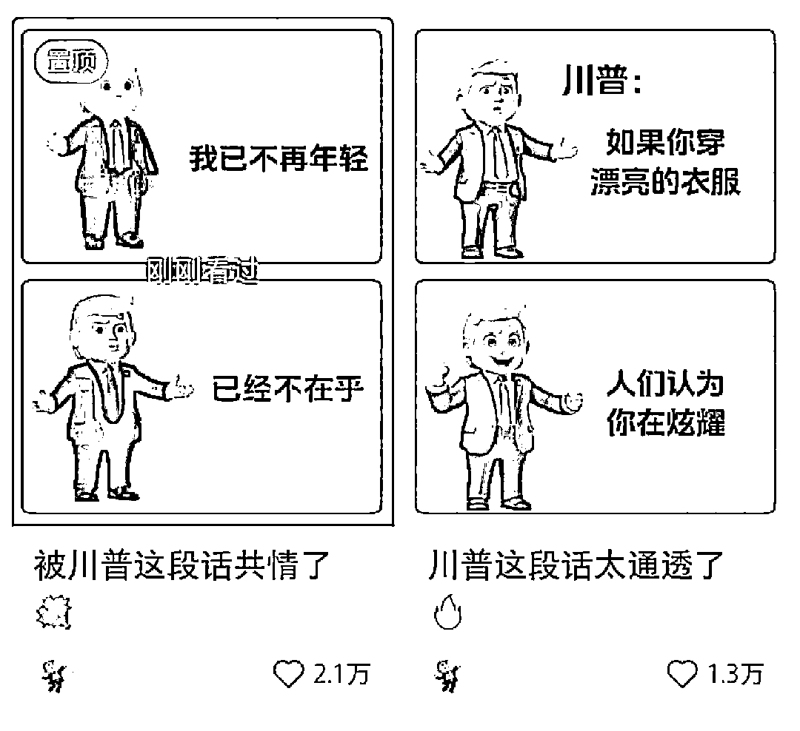
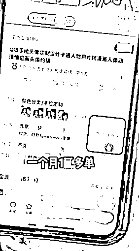
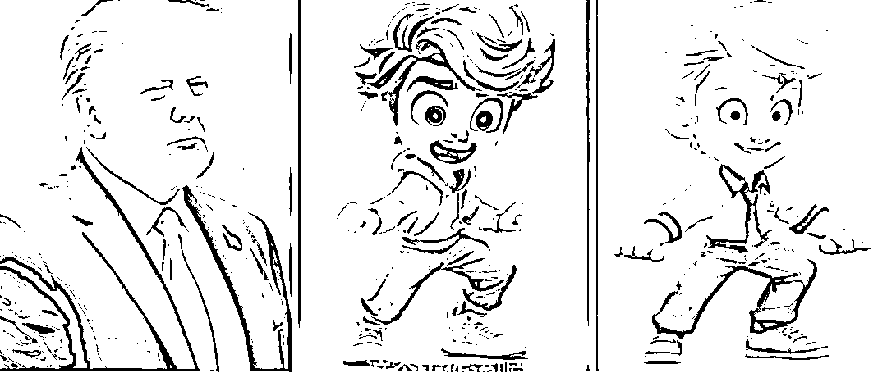
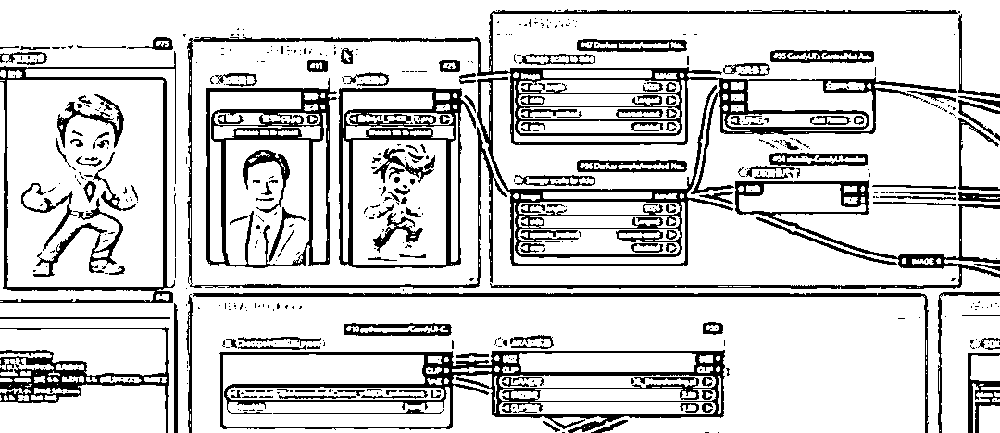
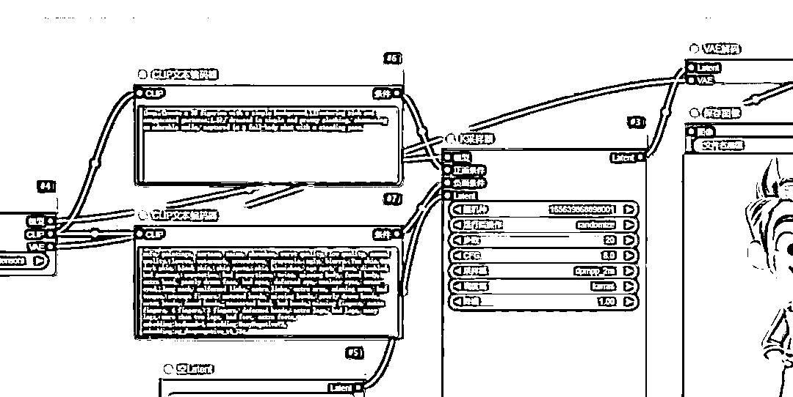
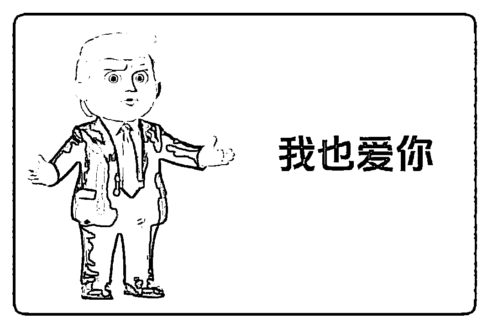

# 新号 5 条作品涨粉 2000+，借助 AI 做小红书特朗普人间清醒号，暴力起号新玩法

> 原文：[`www.yuque.com/for_lazy/zhoubao/inaw17w9ecg4gb2c`](https://www.yuque.com/for_lazy/zhoubao/inaw17w9ecg4gb2c)

## (51 赞)新号 5 条作品涨粉 2000+，借助 AI 做小红书特朗普人间清醒号，暴力起号新玩法

作者： 高鹏

日期：2024-11-13

大家好，我是高鹏。

今天继续分享一个热门玩法。

这个玩法最近太火了，比如这个号仅仅发了五条川普的卡通形象语录，就涨了两千粉。

这可是一个新号，一共才发了五条作品，其中两条还跑到了一两万的点赞量，这个起号的速度太快了。

川普再次当选了总统，最近的热度也是非常的高，相关的话题也是自带流量。

这个号发的主题全部都是人间清醒特郎普，一个特郎普的形象来再配上一些反内耗、反焦虑的金句，导致这个刚起的号就做到了这种程度，这个模式非常值得借鉴。

这种号做起来之后，其实商业化模式也很多，在这儿我给大家提供三种。

第一种就是可以去接这种 Q 版头像的定制服务。比如某宝上帮别人去定制 Q 版的头像，像这个品已经出了一万多单了，单价也是两位数，还是非常可观的。

第二个可以去接商单，有了一定体量的粉之后，就去接商单。

第三个因为这种内容发的都是一些人间清醒的语录，所以很适合去带一些认知类的书籍等等。

接下来详细给大家拆解，怎么样借助 AI 来做这种川普人间清醒的号。

第一个就是我们怎么样来生成这种川普的 Q 版原创卡通形象，首先我们借助 AI 绘画工具，把川普的真人头像进行投喂，让 AI 生成这种 Q 版的卡通动漫形象。

要用到的就是 comfy UI 的工作流，文章下面给大家准备好了，先看怎么做。

这个工作流的强大之处，是可以把真人照片直接一键转化成 3D 的卡通模型，这个卡通模型还支持各种动作的切换。

它的形象生成之后，跟你提供的原照片人脸基本上是一致的。也就是只要你一看它生成的 3D 的卡通模型，就知道它对应的人是谁。

要注意一点就是导入的照片一定要高清的，五官轮廓比较明确的的一张川普原照片。

然后还要提供一张对标的，要生成的图片的一个样本。这个图片可以直接找对标号的川普卡通形象，直接上传上去，作为我们的目标图片。

当然也可以从网上找一些，觉得比较好的卡通的造型，形成另外一种账号的风格也是不错的。

另外还要输入一些跟 3D 模型有关的提示词，这个提示词的处理有一个相应的流程，没有那么复杂，文章下面也会提供的。

有了川普的这些卡通图片之后，还要搞定人间清醒的文案，就是找一些对标号，或对标的内容去搜关键词，就能够找到很多。

直接去各平台搜人间清醒，或者醍醐灌顶的文案等等，就能够找到很多相关的内容。

不用管他是不是川普本人说的，就把这些金句给它结合川普的卡通形象做成图片就可以了。

最后就比较简单了，就是图片的排版。像这个图片，就是放一张川普的卡通形象，然后加一个圆边的黑框，再把文案给排上去。

排版就用 PPT，稿定设计等等，都可以实现这种效果。

好，今天的分享就到这里了。

关于刚才提到 comfy
UI 的工作流以及用到的模型，包括具体的参数的设置等等，统一放到文档里了：[`svj4gxvm0v3.feishu.cn/docx/DrVEd5bEIoQwj2xq6RRcaXGMnAd?from=from_copylink`](https://svj4gxvm0v3.feishu.cn/docx/DrVEd5bEIoQwj2xq6RRcaXGMnAd?from=from_copylink)

我是高鹏，深耕网创 9 年，这是我拆解的第 689 个落地项目玩法，更多项目玩法，欢迎找我聊聊呀~

* * *

评论区：

五阿哥 : 我也刷到几次，原来是圈友的作品[玫瑰]

微芒 : 太棒了，这热点抓的真及时[庆祝]，请教下新号的内容小红书会推还是要自己推呢？