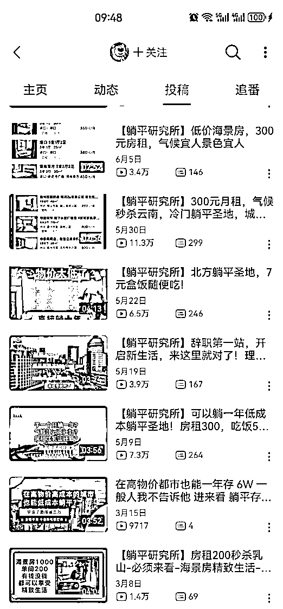
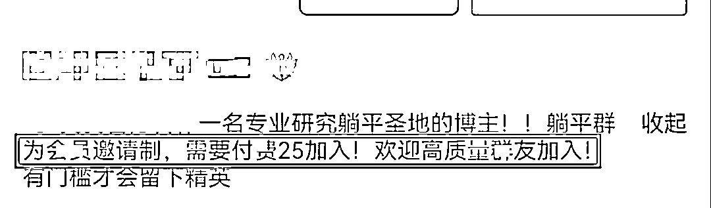
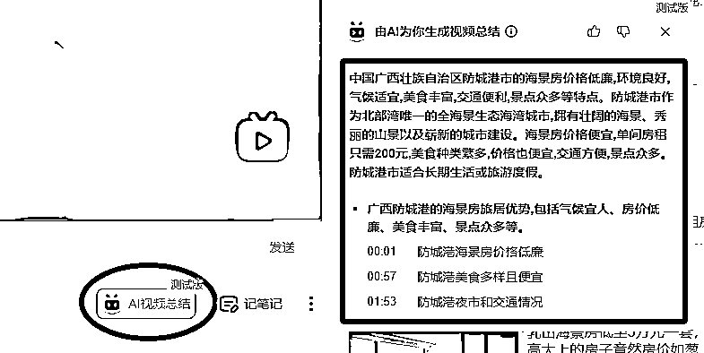
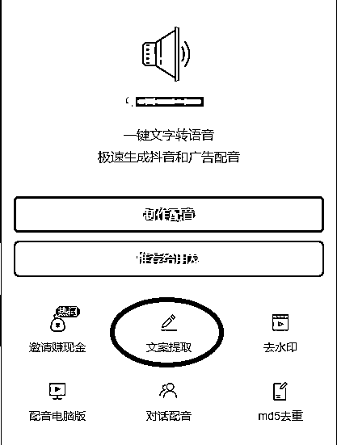
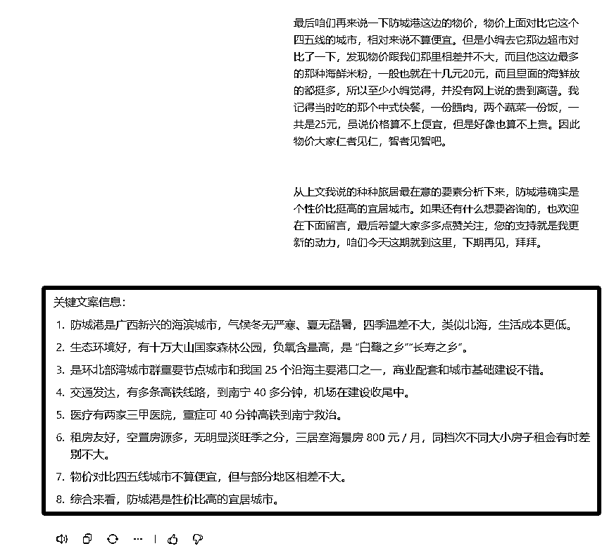
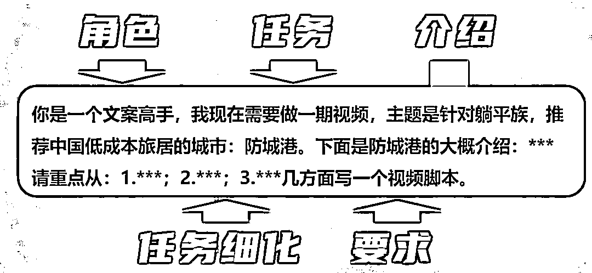
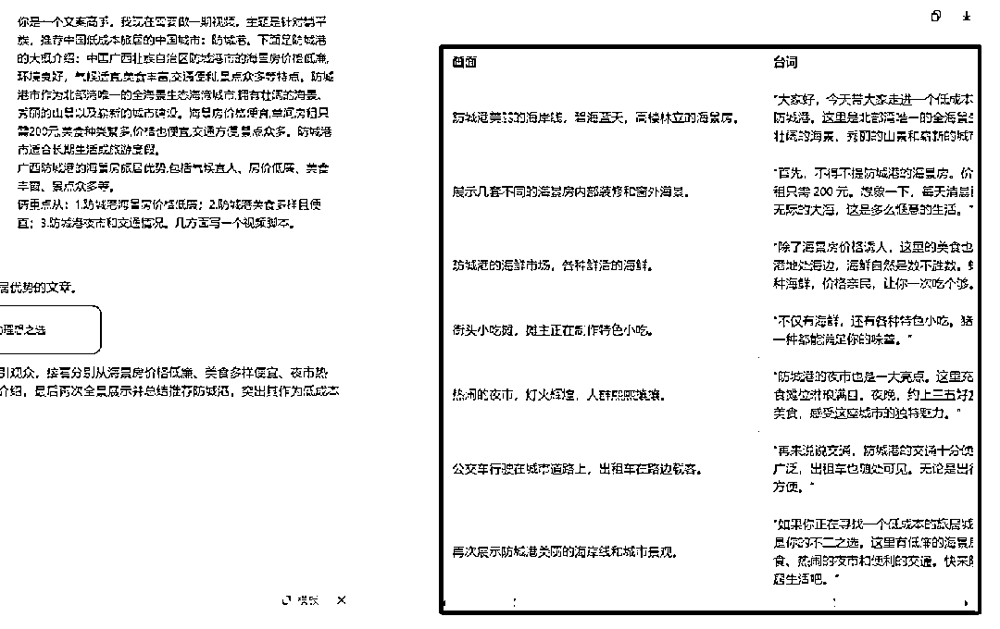
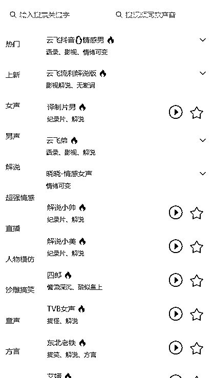
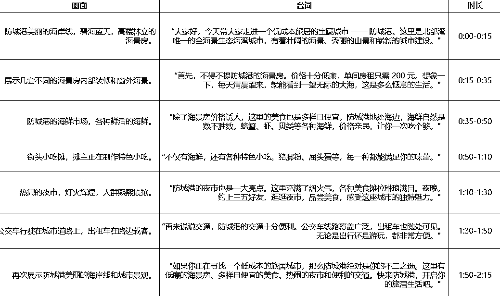
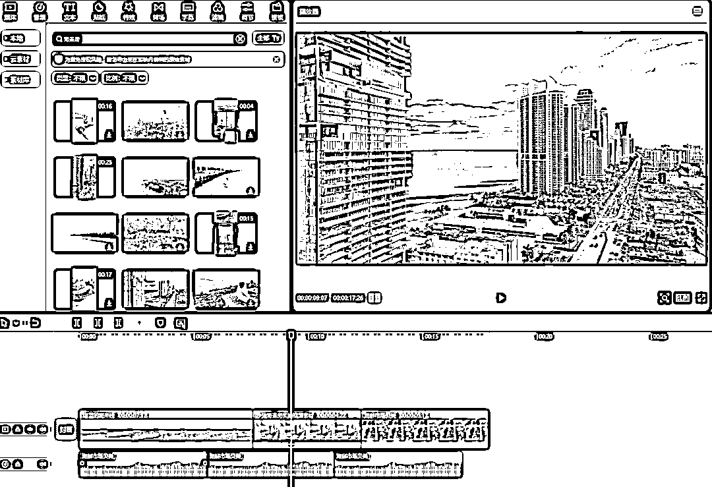

# 冷门蓝海赛道，借助 AI 做躺平攻略社群，一单 25 元做到爆单

> 原文：[`www.yuque.com/for_lazy/zhoubao/mwc9ymw9t16i0itq`](https://www.yuque.com/for_lazy/zhoubao/mwc9ymw9t16i0itq)

## (43 赞)冷门蓝海赛道，借助 AI 做躺平攻略社群，一单 25 元做到爆单

作者： 高鹏

日期：2024-11-12

大家好，我是高鹏。

今天继续分享一个热门玩法。

借助 AI 分享躺平的攻略，这算是目前一个比较小众的蓝海赛道。

比如这个号专门发一些躺平计划，低成本旅居等等一些躺平的攻略，然后做一个躺平的社群，讨论如躺平，还有一些躺平的方法。

视频都非常不错，而且他的社群也收了不少人。

关键的是这种视频制作起来其实不复杂，出镜文本可以借助 AI 创作，画面可以找一些现成的素材剪。

现在这个大环境躺平成了很多人追求的目标，也是一个躺平的话题。这种分享躺平攻略的内容，就非常容易引起大家的情绪共鸣，跑出播放量，现在做的人还不多。

后端的商业模式有三种。第一种就是像这个人做的有一定门槛的社群，看他的简介写写的非常清楚，你需要给他 25 才能加入。

第二种是有了一定的量之后，可以做淘客的业务。

第三种也可以去带一些旅游的门票等等，因为这些躺平的人群，对低成本的旅游还是有一定需求的。

如何做出这样的高水平的视频，我们需要通过四个步骤来实现。

第一步就是需要找到合适的选题。

第二步，有了选题之后怎么样把对标选题的文案提取出来，进行一个提炼。

第三步就是在提炼的结构基础上,用 AI 帮咱们去做原创的脚本文案创作。

第四步就是如何去配音，包括如何去匹配一些相关的画面进行混剪。

首先选题非常简单，就是去搜相应的关键词，各个平台去搜，去找相应的对标的视频或者对标的账号。

找到对标账号之后，把号关注一下,后续它更新什么，我们跟着去更新就 ok 了。

平时可以收集一些关键词，以后去搜的时候范围就会更大。比如说躺平城市·低成本躺平·躺平计划等等。

找到对标的选题之后，接下来就是对对标的内容进行文案的提炼。

这个我们要借助 AI 工具，比如说在小破站上，有的视频它右下角（网页版的才有，app 版的是没有的）会有一个 AI 视频总结。

点一下这个 AI 视频总结，然后 AI 就帮你生成了这个视频的总结，包括视频主要讲了什么事，讲了几个方面都进行了总结。

而有的视频右下角没有 AI 视频的总结，就是说现在的 AI 总结视频这个功能还不完善。

那么如果有的视频你觉得不错，它又没有 AI 视频总结的功能，那怎么办呢？

其实很简单，就是把视频链接复制下来，来到这款工具里，把文案提取出来。

文案提取出来之后，接下来要用到一款 AI 的智能体，然后把原文直接发给它，你会看到 AI 已经帮你提炼出来文案的关键信息了，一共提炼了八条。

接下来根据这些提炼的信息，就可以借助 AI 去写原创的文案了。

在这个提炼的基础之上去写原创文案的时候，给到 AI 的指令是这样的。

首先是角色的设定，告诉 AI 你是一个文案高手，给到他任务是现在需要做一期视频，主题是针对躺平族推荐中国低成本的旅居城市防城港，然后再给到他一个防城港的大概的介绍。

然后接下来是任务的细化，告诉他请重点从 1234 等等这几个方面写一个视频的脚本，这重点 1234 其实也是我们上一步提炼出来的这些核心的关键点。

投喂 AI 之后，它就帮咱们把相应的画面以及画面对应的台词都创作出来了，这个用到的 AI 是豆包，我在文章结尾会给大家提供的。

它的厉害之处在于台词是对应前面的画面的，所以我们在后续去匹配视频素材的时候，直接去对标它给的画面就可以了，而且给到的台词也都很贴切。

最后就是配音和剪辑了，其实配音工具有很多，之前也给大家说过这一款工具，里边有很多配音的风格，选择自己认为比较舒适的配音风格就 ok 了。

接下来进行视频的剪辑，这里有一个核心点，就是我们要根据台词去匹配对应的视频素材。

这个直接用剪映的素材搜索功能就可以了，因为我们在上一步 AI 给到了台词对应的画面，所以我们在剪映里直接去搜对应的画面的关键词就行了。

比如说第一个画面的关键词就是海岸线，我们去搜海岸线的时候，剪映会提供很多这样的相关的素材。第二段台词又提到了海景房，又能找到很多相关的素材，后面都可以按照这个方法找需要的素材。

这些素材找到之后，把它的时长跟我们的配音相匹配，再添加一个背景音乐和字幕，这个视频就制作完成了。

总的来说其实制作起来并不复杂，因为不需要实拍，也不需要出镜。

好，今天的分享就到这里了，目前这个玩法做的人还不多，而且躺平这个话题也是当下的一个热门话题。

那么关于刚才提到的 AI 提炼文案的智能体，以及配音工具和 AI 文案创作工具，统一放到文档里了：

[`svj4gxvm0v3.feishu.cn/docx/GfQNdnV9QodQI0xOkn9cRnWNny2`](https://svj4gxvm0v3.feishu.cn/docx/GfQNdnV9QodQI0xOkn9cRnWNny2)

我是高鹏，深耕网创 9 年，这是我拆解的第 688 个项目玩法，平时喜欢拆解各类变现项目，也喜欢广交朋友~

* * *

评论区：

暂无评论