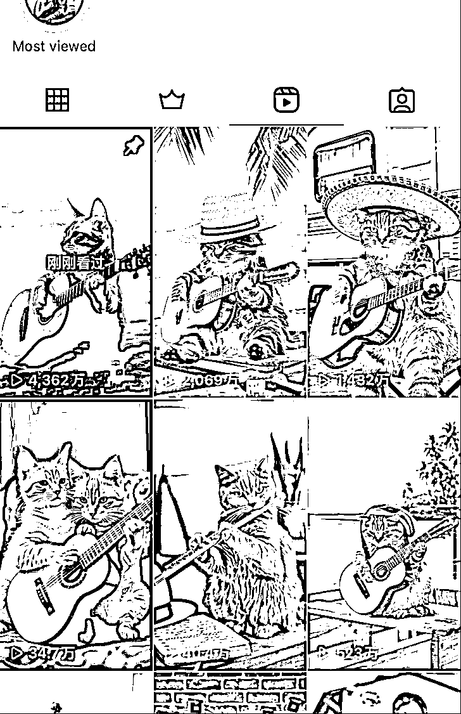
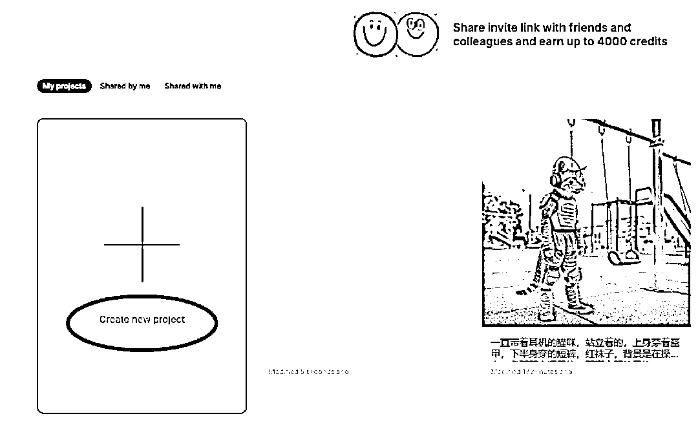
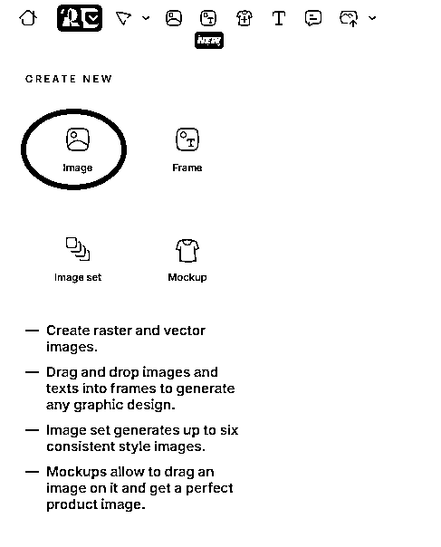
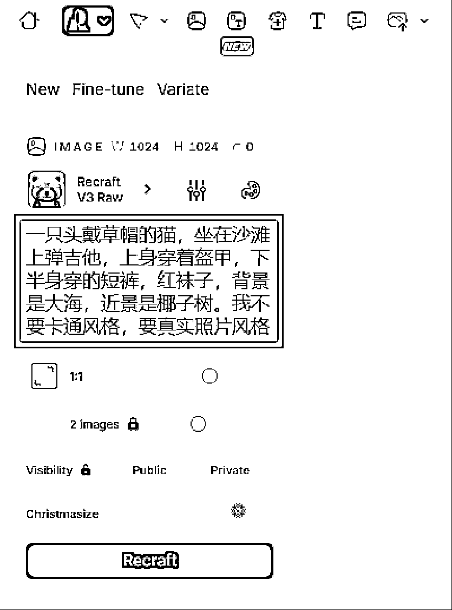
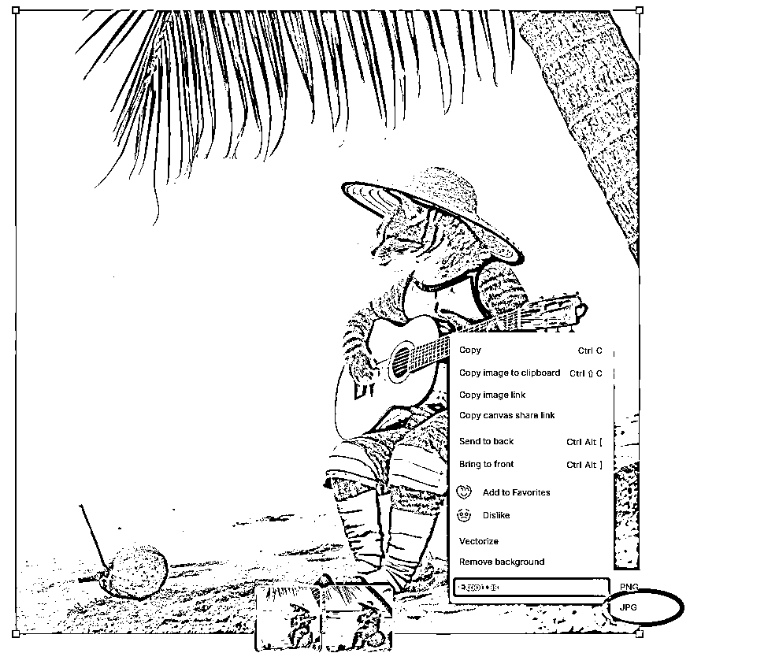
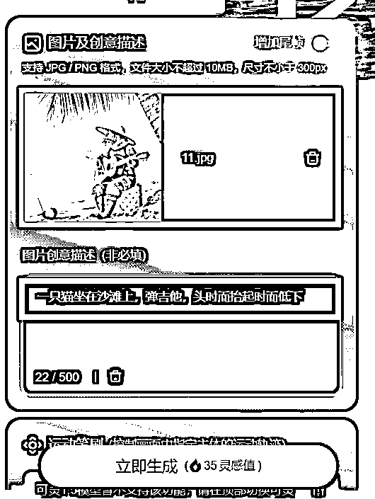
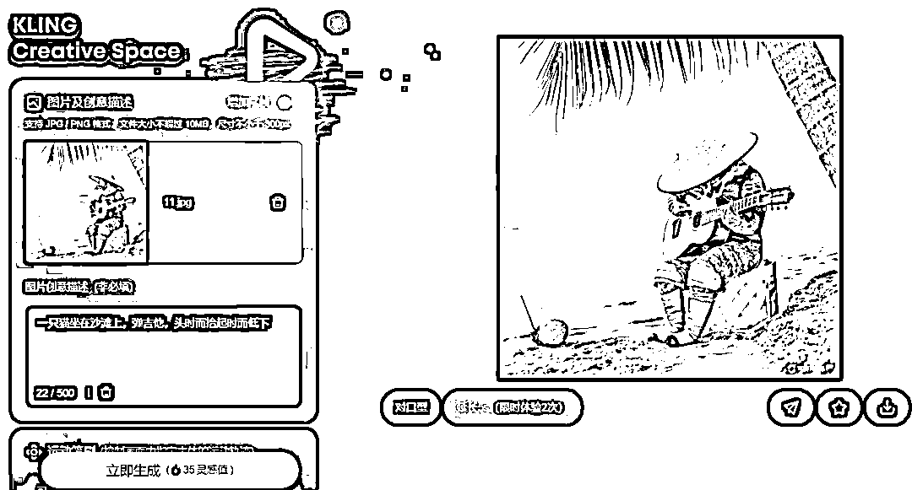
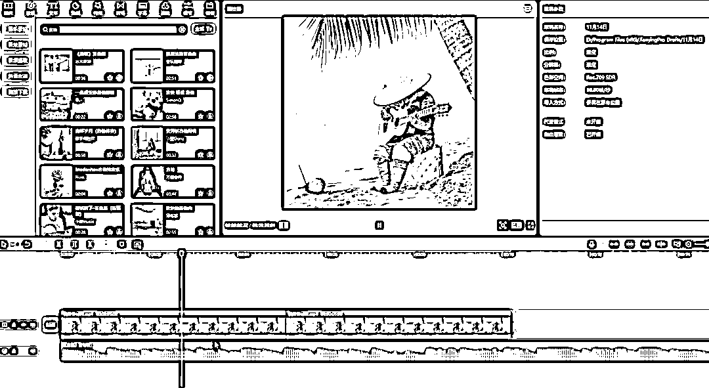

# 多条视频 1000 万+播放，AI 猫咪演奏海外爆火，AI 出海新赛道

> 原文：[`www.yuque.com/for_lazy/zhoubao/xq1s191ffhhun6yz`](https://www.yuque.com/for_lazy/zhoubao/xq1s191ffhhun6yz)

## (36 赞)多条视频 1000 万+播放，AI 猫咪演奏海外爆火，AI 出海新赛道

作者： 高鹏

日期：2024-11-15

大家好，我是高鹏。

今天继续分享一个热门玩法。

用 AI 做猫咪演奏乐器的视频，发到 ins 上面，播放量非常高，这是最近 AI 出海赛道出现的一个爆火玩法。

比如这个号发的都是这种视频，很多都爆了几千万的播放量，最差的也有几十万的播放，非常厉害。

这种 AI 猫咪的视频，国内平台有很多人在发，但是海外 ins 等平台发的人还不多，还是那句话，国内火过的玩法在海外都可以再玩一次。

在 ins 上发这种视频的商业化有很多模式，最直接的去接一些广告业配，比如跟宠物用品相关的一些广告。

第二个就是可以挂链接，自己去带货，也是宠物周边的产品。

第三个就是可以沉淀流量到私域，教给别人怎么样用 AI 来制作猫咪视频的课程。

要实现猫咪演奏乐器的视频有三个步骤来实现，第一步就是 AI 文生图，第二步是用 AI 把图片转成视频，第三步就是配乐加剪辑。

首先就是借助 AI 来根据文字生成图片，用到了这样一款工具，这个工具非常厉害，前段时间它被评为比 MJ 更加优秀，生成的图片更加生动形象的 AI 绘画工具。

打开这个工具来到它首页，会看到一个绿色的加号，点击一下这个地方新建画布。

然后在左上角有四个选项，点最左上角这个 image，就是生成图片的功能。

接下来会让你输入提示词，这个地方我们直接输入中文就可以。

我输入的是一只头戴草帽的猫坐在沙滩上弹吉他，上身穿着盔甲，下半身穿着短裤红袜子，背景是大海，近景是椰子树。

并且提示他不要卡通风格，要真实照片的风格。

它生成的图片，非常贴合给的提示词提到的关键信息，而且细节非常饱满。

然后我们在这张图片上面右键单击，在最下面找到这个 export 就是输出，导出 jpg 格式，导出图片备用。

然后第二步就是用 AI 把图片转成视频，用到的就是可灵或者即梦。来到首页，我们选择 AI 视频这个板块。

进去之后，有文生视频，还有图生视频。

我们选择图生视频，然后在第一个框上传刚才保存的图片。第二个框输入一些描绘的提示词。

我在这儿写的是一只猫坐在沙滩上弹吉他，头时而抬起时而低下，然后点下边的立即生成。

普通用户需要等个几分钟的时间，就生成了比较生动，符合咱们描述的这样的一个视频。

它生成的效果还是非常不错的，然后右下角有个下载视频的选项，把这个视频下载下来。

接下来第三步就是配乐加剪辑。

因为生成的这个视频是没有声音的，所以需要在剪映里添加一个弹吉他的背景音乐。

直接在音频里去搜索吉他两个字，就会找到很多吉他的纯音乐，加到轨道上面，可以再复制出来一段，这样的一共十几秒，匹配音乐的效果会更好。

就这样一个简短的视频，配合刚才说的这个工具，制作起来并不复杂。

只不过 AI 出海这个赛道现在做的人还不多，机会肯定是比卷国内要多得多。

好，今天的分享就到这里了。

关于刚才提到的这两款工具，我都统一放到文档里了：

[`svj4gxvm0v3.feishu.cn/docx/RJVydpaUOoNFNhxpoA7cENGTnxh?from=from_copylink`](https://svj4gxvm0v3.feishu.cn/docx/RJVydpaUOoNFNhxpoA7cENGTnxh?from=from_copylink)

我是高鹏，深耕网创 9 年，这是我拆解的第 691 个落地项目玩法，更多项目玩法，欢迎找我聊聊呀~

* * *

评论区：

桔子 : 新人报告，点赞👍

浪子 : Ins 是哪个平台呢