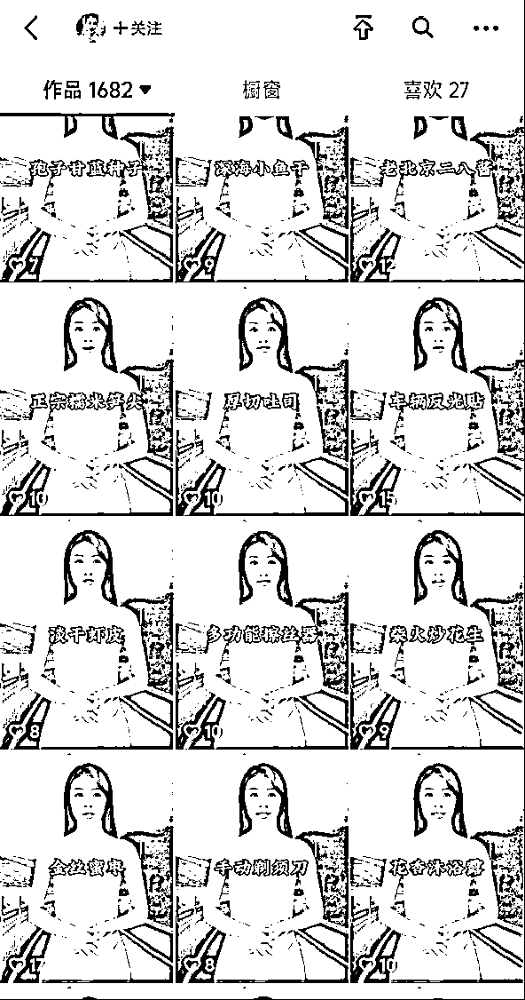
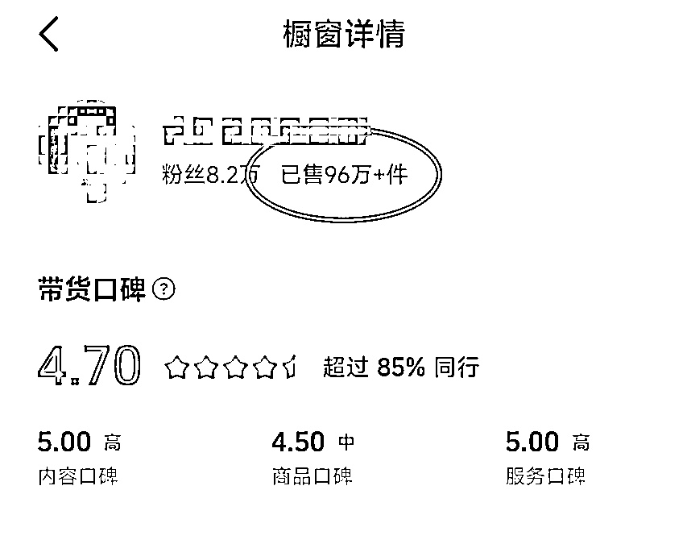
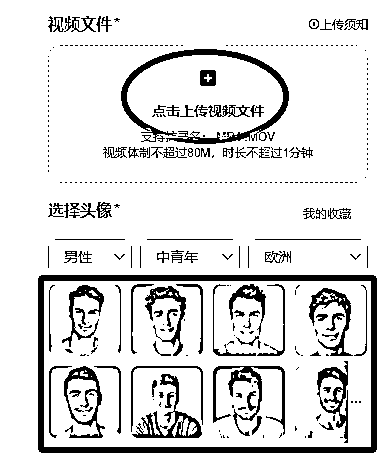
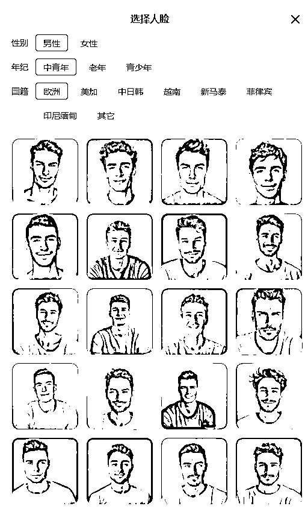
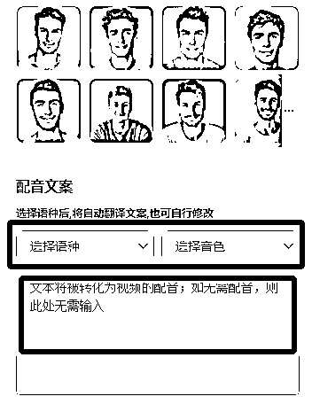

# 蓝海新赛道，海外短视频带货 AI 矩阵操作，怼量爆单玩法

> 原文：[`www.yuque.com/for_lazy/zhoubao/uc4cpn8w69c3i3op`](https://www.yuque.com/for_lazy/zhoubao/uc4cpn8w69c3i3op)

## (24 赞)蓝海新赛道，海外短视频带货 AI 矩阵操作，怼量爆单玩法

作者： 高鹏

日期：2024-11-14

​大家好，我是高鹏。

今天继续分享一个热门玩法。

借助 AI 做 tik 短视频带货的矩阵，不卷国内，去海外做。

只需要用到这个神器，上传一段国人带货的视频，然后选择一个老外的形象，就可以把原视频里边的人换成老外，连声音、动作、神态、口型都是完全匹配的，还可以把汉语换成英文。

以后不用请老外模特，也不用懂外语，就能够做跨境短视频带货了，真的太厉害了。

之前给大家分享过某音上的神操作，凭借工具批量的堆这种数字人带货的视频。

比如这个号堆了将近 2000 条视频，带出去了九十多万件商品。

有了刚才的这个神器，就可以把国内的带货讲解的视频进行量化操作，都转成出海的视频。

这种矩阵如果去海外操作，那么效果一定会好很多，就不用在国内卷了。

工具的操作很简单，打开工具之后，在右边点击上传视频文件，然后上传提前准备好的，国内带货的讲解视频。

然后在下边选择一个你想要的老外的形象，这里有很多，你可以选择男性的，也可以选择女性的，中青年，老年。包括地区，欧美或者日韩都是可以选择的。

选择好了角色之后，也可以选择配音，不用原来视频的文案，直接把文案输入，选择好语种还有音色，它就能把文案对口型的讲出来。

做法还是很简单的，现在做国内的短视频带货越来越卷，但是海外还有机会。

今天给大家分享的就是一个非常不错的思路。

关于刚才提到的这款神奇的工具，我有整理不止一款，但是这些都有一定的门槛，我都统一放到文档里了：

[`svj4gxvm0v3.feishu.cn/docx/IFdMdGzpso8W5LxtlBocaF8mnNf?from=from_copylink`](https://svj4gxvm0v3.feishu.cn/docx/IFdMdGzpso8W5LxtlBocaF8mnNf?from=from_copylink)

我是高鹏，深耕网创 9 年，这是我拆解的第 690 个落地项目玩法，更多项目玩法，欢迎找我聊聊呀~

* * *

评论区：

五阿哥 : 这个量那么大是不是主要干直播带货的，或者是分销给其他人带货的吧

上上签 : 小白想求个航海