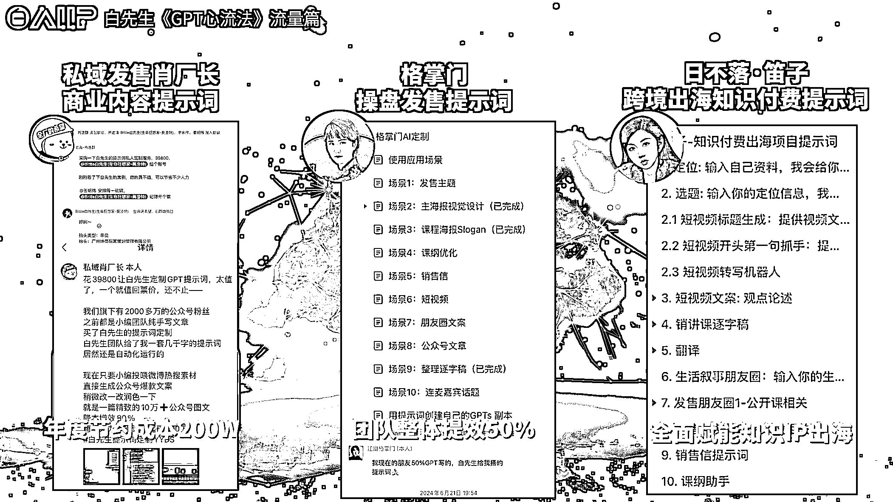

# 《GPT 调教心流法》构建篇

> 原文：[`www.yuque.com/for_lazy/zhoubao/fnd3s9foy7gptg5c`](https://www.yuque.com/for_lazy/zhoubao/fnd3s9foy7gptg5c)

## (22 赞)《GPT 调教心流法》构建篇

作者： Bittle.白先生

日期：2024-11-15

你好，我是 Bittle 白先生～经历 AI 的这一年大家还好吗？

一不留神，《GPT 调教心流法》发表已经过去一年多。很多小伙伴通过它开启了 AI 之路，甚至成为了 AI 的导师。还记得“心流 5 问”、“身份 4 问”、“锁定技”、“调教思维链”等等这些实操的心法吗？他们让你能更好掌握的提问技巧，与 gpt 的交流无阻并拿到高质量的答案。不会吧？这篇影响过万人的教科书级别的文章你还没看过？赶紧补作业吧。

后来我还提出了"心流 7 步曲"，基本涵盖 AI 提问的应用场景，具备很强的复用性，任何你想要 AI 帮你做的事，都能够通过 7 步曲来解答。

一年时间里，我们做了很多场企业培训、线下大课，还有跟二三十位 IP 合作，定制了上百条的不同行业内容提示词。

**  **

**定制提示词有什么用呢？**

只要简单的输入素材，就可以生产满足 IP 口吻、结构、情绪的文案内容，让你不再为创作烦恼，并帮助 IP 获取流量。

目前我们涵盖私域、星座、营养、保险、养生茶、身心灵等等二三十个赛道，也非常感谢 IP 们，彼此成就。让我们不断研究，得以在提示词的构建上迭代了若干个版本，也总结了很多新的思路和心法。

重启《心流法》的系列文章，我会把这些心法展开讲讲，希望能够让你在 GPT 提示词的使用更上一层楼。如果你觉得有启发，感谢留言、点赞、转发～

随着国内外提示词研究的不断研究发展，在提示词的构建方法上，目前我们迭代了四个版本

**1.0 版本——自然语言提示词**

最早期的一类提示词，长文本的表达的提示词，简单直接，但是不好辨别当中的核心内容。

这个类型的提示词就是一些自然语言的对话，对于逻辑表达不成熟的人来说，写起来有点流水账的感觉。入门简单，但也容易看着就混淆了，适合新手。

**2.0 版本——方法论提示词**

随着行业的进步，我们很多一些海外的一些大咖研究多了，发现现在的结构化提示词的版本，像有思维导图语言去编辑而成的，它其实是把我们的一个文本规范化了。当中嵌入了某一些文本构成的方法论，并让 AI 学习。

那它解决一个什么场景呢？比如说以下是我们给无忧传媒做的一个信息流广告仿写的这个提示词，因为信息流的广告会每天生产的量非常大，那它满足一个点就是你写好了一条文案之后，它就会学习你的结构，并且把这条文案去复制个 10 遍 50 遍，甚至 100 遍来完成。

结构化提示词，表现出来的优势是分区块、稳定、可操作性强。

**3.0 版本——人格化提示词**

大家可以看到我们在跟他描述的时候的一些对话，对话会有仿人格的这种情况。这也是我们总结的心法，你用什么对话方式，也决定了 AI 如何回应你。想让 AI 生成一些个性化的文案，这个细节是一个非常关键的动作。也是我们早在 2023 年 5 月就提出的一个思路。从此 IP 文案创作，不再困难。

**4.0 版本——内容化提示词**

4.0 耦合版的提示词是我们一个突破性的进步，通过对参考模版的充分拆解，并融入提示词当中，以此让 AI 一字一句的学习，这个构建方式成功的让 AI 创作保持一个非常稳定的创作水平，并且能生产出符合朋友圈级别的文案，既有人味，又有更多深度思考的表达。

至此，AI 自媒体的提示词构建方式，可以说达到一个十分完整的状态，也很好的促进我们搭建出整个心流法体系。指导着我们能快速根据场景需求，搭建不同的提示词以及为智能体服务。

曾经，大家都以为随着 AI 的智能性，提示词的构建需求会越来越弱。但其实一年过去，反而是提示词才是所有 0 前边的那个 1。如果没有优质的提示词作为基础，后续的智能体，工作流是没有灵魂的。

简单分享到这里，下期我们讲讲优质内容和提示词之间的关系。感谢关注～

* * *

评论区：

暂无评论