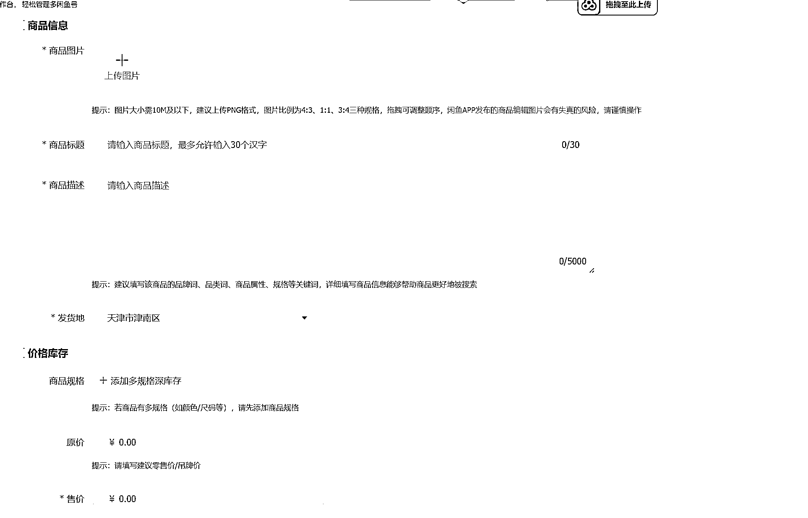

# 如何在生财快速赚到 100 块，仅为迷茫小白建立信心的项目

> 原文：[`www.yuque.com/for_lazy/zhoubao/ncvkpgk8dbsbsipf`](https://www.yuque.com/for_lazy/zhoubao/ncvkpgk8dbsbsipf)

## (78 赞)如何在生财快速赚到 100 块，仅为迷茫小白建立信心的项目

作者： 透世穿尘

日期：2024-11-12

大家好，我叫白了个白（就是小白中的小白，比小白兔还白的那种白）

**对于一个小白，刚来生财三天就要发赚钱帖子，究竟是谁给的勇气** ，俺认为来自两个方面：

> 第一：生财社区文化鼓励分享，毕竟第一桶金（这点钱其实都不配用金来形容）也是实操来的，还有禁得起考验的
> 
> 第二：脸皮足够厚......

一般赚钱必须要有一个故事，这个环节不能少，我知道你想问怎么赚的，不差这几行字，哈哈哈哈哈哈哈哈哈

我以前听过生财，多多少少觉得这是一个割韭菜项目，加上最近工作不稳定，我就想寻找第二增长曲线，那我就想了解一下生财，结果网上一搜发现有碰的有骂的，果然没有争议的一个社区不是好社区，于是乎我毅然决然的花了 10 块大洋，买了咱们以前的课程。

再此我呼吁大家一起抵制盗版，千万不要有类似行为，不论是生财还是其他平台。我也立下誓言，从此与赌毒和盗版势不两立（请不要问为啥缺一个）。所以找到鱼丸的时候，我说了一句话，我欠生财一张票吧

拿到之后，基本上风向标的都过时了，我觉得唯一能掏出点价值的，也就是航海手册了，妈耶一看还是 2023 年的了（这帮人也是骗子，拿去年教程哄弄我），去年就去年吧，我看了一眼，光看题目我知道我就可能放弃，YouTube、Tiktok 咱不会，中国都赚不了钱，国外更没戏，AI 挺好，我是一无所知呀，抖音快手不会拍视频、小红书不会弄精致图片和文案、公众号不会写.......

就在我快放弃的时候， *我发现一个叫闲鱼二手书的，尽管是 2023 年，但是我觉得还能干* 。当时卖我教程的那个店主，还添个逼脸拉了一个群，还说叫生财交流群，他看我骨骼清奇、天生丽质，是个奇才，他说你别做闲鱼二手书了，**那个项目都做烂了，也太简单了，栓条狗都能干......_**

我当时火就上来了，非常严厉跟他说：你咋知道我小名叫狗蛋！于是我就在这种不听劝、不信邪的情况下，开始闲鱼二手书，后来我有看了手册，说是一个人管理六个账号，一个月平均能五六千（淡季），我一个账号一个月就是 1000，这个项目大佬肯定看不上，就这么干吧

下面是嘚瑟晒图阶段，人生第一桶金总是美滋滋的，挺开心的（谁问你呢，狗头保命）

闲鱼需要精细化运营，需要优化每一个环节，然后我都没有做，没有做的原因，不是我不想做，而是我从八月份到 11 月份，都在给别人代课，腾不出时间，毕竟代课一个月万，还是舍不得丢，所以我就用做简单的方式做了闲鱼二手书，如果这样都能出单，我觉得这个项目可以作为生财的一个“一百元项目”，就是让类似我这样的小白，先挣到 100 块。

我想把闲鱼二手书的链接放上，让大家照着做，我想想还是别放了，原因有二

> 第一，我真没有找到，我是小白刚来三天，新手手册还没看完呢，谅解一下。如果还没有下架，有请我的全网目前唯一铁粉鱼丸给我放到评论区，谢谢
> 
> 第二，我觉得手册有些地方繁琐了（没有贬低意思，我只是觉得对于我们白中白来说，简单不能在简单的最好了），不需要那么多的前戏，直接怎么干就行了

下面请开始我的表演，以上能不能具有通用性，俺不知道，**因为我只是让我一个小学同学干了，他也挣钱，没有大面积进行测试，不能保证百分百呀 _**

第一步，有个没有下载过闲鱼的手机，如果你手机没有最好，有的话建议买一个，淘宝 200 块钱买个小米挺好（别超过 300 呀，我目前只能让你最多赚到 300 块）

第二步，注册名字、昵称、介绍、绑定支付宝、都是常规操作，最重要一点说一下，一定要信息开启通知，不然你错过订单就不好了。

第三步，开始刷两到三天的二手书账号，至少让系统知道你是卖二手书的吧

以上都没有问题吧，连我白中白都会，你们肯定没有问题

第四步，选书 我当时是 9 月底干的，还赶上一段教材，现在就是卖小说，等到开学你在卖教材。

这里面衍生出两个问题，选什么书和在哪进书。选书有闲鱼榜单和孔夫子榜单。好像我也回答第二个问题了，我觉得孔夫子书挺好的，售后也好。所以我建议这样吧

第五步，上传书籍，用的是闲管家网页版，上面有标题+内容+图片+价格

标题：正版二手+书名+作者+出版社

内容：可以一个模版，每个都用 （就是哪些内容，你找几个合并合并就行）

图片：你百度搜一下，里面有个工具叫去水印和变清晰，你从不同的角度来四到五张就行

价格：开始参照同行就行，基本上一本书加个至少两到三块吧

第六步，每天 10 个宝贝发布，连续发布三到五天，可以收到开通鱼小铺邀请了（因为开通之后，就可以发布 500 个产品了）

第七步，有人咨询无非就是正版吗，几成新，在哪发货，这个你对答如流 正版 八五左右， 全国有仓。

第八步，用户下单，在孔夫子下单即可。然后把单号填到闲鱼发货就行了。记得每天一键擦亮宝贝

**结束了？结束了！这么简单，对就是这么简单！**

> 先算算，按照 25%的利润 ，如果想要赚 100 块 就是要 400 块
> ，如果 15 元一本书的话，你只需要卖出 27 本，不出两个月，目标就能完成了，两天卖出一本书，还是有可能的，概率很大的

高手请留情，我知道你们会说很多细节不完善，我都知道，如果实操我能出一本书册，每一步都能写至少 1000 字，但我没有，因为大家做的过程中就会发现问题，然后去解决问题了，我需要是给大家建立信心。对于我们这样的小白，信心才是最宝贵的。

**按照我的方法去赚钱，遇到任何问题，都可以评论区留言，我看到肯定回复。**

当然你能耐心的看完了手册，更具有实操性，那么请从闲鱼二手书，开启你的第一桶金吧

闲鱼二手书，是有天花板的，但是闲鱼没有天花板，航海项目没有天花板，生财没有天花板，你通过这个项目未来能有多大发展，不要问我，我也不知道，我也是刚做的，这也是我来生财的原因吧

让我们一起加油，我是白了个白！！！！

* * *

评论区：

六只猫 : 我的目标是先挣一块钱[嘘]

巴沙 : 优秀

乌托邦 : 我才开始[流泪]

贤雅 : [强]

Hpin : 👍

灯光少侠 : 这种很实操[强]

禾刀 : 好多帖子说闲鱼二手书要办证吗？你这个不用？

晨希 : [强]