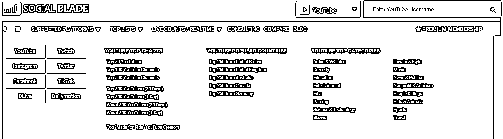

# YouTube 赚钱从跟爆款、流行开始

> 原文：[`www.yuque.com/for_lazy/zhoubao/bryt1cpq0350v6rh`](https://www.yuque.com/for_lazy/zhoubao/bryt1cpq0350v6rh)

## (49 赞)YouTube 赚钱从跟爆款、流行开始

作者： 书情小跟班

日期：2024-11-11

这里的时下流行是指 YouTube 的首页，针对于 YouTube 来说，当下什么视频，或者说什么内容比较火，相对于 YouTube 的偏好

在这个帖子 如何找对标? [`wx.zsxq.com/mweb/views/topicdetail/topicdetail.html?topic_id=1525414128554252，这里的首页，指的是针对于你的偏好`](https://wx.zsxq.com/mweb/views/topicdetail/topicdetail.html?topic_id=1525414128554252，这里的首页，指的是针对于你的偏好)

专业的网站 [`socialblade.com/`](https://socialblade.com) 这个网址没记错之前好像有发过

翻译下

这个网址[`www.tubefilter.com/`](https://www.tubefilter.com) 就更具实时性

 images.zsxq.com/Fvcn7t2FomkLTGmQ9EZUxmcv4R8Z) images.zsxq.com/FtJFpwnnLMcuHzF3xCPwS7jTxynU)

这个网址非常明了清晰的告诉你，赶紧做短片，赶紧做短片，赶紧做短片

下面是具体的频道了

儿童频道播放量非常猛

前面说的 50 个频道，上榜的有 31 个是短片（Shorts），然后这些频道有很多都是儿童频道

大家如果要追爆款，建议每周关注下这个网址的一个榜单 [`www.tubefilter.com/`](https://www.tubefilter.com) 看看最热门的是什么视频，看看最新发的视频是什么视频，每一个视频的播放量是什么情况，每一周的情况等等。

找几个对标，好好学习，成功复制成功，更容易成功嘛。

* * *

评论区：

书情小跟班 : 做 YouTube 的一些常识[`rlwxa0zgke.feishu.cn/docx/P2DYduGbkoW0nqxcRZgcL6xKn7I?from=from_copylink`](https://rlwxa0zgke.feishu.cn/docx/P2DYduGbkoW0nqxcRZgcL6xKn7I?from=from_copylink)

老彭 : 书情很厉害，连续分享一年多 YouTube 相关知识[强][强][强]

火焰女孩 : 一般在什么点发布会比较好呀！多账号的话一定要多 ip 吗？

苗苗 : 请问可以链接您吗？

书情小跟班 : 通过鱼丸联系我

书情小跟班 : 看我发的帖子

火焰女孩 : 好多都打不开了[流泪]