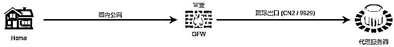
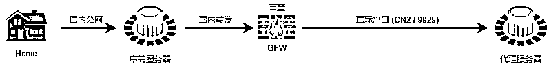
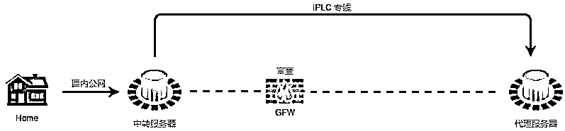

# 成为 一个专业在 YouTube 上赚钱的人要注意的点——海外住宅 IP

> 原文：[`www.yuque.com/for_lazy/zhoubao/sdp6twev0de4p41n`](https://www.yuque.com/for_lazy/zhoubao/sdp6twev0de4p41n)

## (39 赞)成为 一个专业在 YouTube 上赚钱的人要注意的点——海外住宅 IP

作者： 书情小跟班

日期：2024-11-11

我知道有些人贪便宜，用免费的节点来做 YouTube，想低成本在 YouTube 上赚钱，想法是挺好的，但是呢，当你真要这么做的时候，你在细节上是没有处理好的。

普及下海外住宅 IP 或者说海外住宅 IP 代理

一般情况下认为是**专线+海外住宅 IP** 较做得比较好的了，在多账号的操作上（**指纹浏览器是标配** ）

**什么是专线？** 这里也是一个知识普及的点

## 不同节点区别

由于 Shadowsocks (SS) 的图标为一个纸飞机，所以一些专门提供代理服务器并且自发完成 SS 服务部署的公共代理服务商也称为「机场」。

但即便技术原理相似，不同的机场间体验也可能大相径庭，因为不同实现手段之间还有许多门道，下面我来介绍几种常见的机场线路。

### 直连节点

直连线路就和上面介绍 Shadowsocks
原理的实现完全一致了。仅仅通过一台境外服务器作中转站，而客户端到服务端的连接走的也只是公网。这种实现非常简单，但有着很大的不稳定因素。

首先是用量过大，或者机房受到特殊照顾，很可能会遭到防火长城的干扰。而即便没有直接干扰，纯公网路由转发都可能带来不同程度的「绕路」，而且高峰期骨干网拥堵也会使体验大打折扣。

而直连线路中也有稍微好一点的一类，也就是 CN2 线路。CN2 指的是电信精品骨干网，是一类特殊的公网线路。这部分线路超售程度较轻，比电信 163
要好上不少，但高峰期还是可能会有一定程度的拥堵，这是公网线路难以补齐的短板。

而主机商家在商品上标明「CN2 GIA （全程）」和「CN2 GT（半程）」就指针对大陆专门做过链路优化的机器/机房。

### 中转节点

中转即在直连的基础上添加一台国内机器，从而服务端连接链路变为：「本地 - 国内骨干网 - 国内中转节点 - 公网出口 - 境外代理服务器」。

虽然看似多了一步，但这能帮助代理服务商有效控制服务质量。由于机场用户可能遍布祖国大江南北，所以直连线路效果受地域影响很大。

而相较于人均不足的国际出口带宽而言，国内骨干网带宽还算充裕，这样让国内用户先连接国内中转服务器，中转服务器通常选择一些出口线路较好的机器，比如将流量转发到电信
CN2 / 联通 9929 线路出境。这样一来代理服务商通过对中转服务器的管理便可较为有效地提升相当一部分用户体验。

中转接入包括单线接入、BGP 接入。单线接入指通过一台或者多台单线服务器将流量转发至 电信 CN2 / 联通 9929 线路出境，以此避免昂贵的 BGP
带宽成本，但难以控制单线服务器到国内 CN2 / 9929 出口的链路质量，体验受中转服务器的选择影响较大。

而 BGP 接入则为用户连接国内 BGP 服务器，BGP 服务器通过隧道中转到 CN2 / 9929
等较为优质的链路，出境后也部署隧道中转到代理服务器，BGP 服务器通常接三网效果都不错，且对流量进行隧道中转可针对性优化链路。

### 专线节点

一般而言，专线指 IPLC 内网专线。比如常见的深港 IPLC 就指深圳到香港点对点的专用线路，此线路不使用公网，就**完全不存在审查** ，也不存在运营商
QoS。又由于带宽独享，在高峰时期无需争夺可怜的公网带宽，全天候都体验都不错。

其他渠道，如三大运营商或者一些私人专线提供商上，都会发现 IPLC 专线价格是非常高昂的。电信 IPLC 大概在 500CNY/Mbps
这个价位，当然三大运营商提供的线路稳定性最有保障。也有一些私人 IPLC 提供商，报价基本都要 300CNY/Mbps 往上。

### AIA 专线节点

Anycast 公网加速（Anycast Internet
Acceleration，AIA）是一个覆盖全球的动态加速网络，可以大幅提升您业务的公网访问体验。不同于其他应用层加速服务，AIA 能实现 IP
传输的质量优化和多入口就近接入，减少网络传输的抖动、丢包，最终提升云上应用的服务质量，扩大服务范围，精简后端部署。

AIA 专线本质还是专线。但普通专线往往只有一台入口节点，从用户到入口节点还需要经过或长或短的公网连接。而 AIA
专线便压缩这最后的不确定性，配合腾讯云遍布全球的基础设施以及其它运营商的鼎立相助，使得使用 AIA
专线的用户无论遍布大江南北都能从最近的接入点进入腾讯云内网，告别公网的拥堵与时延（哪怕只是一点）。

使用体验：AIA 专线 > 普通专线 > BGP 中继 > 普通中继 > 直连

一般认为专线是所有节点最优的，当然了专线也有分等级，不过，一般的专线也就够用了

海外住宅 IP 是指**IP 地址源自真实的住宅网络** ，但实际上我们往往是用别人搭好的海外住宅 IP
，即我们买到的是海外住宅 IP 代理服务。是的，我们花买是买服务，只是说这个服务的产品是让我们有海外住宅 IP。

**什么是海外住宅 IP 代理？**

海外住宅 IP 代理是一种特殊的网络服务，它允许用户通过位于海外的住宅宽带网络连接互联网。这种代理服务使用真实的住宅 IP 地址，而这些 IP 地址通常被分配给海外的个人家庭用户。

由于这些 IP 地址来自真实的住宅网络，它们在互联网上的可信度较高，从而减少了被封锁或标记为可疑流量的可能性。

**海外住宅 IP 代理与普通 IP 代理有何不同？**

海外住宅 IP 代理与普通 IP 代理的主要区别在于 IP 地址的来源和性质。普通 IP 代理（如数据中心 IP 代理）使用的 IP 地址通常来自大型数据中心，这些 IP 地址容易被识别和封锁，因为它们归属于非住宅网络。

相比之下，海外住宅 IP 代理提供的 IP 地址源自真实的住宅网络，这使得它们在进行网络活动时更加隐蔽和安全。

例如，在执行数据抓取或访问地理位置限制的内容时，海外住宅 IP 代理由于其较低的识别率，更能有效避免被封锁或监控。

**海外住宅 IP 代理的基本定义及其与其他代理类型的区别**

海外住宅 IP 代理的核心优势在于它提供的 IP 地址是由真实的互联网服务提供商(ISP)分配给普通家庭用户的。

这些 IP 地址在地理位置、网络行为等方面与普通用户的行为模式高度一致，从而使得使用这些代理的网络请求更难被识别为代理流量。

另一方面，数据中心 IP 代理虽然在成本和速度上有优势，但由于其 IP 地址通常来自同一 IP 段，很容易被网站管理员识别和屏蔽。

海外住宅 IP 代理在处理需要地理位置特定访问、高度匿名性或低检测率的应用时，提供了独特的优势。

例如，在进行市场研究、社交媒体管理、内容聚合等需要模拟真实用户行为的场景中，海外住宅 IP 代理由于其几乎与真实用户行为无异的特点，成为了首选解决方案。

而在一些对 IP 来源敏感的应用场景中，比如电子商务、在线广告和版权受限的媒体内容访问等，使用海外住宅 IP 代理可以有效规避风险，提高成功率和数据质量。

海外住宅 IP 代理以其独特的属性和优势，在互联网世界中发挥着越来越重要的作用。

它不仅提供了一个安全、隐蔽的网络
访问方式，还能在多种应用场景中提高效率和效果。无论是在跨越地理界限的内容访问，还是在需要高度匿名性和低检测率的专业任务中，海外住宅 IP 代理都展现出了其不可替代的价值。

特别是对于那些需要精确和可靠的网络操作的用户而言，海外住宅 IP 代理不仅提供了一种技术解决方案，更是一种保障网络活动顺利进行的关键。

此外，海外住宅 IP 代理在维护用户隐私和网络安全方面也起着重要作用。

由于这些 IP 地址来自真实的住宅用户，因此能有效避免一些常见的网络监控和数据分析方法。

用户的网络活动，如浏览习惯、在线购物记录等，更不易被追踪。这对于那些重视隐私保护的用户来说，是一个不可忽视的优势。

以上信息仅供参考，当然了，不是非得要专线节点，不是非得要海外住宅 IP，只是在每一个环节比别人多做 1%，那么你更具备优势。

海外住宅 IP 代理服务怎么买？大家 Google 下吧，免得落人口舌，我靠这个赚钱。

* * *

评论区：

红烧电饭煲 : 感谢书情老师分享！

Sugar 张 : 希望老师能直接分享一下您在用的海外住宅 IP，避免踩坑，谢谢[可怜]

老彭 : 希望老师能直接分享一下您在用的海外住宅 IP，避免踩坑，谢谢[可怜]

浅浅 : 希望老师能直接分享一下您在用的海外住宅 IP，避免踩坑，谢谢[可怜]

silver : 请问可以麻烦您分享一下您在用的海外住宅 IP 吗？谢谢～