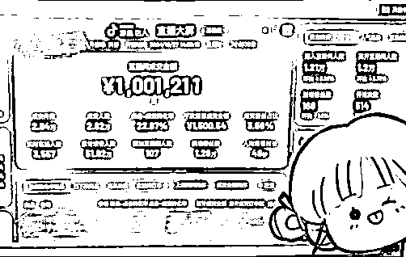
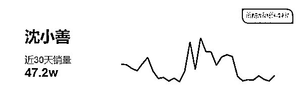
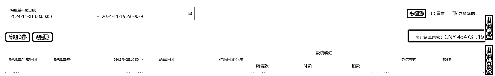
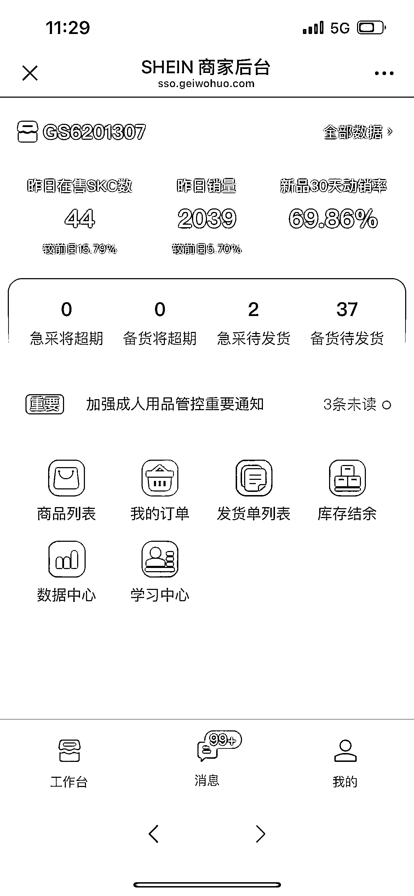
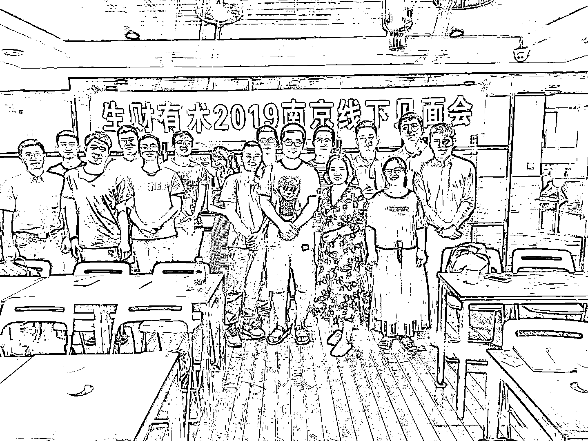
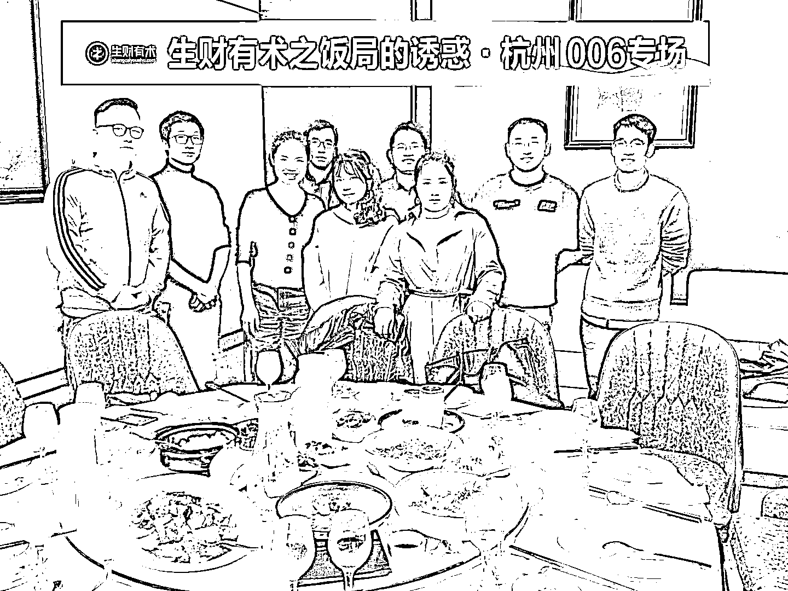

# 项目实操：Shein 全托管-选品项目经验分享

> 原文：[`www.yuque.com/for_lazy/zhoubao/eb5ct5vszemvtnb1`](https://www.yuque.com/for_lazy/zhoubao/eb5ct5vszemvtnb1)

## (精华帖)(352 赞)项目实操：Shein 全托管-选品项目经验分享

作者： 沈小善

日期：2024-11-15

大家好呀~我是小善，也是"沈小善"品牌的创始人，我们在国内的消费品行业里做得还算不错（面包、咖啡），年销过亿，我们品牌名的来源是我们想为**这个世界做一点点善良的事情** 。

2019 年加入生财，已经是第五年的老会员了，算是一颗和生财一起成长的小树。

2019 年，我在生财发布的第一篇帖子是"进入星球很焦虑怎么办"。[`t.zsxq.com/vCsVf`](https://t.zsxq.com/vCsVf)

那时候真的很焦虑啊，看到这么多厉害的人，赚这么多钱，觉得自己怎么这么菜，要啥啥不行，干饭第一名。

焦虑过后继续干活，开始和第一个圈友聊了三小时，后来研究抖音引流，再到公司从十个人变成 40 多人，开始从业务思考到管理问题，都有记录。回头看这五年，也很有趣。这些内容都在#小善的创业思考#这个话题下。

一边创业一边挨打，一边研究一边记录。

不知不觉加入生财五年了。从进生财开始算，规模有几十倍的增长。

回想第一次进生财的时候还是战战兢兢，发帖都不敢。五年时间，五年弹指间，从公司十几个人发展到最高 200 多人，有了自己 5000 平的工厂。从只有天猫京东淘宝的时代，一天卖个三万五万的，到单日破 100 万，就像梦一样，不敢相信。

虽然今年大家都说生意难做，但我们也还算是逆势增长，到现在为止，我们在国内电商都属于第一梯队。

* * *

* * *

* * *

可以说在生财的五年是我成长最快的五年。在成功探索国内淘宝、天猫、抖音、拼多多、小红书、视频号后，我们公司已经铸成了一把利剑，基本在每个平台都有斩获。

这时候我想着要不要把在国内红海市场验证的规律和打法拿到国外市场试试水？当然，一个原因是可以出一口八国联军侵华的气，枪口对外肯定比枪口对内要好；另一个是我确实想看看，我的产品方法论是否可以跨越时间、空间、文化和种族；还有一个就是，有谁能挡住七倍效率赚钱的诱惑呢？

说干就干，9 月份我全面退出国内消费品公司的管理线和业务线，开始和我的新合伙人，也是我的好闺蜜小虹，两个人一起探索国外业务。

# **项目成绩**

先说下我们取得的成绩，我们全职做希音（Shein）一个月时，单人利润达到 3 万；第二个月，单人利润增至 10 万。但这个过程并不顺利，在不断摸索尝试中前进。

因为我们本身在国内抖音的业务非常非常不错，也知道抖音的流量机制下单个 SKU 的量是非常大的，我们一开始就想着拿下单个 SKU 量最大的 TikTok 去。一想到单个 SKU 量那么大，国外去了赚钱速度提高七倍，想想就激动。

结果天不遂人愿，发生了很多意外。

最开始我们想做跨境，就通过对比国内外消费者的需求，发现人与人之间确实存在差异。比如我们中国人的地毯和鞋脏了都要洗，而美国人则是撒点粉末掩盖异味就继续使用。研究来研究去，发现人与人的需求差异很大，反而是各地对宠物的需求差异没那么大，于是我们就选择运了两个货品各 300 件到美国。

因为第一次运货到美国，注册店铺等事项需要很长时间。在这个空档期，我们就商量说，要不把 SHEIN 店铺注册上品打发一下时间，反正也没事做。

9 月，我们在等货的空档上了一些产品，开始零星出单。但是我们的目标是 TikTok 的星辰大海，所以等美国货到了，就立即放下 SHEIN，开始研究素材：研究美国人的素材风格、如何翻译评论区、如何翻译视频、如何去掉水印、什么产品好卖、如何投放等。

9 月，我们一直在两边拉扯，每天要自己做素材、研究素材、投放，还要学习英文。很快海外抖音有一条素材就达到了收支平衡，但我们发现 TikTok 的原创素材非常重要，原生感尤其重要。如果要继续优化，就需要获取更多外国人的原生画面或者大量达人铺货，工作量变得巨大，现在团队就 2 个人，根本干不过来。

而此时，SHEIN 前期随手上的产品，只花了 TikTok 十分之一的时间，一天居然能出几十单，但那边也需要发货、采购，同样需要投入更多时间。

这时候我们商量了一下，只能二选一了。就 2 个人的团队却感觉承担了 20 个人的责任，根本忙不过来，而且我们两个人中，我只能打打气，干不了具体工作。

于是我们在 10 月就决定先聚焦精力打一个平台，暂时放下 TikTok，专注做 SHEIN。10 月份实现 3 万的利润，11 月份预计会有 20 万左右的利润。截至 11 月 1 日至 15 日，单店销售额达到 40 万，我们店铺的利润率超过 20%。

# 做 Shein 遇到的坑

从最开始到现在做 Shein 需要解决很多问题：

1. 科学上网的问题。

2. 我们的英语水平不够好，需要解决翻译网页以辅助选品的问题。

3. 注册店铺的平台审核周期长，最开始被打回好几次，从注册到最终通过，花了大半个月时间（为什么不能立即给出审核结果，真是令人困扰）。

4. 各种罚款问题：数据填错要罚款，少发货也要罚款。每个错误都要罚 1000，真是令人哭笑不得。

5. 寻找合作伙伴，协助发货采购，进行集中采购。

6. 每个店铺每月只能上架 15 个产品的限制，我们找到了一个可以无限上架的渠道，增加了学习反馈的机会。

7. 开始大量上新产品，一天上传八到十个，但发现大部分都不通过审核，未通过的产品连测试流量都没有获得。

8. 随后我们调整策略，改为每天上传 2-3 个严格筛选的精品。这时才发现该平台重视产品质量，铺货数量并非关键。

9. 进行竞争测试：我们上架了 10-20 个大品类产品参与竞争，同时将供货价降低至采购价的 80%以下，用于测试平台的价格敏感度。结果发现该平台对价格并不敏感，即使比采购价低 20-30%仍然难以出单。

10. 继续测试：我们将约 20 个国内爆款产品搬到国外平台，依然不见起色。这再次证明中国消费者与外国消费者的需求存在较大差异。

11. 之后我们进一步缩小范围，放弃原有想法，转而专注于外国消费者熟悉的产品，主要参考亚马逊、独立站和 Temu 等平台的热销品。

12. 接着我们进行了更多定向测试，不断优化上架原则和规律。现在我们上架的产品基本都能售出，避免了库存积压的问题，主要考虑的是销量大小的问题。

13. 最后我们发现 SHEIN 的订单很稳定，平台不会随意更换供应商，对价格的管控也没有外界传言的那么严格。与国内平台相比，难度至少降低了三个等级，只需要管理上下架，就能实现**20%以上的利润率** 。

简单来说，我们的策略就是：

**将外国消费者在 Temu 和亚马逊上购买频繁、需求已得到验证的产品，转移到 SHEIN 平台上销售。**

就是这么一个简单的方法，在我们团队仅有三个人的情况下（其中我只能在一旁加油打气），**订单量就突破了 2039 单/日。**

与国内传统电商相比，我们一致认为这里的竞争程度至少降低了三个等级。所以现在还算是一个比较好的时间去做尝试，从我们投入的时间至少，人数之少，反馈的速度来看。

所以我想把这个项目放大，让更多人参与进来做，复制我们成功的经验，赚到自己一个不错的副业收入，同时，我们想找到选品运营能力强的圈友，后期我们会深度绑定合作，**特别优秀的圈友** ，我会出资孵化他成立自己的工作室，一起做海外电商的项目。

从我们的经验来看，新手一个月，每天花费 3-4h，收入几千块钱不等，看个人的选品能力。

这也是我和生财合作做航海的原因。

下面我会来具体介绍一下 Shein 这个项目的机会玩法这些。

# Shein 的介绍

我们做的是希音（Shein）全托管项目，简单来说就是：你与 Shein 形成一个完整的供应链体系。你负责在中国选品和供货，而 Shein 则负责将商品运送到全世界。希音还会帮你处理客服事务，并在海外完成发货。你只需专注于在中国选品和供货，关于销售的一切事务都无需操心。

## 项目玩法

**运作流程共分为三个步骤：**

1. 选品上架

通过选品方法的学习，选择合适的商品并成功上架到 Shein 平台

2. 测试转化

Shein 会为上架的商品提供测试流量，以评估其转化率。

3. 采购发货

如果商品显示出良好的需求和转化率，将持续进行采购供货给 Shein。

* * *

## **成本投入**

我们的运营模式主要集中在以下几个方面：

1. 前期投入

- 重点投入时间于选品和上架过程

- 初始采购 3-5 个样品，费用较低

2. 销售周期

- 畅销商品可持续销售 2-6 个月

- 销售不佳时，损失主要为时间和精力投入

3. 采购效率

我们团队能够实现 90%的采购商品成功销售

4. 全方位支持

**我们将为你提供：**

- 成熟的店铺运营

- 必要的资金支持

- 丰富的行业经验

通过我们的支持，帮助圈友迅速突破新手期

* * *

* * *

## **做成的关键要素**

**** 1. 执行力是首要条件

跨境电商需要学习全新的知识体系，途中会遇到诸多挑战。比如需要适应与国内完全不同的文字系统（尽管有翻译工具辅助），这些不适感会让许多人望而却步。但正是这些门槛创造了竞争洼地，为坚持的人带来机会。

2. 善于发掘平台差异化机会

我们已经总结出了一套规律，但仍需持续寻找符合这些规律的产品。同时，我们也要不断优化和迭代这些规律，使其更加精准。****

* * *

## **项目难点**

1. 语言障碍的突破

语言问题往往是最初的心理障碍。我个人英语水平不高，连大学英语四级都未通过，曾经认为语言会是一个重大障碍。但实际操作中发现，借助现代网页自动翻译功能，语言障碍已不再是主要问题。

2. 选品和执行力的培养

初期面临的挑战：

- 适应新的语言环境

- 熟悉新的平台操作（如亚马逊、Temu）

- 为不同文化背景的消费者（美国、欧洲、西班牙等）进行选品

即便有明确的规则和流程指导，新手仍需要一定的适应期。这个过程需要持续的实践和耐心。

## 提供的支持

我们会给这次提供下面的支持，你只有做好选品上架，我们负责 Shein 玩法教学，账号提供、选品经验分享、采购发货等工作。

*   每日 100-200 个实战案例分析

*   错误原因精准标注

*   每天至少半小时在线答疑

*   群内互助交流

你做了作业即可查看所有人的作业和批注，可以得到快速反馈。

# 航海预告

说了这么多，来和大家说下，Shein 航海，**11 月 20 日** 开始报名，感兴趣朋友欢迎来报名。

最后，想再说一些心里话。我创业已有七八年，很多事情都在变化，但"为这个世界做一些善良的事"这个初心从未改变。因此想要开展这次航海计划——中国人何必内卷，我们可以去竞争美国人、欧洲人、巴西人等等，实力完全可以一较高下。

中华民族的伟大复兴需要我们共同努力！让我们将义乌的优质小商品送达欧美每个角落。

随着年龄增长，阅历渐深，我对他人的生活有了更深的理解。看到大多数人都在生活的漩涡中挣扎：

大部分男性不得不通过赚钱来承担责任；即便在大企业工作的人也会担心朝不保夕，害怕突然失业；理解了那些想要创业、想要追求梦想的人，却被眼前的账单束缚住手脚。

大多数普通人在生活的漩涡中挣扎，并非是我们不够努力，而是努力的方向可能出现了偏差。但我们依然在坚持，每天都在追求更好的生活。

记得很多年前我在生财有术社群写过："我经历过很多失败，身边所有亲戚都劝我放弃，唯独在这里，社群会鼓励你重新尝试，这就是我钟爱这里的原因。"

* * *

这一次，让我们携手再来尝试一次。

为什么要说这些看似无关的话？因为我是有私心的。创业这么多年，我深知成功的概率有多低，找对自己的赛道有多重要，人才有多么的难得和重要。分享这些心里话，是为了更好地实现我的三个目标：

1. 寻找志同道合的人。我希望遇到和我一样，想为这个世界和用户做些善良事情的人。我知道这样的人很少，可能难以遇到。

2. 为参与者创造价值。我希望大多数符合我们项目特性的人，无论是兼职还是全职，都能为家庭和个人带来可持续增长的收入。能够为自己买身好衣服，消费时更有底气，从而增加幸福感。

3. 帮助圈友认识自我。我希望大多数圈友通过我们的航海计划了解自己的长处和特点，认识未来的自我边界，让成功更近一步。我们有 7 天无理由下船机会，不会耽误你太多时间，这是一次观察自己特性的宝贵机会。

当然，这是我第一次"开船"。我清楚我们团队更擅长实干而非培训，但我们确实在用心准备。我们希望帮助符合这个特性的人发展起来，让有产品运营天赋的人发光发热。如果有一些问题，请马上告诉我们，我们会全力解决。

如果我们努力过后仍然做得不好，最后一定要骂的话，可以小声点吗？🥺🥺

欢迎大家到时候来报名，期待可以一起多多交流呀。

最后希望圈友平安喜乐，远离忧愁和烦恼

附上三张参加生财活动的周边和生财文化衫，求仁得仁。

时间真的过的好快好快 哈哈哈~

* * *

评论区：

亦仁 : 原来沈小善也是生财圈友啊！ 感觉到很自豪与你同在一个圈

沈小善 : [苦涩][苦涩][苦涩]在五年了才发现我[苦涩][苦涩][苦涩]

坤汀 : 原来沈小善也是生财圈友啊！ 感觉到很自豪与你同在一个圈

Sky 老思 : 原来沈小善也是生财圈友啊！ 感觉到很自豪与你同在一个圈

黄小刀 : 哈哈哈哈和 5 年前一样的自拍风格，但是更沉稳更成熟更大气了！下次买你家欧包打折嘛？

欢欢@生财有术 : 原来沈小善也是生财圈友啊！ 感觉到很自豪与你同在一个圈

沈小善 : [奸笑]现在哪还能长这个样子，就是五年前的照片宝贝

一番 : 是车轮面包那个沈小善吗？我回购了好多次，超级好吃！