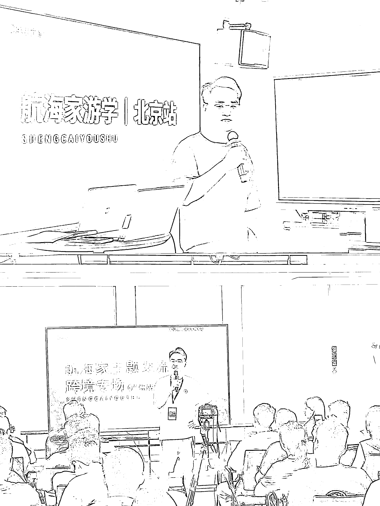
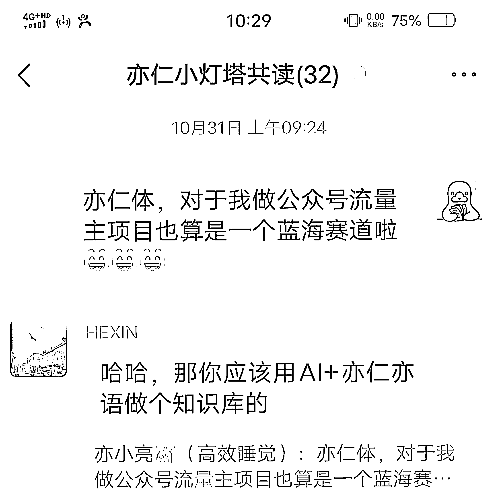
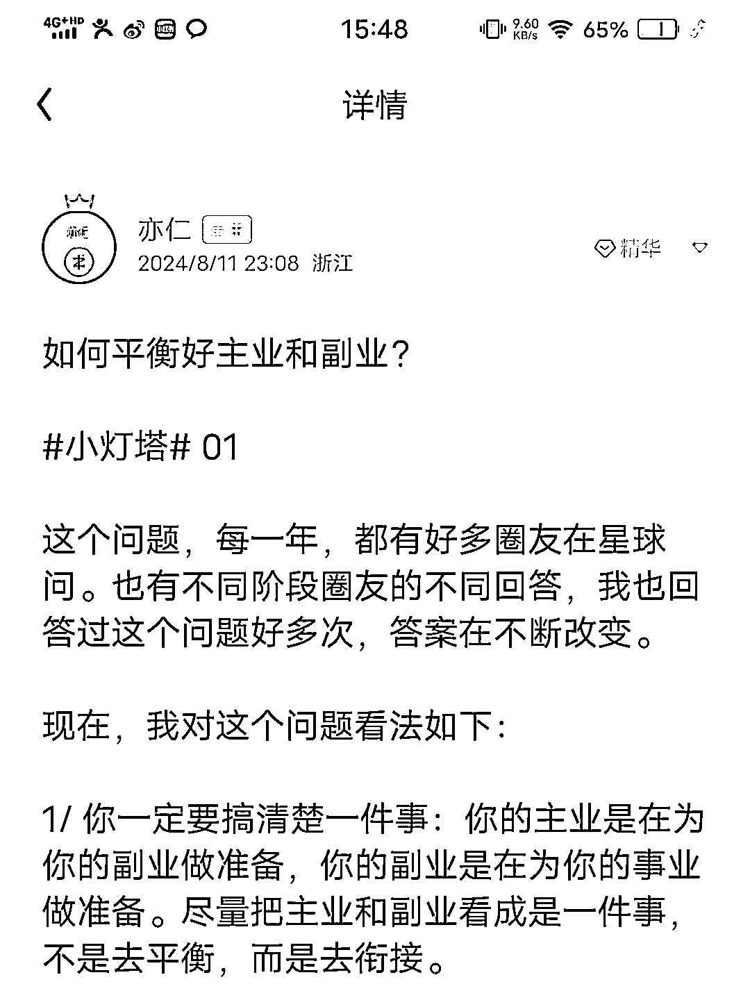
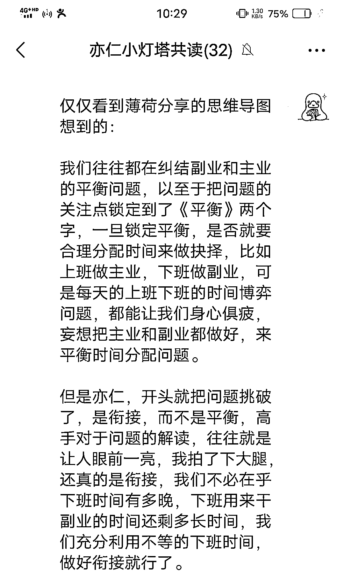

# 我发现了一个小众蓝海赛道-亦仁说

> 原文：[`www.yuque.com/for_lazy/zhoubao/fc0ky3nfpp7k4y2k`](https://www.yuque.com/for_lazy/zhoubao/fc0ky3nfpp7k4y2k)

## (65 赞)我发现了一个小众蓝海赛道-亦仁说

作者： 亦小亮

日期：2024-11-12

大家好，我是亦小亮，5 年老生财人了，算算也很久没发贴了。

我发现了一个小众蓝海赛道，就是亦仁说，今天分享出来，如果感兴趣，可以照着下面做做看。

我们用名人说，来解释这个领域，可能好理解，但是仅仅这个理解，这个账号很难走下去，因为你很难写出 100 篇关于亦仁说的文章，因为等亦仁没流量推荐的时候，你就很难坚持下去了，你也别问我为什么是 100 篇，不是 200 篇或者 50 篇。这个放到最后，我来讲。

你说不从名人名言领域写，该怎么写？

别急，我们一步一步来。

当我们拿到这个领域的时候，是不是疯狂找亦仁说过的话，翻他的公众号，出过的书，演讲的记录，就是想快速得到他的一串串金句，然后作为标题，最简单的方式丢给 kimi，很快一篇文章就出来了。

收益怎么样？我不知道，也许爆个几篇 10w+，就出池了，我们抛开收益不谈，（你疯了，我做公众号流量主，不就是为了这点收益嘛，你现在跟我说不谈这个事情，）这是一种成长极点的执行动作，当然也非常省时省力省事儿。

如果换我来做这个蓝海赛道。

我接下来会这样做?

停两分钟，我们先看看亦仁的帅照，如果你不是我说得上面那种方法，你会怎么样？

想好你的答案，接着看我的方案，是不是一样，不一样的话，请评论区或者私我，我也学习一下。

好了两分钟到了，我要公开我的做法了，一样的话，我们拍个手，说句英雄所见略同。

# **如何内容规划？**

我大概会先列出 100 篇的内容规划，怎么又是 100 篇，不是 50 篇或者 200 篇，别急，答案在最后呢。

如果是日更的话，也就是 100 天，我不能在短时间内搜集关于亦仁的一切，所以，我可能偷个懒，把亦仁亦语这个公众号，和他近期的系列文章作为前期突破口。

比如拿他的小灯塔作为为期一个月的内容规划，你肯定会问，你要洗稿吗？还是读后感?

前者不可能，我鄙视洗稿行为，后者有一点，但是我这个读后感的方式，成长极高。

我第一步，看完他的标题，我自己写一篇，写不出来，也要硬写，不一定是执行细节，可以是方案-
战略等内容，不必对自己下死手，必须 5000 字等等（有时候，不逼逼自己，谁知道自己的潜力呢，我这篇文章就是逼自己写出来的，因为确实很久没在生财发帖了，这个话题也是在@HEXIN 的亦仁小灯塔共读里突然想出来的），看你当时第一眼看到这个标题，想到什么写什么？别停下就行了，写完，也不必快速去看亦仁的文章，也可以缓几天，想到什么补充一下。

第二步，最后实在写不出来了，就去看看这篇文章，一边看一边思考，亦仁的思考点在哪里？这个思考关键价值是什么？我当时怎么没想到这个?我当时怎么去理解这个标题（问题）?我对这个问题的理解在哪个深度？偏差是什么？……

这篇文章，有引出什么新的问题？关于这个话题，我可以从文中挑一些关键词继续发散，找到微信指数高的关键词，继续怼文章，当然这是下一步的计划，等于这篇文章，很可能帮我引出后面要写的 10 篇文章，如果这样的话，光亦仁的小灯塔，我都可以写出 60 篇文章，当然也许这些文章的关键词也会重复，不过，不用担心。

把自己前面写过的文章内容对比亦仁的文章，列出不同。

第三步：对同个问题理解的差异化，分析缘由，当然并不一定对，但是得找，比如从拆解问题开始，拆解问题第一步，一定要弄清楚问题是要问什么？

**1 个小时 = 55 分钟 + 5 分钟。**

**爱因斯坦说：如果给我 1 个小时，解答一道决定我生死的问题，我会先花 55 分钟，来弄清楚这道题到底是在问什么。一旦清楚了它到底在问什么，剩下的 5
分钟足够回答这个问题。**

这个时候，我们自己也学会了一种拆解能力。

还有第四步：把自己写出来的一系列文章，标签化，打乱组合排序，继续发表。

这个时候，我来讲讲前面为什么是 100 篇，因为 50 篇太少了，一年一篇文章发 6 次，可能后期流量都没有多少了，200 篇太多，虽然一篇文章发表不到 1.5 次，原创占比很高，但是每个人很难坚持写到 200 篇文章，所以，我一般一个领域，实实在在写出 100 篇文章（3 个月的时间），就不新造轮子了，把这些文章，标题、文章开头、结尾，修修剪剪，就能再发一次。这样既节省时间，也能更快拿到第一股高推荐，我公众号爆款项目里的娱乐领域，就是找 100 个自己讨厌和喜欢的明星写完，就不新找了，完全够了，至少两三年的内容不用在写了。

说了这么多，怎么来实践，我们依然拿亦仁小灯塔的第一篇文章做为例子。这个对于现代人，尤其是副业刚需的社会下，需求点和关注点很高。

我第一次看到标题的时候，我的文章里几乎所有的篇幅都在讲平衡问题，而亦仁却给出衔接，而不在平衡这两个字，这就反应出了对问题的解读和理解。

然后这篇文章里提到的关键词有平衡、摸鱼、时间管理、线上助理、和老婆商量、熬夜、三年干 100 万，以及我们想到的反馈（正负反馈）、精力管理等等。

接着去拆解这个标题（问题），如果有别人与你与亦仁也不一样，也可以放进来，比如，衔接不上，为什么衔接不上，其实，这个时候，有是另一个问题的诞生，副业的选择，是否遵循主业相关性，或者为了走出舒适区，去做不同领域的副业，导致衔接不上，这是项目之间的衔接不上，还有时间的衔接，并不是每个人都是双休啊，996，通勤时间太长啦，还有一点是自身优势的衔接，就是从优势方面找副业等等。

这样一套分析下来，不说 100 篇，至少 20 篇，一篇文章发表 3 次，也就是说，我手里 20 篇文章，可以日更 2 个月。

# **如 何 变 现？**

讲完了内容规划，我来讲讲变现，这也许是每个人最关注的点。

第一个当然是流量主啦。

第二个就是可以文章带货，每篇文章放进去一本书或者其他什么，比如最近很火的梁宁的「真需求」，还可用金句做小绿书带货。

第三个，亦仁的小灯塔引流私域，建立共读陪跑群，或者虚拟资料售卖。

第四个，推荐别人进生财有术赚佣金，最好的方式，就是用亦仁说过的金句发到小绿书上，引流赚佣金，当然不限于微信平台。

第五个，万一被亦仁老板转发，或者得到，谢谢分享，已加精华，8 个喜庆的大字，又是一笔巨款收入。

第六个，这样运营半年，可能你的账号做成了 IP 号（这个也是公众号爆文最近的趋势），你的个人成长人设就起来了。

第七个，不想了，剩下的交给你们想啦。

你们看过往还有一些成功案例，生财女孩、生财王子、生财......，这一波波流量用的很溜，当然，光会接流量是没用的，还要真的在做实事，因为流量的波峰不常有的。

我们也要举一反三，不单单是亦仁，像** *成甲老师、刘润老师、刘思毅、V 先生、杨涛***
都可以。每选一个人，就是一个细分赛道，变现方式也不同。比如有些老师确实没有付费社群，没法带货。

* * *

评论区：

秋秋桂 : 好牛的想法

世宾 : 我在公众号里面就写过关于亦仁文章的读后感😁

亦小亮 : 写了几篇

sunyue : 疯狂思维扩散[偷笑]100 篇文章就这么水灵灵出来了。不只是学习思考，提升认知，顺便变现赚钱，谢谢教练分享，有启发～

岳嘉 : 一点愚见。我们经常看公众号，视频号，小红书，各种各样的，巴菲特说，查理芒格说，段永平说，等等。来吸引高质量的财经粉丝，其实是类似的，财经粉，创业粉，许多都是高质量的男粉呀

亦小亮 : 有相似的

苏玲 : 好文，我震惊了。这篇文章我要反复阅读，改改自己的小毛病。