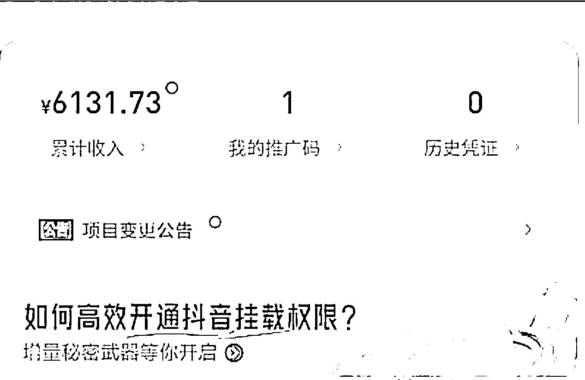
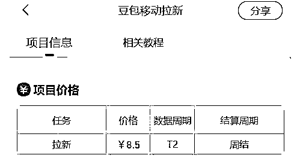
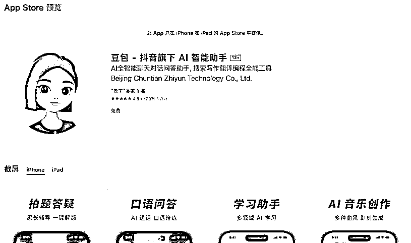
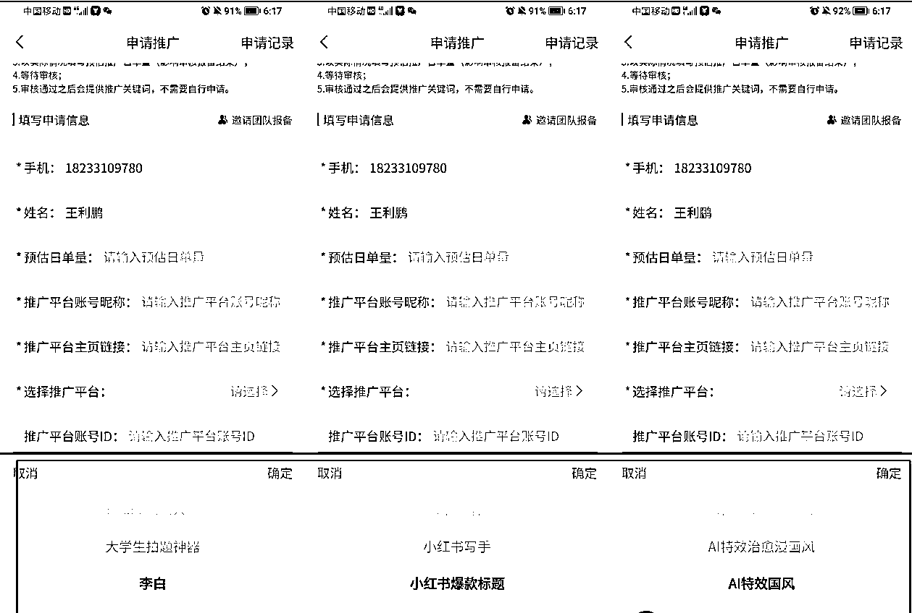
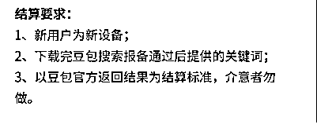
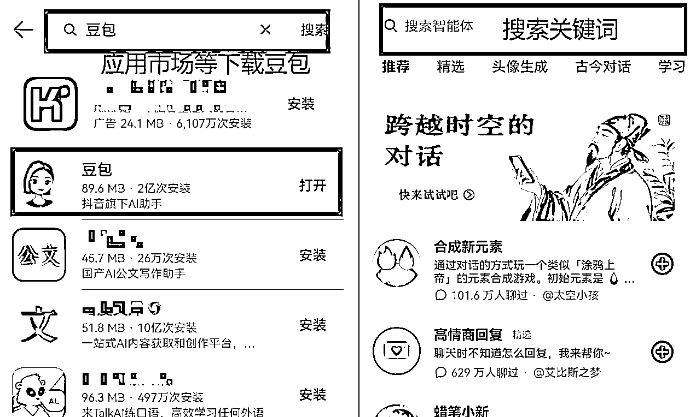
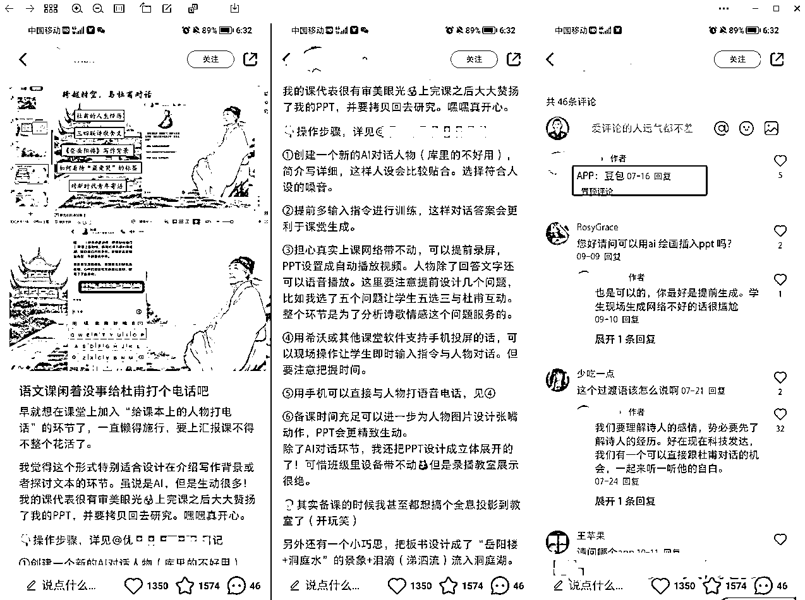

# 豆包 app 拉新，8.5 单，一条图文就赚了几千块！

> 原文：[`www.yuque.com/for_lazy/zhoubao/tuo77ef9u36eyb42`](https://www.yuque.com/for_lazy/zhoubao/tuo77ef9u36eyb42)

## (54 赞)豆包 app 拉新，8.5 单，一条图文就赚了几千块！

作者： 大鹏

日期：2024-11-14

大家好，我是大鹏。

昨天在获得了一个最新的搞钱信息差：

有圈友在小红书做**豆包 app 拉新** ，一条图文爆了直接变现几千块

豆包我知道，拉新我也知道

但是豆包 app 拉新又是个什么路子？

通过跟询问老铁我才知道，原来是 *豆包官方为了吸引更多用户进来推出的 app 拉新活动*

拉新单价还不低，8.5/单，比大部分 app 拉新单价都高！

app 拉新这种玩法大家应该也都比较熟悉了

就跟之前的夸克网盘、迅雷网盘拉新一个道理

只要新用户通过你分享的链接下载并注册**豆包 app** ，你就能获得拉新奖励

之所以今天要给大家分享这个，当然是跟之前的网盘拉新不太一样了

网盘拉新出来太久了，很多人都在做，而且新用户也被拉新的差不多了，拉新成功率不高

但是豆包 app 不一样啊，现在能用几个人手机上面有这个 app 啊

反正我是没下载过，相信大部分人也都没下载

所以基本上都是新用户，大部分都满足拉新的条件，市场非常大！

这是不是个机会，你自己品~

**✅****豆包 app 是什么？**

豆包应该都不陌生了，是字节跳动旗下的一款 AI 产品，跟 chatgpt 差不多的那种，功能非常多，使用场景很广泛

具体的可以自己下载一个试一试就知道了

**✅****如何操作？**

**1、申请授权**

扫码注册任推邦平台后，找到豆包移动拉新这个项目，在项目详情页进行报备

**2、填写推广内容**

填写推广内容这一块儿的时候要注意一下，系统自带了很多智能体给你用来推广

每个智能体对应着不同的功能，比如有的是用来生成国风图片的，有的是用来帮你写文案的，还有的可以帮你生成 AI 音乐等等

选择好推广内容，申请通过之后，官方就会给你一个特定的关键词

别人在豆包 app 内搜索你这个关键词就会进入到对应的智能体中去

**3、拉新步骤**

用户操作步骤非常简单，总体只需两步

在应用商城下载豆包 app,然后再 app 内搜索你的特定关键词，如果他是新用户，就算你的一个拉新，你就能获得 8.5 元/单的奖励

**4、推广渠道**

推广无非就是私域和公域和地推

**私域** 就是在朋友圈、公众号发文案进行推广

**公域** 推广起来其实也比较简单，可以做图文，也可以做视频，把智能体功能演示清楚，讲清楚使用场景

在评论区引导，把 app 名字和关键词放上去即可被动拉新

目前这个玩法刚出来，知道的人还不多，里面还是有很多信息差的

估计我这篇文章发完之后不久，就会有很多老铁动起来了。

有想法的可以抓紧行动起来了，年前搞波大的！

但是，如果没有执行力看看就行了

毕竟没人会给你白白送钱~

* * *

评论区：

lost9 : 评论区只放名字，平台怎么知道用户是通过你下载的啊[囧]

大鹏 : 关键词啊，每个人都有特定的关键词跟你绑定的

Echo : 不懂就问 搜索关键词是在豆包 app 里吗？

大河 : 您放的这个案例好像没有放关键词

大鹏 : 对

Leona 木子 : 一定要下载任推帮是吧？

大鹏 : 目前好像就这个平台有

Echo : 那会不会下载了不搜哈