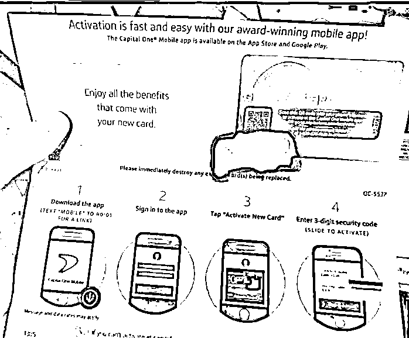
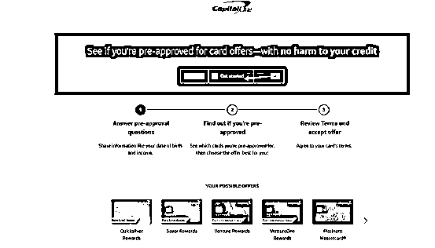
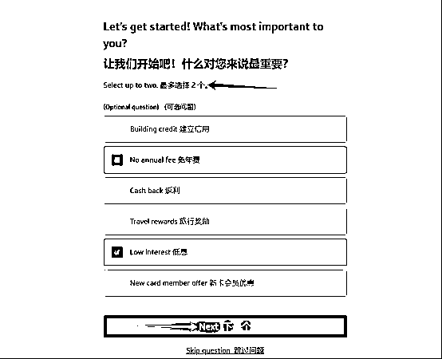
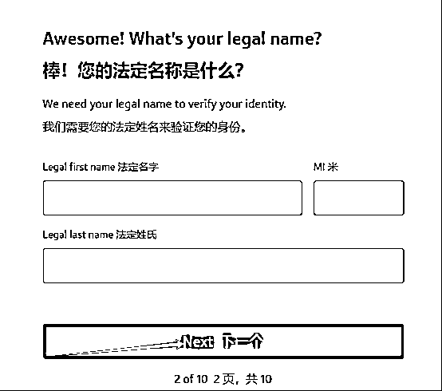
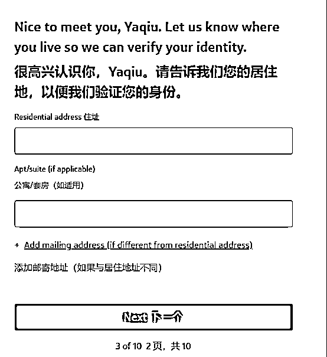
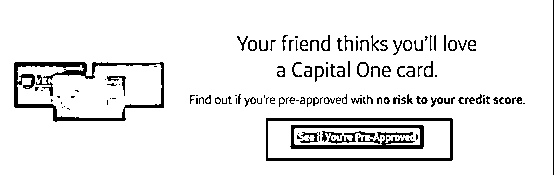
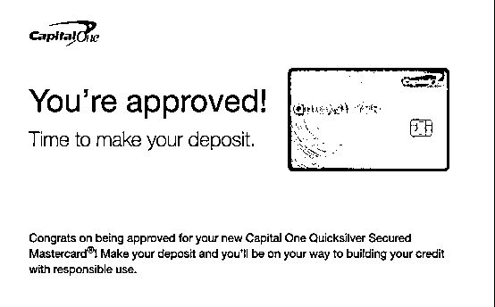
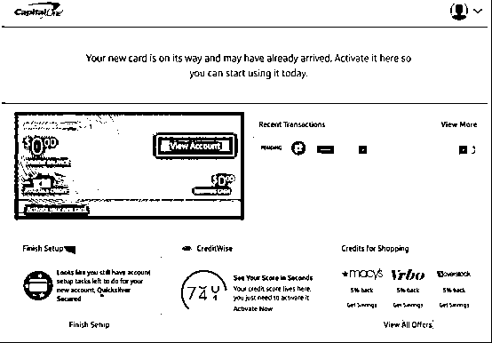
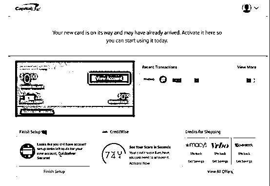
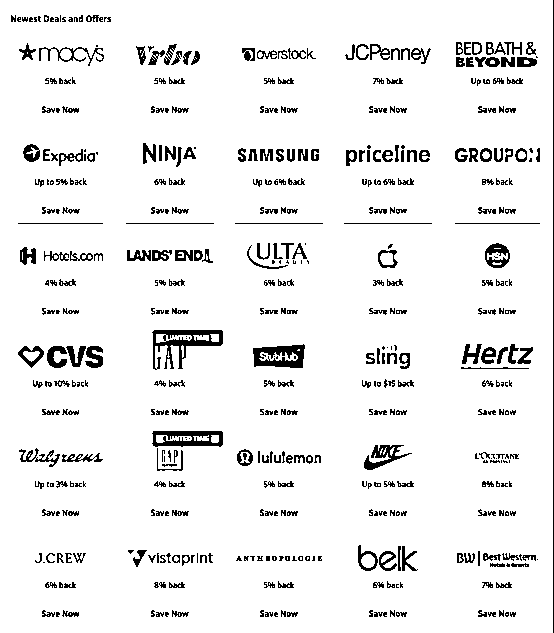

# 超级简单！非美国人也能办的美国信用卡 Capital One Quicksilver 申请指南

> 原文：[`www.yuque.com/for_lazy/zhoubao/ht19lzihsuvp3g5e`](https://www.yuque.com/for_lazy/zhoubao/ht19lzihsuvp3g5e)

## (21 赞)超级简单！非美国人也能办的美国信用卡 Capital One Quicksilver 申请指南

作者： 国民弟弟的跨境十年

日期：2024-11-11

做跨境电商的小伙伴们知道，很多美国电商平台和服务只接受美国信用卡。有一张美国信用卡能让你支付更方便，避免因为支付方式不被接受而错失交易机会。所以，拥有一张美国信用卡带来的优势可不少。

今天来给大家分享一下，想在美国轻松刷卡，又不想被各种复杂规则晕搞？

第一资本 Capital One Quicksilver 就是你的不二之选！这张卡简单易操作，返现多多。

这篇文章手把手教你，即使你不是美国人，也能轻松申请到这张卡。

# 为什么选 Quicksilver？

Capital One Quicksilver 卡是一款热门的现金返还信用卡，这是一张非常适合非美国人申请的信用卡。很多人都推荐它！我自己也申请了。

**以下是它的特点：**

1-无限 1.5%现金返还：所有消费都能获得 1.5%的返现，消费类型没有限制，非常适合日常购物、用餐和娱乐。

2-一次性奖励：新用户在开卡后的 3 个月内，如果消费达到<card type="inline" name="math" value="data:%7B%22code%22%3A%22500%EF%BC%8C%E5%8F%AF%E4%BB%A5%E8%8E%B7%E5%BE%97%E4%B8%80%E6%AC%A1%E6%80%A7%22%2C%22id%22%3A%22xXf8L%22%7D">200 的现金奖励。</card>

3-无年费：这张卡没有年费，持卡人不必担心额外费用。

4-国际消费无外汇转换费：在海外消费时无需支付额外的外汇转换费，非常适合经常旅行的人。

5-0%购入和余额转账促销期：通常在开卡后的 15 个月内提供 0%的购入年利率和余额转账利率，之后会恢复到 19.99%-29.99%。

6-灵活的返现使用：返现没有最低兑换要求，可以随时用来抵消账单或直接存入账户。

7-旅行和购物福利：包括旅行意外保险、购物保护等，虽然不是主要卖点，但增加了保障。

重点是简单申请、简单操作；5 步搞定，轻松拿卡！

### 申请准备材料

1. 美国地址：需要一个有效的个人地址。

2. ITIN：个人纳税识别号。

3. 谷歌邮箱：注册时需要用到。

4. 美国手机卡：需要能打电话和接电话，激活卡时需要。我使用的是 ultra mobile，可以在某宝购买。

5. 美国 IP 环境：确保网络环境符合要求。

### **Quicksilver 卡官网注册教程**

**步骤 1：** 访问官网 打开 Capital One 的官方网站，找到 Quicksilver 信用卡的申请页面。

**步骤 2：** 选择相关信息正式进入下一步

**步骤 3：** 填写申请表

在申请表中，输入你的个人信息~

· ①填写姓名（英文名）

②填写美国地址

接下来还需要填写 ITIN、邮箱、手机号码后，就会告诉你等消息。

**步骤 4：** 等待收卡

等待邮件通知。

**步骤 5：** 激活信用卡 如果申请成功，收到信用卡后，按照卡片上的说明，需要自己手动拨打电话激活。

激活后需要做什么

①信用 Wise 使用说明

这是一款可以快速查看你信用分的工具，但注意：因为信用分是通过信用局查的，只有用 SSN 才能使用，所以用 ITIN 的朋友无法用这款工具查看信用分。

②如何积累信用分？
我咨询了一些美国的代理、朋友和银行工作人员，他们告诉我：如果你的信用额度是 3000 美元，建议使用不超过 30%。这样可以更快积累信用分。银行不喜欢看到你过度依赖信用卡支付，因为这可能意味着你有破产风险。

③Capital One 向哪些机构报告信用？ Capital One 会向美国三大信用机构报告你的信用情况：Equifax , Transunion
,experian

温馨提醒下大家使用几个月后，建议再申请一张他们的信用卡，也是无年费的，能帮助你进一步建立信用。

**主要的重点是 OA 的返利：**

基本都是 5%-6%的返利，又是 OA 的利润。如果你 3500 充满了话：5%的返利是 175 刀，再叠加使用返利网站。

基本上可以让自己的利润点提高 10%不是问题。

我也试过申请其他信用卡，但因为没有信用记录，成功的几率很小。所以不建议大家浪费时间去申请其他卡。

以上！

**国民弟弟相关创业的故事文章推荐：**

[`articles.zsxq.com/id_8n2o7gax71fr.html`](https://articles.zsxq.com/id_8n2o7gax71fr.html)

* * *

评论区：

静水流深 : itin 有成本的为什么不说？

shirley : 确实，itin 已经难住一波了[撇嘴]