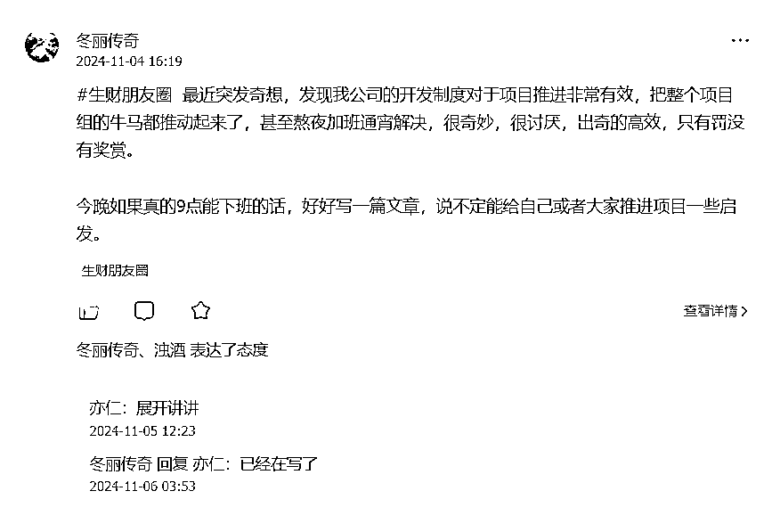

# 开发工作给我做项目的一些启发

> 原文：[`www.yuque.com/for_lazy/zhoubao/iro52z8p6n9pziay`](https://www.yuque.com/for_lazy/zhoubao/iro52z8p6n9pziay)

## (24 赞)开发工作给我做项目的一些启发

作者： 林家少爷

日期：2024-11-06

前几天在生财朋友圈说到，要跟大家分享一下，对于推进项目，我公司的制度有什么值得参考的地方，

原本心里是想着有时间再写，很有可能因为没时间这个借口鸽了大家，但是看到亦仁在下面回复了，要我展开讲讲，

大佬都发话了，继续拖延那还得了，于是我今晚开始奋笔疾书，分享一下对于我的一些思考和总结。

挺久没有写过“深度”长文了，当然跟工作过于饱和有一定关系，跟我个人拖延也有一点关系，大家勿怪。

先讲一下目前项目的开发流程，首先用户或者内部客户提出需求，项目经理收集需求之后，需要开会议对需求进行研讨，分清楚哪些是真实需求，哪些只是个别用户的伪需求，待确定了开发需求之后，项目经理会将需求编写成 wiki 文档，写完详细的开发文档后，就转到 BD（可以理解是产品经理）绘制原型图，正常出了原型图之后会转到 UI 根据原型图的草图进行美化设计，我项目组并没有 UI，毕竟开发的是低代码平台，对于 UI 设计要求并不高，所以跳过了这一步，直接就是到开发手里了，我的工作就是将原型图的功能和交互用代码实现，同时跟后端大佬对接接口完成整个页面的前后端交互，待开发完任务，自测功能通过之后，就需要发转测邮件通知测试进行测试。

如果测试过程有 bug 的话就需要日清日结（苦其久矣），bug 都解决之后就转到待发布，如此就完成了整个需求的完整开发周期。

以上就是我目前项目组工作的大致流程，表面上看，条理清晰，实际工作是交叉错位进行的。

有可能接到紧急需求后，不经过 BD 直接让开发对需求直接编码，也有可能有历史 bug 被上级要求要紧急修复，紧急上线，打乱了开发进度，

当然吃开发这碗饭，这些工作无论如何都得啃下，出来工作 6 年，也熟悉了这种紧凑而时常让人崩溃的开发节奏。

回到正题，那么这一份工作给我做项目带来哪些启发呢，有以下几点：

第一，对于需求进行拆分，并且准确预估时间。

因为每次有新项目周期下发，都会有最终截止时间，比如 11 月初出新的需求，11 月 25 号是最后开发周期，在这个时间点之前必须开发转测试，所以自己需要根据每个需求的轻重缓急进行排序，对每个需求进行详细的拆分，开发术语叫拆 task，比如需求 1 需要完成任务点 1，需要 4 小时，每天下班后填上自己开发了几个小时，整个过程都有记录，很好的回溯，月底也可以根据自己的开发节奏进行工作进度调整。

这一点很像 21 天航海，每天都安排好需要做的任务，今天遇到了什么问题，怎么解决问题，只是航海项目很多都需要依靠个人自律去完成，所以完成度差异很大，最终收益也可能差距很大，这就引出第二点。

只是航海只是建议，但是工作必须要完成，遇到问题必须要解决，坦白讲，我做生财项目目前还达不到这个高标准。

第二点，对于需求跟踪良好的推进机制，甚至可以说很恐怖进奏而有效的督促。

为什么恐怖，因为一个需求点如果过了延期之后，不太重要或者自测的需求还好说，如果是比较重要的需求，哪怕延期一天都有可能要经历以下几件事情：

首先就是会在延期后经受来自关联业务团队开发的催促，因为可能本人的需求跟他们关联，如果我不转测不上线，他们也会延期，所以会一天一催或者一天多催。

都是开发人员，大家都是打工的，大家都还好说话，也不会逼得太紧，

然后项目领导看到需求延期之后，为了自己指标好看，也会不定时的问我为什么延期了，预计什么时候转测，语气非常的严厉，这时候就有点压力了，又得停下来想想怎么组织语言回答他比较好，又要预算多少时间，这个时间又不能太仓促，免得自己给自己挖坑。

好不容易应付好领导之后，又被通知今晚留下来，晚上 8 点要所有延期的人员留下来开会，语气严肃且直逼人心地“提醒”大家尽快转测，还要每个人轮流阐述为什么延期，多久能搞好。

好一个批斗大会。

当然心态好的话上面的都能扛过去，可是接下来几天要面对 BD，测试，领导，开发同事们轮番的催促，很容易打断开发的进度，而且有些领导问话我还必须停下来答复，又不能停下来太久，得不断让自己进入开发状态，把任务尽快完成。

不然这种闹心的催促根本不会停止，还会有领导的 PUA，而且其他并行的开发任务也可能因为追上一个需求的任务而延期，恶性循环。

为什么之后开发延期之后大家都会熬夜加班都要把任务完成，就是担心延期后，又被大家轮着催促，非常难受，压力也很大。

所以为什么程序员头秃，都是被逼出来的，爆表的压力生生逼出来的。

当然可能有人说自己稳下心来干活就好了，不用管那么多，大不了跑路。

可是换了一家公司都差不多，情况一样，天下乌鸦一般黑，

我还好，更多同事都是有房贷车贷在身，甚至杠杆买房，压力山大，更加不敢放下这份工作了。

何况对于自己要求要高一点，那么随意的话，什么事清都是做不好的，何况只是一份普通的工作。

所以如果自己去做闲鱼，小红书项目，或者其他信息差的项目，采用极致的他律替代自律来约束自己，效果可能会更理想，

如果自己到了约定的时间达不到目标，比如收益达不到，或者私域用户数达不到，就要给自己一点让自己心痛的惩罚机制，对自己狠一点，如果做到这一点，还会有什么项目啃不下，还会有什么目标实现不了。

当然这个目标是自己能力所能达到的，可以实现的目标才有意义，不然就是恶性循环，只会不断让自己不断地陷入自我怀疑。

为什么整个开发团队都如此高效地推进项目，这就提到第三点了。

第三，明确且变态的指标，和淘汰机制。

为什么说明确且变态，因为每个月的开发或者测试指标都是不一样的，表面上每个月指标变得越来越严，实质上都是此起彼伏，变着花样让牛马们卷起来。

比如开发一个月必须要增加 2000 行代码，减少 1000 行代码，bug 必须日清日结，当天修复，最多不能超过 3 天，bug 率不能超过多少，测试必须每个与要检测出 30 个 bug，半年硬性指标 180 个，如果达不到，领导就要拉小黑屋“喝茶”，甚至可能要被干掉。

上面的指标本质上是冲突的，开发为了少出 bug 一定会谨慎有加，而测试为了完成指标一定会“睚眦必较”，所以经常看到开发和测试因为这个事情吵架，而领导也为了达成自己的指标，拉群反复督促大家一定要完成指标，动不动就说“完成不了就滚”。

其实大家都有压力，领导也坦白讲自己也是打工的，指标不好看也可能被干掉，大家都有危机感。

所以为了自己能留下来，都会拼命的卷自己，卷团队，遇到问题会争分夺秒地找同事解决问题，这股劲就跟创业为了解决卡点不断走访高手，用钱开路，不断想办法解决问题，不达目的誓不罢休一样，

所以在这家公司每分每秒都有一种创业的感觉，何况这是一家十几万人的大公司。

因此，做一个项目，要想达到一定的收益，是不是可以也给自己定一个指标，比如每天要输出 1000 字，每天发 10 条小红书笔记，每天拍一个视频，玩不成就惩罚一下自己，完成了就奖励一下自己，这个需要一定的自律，也需要一定的偏执精神，

其实项目如果有利益驱使不难做到，除非真赚不到钱了。

以上三点就是工作制度带给我的启发，当然大家可以当做课外知识拓展，图个乐呵。

这份工作让我经常性的陷入对于工作和生活的思考，下面说一下自己的思考。

首先，虽然这家公司传递了创业一般的工作热情和氛围，但是激励机制真的很一般，甚至说没有。

比如，提前完成，没有任何激励，反而因为你闲下来了给你安排更多新任务，真把人的剩余价值压榨到尽。

第二点，收入没有想象空间。

公司早期是有股权激励的，但是后来的人就没有这种权益了，只有死工资，还有若有如无的一两个月年终奖，今年看来就是在画饼，毕竟年终奖并没有写入劳动合同，根据前几年的观察大概率是没有的。

所以一年收入多少，用烂笔头都能算出来，想象空间有限，发展空间也有限。

这几年互联网行业已经在走下坡路了，极少或者已经没有可以快速增长的业务，也就失去了能够带来强劲资金激励的项目，只有死工资，为了这点工资，要把一天大部分的时间都搭进去，为了完成公司的任务，达成公司的指标，为了不被干掉，只能不断投入更多的下班时间，压缩个人生活时间，直接导致个人发展自身业务时间被不断压缩，没有了自己的业务也就完全断绝了自己的后路，进而更依赖这份工作收入，怎么想都感觉这是个死局无法破。

其实到了 35 岁并不是找不到工作，还是可以找到的，一两万工资的工作能找到，只是很难找到很好的工作，工作肯定是过了巅峰期的了，收入也过了巅峰期。

市面上所谓年薪百万的工作，实际到手可能不到 50 万，跟到手 100 万还是有很大差别的。

何况我还没真正接触过年薪百万的人，可能能在职场达到年薪百万的人也是极少了。

我对于财富是有一定追求的，怎么可以眼睁睁看着工作一天天地变卷，但是收入却可能越来越少，

这个死局我必须要破才行。

当然还有第三点，也是最关键的一点：

无效内卷。

因为公司同事间的主动被动内卷，并没有让项目产生更多的收益，相反，项目越推进下去，项目人员越来越少，可能是自离可能是被干掉也可能被抽调，剩下的人只能被分配更多的工作，开发时间也是不会因为人员减少而延长的，这就是为什么大家都互称牛马自嘲的原因。

当然本质原因还是互联网已经在走下坡路，高校疯狂扩招的计算机大学生，导致市面上流动着许多廉价的初中级计算机开发人员，而公司里面每个人的工作都是可以在市面上快速找到合适的螺丝钉替换的，所以才敢肆无忌惮地压缩员工，而牛马们敢怒不敢言。

其实我在想着目前我在生财已经做了几个项目，赚了好几次钱，有了一定的项目经验，大致知道怎么才能赚到钱，哪些点可以复制矩阵化扩大收益，哪些点可以优化，只是自己一直以工作忙作为借口没有及时的放大收益，

而且整天的时间只有工作，工作，并没有去过外地，其实自己也有点井底之蛙的感觉，

小时候被家里的大山挡住了自己的出路，现在好不容易出来了，又被繁重的工作挡住了继续出走看世界的出路，可能我目前对于社会，对于生活，对于商业的理解都是狭隘的，

是不是可以出来一段时间专注做好项目，比如最近亦仁提出来的 YouTube 出海项目，还有我一直在做的 ai 代写项目，小红书项目，还有我一直想压倒性投入的 web3 项目，还有一些我发现的套利项目，我敢说全力投入这些项目，超过目前工资甚至年入百万，我都是有信心的，只是缺一点决心而已。

目前手上有一点积蓄，没有家庭，没有负债，虽然第一次创业失败告终，不得已回归职场，至今已经 2 年半了，可是志气未减，在工作的每时每刻都不忘记要重出江湖，可是职场带给我的依赖感和疲惫感，不断地冲刷着我的热情，让我内心百感交集。

现在的我终于理解为什么创业大佬说，你既然出来了就不要再想着回去打工！

但是我又坚信我以后一定会发达的，上班只是暂时过渡，最终财富的积累还是依靠自己独立做项目，

我不能一味地被眼前的大山挡住前行的路，我要快点开辟一条出路，杀也要杀出去！

以上就是我这两年的一些个人总结，后面我还会对之前的创业，做项目经历做一次全面的复盘，以及我总结的一些项目方法论，欢迎大家点评指正。

* * *

评论区：

比沃特 : 个人理解：开发项目延期在哪个公司都是比较大的问题。被谈话、被惩罚都是能预想到的。严重的甚至失去信任，直接被离职

林家少爷 : 谁也不想延期，是我想的吗

林家少爷 : 延期其实没多大事，有时候需求上线后压根就没用过，只是人为制造了恐慌，真正做项目也可以借鉴，如何让自己尽力在规定时间内做好，人为制造恐慌，那么项目自然就能做好了。
心想打个工赚钱都那么难都挺过来了，自己做项目做起来那肯定也可以

比沃特 : 我这段话表达的意思：有说你想延期了？有说延期是你的责任了？已读乱回呢？