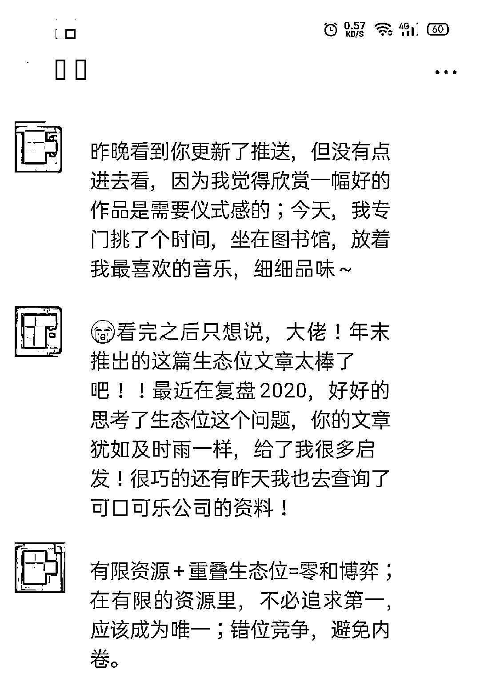
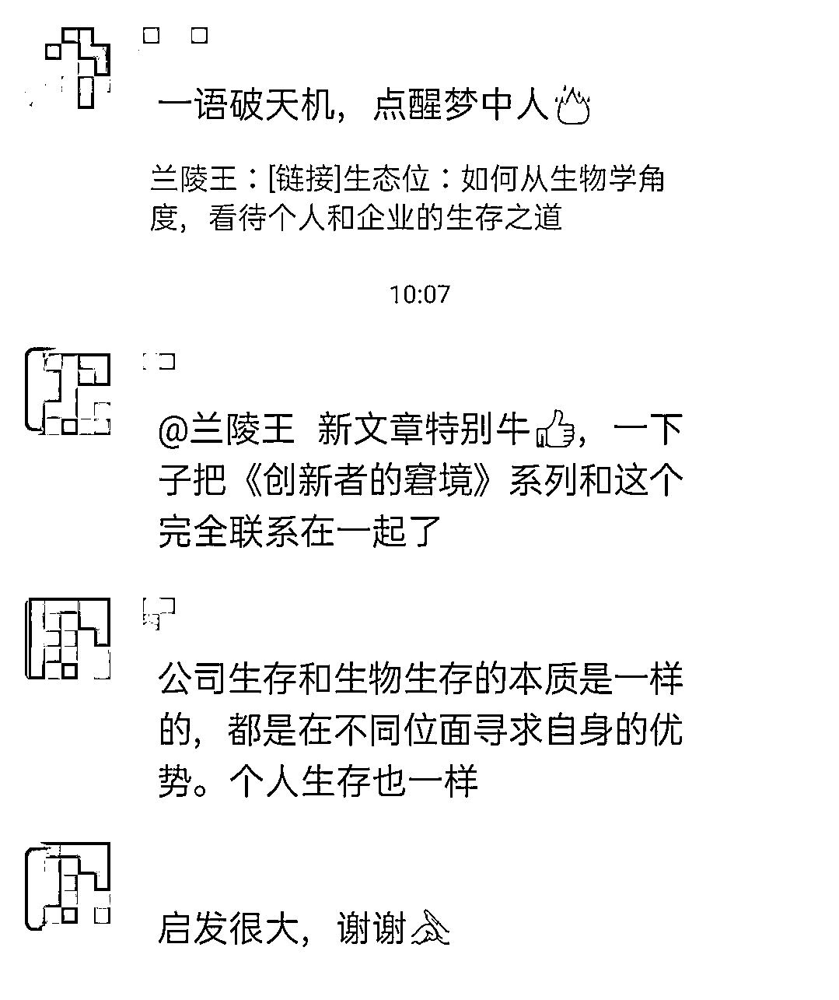
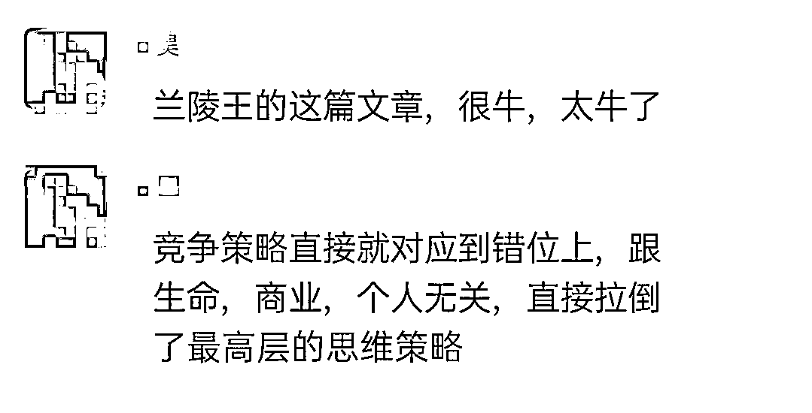
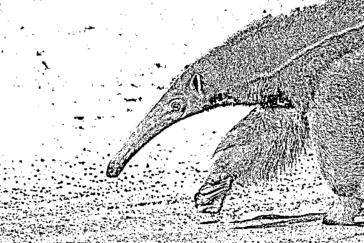
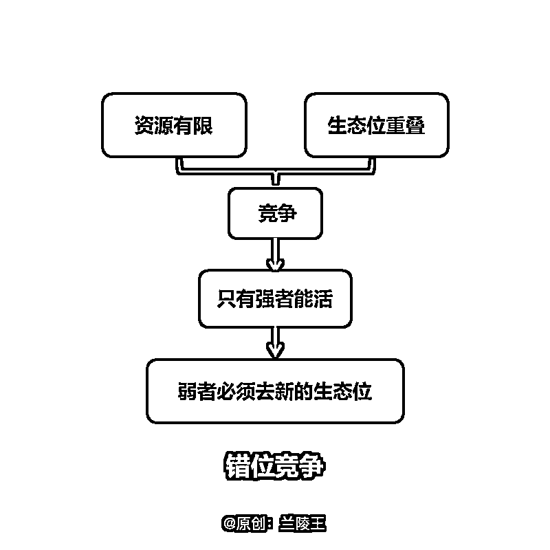
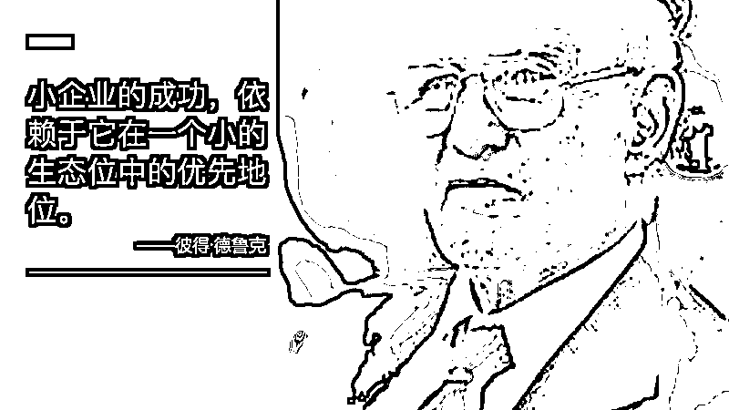
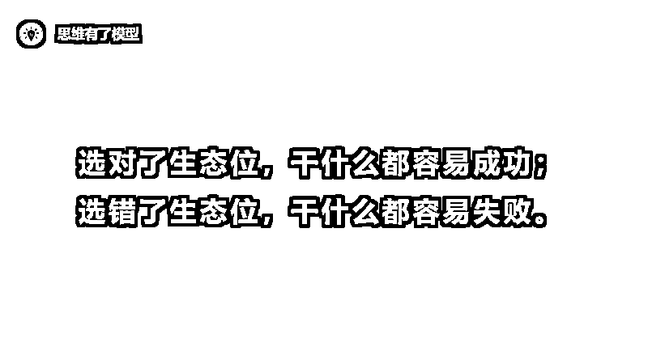
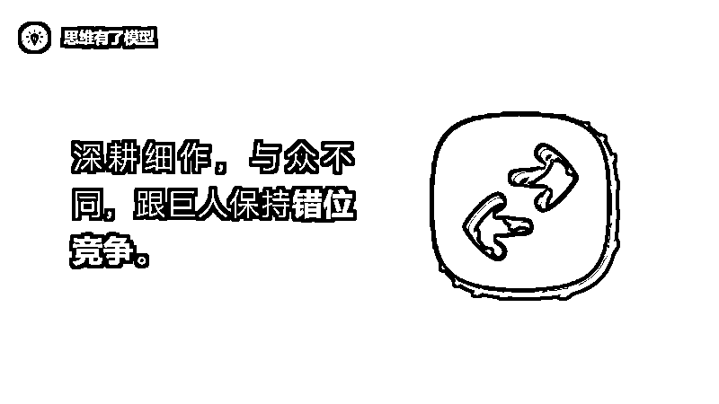
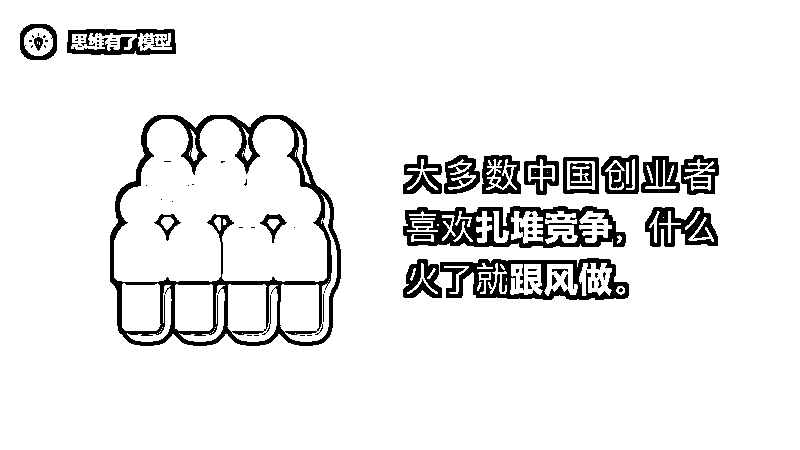
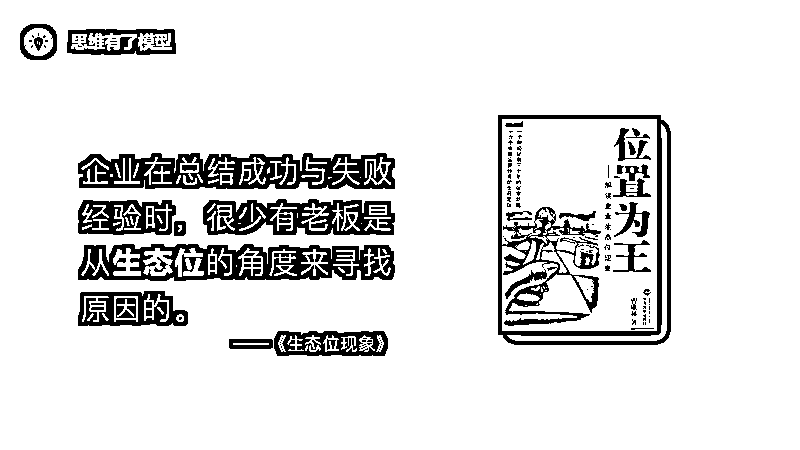

# 生态位思维：每个「创业者」必须要掌握的思维模型

> 原文：[`www.yuque.com/for_lazy/zhoubao/uemhk1m3t6kxogxi`](https://www.yuque.com/for_lazy/zhoubao/uemhk1m3t6kxogxi)

## (23 赞)生态位思维：每个「创业者」必须要掌握的思维模型

作者： 兰陵王

日期：2024-11-06

**  **

**生态位对了，做什么都容易成功；**

**生态位错了，做什么都容易失败。**

在我所有的思维模型里面有几个思维模型极其的重要，它们揭示了生命的本质，生存的规律，比如熵增定律，还有一个就是今天的**“生态位”** 。

生态位是生物学里面一个极其重要的思维，它对我们人生的意义极大，其重要性甚至不输“熵增定律”。这一点，我跟我另一个朋友有同样的共识。

为什么它这么重要呢？

因为人也是生物，但凡生物就必然遵循一些基本的生存法则，比如错位竞争。而生态位就是一门研究生存与竞争的学问。

所以，不论是动物也好，人也好，还是企业也好，都有自己的生态位，找到自己的生态位，才能在这个世界更好的生存下来。

PS：下面是昨天文章发出去之后，少部分读懂了的读者的一些感悟，希望对你有所启发。

▲与其第一，不如唯一

▲公司生存与生物生存本质一样

▲站在更高的维度思考商业与个人的竞争策略

# **

**

## **什么是生态位？**

## **它为什么重要？**

很多人花了大几千，甚至大几万的钱，去学习职业规划、学习品牌定位、学习企业战略，最后好像什么也没学到，该迷茫还是迷茫。

因为市面上很多课程教的都是术层面的东西，没有深及本质。用老子的一句话来说就是「有道无术，术尚可求；有术无道，止于术」。

那么职业规划的道是什么？定位的道是什么？企业战略的道是什么？就是生物学所说的**生态位** 。

什么是生态位？

生态位是一个生物学思维，最初是由 J.Grinnel 提出，用于研究物种之间的竞争关系。后来逐渐被发展完善，并开始延伸到商业领域。

意思是「**在生物群落或生态系统中，每一个物种都拥有自己的角色和地位，即占据一定的空间，发挥一定的功能** 」。

怎么理解这句话？其实这句话本身没有什么玄机，它只是第一原理 ，从它引申出来的东西，才是我们要去努力理解的东西。

每个物种都有自己的角色和地位，这很好理解，对吧？有的鸟吃昆虫，有的鸟吃鱼，有的鸟抓小鸡。

现在的问题是，为什么这个世界上会进化出如此纷繁复杂的生态系统？

我百度了一下，全世界大约有 26000 种鱼，也就是说就鱼而言，就有 26000 种生态位。最让我感到奇葩的是，这个世界居然有种叫做食蚁兽的动物，就是这货，长得贼大，舌头贼长，看起来贼吓人，结果只吃蚂蚁。。。

为什么会进化出这样的奇葩物种呢？

**  **

**因为这个世界上的资源是有限的。**

**因为这个世界上的资源是有限的。**

**因为这个世界上的资源是有限的。**

如果我们所有物种都是一样的生态位，我们吃一样的食物，住在同一个空间，能不能和睦共处呢？

能！前提是资源是无限的，食物无限，空间无限，这样物种间就没有竞争，如果是这样，我们就能和睦共处。这种没有竞争、没有天敌的生态位，就叫做**原始生态位** 。

什么情况下有原始生态位呢？

就是我们常常说的**蓝海市场** 。虽然说资源不是无限的，但是基本上是完全够用的，所以大家可以相安无事。

就像我们的祖先“鱼”，一开始这个世界上只有鱼，大家都生活在远古海洋里，由于资源丰富，所以物种间的竞争不激烈，大家都可以生活在同一片远古海洋里，享受着同样的资源。

但是这种状态不会一直维持下去，因为一旦资源充足，生物就会疯狂繁衍，所以每个物种所分得的资源将会越来越少，直至达到一个阈值——部分生物靠现有资源已经很难生存。

这个时候，弱者就必须另谋出路——**去寻找新的生态位** 。

于是我们的祖先开始从海洋来到了陆地，对于我们的祖先来说，陆地又是一个原始生态位，资源够用，没有竞争，没有天敌。

但是这种状态也不会维持太久，因为一旦资源无限，生物就会疯狂繁衍，所以每个物种所分得的资源将会越来越少，直至达到一个阈值——部分生物靠现有的资源已经很难生存。

**  **

**所以弱者又开始寻找新的生态位。**

有的吃草，有的吃肉，有的会飞，有的行走……最后每个生物都找到了一个适合自己的生态位，大家互相制约，形成了一种稳定的平衡态。

**  **

## **一、原始生态位**

在事物一开始的时候，由于资源丰富，市场容量很大，所以竞争不激烈，大家都可以活得很好。这就是我们常说**蓝海市场** ，第一批进入蓝海市场的人也被我们叫做第一批吃螃蟹的人。

**  **

## **二、现实生态位**

但是蓝海不是永恒的，因为地球上的资源不是无限的，竞争者很快就会涌入进来。于是每个人能分得的资源开始越来越少，竞争开始变得越来越激烈，直至达到一个阈值——弱者无法靠现有的资源生存下去。

最后就会出现三种情况：

①第一批吃螃蟹的人胜出：第一批吃螃蟹的创业者，一定要在巨头进来之前，迅速做大，形成规模效应，这样当你跟巨头的生态位发生重叠的时候，就是他死你活。

这也是为什么创业者需要拉投资、需要烧钱的原因，就是为了在巨头进来之前，运用先发优势，迅速做大，然后成为绝对的强者。

②第一批吃螃蟹的人死亡：如果第一批吃螃蟹的创业者一直磨磨蹭蹭，没有利用好先发优势，导致巨头进来的时候没有人家强，最后只能是他活你死。

想一想某讯、某巴巴，它们利用雄厚的资本，以及超强的组织能力和技术优势，杀“死”了多少创业者。

残酷吗？残酷，这就是商业世界，跟动物世界一样，弱肉强食，适者生存。

③蓝海变红海，弱者需要寻找新的原始生态位：最终不论是第一批吃螃蟹的人胜出，还是巨头胜出，这片蓝海都将变成红海。如果你

觉得你干不过人家，最好的办法就是去寻找新的原始生态位，在那里成为第一。

不要在有巨头存在的生态位里拼第一，要去新的生态位成为唯一。这方面张一鸣和王兴做得很棒，社交有腾讯，电商有阿里，没关系，我们还有新的生态位，比如外卖、短视频。

正如管理大师德鲁克所说的**「小企业的成功，依赖于它在一个小的生态位中的优先地位」** 。

**  **

**三、生态位重叠**

造成上面这种激烈竞争现象的原因是：**资源有限** +**生态位重叠** 。

资源有限并不能导致竞争，但是在资源有限的前提下，如果有两个物种的生态位发生了重叠，那么必然就会出现一个结局**——只有一个物种能活下来——更强的那个物种。**

**  **

那么弱者怎么办呢？

如果你想活下来，只有一条路可选——**放弃现有的生态位，去寻找新的原始生态位。**

**  **

这就是为什么我们的祖先不得不冒着九死一生的危险，从海洋来到陆地的原因。去新的生态位还有一线生机，留在现有的生态位就只有死路一条。

当资源有限时，没有两个物种能在相同的生态位共存。——生态学家 高斯

**  **

**四、错位竞争**

**  **

**这种通过寻找新的生态位，来避生态位重叠，从而避免激烈竞争的生存策略，就叫做错位竞争。**

**  **

今天我们所看到的所有的生物，奇葩如食蚁兽、蜂鸟，都是错位竞争的结果。

想一想，淘宝都那么强大了，为什么京东还能做起来？淘宝和京东那么强大了，为什么拼多多还能做起来？淘宝、京东、拼多多那么强大了，为什么蘑菇街、一号店、唯品会、当当网还没死？

因为虽然电商这个市场是有限的，但是淘宝、京东、拼多多、当当网，它们的生态位并没有完全重叠，淘宝主打全品类，京东主打高品质，拼多多主打低端和团购，它们的生态位大部分是错位的，这就避免了“你死我活”的结局。

正如《生态位现象》一书中所说的那样：

在动物界，凶猛动物之间为了避免因争夺食物而造成不必要的伤亡，它们寻找食物的时间必须是错开的；市场竞争也是如此，如果两个企业同时去争夺同一个生态位，必定会造成“两败俱伤”。——《生态位现象》

也就是说，无论是动物还是企业，弱者要想生存就必须遵循一条原则：**尽量在不重叠的生态位或者少重叠的生态位中谋求发展。**

**  **

其实企业界跟生物界是一样的，每个企业都有自己的生态位。许多规模和实力都很弱小的中小型企业，也可以与那些庞然大物的巨型企业，在一个市场中共同生存和发展，其根本原因就在于它们拥有不同的生态位。

这就是这个世界的生存之道。

弱者要想在这个世界中生存下来，就必须把自己的生态位跟强者的生态位错开，只有当你们的生态位**不发生重叠** 或者**很少重叠** 的时候，你们之间才不会产生激烈的竞争，如此，你才能在这个艰难的世界中活下来。

## **如何寻找生态位**

前两天朋友打电话过来，说自己虽然已经是名牌大学的研究生，但是依然觉得自己很菜、很迷茫，问我怎么办。

我给她的第一个建议是：**先找到自己的生态位** 。

高考以后，你职业生涯的第一件事，你人生中最重要的事，就是找到自己的生态位。只有找到了自己的生态位，你的努力、你的才华，才能被最大限度的发挥。

正如《生态位现象》一书中所说的：

对于一个企业家来说，选对了“生态位”，干什么都容易成功，选错了“生态位”，干什么都容易失败。

纵观成千上万企业的成功与失败的案例，虽然原因不尽相同，但有一点是非常明确的，那就是“生态位”的选择制约着最后结果。

同样的资源，为什么在这个企业能成功，在另一个企业不能成功？同样的一个平台，为什么有的人能成功，有的人不能成功？同样的一个人，为什么前期能成功，后期不能成功？这些都是“生态位”在决定一切。

所以，不论是企业还是个人，在 all in 之前，第一件事情，也是重要的事情，就是先找到自己的生态位。

选对了生态位，干什么都容易成功；选错了生态位，干什么都容易失败。

那么现在问题来了，我们如何找到自己的生态位呢？

跟大家分享一下我个人的经验。生态位分为两块：**个人的生态位** 和**企业的生态位** 。两者基本相似，略有差别。

**一、个人的生态位**

对于个体来说，找生态位的方法分为两块：**向内看** +**向外看** 。

什么是向内看？

蔡志忠有句话，非常精彩：

人生其实没那么难，第一个是量量自己口袋里的**筹码** ，每个人的筹码都不同；再来就是寻找自己的**天堂** 。其实人生没那么难，赚钱也没那么难，你只要拿两张 A4 纸，左边写你擅长什么、不擅长什么，右边写你喜欢什么、不喜欢什么。选择自己喜欢又擅长的，然后把它做到极致，一定会容易成功。

①先量自己的筹码

什么是筹码？

筹码就是你的能力圈。你最擅长做什么？你有什么资源？你有什么天赋？你过去的经验；你过去的沉淀……

②再找自己的天堂

什么是天堂？

所谓天堂，就是你发自内心喜欢做的事。如果我们讨厌一件事，即使我们再厉害，也很难把这件事做到极致。只有我们真正发自内心喜欢做一件事，我们才能把这件事做到极致。

**筹码+天堂，就完成了整个向内看的过程。**

**  **

不过这个过程并不容易，因为这其实是一个非常难回答的哲学问题，即，我是谁？来自哪里？

大自然给每一个人都提供了一个适应其生长的特殊环境——生态位，且每一个生态位都具备一定的优势，也就是说要发现自己的生态位，这也是哲学探究的最高目标——**认识自我** 。

不过有一些心理测试可以帮到大家去做一个初步的认识自我。比如：

①MBTI 测试：

[`www.16personalities.com/ch`](https://www.16personalities.com/ch)

②大五人格测试：自己找

③霍兰德职业测评：自己找

④DiSC 职业测试：自己找

⑤乐嘉性格色彩：自己找

⑥卡特尔十六种人格因素测验：自己找

其他还有很多，自己去网上找。我在大学的时候测过前面三种，大概对自己有了一个初步的认识，还是挺有帮助的。

但是注意：一定不要把测试结果当做真理，它只是帮你了解自己的一个途径。

什么是向外看？

有三个重要的指标：**市场规模** +**变现能力+竞争对手** 。

首先，你所选择的领域市场规模一定不能太小，小到你无法生存；其次，这个东西好不好变现？最后，这个领域竞争激烈吗？有没有无法超越的巨人？

比如电商领域，市场规模很大，变现能力很强，但是阿里、京东、拼拼多都在里面，你要想进去分一杯羹，那只能是死得不能再死。

比如金融领域，市场规模很大，变现能力很强，但是金融领域人才辈出，竞争激烈，你进去也只能是做一个朝九晚五的打工人。

如果实在垂涎怎么办？就不能硬分一杯羹吗？

可以，充分发挥自己的天赋，在里面去切一小块蛋糕，然后**深耕细作+与众不同** ，即保持错位竞争。

比如蔡志忠，在画画领域中，存在如梵高、莫奈、达芬奇、徐悲鸿、齐白石等众多巨人，他如何做呢？他找到的是漫画领域，先跟顶尖巨人错开生态位。但是漫画领域也有很多巨人，怎么办呢？蔡志忠再错开生态位，去画中国的经典，比如《庄子说》、《老子说》等等。

因为漫画+庄子，漫画+老子，这是一个全新的生态位，里面没有巨人，所以蔡志忠当之无愧成为了画庄子、老子的巨人。

这也是我寻找生态位的方式，我首先找到自己的筹码和天堂“写作”。但是写什么呢？那么多巨人，我怎么可能干得过别人，必须错开生态位。所以我选择了思维模型，那个时候写思维模型的人还不多，而我对思维模型的理解非常深刻，有自己的独到见解，应该能成为写思维模型的第一人。

但是后来我发现，写思维模型很难变现，而且写思维模型的人也蛮多的，所以我必须再次迭代我的生态位，于是我找到了学习方法。

事实证明，这个生态位简直绝了。需求巨大，容易变现，最重要的是没有不可战胜的巨人。

所以，我一做就做成了。

真的验证了那句话**「选对了生态位，干什么都容易成功；选错了生态位，干什么都容易失败。」**

**  **

**  **

**二、企业的生态位**

企业的生态位跟个人的生态位，道理是一样的，不过略有差别。

对于个人来说，找生态位是先向内看，再向外看；对于企业来说，是先向外看，再向内看。

什么是向外看？

主要也是从三个维度去分析：**市场规模** +**变现能力** +**竞争对手** 。

对于个人来说，可能选择一个狭窄的领域，也许足够生存了；但是对于企业来说，如果所选择的生态位市场规模太小，是绝对不可能成功的，员工都养不活，做着也没前途。

另外，你所选择的那个领域离钱近还是离钱远？很多人创业是看到一个需求就开始吭哧吭哧的做，但是做了一两年发现还没找到盈利模式，这就很糟糕。

最后，你所选择的那个领域竞争对手强不强？比如手机领域，虽然市场规模大、变现能力强，但是巨头太多，如果你找不到新的生态位就一头扎进去，一定是个死。

想一下，罗永浩那么牛皮，讲话一套一套的，但是还是做不起来，为什么？

生态位跟人家重叠了，人家小米、华为、苹果先入局，比他强太多，所以最后死的肯定是锤子，而不是苹果、三星、华为、小米。

还有好多人，想灭掉腾讯的微信，瓜分阿里的电商，劝你早点打消这个念头吧，你不是黄铮，找不到拼多多这样的生态位。不如学学人家王兴，去做外卖；学学人家张一鸣，去做短视频；学学人家罗胖，去做知识服务。

不要老是盯着马云和马化腾，思考一下还有没有什么新的生态位？

这让我想起中国小商贩的一个普遍现象——**喜欢扎推竞争，也就是我们常说的内卷。**

**  **

想起之前看过的一个视频，刘强东讲犹太人与中国人在经商思维上的差异：

说，一个犹太人去开个加油站，生意做火了，然后另一个犹太人过来就在旁边开个餐厅，第三个犹太人过来就在旁边开个洗车房……来了无数个犹太人，结果 30 年、50 年之后，这儿变成了一个 Town。

但是中国人做生意呢，你开一个加油站火了，立马左边一个，右边一个，前边一个，后边一个。所以在中国创业，是全世界最惨烈的一个市场。

OK，什么是向内看呢？

向内看企业跟个体略有不同，对于个体来说，我们有自己的性格、天赋、能力、经验等等，而企业是一个集体，是一个可以流动的集体。如果我们不具备某些能力，招具备某项能力的人就是了，或者培训就是了；也不存在喜不喜欢这个说法。

不过对于企业来说，依然也是有自己的能力圈的，它也不是什么事都能做，这涉及到每个企业的组织能力和企业文化等等，也就是我们常说的**基因** 。

每个企业都有自己的基因，比如谷歌的基因是创新，你要让它去卖可口可乐，它可能也不行；可口可乐的基因是销售，你要让它去做科技，它可能也会干黄。

所以，不能光看市场肥不肥，有没有竞争对手，还要看你的企业有没有这个基因。

**市场肥+好变现+无对手+有基因，如此才是一个战无不胜的好战略。**

**  **

这就是我制定企业战略的方法论之一，从生态位的角度，去思考企业的未来大战略。但是很遗憾，企业在总结成功与失败的经验时，往往喜欢从资金、产品、市场来寻找原因，很少有老板是从生态位的角度来寻找原因的。

好了，我想讲的也差不多了，最后用我很喜欢的一段话来作为结尾吧：

衡量企业成功的标准不是强大，而是生存，能生存就是最好的企业，偏离自己的生态位去跟强者竞争的企业，非死不可。

世界上的好企业都是百年不衰的企业，如美国的可口可乐公司、法国的人头马白兰地公司，这些百年不衰的公司往往都是选对了自己的生态位。

**它们既是强者又是适者，强者与适者的结合，是对自己“生态位”的高度发挥。**

* * *

评论区：

林路 : 深度好文，期待飞书版方便分享

兰陵王 : 飞书版怎么发给大家呀，我是生财萌新～

林路 : 可以直接放在评论区[旺柴]