# 成功学的重新定义：普通人也能掌握的成功法则

> 原文：[`www.yuque.com/for_lazy/zhoubao/szx9wgt9xytph2o1`](https://www.yuque.com/for_lazy/zhoubao/szx9wgt9xytph2o1)

## (6 赞)成功学的重新定义：普通人也能掌握的成功法则

作者： 兰陵王

日期：2024-11-07

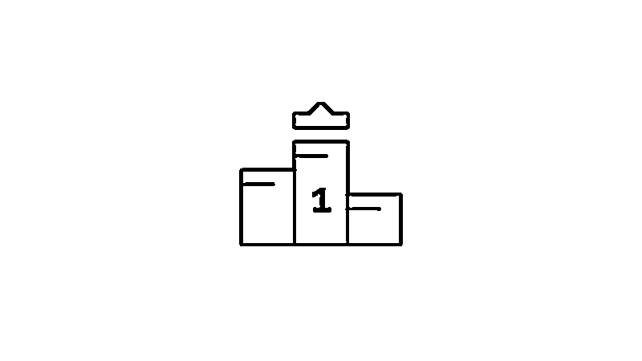

成功到底有没有规律？

成功学难道真的只能是毒鸡汤吗？

我们看了太多成功学书籍、名人传记等等，但是我们的人生依然没有泛起涟漪，我们的现状没有得到丝毫的改变。

于是我们的心中从此打上了一个深深的烙印，成功学是骗人的，是成功者用来忽悠大众的，千万不能相信，谁信了谁就是傻子。

老实说，我个人也不喜欢看成功学，我对成功学也存在偏见，所以我打算重新定义成功学。

在我这里成功学必须满足两条原则，才能被称作成功学。

①任何时候都可以复制

如果一个成功法则有很强的机遇性，需要天时、地利、人和等各种因素的配合，那么这样的成功法则就很难被复制。

也就是说，即使你学了也没用。

我要的是那种，在任何时候都普适的成功法则。不能说可以完全 100%的复制，但至少大部分人只要按照这样的法则做事，就能逐步实现成功。

就像菜谱一样，你只要按照这个菜谱做菜，熟练了就一定能做出一道绝色佳肴。

这是我对成功法则的第一个标准。

②普通人也可以复制

如果一个成功法则，需要很大的能力要求、认知要求，那么这样的成功法则也不在我的选择范围之内。

比如孙宇晨这样的人，从小脑子聪明，投机取巧，如果你具备他这种认知和聪明程度，确实也能做成很多事。

但是要求太高，普通人难以模仿。就像开飞机一样，你只要当上飞行员就能脱贫，但是普通人根本不具备飞行员的素质，这就很尴尬。

这是我对成功法则的第二个要求，必须要我们这种天赋平平，没什么资源的人也能复制才行。

具备了这两个标准，基本上就算得上是一个好的成功法则了。

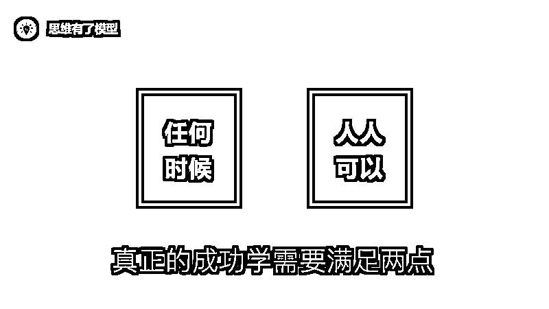

那有没有一个这样的成功法则呢？

这一年我通过不断学习、思考、实践，还真的找到了一条简单且切实可操作的成功法则。

这个成功法则来源于营销学和网络科学，它不仅仅是一个简单的经验总结，而且它符合这个世界的运行规律。

我自从懂了它之后就一直在践行它，真的很神奇，半年时间就让一个公众号起死回生，从 2500 个粉丝做到了 30000 粉丝，知乎、今日头条、简书都不断在给我反馈，告诉我这样做是对的。

这个思维模型叫做**“成为第一”** ，是我目前为止，觉得最好的成功法则。

**为什么要成为第一**

成为第一听起来好抽象，不具备实操性，它真的那么神奇吗？

具体如何实操，我们另外花几期来讲，这一期我们来讲讲成为第一的神奇之处，它的背后有着怎样的规律，以及它的本质是什么。

**①强者越强，赢家通吃**

强者越强绝对不是一句鸡汤，它的背后其实合乎事物的运行规律。

有一门新兴的学科，叫做**网络科学** 。

我们所有人都生活在一张巨大的网之中，在这张网中，强者比弱者具有更多的优势，随着这张网的扩大，强者的优势会越来越强。

美国物理学家巴拉巴西做了一个实验，他把人与人之间的连接模型化成小球之间的网状结构。

就像下面这张图这样。（当然一开始没有这么多小球）

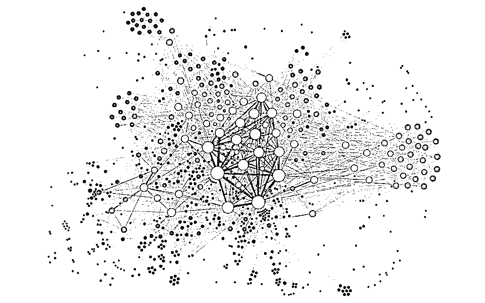

巴拉巴西先用计算机随机生成一些小球，这些小球大小不一样。然后模拟人与人之间的连接生成一套复杂的算法，模型君把这套算法简化为“偏好选择”。

大概意思就是说，每随机生成一个小球，它会随机与这个网络中的任何小球发生连接，但是跟越大的球发生连接的概率会更大。

这就像我们在现实生活中，可能遇到任何人一样，但是我们遇到问题时，会倾向于去跟那些厉害的人发生连接，向他们请教问题，跟他们达成合作，跟他们结为好友。

然后巴拉巴西不断往这个网络里随机生成小球，慢慢的会发现一个现象：第一大的那个球慢慢变得越来越大，而且开始跟第二名拉开差距，随着小球数目的增多，这个差距会变得越来越大，直到完全甩开其他小球，一家独大。

这就是我们所说的「强者越强，赢家通吃」背后的本质。

当然，这是理想状态，它就像经济学模型，只是解释一个现象，不代表现象本身。

在现实生活中，你会发现强者也会死掉，这里面跟很多东西有关，比如企业的臃肿、故步自封、缺乏创新、时代浪潮等等。

但是这个底层逻辑是你可以借鉴的，当你成为第一之后，越多人认识你，你就会变得越牛逼，变得越牛逼就会被越多人认识……如此循环叠加。

最后强者越强，赢家通吃。

比如，我在知乎上的一篇爆款文章《费曼学习法》，因为写得比别人都好，所以被很多人点赞，排在了搜索榜的第一名，又因为排在第一，所以每次有人要搜“费曼学习法”就能看到我那篇文章，于是给我带来了更多点赞……如此循环往复，强者越强，赢家通吃。

现在的腾讯和阿里巴巴也是，只要不发生大的变故，它们只会越来越厉害。

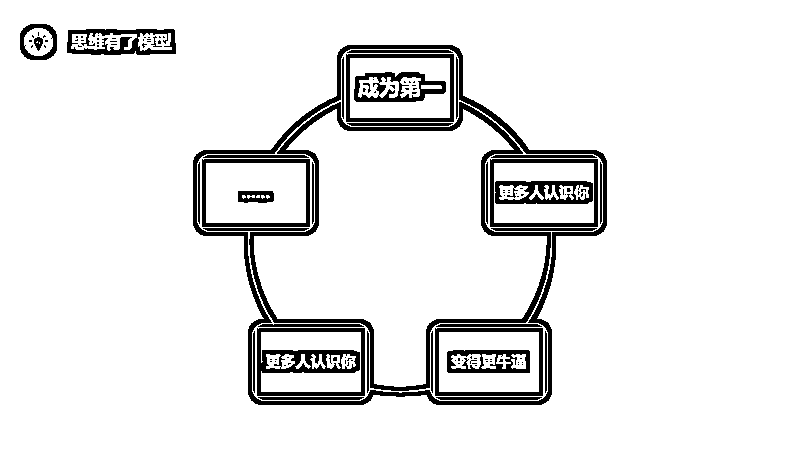

**②权威思维**

成为第一之后还有第二个好处，这个好处与人性有关。

当你成为第一，成为专家之后，能够获得更多人的信任和支持。

我们人的大脑天生不爱独立思考，如果有一个权威的人士站出来告诉我们该怎么做，我们简直爱死了。

比如，经常有这样一个现象，一堆人忙完一件事后聚在一起，准备去吃饭，这个时候问题就来了，到底去哪吃呢？

我们的回答通常都是，随便，都可以，只要不吃 XXX 就行。

但是如果这个时候有个资深吃货跳出来说，我知道哪哪有家店，他家的 XXX 特别好吃，经常有很多富豪不远千里跑来就为吃一顿这个，而且还不贵，走走走，我带你们去尝一下。

这个时候，除了特殊情况，大多数人都会抛去自我，选择跟随这个吃货。

我们天性里需要一个权威来引领我们，只要他足够牛，能够带我们走向成功，我们愿意追随。

我是个表达者，深深的知道这个权威思维有多么强大。

当你寂寂无名的时候，你说的话即使再正确也没有人会相信；但是如果你成了某一个领域的专家，即使随随便便一句话也会被人反复揣摩，如获至宝。

所以你想你说的话有分量，你希望得到别人的支持与信任，那么成为专家，成为第一，绝对是必要的。

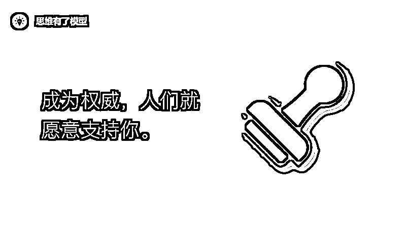

**③人们的心智有限，只记得第一名**

成为第一还有一个你无法抗拒的理由，这个理由是我在营销学中学到的。

著名品牌战略公司华与华有这样一句非常经典的话「在一个行业里，用户只能记住那么一两个品牌，第一名赢家通吃，第二名稍微可以分一杯羹，第三名基本就盈亏持平了，其他剩下所有的都是陪跑」。

为什么会这样呢？这跟我们的心智有关。

有一本书被称为“商业人士的必读书目”、“美国营销行业有史以来影响最大的书”、“美国史上百本最佳商业经典第一名”、“美国 CEO 最怕被竞争对手读到的商界奇书”。

这本书的名字叫做《定位》。

活学活用：我们刚讲了权威思维，上面这段话就是在利用权威思维，因为它是当之无愧的第一，所以拿出来作为论据很有说服力。

《定位》告诉了我们一个叫做**心智** 的东西，**它说我们每个人的心智都是有限的，对于同一类事物，只允许我们记住很少的名额，其中第一名占据了我们大部分心智，其他剩下的只能瓜分一点点心智。**

比如，电商行业第一名是谁？淘宝（天猫）；第二名是谁？京东；第三名是谁？不知道。

比如，第一个登上月球的人是谁？阿姆斯特朗；第二个登上月球的人是谁？不知道。

比如，世界第一高峰是谁？珠穆朗玛峰；第二高峰是谁？不知道。

人的心智有限，第一名占据了我们大部分心智，第一名之下默默无闻。如果你想获得成功，努力让你做的事成为他们心智中的第一，这样人们才会记得你。

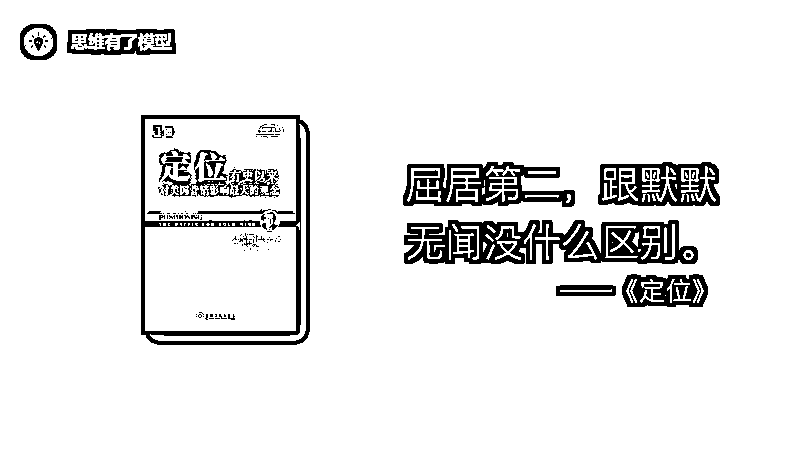

**④成为第一，你的价值将比任何人都高**

我在上一周的文章里提到了，成功的本质，是因为你的存在本身能够给很多人带来巨大的价值。

投机倒把也能成功，但终究不是长久之计，要想永远的成功下去，你就得遵循商业的规则——源源不断的给别人提供价值。

也就说，所谓的成功，其实是你比你的竞争对手提供的价值更多。

当你比你的对手提供的价值更多，比如他能够给用户提供 10 块钱的价值，而你能够给用户提供 100 块钱的价值，用户就会选择你。用户不是傻子，谁提供的价值更多，他们就会选择谁。

而如何才能比你的竞争对手提供更多的价值呢？

经济学里面有一个理论，叫做**规模效应** 。如果你是这个行业的老大，你具备规模优势，你的边际成本就会比别人都低，你的质量比别人都好，你的效率比别人都高，你就再也没有敌人。

而且别忘了，强者越强，赢家通吃。

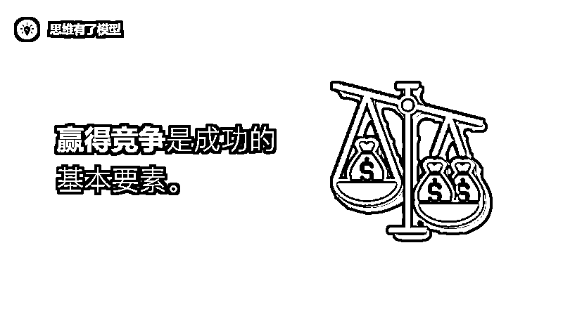

但很多人不懂这个道理。我看见的现象是，大多数人不知道自己这一生要干什么，他们频繁的在换跑道，一年内换了四份工作。

别人说这个行业前景好，就跑去做这个行业；过了段时间，人家说某某工作工资高，又换到另一份工作；做了一阵不适应，又跳槽去别的公司……

他从来没有在一个行业深耕细作，做到第一。没有第一就很难形成规模优势，没有规模优势你的价值就不大，任何人都可以替代你。

所以，你不成功是正常的，成功了才不正常。

再举一个例子，经常有很多人请教我自媒体相关的问题，我发现其实他们很长时间做不起来，最大的原因不是写作能力的缺失，而是定位问题。

他们写得很杂，乱七八糟什么都写，一会追热点，一会写日记，一会写感悟，一会写书评，一会写职场，一会写情感……

这会导致什么问题？

每一个领域他都无法成为第一。你写热点有专业追热点的人写得好吗？你写情感有咪蒙写得好吗？你写日记、写感悟有比一本经典书籍写得好吗？

读者为什么会选择你呢？

我看情感为什么不看王泽鹏而要看你写的？我看职场为什么不看插座学院而要看你的？我看认知为什么不看经典书籍而要看你的？

如果人家哪哪都比你强，你存在的价值就根本体现不出来。

这是一个再简单不过的道理，有人任何一篇文章写得都比你好，我为什么么要看你的文章？

除非我不认识这些巨人，我只认识你，在我的心智中你是第一名，这个时候我才会看你的文章。

所以，如果你想成功，那么你就必须比你的竞争对手提供的价值更多。

什么情况下才能比你的竞争对手提供的价值更多呢？

那就是你通过不断深耕细作，有一天，你的成本最低，质量最好，效益最高，你成为了第一名，这个时候你就再也没有敌人。

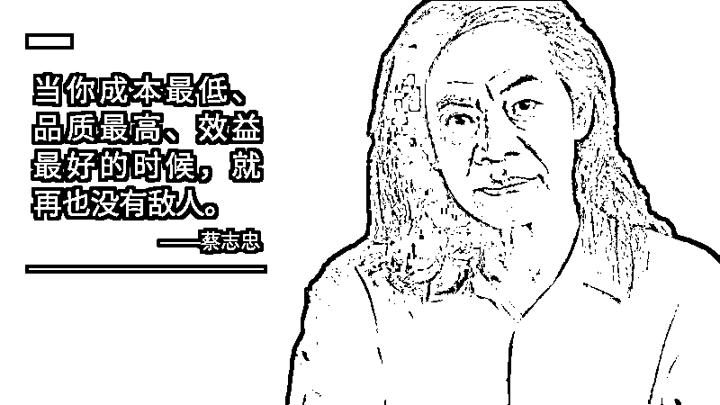

**什么是成为第一**

我知道你看了上面可能有点懵，似懂非懂。没关系，我们再深度解释一下什么是成为第一。

**①心智第一**

第一不是你说了算，而是你的用户说了算。在用户的心智中你是第一，那你就是第一。

比如你本来文章写得一般，但是你的读者没有读到比你更牛逼的文章，那么在他的心智中，你就是第一。

所以大家不要灰心，任何时候你都可以成为第一。

只是区别在于，一开始你是少数人心智中的第一，等你继续深耕细作，你就会成为更多人心智中的第一。

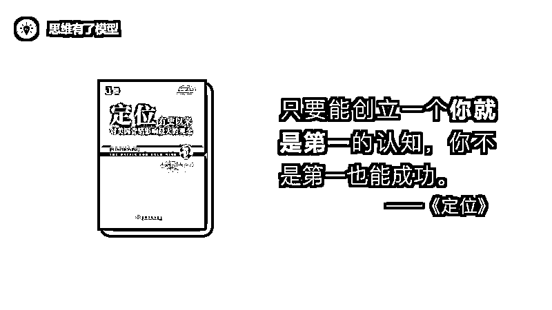

**②价值第一**

**你能够给用户提供的价值比别人都高，你的成本比别人都低，你的质量比别人都好，你的效率比别人都高。**

当你达到这样的状态，你就再也没有敌人。

当然，你还需要宣传，让更多人知道你能够给他们提供最多的价值。毕竟，酒再香也经不住巷子深。

曾经有人跟我讲过这样一个理论，很有意思。他说爱情其实也是这样，我们永远在选择一个更高价值的人。

所以你要做的就两件事：第一，提升自己的价值，成为对方心智中的第一；第二，让更多人知道你，俗称流量。

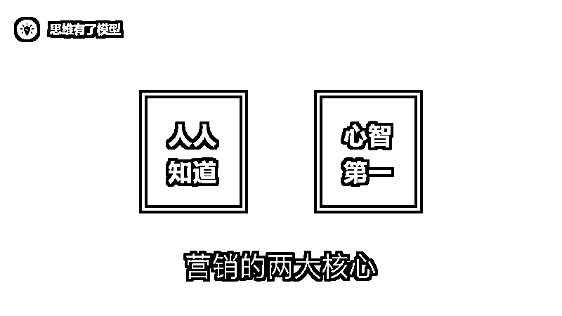

**怎么成为第一**

我提供三个方法：**深耕细作，与众不同，阶梯攀升** 。

具体我们下次文章再见，其中深耕细作和与众不同是两个非常重要的思维模型，需要单独拿出来讲。

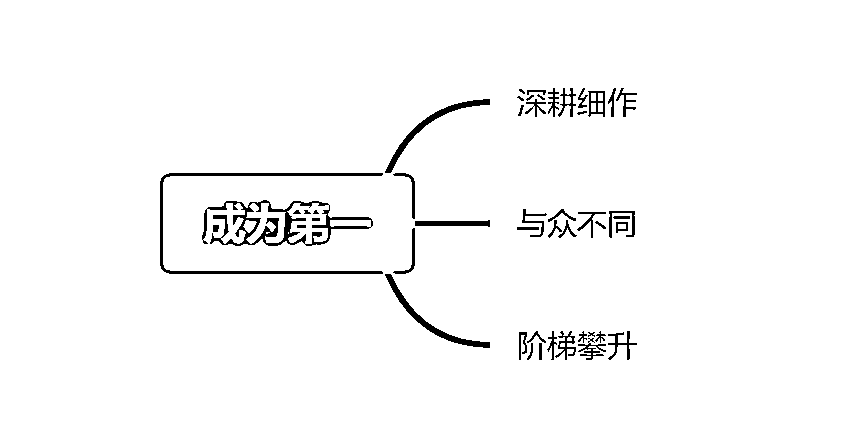

**经典案例**

最后，给大家分享一个巨人吧，是我非常敬佩的人，蔡志忠先生。

能感悟这个成功法则，要非常感谢蔡志忠先生，他就是“成为第一”的忠实践行者。

蔡志忠先生说，他从四岁半就确定了画画；15 岁便成为职业漫画家；第一本《庄子说》连续十个月成为金石堂畅销书第一名；是第一个用漫画的形式向世界分享庄子、老子、孔子等思想的漫画家。

2011 年获“金漫奖”终身成就奖，蔡志忠先生一生都在这个领域深耕细作。

最后，分享蔡志忠先生的一句话吧：

老师说“努力就会成功”，其实这个是善意的谎言，没有人不努力的啦。

努力没办法让你走到成功，更重要的是选择，选择自己最拿手、最喜欢的，把它做到极致，无论做什么，没有不成功的啦。

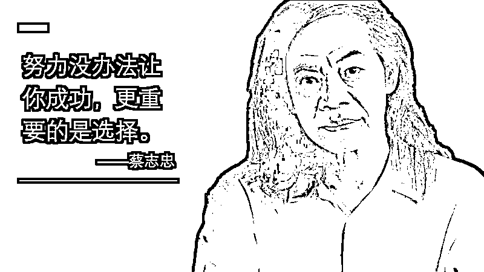

* * *

评论区：

暂无评论