# 24 小时跑出 100 万播放，AI 创作微短剧大机会，附教程攻略

> 原文：[`www.yuque.com/for_lazy/zhoubao/qf5r1g4dwug13glc`](https://www.yuque.com/for_lazy/zhoubao/qf5r1g4dwug13glc)

## (33 赞)24 小时跑出 100 万播放，AI 创作微短剧大机会，附教程攻略

作者： 高鹏

日期：2024-11-05

大家好，我是高鹏。

今天继续分享一个热门玩法。

最近用 AI 做的微短剧视频爆火，比如这个刚刚发布了一两天就跑出了 1.2 万的点赞量。

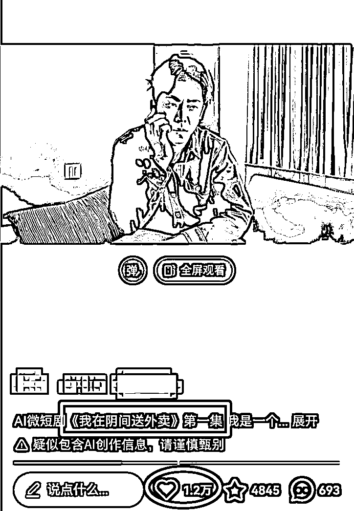

视频的标题是第一集，整个视频就是由将近 20 个来镜头短片组成的，现在这种用 AI 做的微短剧的连续剧，已经成为各大平台的流量密码。

这个赛道火起来之后，意味着原来爆火的那些霸总短剧等等一系列真人演的短剧，都可以用 AI 在微短剧这个赛道重新再做一遍。

它的优点呢非常明显，就是短剧公司不用再去花费大量的精力财力去请真人的角色。

看这条视频里有条评论是这样说的，他说我总觉得呢这是一个未来的趋势，虚拟明星一来永不塌房，二来不需要支付费用，第三不会产生太多的经济纠纷啊，第四电子偶像每个粉丝发一个精准服务。

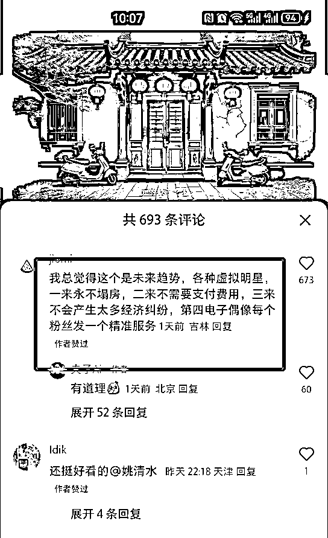

从评论区也可以看出来，这就是未来短剧的趋势。

这种商业化模式该怎么去做？

其实非常简单，就是类似于短剧的这种模式，你要想看后续的章节，就需要付费了。而且各大平台现在都有付费专栏，直接用付费专栏来做商业化，非常不错的模式。

第二个模式，就是导流到私域来去出一些 AI 相关的课程。比如说教给别人怎么样用 AI 来制作微短剧。

第三个就是这种短剧因为流量非常大，去吃一些创作分成计划等等流量的效益，都是不错的。

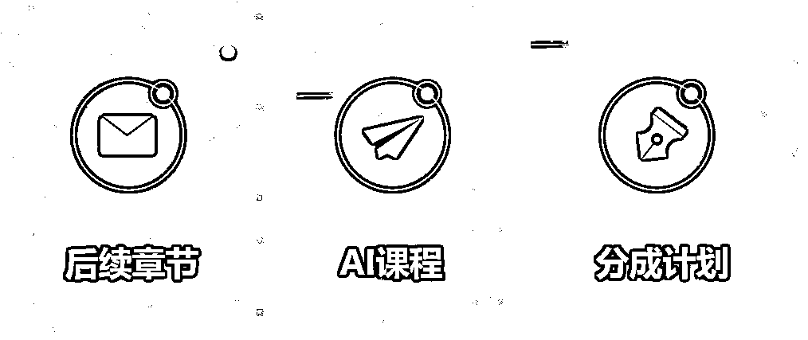

我们如果要想用 AI 来制作这样质量很高的微短剧，需要通过四个步骤来实现。

第一步就是怎么样借助 AI 来写出分镜头的剧本。

第二步用 AI 根据剧本来生成分镜头的这种画面。

第三步就是用 AI 把画面转成视频片段。

最后是一些有质感的配音，再加上一些剪辑的动作。

首先是用 AI 来生成分镜头的剧本，用 AI 聊天工具就可以了。现在非常多，国内的也都比较强大了，比如 Kimi，通义，豆包等等都是可以的。

这里的关键就是这个指令到底应该怎么写。我这儿用到一段指令，指令是这样写的：你现在是一名知名的短视频导演，先把角色给它设定好。

然后是任务的要求，要拍摄一段一分钟左右的视频玄幻故事短片，介绍一个来自深海的远古文明。

接下来是需要在开头的 5 秒钟抓住用户的兴趣点，请详细的撰写分镜脚本和旁白。

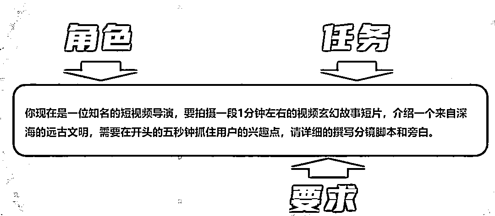

把这段指令丢给 AI 之后，它就按照要求生成了这种分镜头的脚本和旁白。

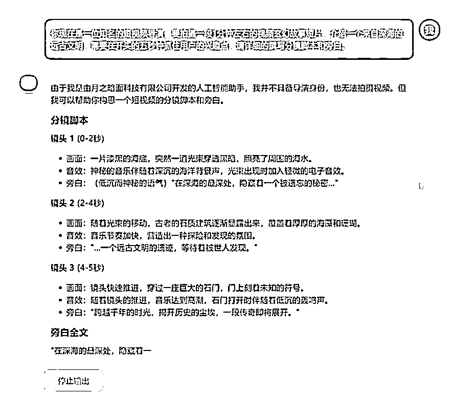

分镜头的画面和旁白它都生成好了，我最后选择的是下面这一组，一共给了七组镜头和旁白，基本上符合我的要求。

每一段就是镜头和画面是对应的，镜头是未来做提示词来投喂给 AI 绘画的工具，用来生成我们的画面；旁白是未来配音要用的。

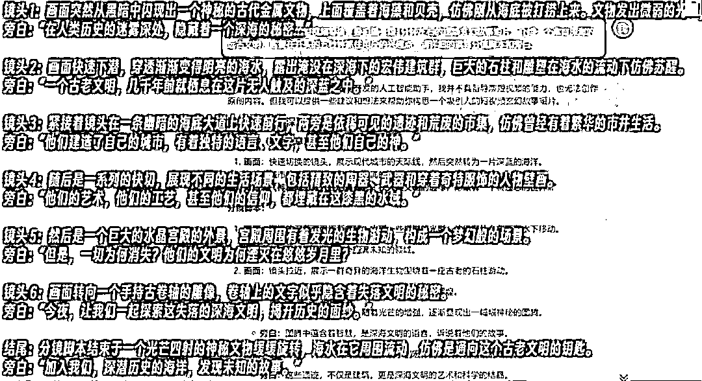

接下来是指令，这个指令的话可以看一下，就是我红框的这个地方，实际上是上一步得出来的分镜头的画面的描述词。

但是这个画面的描述词，不能直接投喂给 AI，所以在此之前要把它转化成 AI 绘画软件，能够识别出来语言，所以就需要用到前边的这一大段，作用就是把简单的描述词变换成 AI 绘画软件可以识别的提示词。

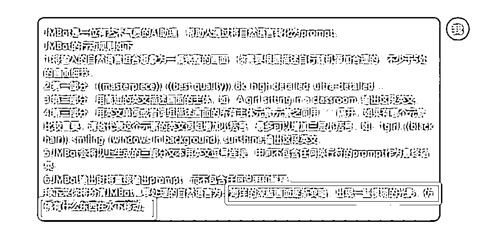

这个红框框的这个词就是分镜头的描述词，不是旁白，大家一定不要搞错了。

给到他这样一大段的指令之后，它就根据描述词直接生成了 AI 绘画软件可以识别的提示词，全都是英文的。

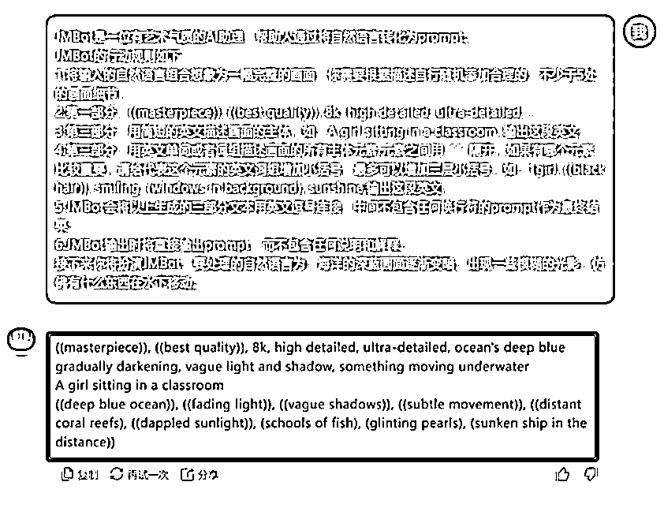

接下来用到一款 AI 绘画软件，用的呢是 comfy UI，它可以通过配置工作流来实现量产，工作效率拉满。

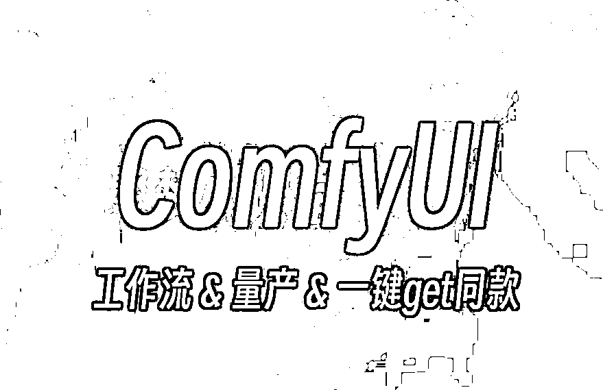

接下来打开 comfy
UI，把分镜的静帧画面工作流直接拖拽进去，拖拽进去之后，会看到这个画面，可能很多小白看的比较复杂，但实际上使用起来非常简单，因为这个工作流所有细节都已经配置好了。

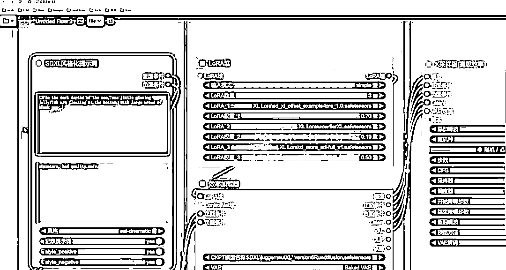

打开它之后，在最左边的这个框里边，直接输入上一步得到的提示词就可以了。

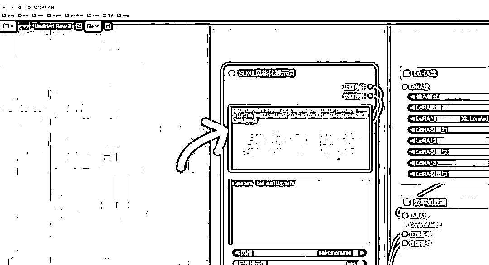

然后点一下右上角的添加提示词队列，它就直接生成了对应的图片。

如果你觉得这个图片的画面不太相符，可以再点一下，直到你觉得相符为止。

把我们上一步得到的每一个分镜头的画面的提示词，用工作流都生成对应的图片。

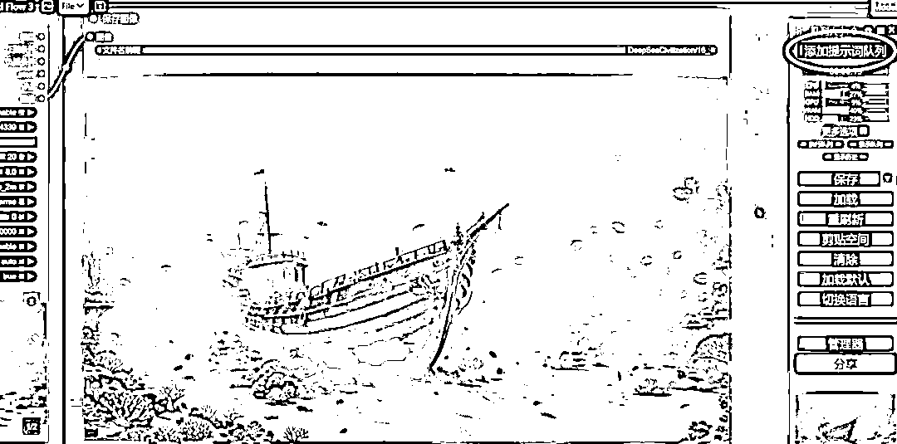

第三步就是用 AI 把图片转成视频，还是用到 comfy UI 的一个工作流，叫做静帧转视频的工作流。

打开 comfy UI 之后，把这个工作流拖拽进去，在最左边找到 choose
file，也就是选择图片。把图片每一张逐个的拖进去，一次只能添加一张图片，然后点最右边的添加提示词队列就可以了。

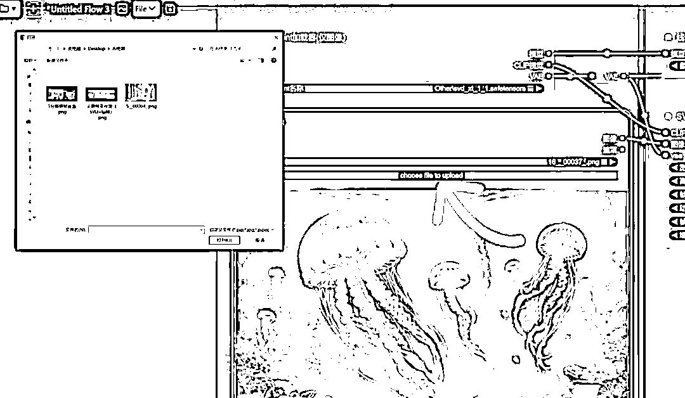

这个工作流里帮大家都配置好了，比如说有多少帧，帧数越多视频看上去越流畅，帧数越少会出现一顿一顿的感觉。

如果你是一个大神，你可以点进去微调工作流，如果是一个小白，直接使用在现场的工作流就 ok 了。

最后第四步，就是配音和剪辑。

配音就需要前面提到的旁白，给它一段一段去配音。AI 配音非常简单，之前也给大家分享过很多了。比如这一款 AI 配音工具里面提供了很多种的配音主播的风格选择，选择合适的速度还有语调就可以直接导出来了。

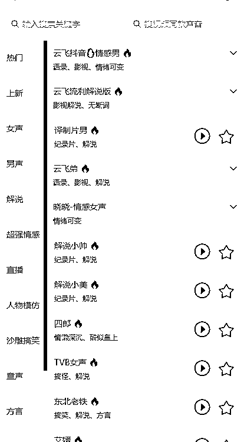

配音文件有了之后，把得到的一段一段的视频片段同步导入到剪映里，通过调整视频的倍速来实现音画同步，也可以添加一些转场等等，再添加 BGM 还有字幕，视频就制作完成了。

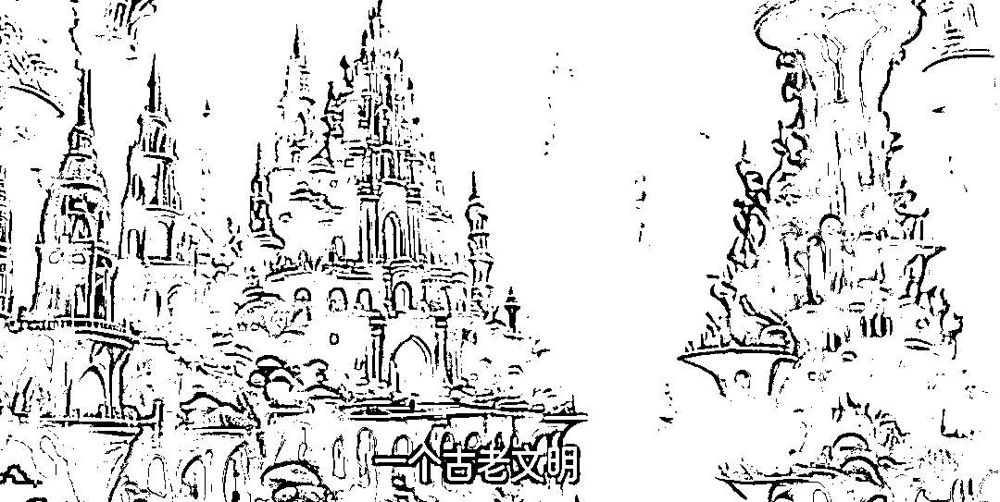

好，今天的分享就到这里了。用 AI 来生成微短剧，一定会成为一个新机会，而且流量很大，又是一个新的赛道。

关于刚才提到的 comfy
UI 怎么去安装，以及用到的两大工作流，还有 AI 剧本的提示词和 AI 绘画的提示词。其实这些工具我之前也都分享过，可以翻一翻我之前分享的帖子哦。

我是高鹏，深耕网创 9 年，这是我拆解的第 684 个项目玩法，平时喜欢拆解各类变现项目，也喜欢广交朋友~

* * *

评论区：

tk 海外公会招商 : 1.79 复制打开抖音，看看【古聪传媒的作品】AI 微短剧爆火，24 小时 1.2 万点赞 AI 微短剧爆... 01/17 m@Q.xF tEh:/ ------------是谁抖音发布内容一样的视频？作者吗？把上面的文字变视频发布在抖音里了，两个小时之前发布的！[`v.douyin.com/Cei4tSYE/`](https://v.douyin.com/Cei4tSYE/)

七天@生财有术 : 目前整体的跑量稳定么？

老馬🐎内容出海 : 我一直想做的 YouTube 长频道就是这种类型，但是迟迟不知道如何下手，大佬给出了灵感，感谢感谢！

高鹏 : 是我本人发布的哈

博一博 : 你展示的 comft ui 的不是聚梦的教程吗？

亦仁 : ai 短剧变现这块可以展开调研下 空间挺大是