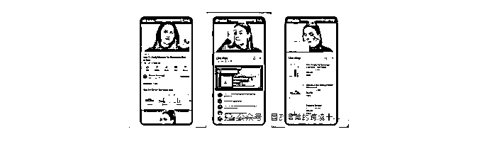
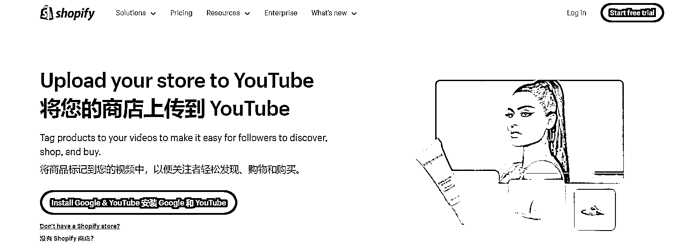
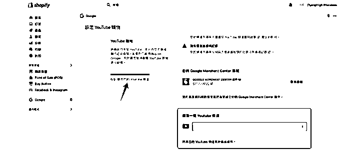
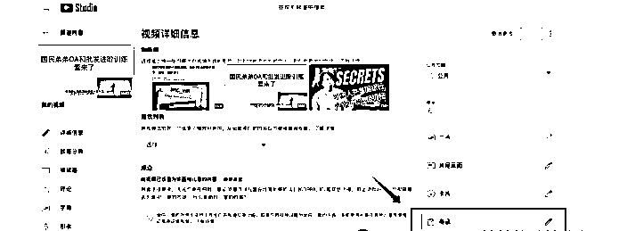

# YouTube 紧跟 TikTok、Instagram 步伐，全力拓展电商版图

> 原文：[`www.yuque.com/for_lazy/zhoubao/rypzwovp7umv6u22`](https://www.yuque.com/for_lazy/zhoubao/rypzwovp7umv6u22)

## (22 赞)YouTube 紧跟 TikTok、Instagram 步伐，全力拓展电商版图

作者： 国民弟弟的跨境十年

日期：2024-11-05

继 TikTok 和 Instagram 之后，YouTube 也加入了电商大潮。

不知道大家有没有留意，现在有不少美国用户在 YouTube
视频下方已经能看到商品橱窗，甚至有的账号还出现了“商店”和“购物车”功能。**这对跨境卖家来说，又是一个不容错过的新机会！** YouTube
Shopping 和 TikTok
的“半闭环”模式有异曲同工之妙。想要抢占这一波市场机会的商家们，首要任务就是了解入驻流程和要求。今天抽时间给大家大概整理好了~

### **Youtube Shopping 是什么？**

简单来说，YouTube Shopping 就是让 YouTube
创作者通过在频道和视频中展示商品来带货，类似于国内的短视频和直播电商。它包含几大功能模块：**视频购物车、直播购物车、商品橱窗、店铺展示和联盟营销等。**

YouTube Shopping 为商家和创作者提供了一个多功能、全球化的平台，具有强大的增长潜力。作为全球领先的视频平台，YouTube
拥有巨大的用户群和很高的用户黏性。数据显示，89% 的用户信赖 YouTube
上的产品推荐。对于商家和创作者来说，这都带来非常大的机会。它还将视频内容和电商功能无缝融合，用户在观看视频时就能看到商品展示橱窗、购物车等功能，避免了从内容到购物之间的跳转。短视频、直播中内嵌产品标签等功能，让观看和购买无缝对接，提高转化率。用户不仅能得到更流畅的购物体验，商家和创作者也获得更高效的流量变现。

### **Youtube Shopping 入驻流程**

### **1****.** **确认资质**

首先需要满足以下条件：

.已成功加入 YouTube 合作伙伴计划

.频道订阅者数达到最低门槛，或是音乐人官方频道

.你的频道观众群体定位非儿童，也不能包含大量标记为面向儿童的内容

.频道记录良好，没有因为仇恨言论或违规收到警告

满足这些要求后，就可以领取 Google 免费开户福利，开启 YouTube 自投广告，为跨境电商业务抢占流量先机！

**2****.** **关联商店与 YouTube**

如果你使用 Shopify 或 Shopline 建站，可以通过以下步骤将店铺和 YouTube 关联，下面以 Shopify 为例：

**步骤一：连接 Shopify 商店到 YouTube**

.登录 YouTube Studio，选择 **商业化 > Shopping**

.在“从商店添加产品”中，点击“连接商店”，选择 Shopify 并继续

.跳转到 Shopify 后，按提示完成关联。

**步骤二：同步账户**

.在 Shopify 的 **销售渠道 > Google & YouTube**，使用与 YouTube 一致的 Google
账号登录，确保账号有管理员权限；

.选择 Google Merchant Center (GMC) 账号和 YouTube 频道，完成商店关联。

### **3****.** **在内容中添加商品**

成功关联后，即可在视频或直播中添加商品：

.登录 YouTube Studio，上传视频或短视频；

.进入“视频元素”页面，找到“链接商品”选项并点击“添加”

.搜索商品名称，选择对应商品并拖放到指定位置。每个视频最多可添加 60 个商品链接，还可设置商品展示时间。

就这样你的 YouTube Shopping 入驻完成了！

目前已有超过 16 万创作者、品牌和艺人已加入 YouTube
Shopping，显示出市场的认可和需求。创作者可以通过商品推广增加收入，从而激励更多优质内容的产出；而品牌则借助 KOL 和 KOC
的带货效应，进一步开拓全球市场~

特别是对于跨境商家来说，YouTube Shopping 给大家又提供了一个进入欧美市场的直接通道，通过与 YouTube
频道或网红合作，能够触达当地用户，带来更精准的营销效果。YouTube
的电商布局意味着新的流量红利，跨境商家可以借此建立全球化品牌形象，可以开拓新的销售渠道。不得不说这对跨境卖家来说，是一个不容错过的新机会~

以上！

**国民弟弟相关创业的故事文章推荐：**

[`articles.zsxq.com/id_8n2o7gax71fr.html`](https://articles.zsxq.com/id_8n2o7gax71fr.html)

* * *

评论区：

亦仁 : 有没有圈友可以切入 YouTube 电商的案例拆解呢