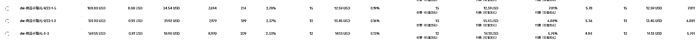
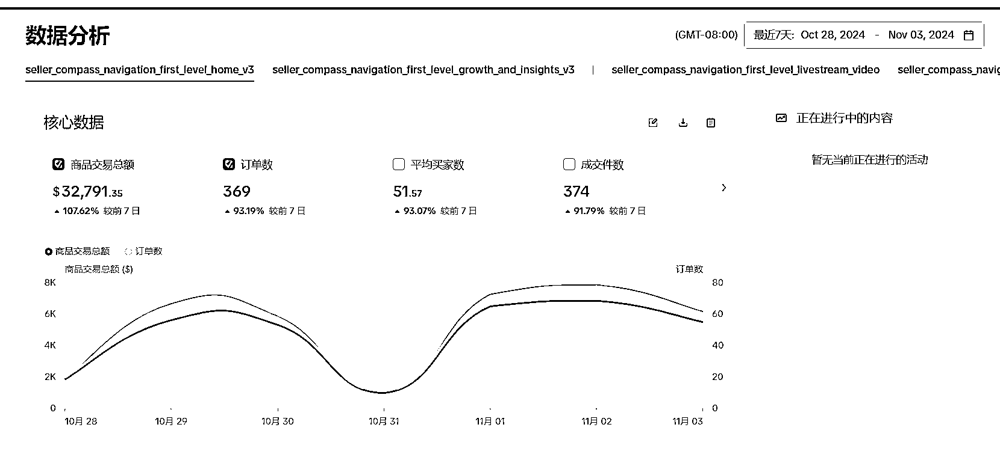

# 挑战 TikTok 两个月带货 GMV 目标 90 万美金，光宗耀祖？

> 原文：[`www.yuque.com/for_lazy/zhoubao/ad4ekcfwz3bxg5oq`](https://www.yuque.com/for_lazy/zhoubao/ad4ekcfwz3bxg5oq)

## (19 赞)挑战 TikTok 两个月带货 GMV 目标 90 万美金，光宗耀祖？

作者： 梁小伟

日期：2024-11-05

TK 做了三年了，一直没出什么成绩，想想玩点大的，现在我们啥都做，代剪辑，自营，联盟纯佣带货，代投，啥都做。

最近自营团队五个人定带货目标原本是定 48 万美金的。我笑了笑。48 万美金，还是胆子小了一点。要玩就玩大的。（霸总表情包）

从 10 月-12 月，我直接挥手就给团队定了 100 万 gmv 不带走一片云彩。

小伙伴估计都有点懵逼，啊？10 月份就出了 8 万美金，一下翻了五六倍，怎么敢的

首先产品客单是 60<card type="inline" name="math" value="data:%7B%22code%22%3A%22-85%22%2C%22id%22%3A%22SQEZ5%22%7D"></card>

如果需要达到需要出单 15384 单-11764 单

有三个备大货的 SKU

已经完成 8 万美金了，剩下的 92 万美金

也就是剩下的两个月每天需要出单 233 单-166 单

这多少有点压力了。。

复盘 10 月

10 月放假 8 天，新办公场地建设花了两个星期，没怎么管，也没发什么视频。

小店靠着之前的几千条素材达到了 8 万美金的 GMV 相当于有二十天都是搁置的

来看 11 月：

11 月首先是大促，本身购物氛围会更好，不说能翻多少倍，达到平常的两倍是没问题的。

但话又说回来，没有精心的布局和稳定的供应链

，大促跟我又有什么关系呢？

我们直接落地拆解：

自营短视频自然流：

人员匹配：

目前负责这个店铺的运营人员共 5 个人，其中两人是熟手，三人是生手。

账号匹配：

配备了 10 个橱窗号+4 个白号

数量匹配：

每个账号每天早上发三条，每天晚上发三条。一天六条

合计：84 条

人员目标分工：

目前我们团队除了带货，中视频也做。AI 相关的项目也做。

平均每个人中视频+AI 的素材是 20 条。

除此之外，还要考虑拍摄时间和账号发布的时间。

就拿目前已知的账号来看，总共一天 84 条的素材要剪辑。如果平均下来，每个人至少得剪辑 16.8 条才能达打满。

结合其他素材，一天要剪辑 40-50 条，听起来很难实现。

真的很难实现吗？

首先团队是不能吃大锅饭的，根据能力不同，要进行任务分配。

两个熟手至少需要剪 25 条，也就是 50 条的素材量

三个生手，每个人剪 12 条加起来才能达到目标。

我们梳理一下：

短视频带货需要考虑的事情无非就三个点

1.拍摄

2.剪辑

3.发布

1.拍摄

拍摄的方法，我用了最经典的模板化组合

不同的场景或不同的角度按 A+B+C+D 来区分

第一波，大家找个场地，打开产品，直接用手机一镜到底，简单配音+配文案进行发布，这种素材我称之为 A

A 素材隔 10 分钟就上传一条挂车视频到账号，轻松简单。出去拍摄的时候就已经发了两条

第二波，团队开始去找不同的场景，

开始去拍摄不同角度，不同景的素材片段，做好分类，

例如 B 场景是近景，连续拍 10 分钟，C 场景是远景，连续拍 10 分钟。D 场景换个位置继续拍十分钟

这样半小时，我们相当于五个人就收获了 15 个景的 30 分钟素材。

开始返回去剪辑视频进行模块拼接

如 B 场景+C 场景=一条素材，B+C+D 场景=一条素材。B+D=一条素材

这样快速组合拼凑，就能达到一天的剪辑量。

素材脚本怎么实现呢？

素材无非就是三个关键点

1.对标

2.总结

3.模仿

1.对标

自己去想一个脚本，特别是没有经验的人，绞尽脑汁花半小时一小时都想不出一条分镜脚本

我就对团队说，抄作业还不会吗？直接打开 pipiads.com，把皮皮上面的所有广告素材全部找出来，找出来后全部丢给 GPT 学习和模仿

然后批量用 AI 生成直接用

2.总结

把所有的脚本提取出来，不管是纯展示的，讲故事的，做噱头的，还是开箱的。先测一大批

分析店铺后台进行复盘和归类。提炼最容易拍，出单最好的视频素材。然后开始批量生产

3：模仿

最新的平台热梗，热歌，热门转场，花哨特效。有一个算一个，出来一个模仿一个。直接不内耗。就是干！

这是自然流的，纯自然流肯定达不到百万美金的结果，这个时候就要开始结合上广告了。

广告也要重新分类

1.商品卡广告

2.视频广告

3.GMV Max 广告

广告配额

广告户：3 个广告户

日消耗预算：5000-10000 美金

日素材上新要求：10 条-30 条出单素材

1.商品卡广告

商品卡广告相对稳定，但放量比较费劲，消耗多，广告成本增加。

一般每日配 20 组 全店投放 消耗大概 500-1000 美金

2.视频广告

视频广告是主力，每日新建 200 组。自动出价和手动出价结合

消耗大概在 2000 美金-3000 美金

3.GMV MAX 广告

这个准备 11 月中旬开始全域放量，现在没有动的原因是会算入自然流出单数据计入总 roi，需要验证自然流出单效果及产出

也就是说按照广告 roi3-3.5 来计算

我将花费 20 万美金的广告预算，才能有 60 万美金的广告回报

这样算下来，好像又没这么难了。

关于达人：

达人这一块我们建联力度比较弱，基本上几天一个达人，一个月几个达人，有时候会投几十美金测。

有点懵逼的是，达人带不了多少品，发的内容没什么转换。基本都是自营的出单猛。我们就没怎么管

不过旺季来了，这方面也在加大力度。

这里我们会分析对标，pipiads 上新了个红人广告数据分析功能，挺好用的。基本上哪个达人的出单情况以及广告投放情况怎么样，我们大概都有些认知。

现在店铺有两个品没有到仓，我抓紧的让大家开始囤素材。现在单品一天出单差不多 60-70 单左右

很多人会讨论大盘不行，平台不行，我不会这样认为。我就觉得如果大盘都很好，那可能我没什么机会了。红海找蓝海，蓝海挖掘更蓝海。用心钻研，肯定能成功。

就像之前我养团队也是踩了各种大坑， 连续几个月一分钱不赚，啥都去做，第一要素就是养活团队。我始终觉得只要活得足够久，机会来了才能把握得住。

以上是我对团队的计划，同时也分享成文章供大家指点，我是皮皮，咋们下期再见。如果你有优质供应链寻找纯佣达人团队，也可以发给我们试试，因为团队基因原因，美妆和服装暂时带不了。

* * *

评论区：

希声 : 666