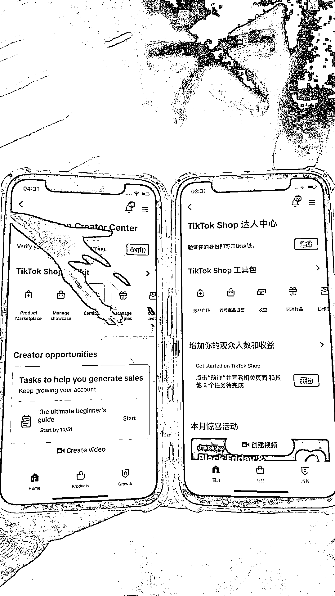
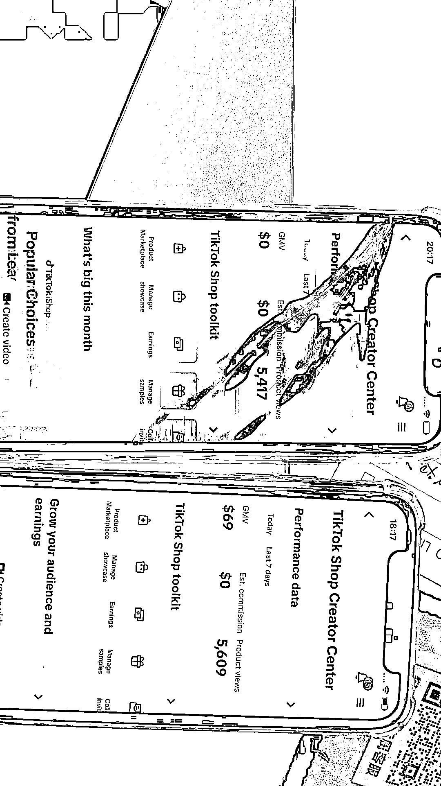
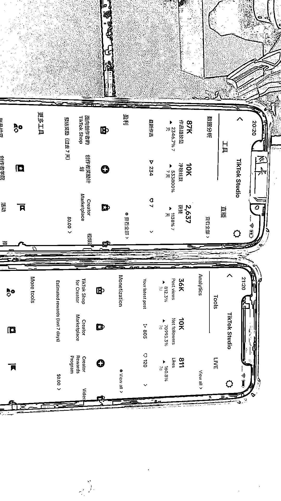
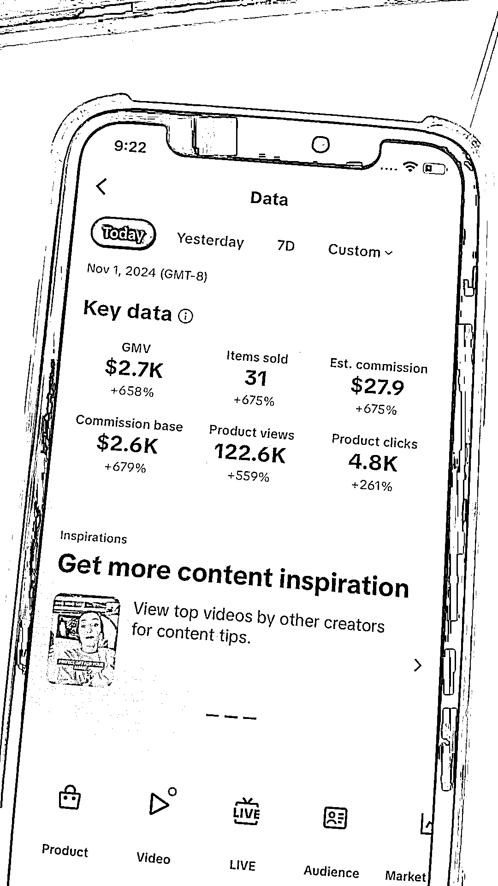
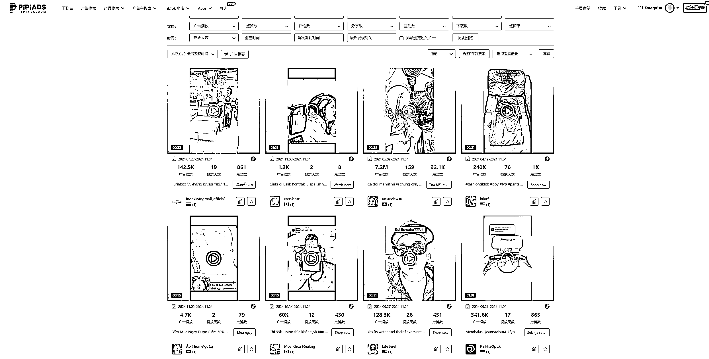
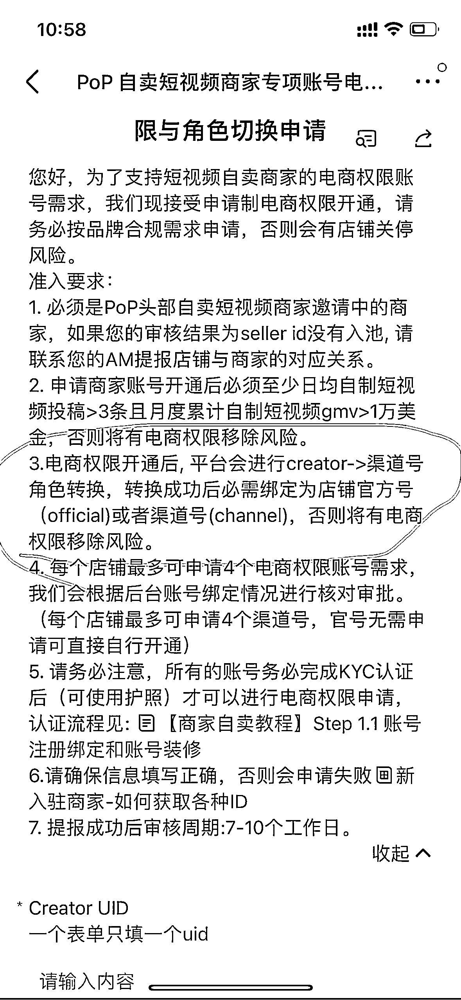

# 批量打 TikTok 橱窗号的经验分享

> 原文：[`www.yuque.com/for_lazy/zhoubao/grefb82hugbuskyz`](https://www.yuque.com/for_lazy/zhoubao/grefb82hugbuskyz)

## (19 赞)批量打 TikTok 橱窗号的经验分享

作者： 梁小伟

日期：2024-11-04

好久没更新了，最近测到一个批量开通 TikTok 达人橱窗号的方法，自己团队有在快速跑起来的，分享给大家。

我将会把我跑通的实战经验，完成的给大家梳理一遍

橱窗要求：

目前橱窗权限需要满 5000 粉要求，或 1000 粉受邀账号

潜在要求：

1：自然流要爆（至少几万播放）

2:优质内容赛道（至少能吸粉）

3：资料稳定（实名资料关联或异常会被封）

容易踩坑的地方：

1：掉橱窗但有橱窗权限

2：永久封橱窗权限

3：没有橱窗入口

实战经验分享：

大家如果纯靠带货视频去涨粉，特别是一些拍摄出来比较普通的产品，会发现涨粉很难。这个时候大家只能通过购买橱窗账号进行批量带货。这个时候怎么办呢？

首先，平台上有大量泛娱乐的内容赛道。我们是否可以去挖掘这些爆款赛道去快速涨粉或者收获高播放。

例如我之前分享了很多创作赛道的案例，大家可以参考之前发布的文章。

[`articles.zsxq.com/id_qf7nxnz7rrn9.html`](https://articles.zsxq.com/id_qf7nxnz7rrn9.html)

这些赛道，比较容易批量生产出几千播，几万播，甚至几十万播放的内容。

如;AI 生成的内容

如：情侣日常+表情包

关键点一：筛号

获取到这些赛道，第二步就要有足够多的账号去筛号。

现在做号，一两个号，一二十个号都未必能成功，反复走量才有可能把这个模式跑通。

跟大家聊个有意思的事情，同样的脚本，不同的背景片段，发布不同的账号，播放从几百-几十万都有。

这个时候，需要有足够多的账号去支撑才能不内耗。

例如你有十台手机，每台手机发三条，总共三十条一天。

十个号内容没问题的情况下，说不定十个号只有一个号是流量破千破万的。

这个跟账号权重有关系。

关键点二：快速放大

如果你每天拿着一两个号去想打橱窗，那我建议还不如直接去市面上购买更来的实际，因为一两个号去精细化运营，运营几个月说不定都产出不了一个橱窗号出来。浪费时间，还容易内耗团队。

特别是内耗团队这个问题，我有话想说

假设团队效率上不去，创作脚本太难。一个人每天仅生产个五六条。发上去 200 播放一条，我曹。顶多一天发两个号，还没什么流量，对公司来说很亏，对团队来说是极度容易内耗的。

这个时候，就要找那种很简单的创作脚本，有手就行，每条剪出来 10 几分钟，又有流量的脚本，去发布，去筛选，去撞不确定和概率。这样剪辑难度降低，数量上来了，账号上来了，自然成功率就高起来了。

例如，我们的小伙伴，新入职，最低要求是剪一天达到 30 条，30 条就可以分摊十台手机

筛出来高播放的号后让老员工发精品内容去承接，快速将账号打爆

关键点四：找技巧

就像我们亲测，连续爆了几天多条几万播放的账号，放了一段时间，粉丝一百多，涨粉很慢。这种账号食之无味弃之可惜。我直接二话不说就开始刷粉了。每个号刷下来 10 美金，一万粉。

开通以为很快掉橱窗，没想到不仅活下来，还出单了。

刷粉肯定有风险啊，但是比起三个月半年都打不出一个号，这个肯定是来得最快的。而且我测试过，这种账号稳定的照样很稳定。

一猜就知道有人问资源，我用的是这家[`ada.fansf.net/`](https://ada.fansf.net)

选真人粉 47

关键点五：直接看结果

正常来说要几万播放才考虑开橱窗的，上周六，我养了三天的号，四个号，有几条破千的，

我也拿来开橱窗。直接刷粉，我发现也是概率性开通。

刷了四个号后

小伙伴反馈，一个没有橱窗权限，一个掉橱窗了，还有两个还有橱窗入口

两个有橱窗入口的还申请不了

这种怎么破局呢？

1：继续发内容

2：有事没事点一下橱窗申请

3：换个网继续点

4：放一个月，后续重新拿来点。

假设我有 40 个号，400 个号，开通橱窗的概率也会越来越大。

同样我跟大家说了，这个事情是拼概率性。这一批不爆，时间短的成功率就会低很多

同样，我把这些账号养的时间稍微久一点，或者有爆几万几十万播放的内容后再去尝试，成功率会更高。

关于变现：

变现我就不说了，不管是自己店铺用，还是联盟带货，甚至是卖，都可以。

账号是生产资料，这是最核心的。快速开通就是要厮杀内容。寻找那些很容易获取流量的赛道。

我一个接着一个的给大家梳理。

内容期：

找赛道：准备 1-3 台刷对标的手机，连续每天刷 2 小时。

遇到感兴趣的赛道，点赞喜欢关注，养到随便一刷都是这个赛道后，分析内容，还有判断最近 7 天新号的播放情况。

做拆解：直接提炼脚本到 gpt，让 gpt 开始学习脚本，复制脚本，快速尝试。

变现期对接到样品或带自己的产品：

找批量对标脚本：打开 pipiads，pipiads 的素材都是投放的爆款素材，直接拆解广告素材， 变成批量素材。

去皮皮搜索对应的产品关键词就可以

这里很多内容团队都通过皮皮吃到了流量红利，包括我自己也是，大家一定要把工具充分利用起来。

团队管理：团队管理是一个很有意思的事情，我会专门写一篇 tiktok 内容团队的文章，如果对这篇文章感兴趣，请给个点赞。

这里还有一个有意思的点，如果你是大客，像 11 月黑五来了。

是可以对接 am，开 0 粉报白渠道号的，最高可以开 20 个。

但对历史 gmv 如 65KGMV（供参考）以及即将到来的黑五 gmv 目标有一定要求。

例如要求一个号至少每天发 3 条，月度短视频 gmv＞1 万美金等等。

这篇文章先到这里，大家可以结合往期我起号和橱窗实战经验的文章一起去看喔。纯实战经验分享。如果有帮助给小弟点个赞。

* * *

评论区：

大牙妹 : 你好，请问你在东莞还是深圳吗？ 我在广州、中山，我也是做美区 tk，想跟你交流学习一下。