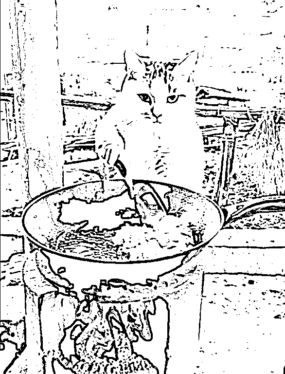
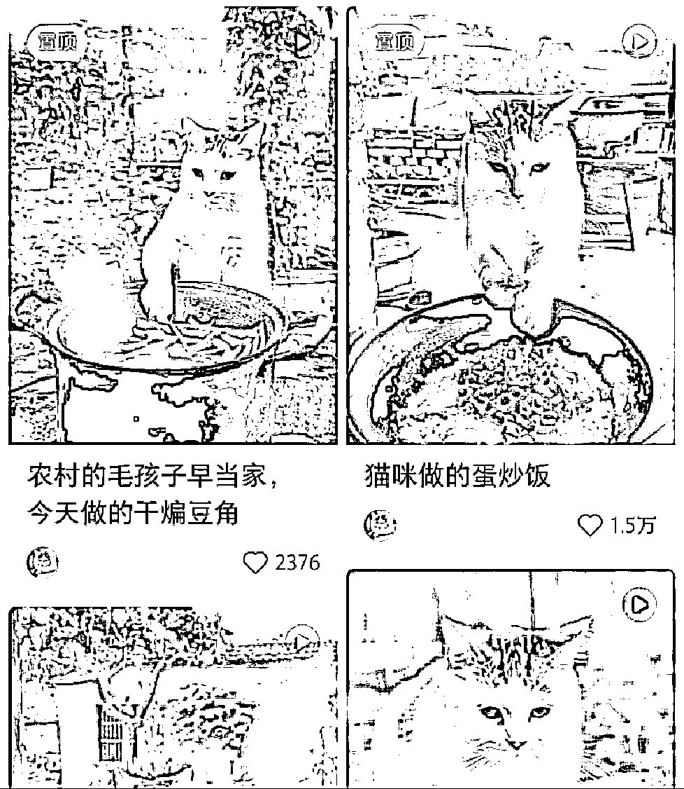
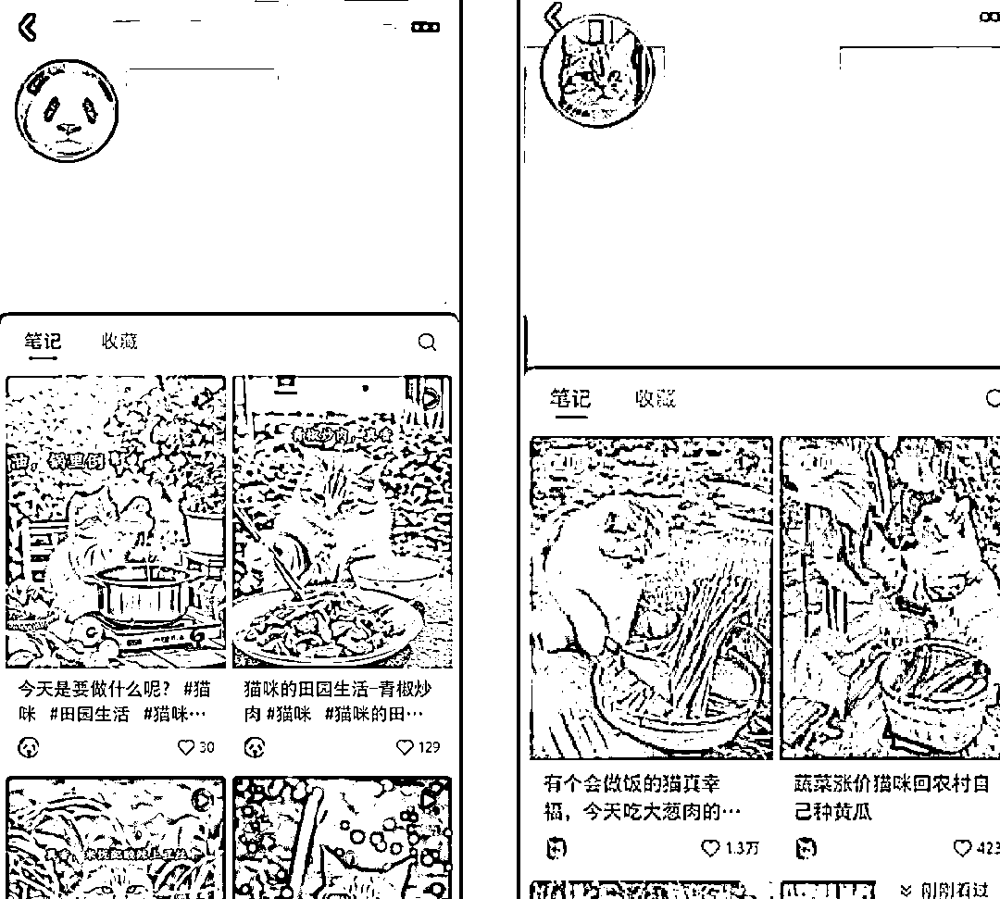
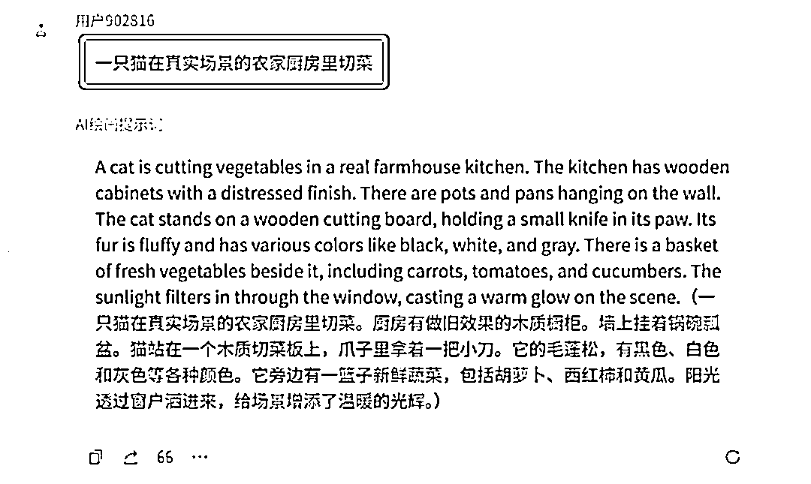
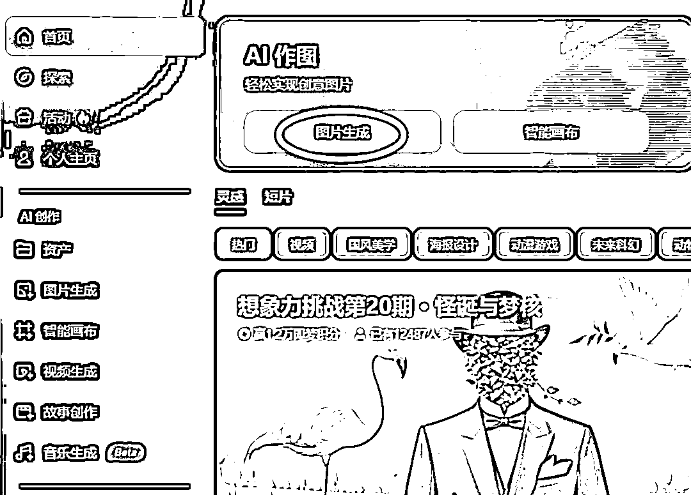
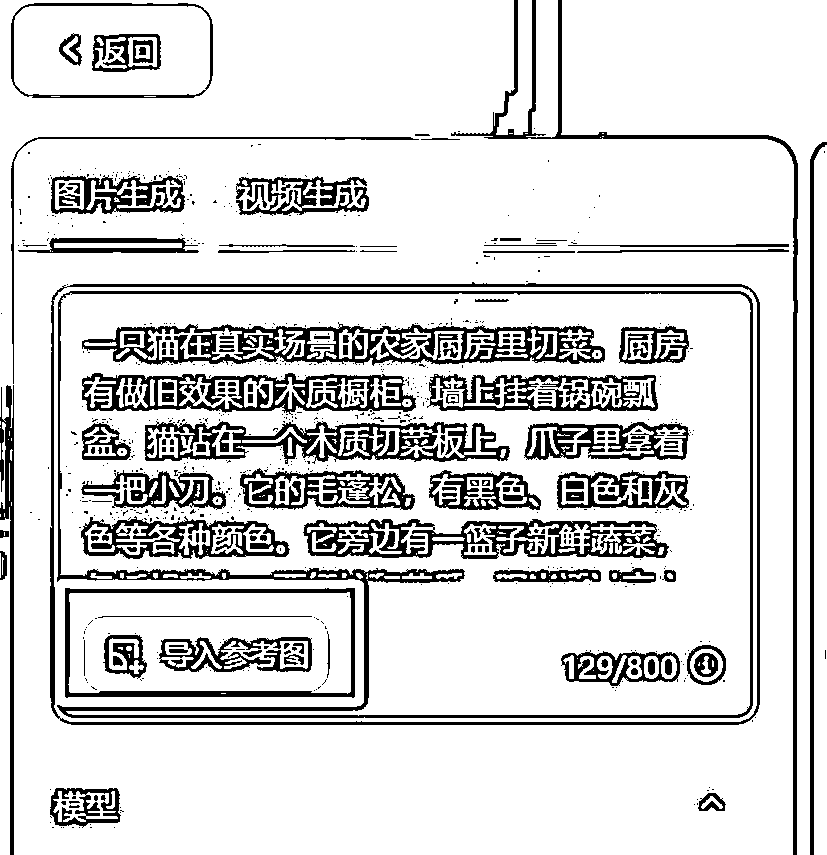
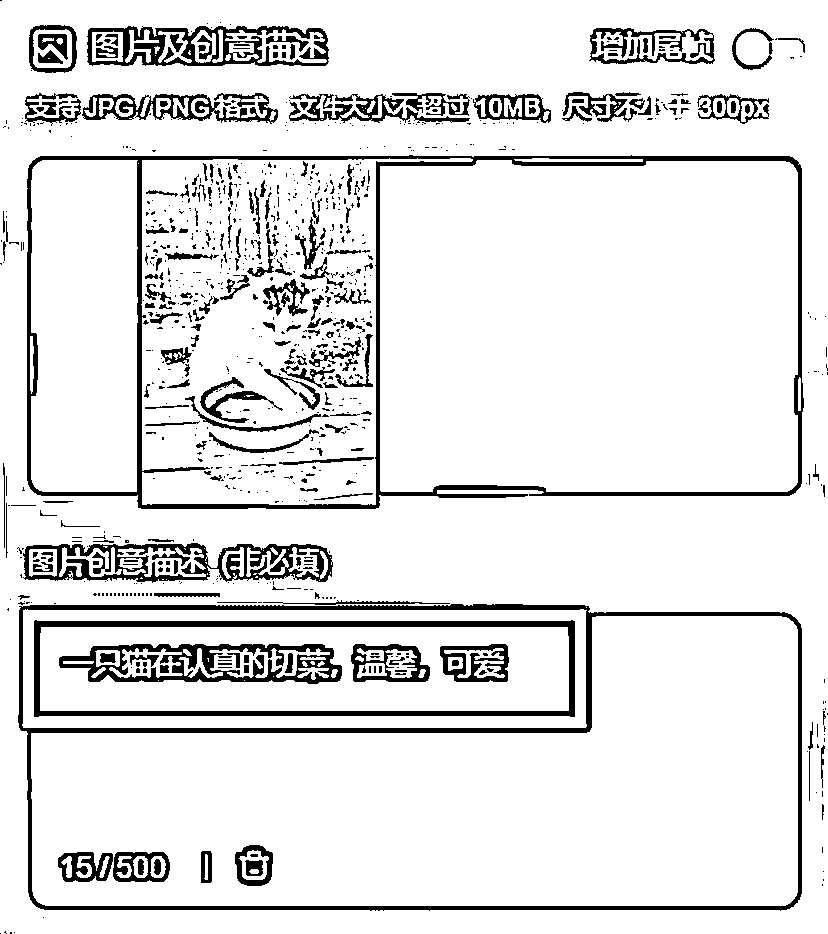
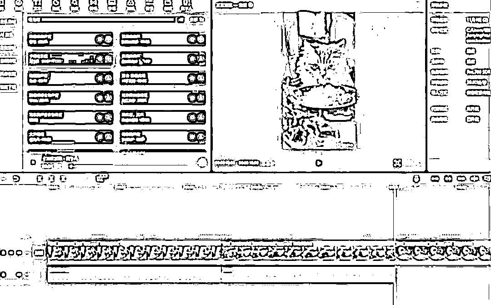

# AI 生成猫咪做饭视频，10 条作品涨粉 2 万，教程来了

> 原文：[`www.yuque.com/for_lazy/zhoubao/hvfe3mk5pht94w85`](https://www.yuque.com/for_lazy/zhoubao/hvfe3mk5pht94w85)

## (56 赞)AI 生成猫咪做饭视频，10 条作品涨粉 2 万，教程来了

作者： 高鹏

日期：2024-11-08

​大家好，我是高鹏。

今天继续分享一个热门玩法。

最近借助 AI 生成的猫咪在农家院里做饭的视频非常火，下面这个视频跑到了 1.5 万的点赞量。

作者发的全部都是这类的视频，只不过就是换一道菜，换一种做法。

这个号也是刚刚发了十几条作品，就涨到了 2 万粉，妥妥的流量密码。

关键不是就这一个号，你看我截图的很多新号，都是通过这种方式把号快速做起来了。

目前商业模式基本上有两种。

一种就是去接商单，可以看他的作品中间会穿插一些商单的信息。

第二个就是带货，带一些宠物周边的用品进行橱窗带货，或者挂车带货。

那么要想做出这种视频，主要有四个步骤。

第一个就是分镜头的提示词，因为猫咪做饭的时候会涉及到很多分镜，每一个镜头都要给到对应的提示词去生成相应的动画。

第二步就是根据提示词来进行文字生成图片。

第三步就是把图片变成视频。

第四步就是剪辑成片。

首先就是分镜头的 AI 绘画提示词应该怎么搞定。我们要做的一个工作就是做动作拆解。

比如说要让猫咪做青椒炒肉这一道菜，那么它有什么样的动作呢？可以构思一下大的动作，你起码要包含这四步。

第一步猫咪洗肉的场景，第二步就是到菜园里边去摘青椒的场景，第三步切肉切菜的场景，第四步就是翻炒的场景。

然后对场景进行简单的描述，借助一款 AI 绘画提示词生成的智能体，它就可以把我们简单的一个场景描述，丰富成一个可以直接投喂给 AI 绘画工具使用的细节拉满的提示词。

比如说我投喂给智能体的是一只猫，在真实的农家厨房切菜。

然后它就给出了很多细节，厨房里边什么样，周边的氛围什么样，阳光是什么样的感觉等等，都补充出来了。

用同样的方法把分镜头的每一个场景都做出提示词来。

有了提示词之后，接下来就是分场景文字生成图片了。我们用到下面的 AI 绘画工具，用它 AI 作图里的图片生成的功能。

进去之后把上一步得到的提示词粘进去，然后一定要导入参考图。

我们要通过垫图来保证我们图片的这种风格的一致性，实现我们所要达到的目标效果。

有了图片之后，就是用 AI 把图片转成视频。用到这个工具的 AI 视频。

点进去之后有两个板块，一个是文字直接生成视频，再一个用图片来生成视频。我们用到的是它的图片生成视频的功能。

我们把上一步得到的图片上传上去，然后下面再添加一个简单的描述词就 ok 了。

比如说一只猫在认真的切菜，温馨，可爱。然后就把图片转成了生动的视频。

因为这些视频都是一段一段的，接下来我们就是要剪辑成片。

我们把所有的片段导入到剪辑工具里，然后再添加背景音乐，这个视频就制作完成了。

总的来说制作起来并不复杂，只不过很多细节的步骤很多人可能不太清楚。有很多新号都是几天的时间就完成了起号，还是比较厉害的。

好，今天的分享就到这里了。

关于刚才我用到的 AI 绘画提示词生成的智能体，包括 AI 绘画工具以及 AI 图片视频工具，统一放到文档里了：

[`svj4gxvm0v3.feishu.cn/docx/OfHEdrbGSoDDhWxvOgdcv2B9nNM?from=from_copylink`](https://svj4gxvm0v3.feishu.cn/docx/OfHEdrbGSoDDhWxvOgdcv2B9nNM?from=from_copylink)

我是高鹏，深耕网创 9 年，这是我拆解的第 687 个项目玩法，平时喜欢拆解各类变现项目，也喜欢广交朋友~

* * *

评论区：

狼牙 : 怎么联系，红包咨询操作细节[调皮]

叮咚姐 : 高老师，怎么联系你呢？

高鹏 : 可以联系鱼丸对接哈

高鹏 : 现在应该是只能联系鱼丸对接