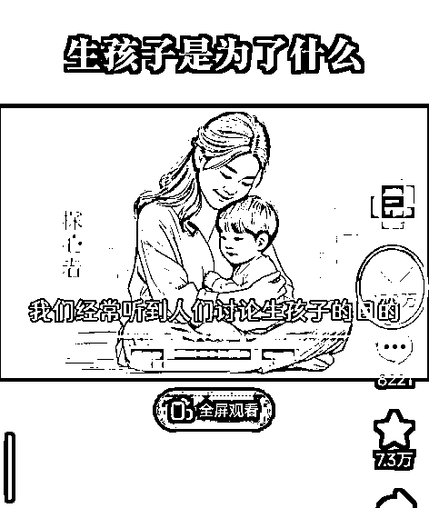
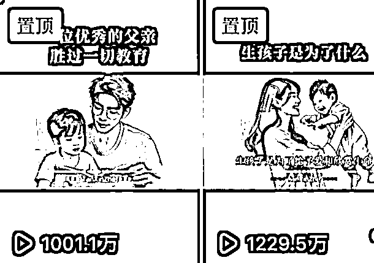
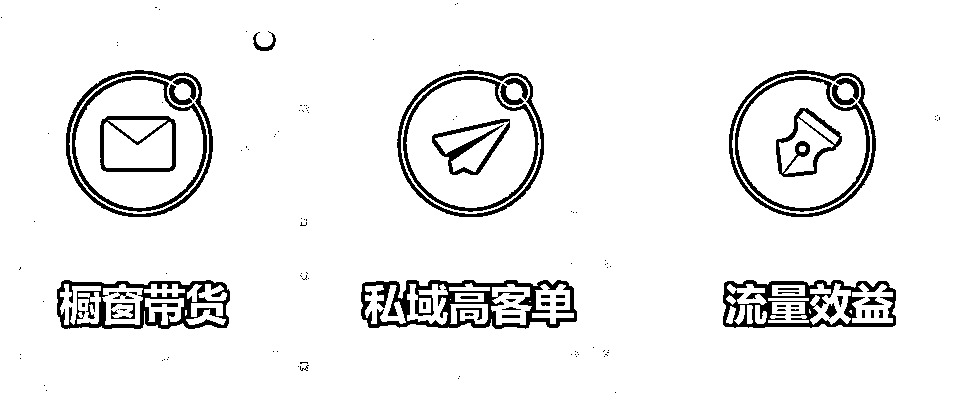
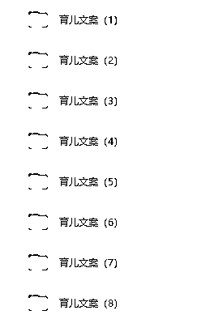
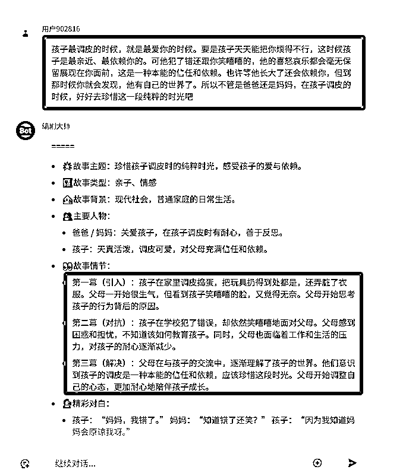
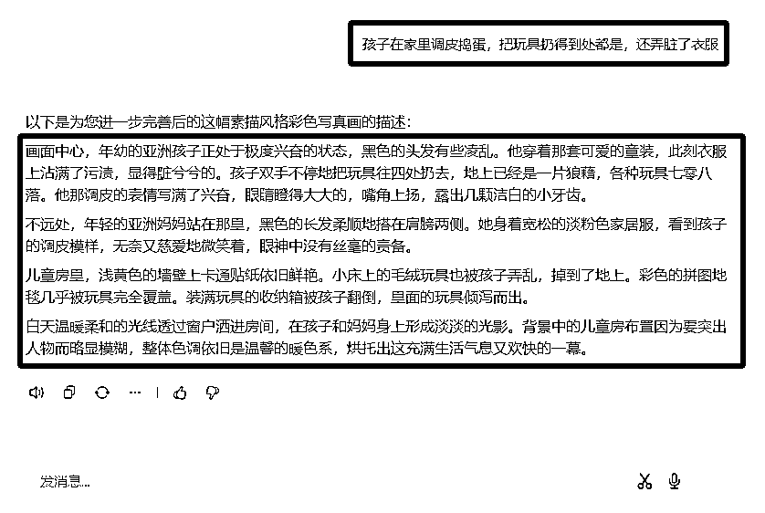
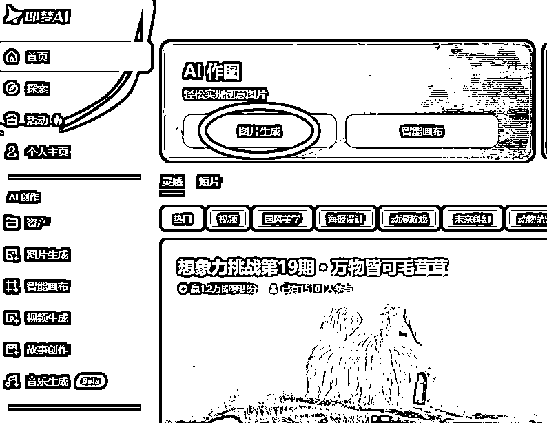
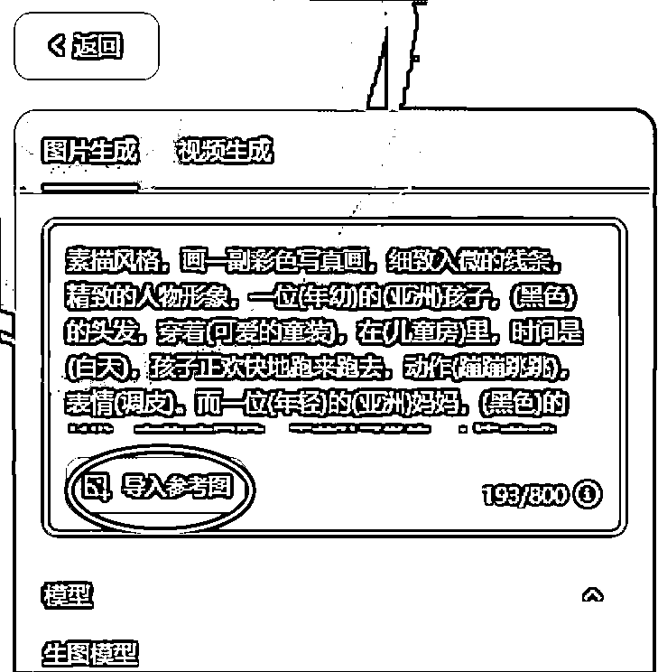
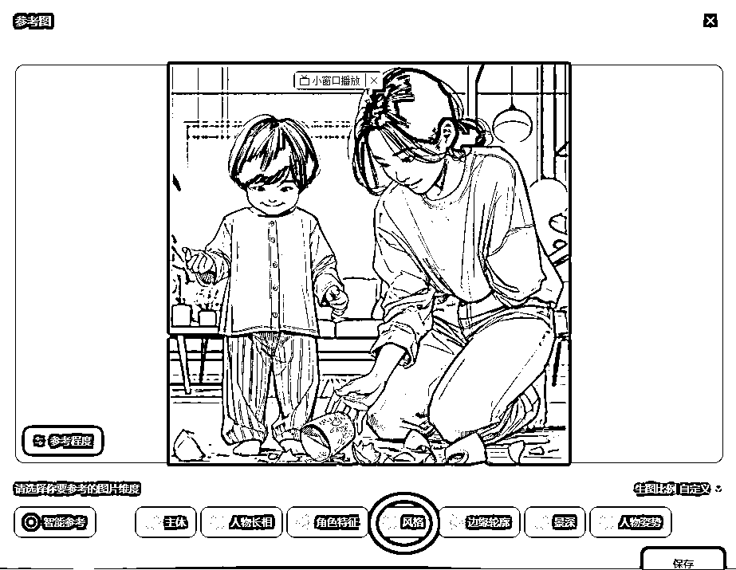
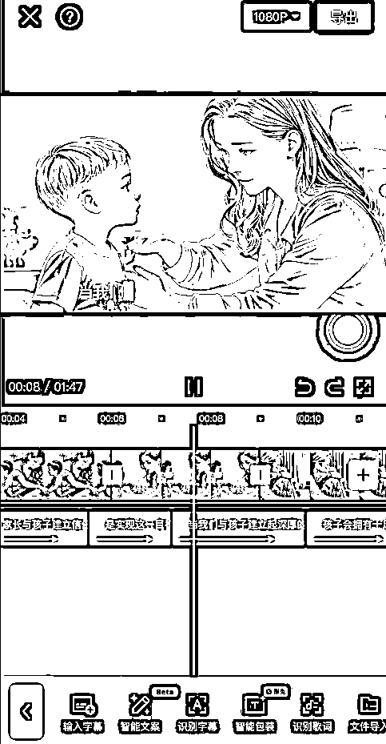

# 借助 AI 做素描画育儿视频，爆 1000 万播放量，附教程攻略

> 原文：[`www.yuque.com/for_lazy/zhoubao/nf2qvg5ta9o3vkkg`](https://www.yuque.com/for_lazy/zhoubao/nf2qvg5ta9o3vkkg)

## (47 赞)借助 AI 做素描画育儿视频，爆 1000 万播放量，附教程攻略

作者： 高鹏

日期：2024-11-06

大家好，我是高鹏。

今天继续分享一个热门玩法。

最近用 AI 做的家庭教育育儿的短视频，数据非常厉害，比如这个号发的很多作品都跑到了千万级的播放量。

还有这两条千万播放量的视频，都是同一个号发的。

而且育儿赛道很容易做商业化，商业化的模式主要有三种。

第一种育儿号做起来之后，带一些跟育儿相关的货品做橱窗带货，什么育儿类的书籍，幼儿早教产品等等都是不错的。

第二种模式，可以直接沉淀到私域做一些高客单的业务，比如说一些育儿类的课程。

第三个模式，就是去吃一些流量的效益，因为育儿这个赛道，它的流量本身就比较大，参加一些创作分成计划等等都是不错的。

这种借助 AI 生成的素描育儿视频，基本上通过三个步骤来实现。

第一个就是怎么样搞定这种特别攻心的育儿的文案。

第二步就是怎么样根据这些文案把它转化成 AI 提示词，然后再用 AI 生成这种素描风格的绘画。

第三步就是把文案进行配音，然后把多个画面进行剪辑成最后的片子。

育儿的文案大家千万不要自己去做原创，因为这个文案非常关键，能不能火就看文案是不是够攻心，是不是能够引发大家的情绪共鸣。

有了文案之后，接下来就是怎么样根据这些文案，借助 AI 把文案里边的场景给它用素描的形式绘画出来。

其实它这个画面就是一张一张图片的轮播完成的，这个图片跟文案里面描述的场景非常的相符。

图片的生成要进行几部的操作，首先就是要把文案里出现的故事情节拓展出来，我们所要用到的工具就是 AI 聊天工具。

但是这个 AI 聊天工具如果你自己去配置的话比较复杂，在这儿我直接给大家提供一个现成的智能体。

现在大家看到的第一个红框，是我找到的文案。文案发给智能体它会自动的处理，把里边的故事情节进行丰富。

他把这个故事情节，根据你提供的文案全部都给你补充出来了。在这里你要把它挑选出来一个一个的小场景。

比如说第一幕，就是孩子在家里调皮捣蛋，把玩具扔的到处都是，还弄脏衣服，这就是一个固定的场景画面。

这个场景出来之后，是不能够直接投喂给 AI 绘画工具，中间还要做一步工作，就是根据这样的一个简单的描述，生成专业的绘画提示词。

我们还要用到另一款智能体，比如说第一个红框，就是刚才摘露出来的一个小场景，丢给智能体之后，它就把整个画面进行了一个非常饱满的丰富，生成了下边这个大框里边的这一大段。

这一大段就适合直接投喂给 AI 绘画工具了。

这儿用到的是即梦，用它的 AI 图片生成功能。

把刚才得到的描述词直接粘到里边，接下来还有非常重要的工作，就是导入参考图。

参考图我们在导入之后，一定要选择参考的是它的风格，而不是其他的东西，然后点保存。

接下来它就会根据咱们的描述词生成了同样风格的一张图片，同样把文案里边出现的其他场景，按照这样的流程逐个的生成不同的图片。

图片都生成完了之后，来到第三步，就是配音和剪辑。

这个配音非常简单，我在之前也跟大家分享过很多次，比如说这样的一款配音工具，有很多配音的主播。

风格建议选择超强情感里，解说出来比较有情感有感染力的风格，把文案进行配音。

最后把配音，还有刚才得到的图片同步导入到剪辑工具里，中间可以添加一些转场，调节图片的时长，添加一个 BGM，这个视频就制作完成了。

今天的分享就到这里了。

关于刚才提到的 AI 绘画提示词完善的智能体，包括参考图，育儿的文案合集，其实这些工具我之前也都分享过，可以翻一翻我之前分享的帖子哦。

我是高鹏，深耕网创 9 年，这是我拆解的第 685 个项目玩法，平时喜欢拆解各类变现项目，也喜欢广交朋友~

* * *

评论区：

小 who : 请问这个怎么变现呀？

看好你 : 这个太适合育儿英语变现了，我手里有英语启蒙课程 有绘画 有真人视频课

江大虾 : 卖书，付费打

Caesar。 : 育儿文案是去淘宝、PDD 等渠道买吗？

亦仁 : 很好的案例，这个如果能深度调研下，看看目前这类账号是怎么变现的，变现状况如何，有哪些同类的也在用这种方式变现，就更好了