# 借助 AI 和开源软件，方便的阅读公众号所有文章 -使用 AI 实现个人需求实例分享

> 原文：[`www.yuque.com/for_lazy/zhoubao/sy02y3rf33wbbmlh`](https://www.yuque.com/for_lazy/zhoubao/sy02y3rf33wbbmlh)

## (13 赞)借助 AI 和开源软件，方便的阅读公众号所有文章 -使用 AI 实现个人需求实例分享

作者： 彩笺

日期：2024-11-04

我在阅读某公众号的全部内容的时候，我期望从最早的时间线阅读全部系列文章。在微信生态内，阅读体验很差，我只能倒叙阅读，并且当我有事再次阅读的时候，我需要记录断点，下次再翻到同样的位置阅读。

借助 AI，花半个小时把解决自己的需求

在上上一期的阮一峰科技周刊里面，我看到过这么一个开源软件：

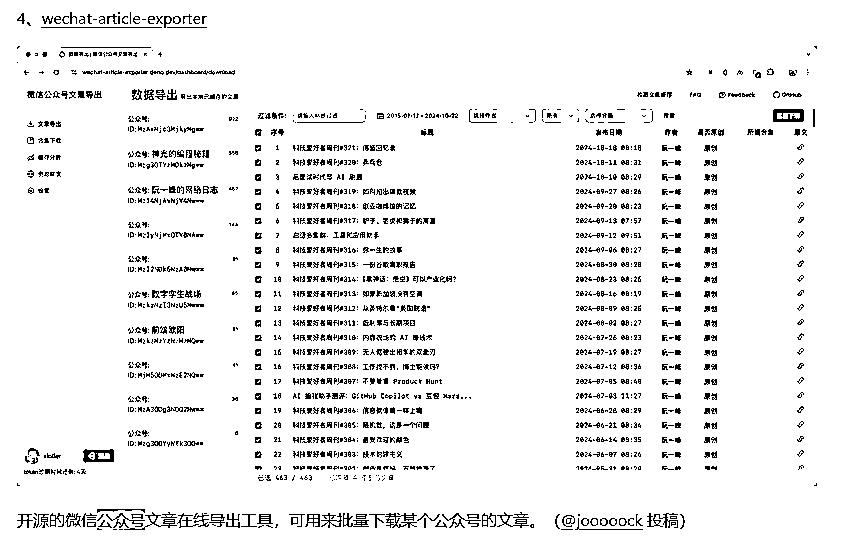

项目链接：[`github.com/jooooock/wechat-article-exporter`](https://github.com/jooooock/wechat-article-exporter)

打开项目页面，在 About 页面发现有体验链接

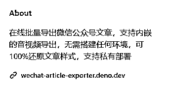

打开链接按照指引操作之后我发现，还是不能满足我的需求

文章只能单篇下载，并且下载之后是压缩包格式，压缩包内的文章是 html 格式

我期望的是我能把所有的文章，或者对应链接汇总到一起，方便我实时查看

但是可以看到的是，每一篇文章都有一个点击的按钮：复制链接，那么我们可以借助 AI 把整个网页的复制链接全部拷贝下来，然后点击就能查看

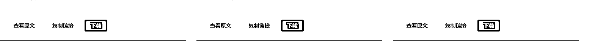

## AI 实操

打开 gpt

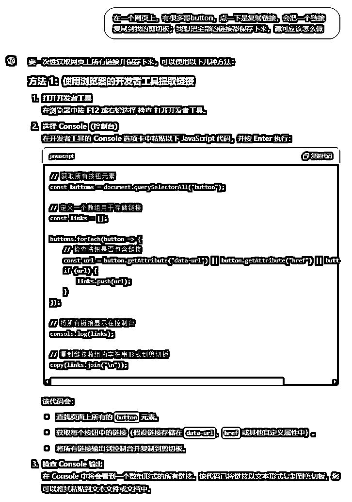

"F12"打开控制台

在控制台内输入代码

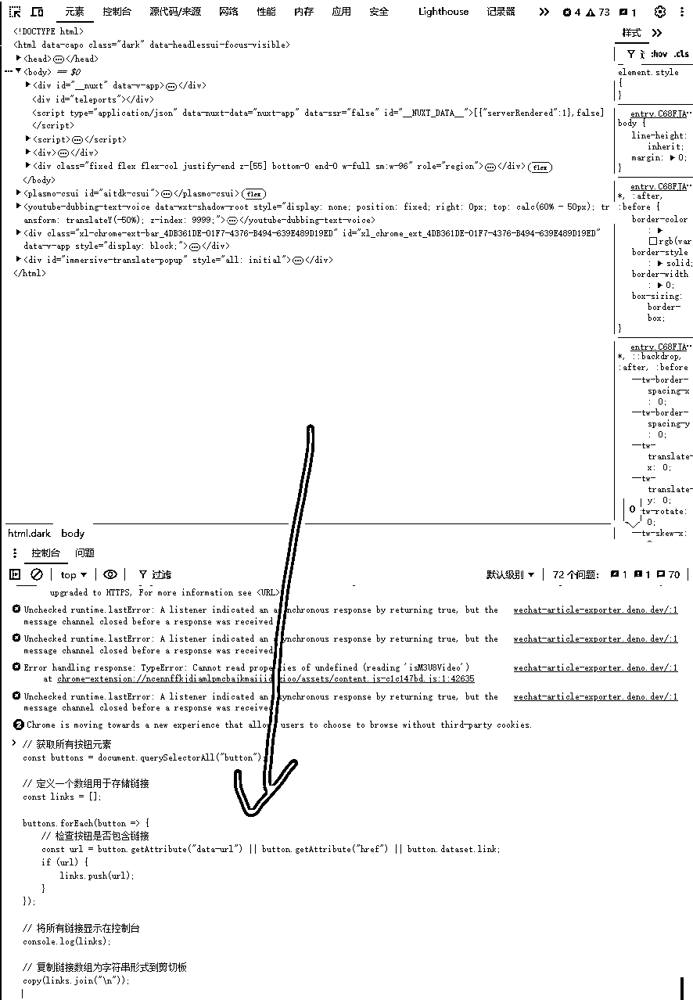

发现输出为空。这时分析发现，代码注释里面提到了检查按钮是否包含链接，那么我们在浏览器里手动检查一下按钮

在 F12 控制台页面左上角有个箭头，点击一下之后，再点击网页上的元素，就会定位到具体的代码

我们定位一下“复制链接”的按钮

好像看不到链接，问一下 AI

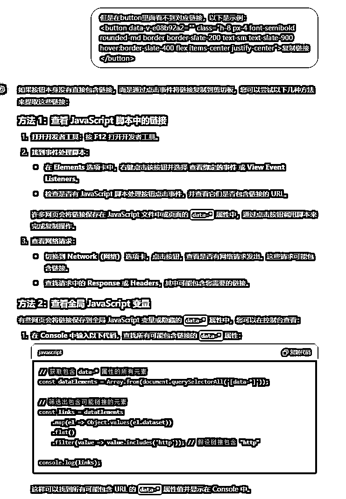

此时可以顺着 AI 的思路往下走，但是此时我发现了网页上除了“复制链接” 还有“查看原文”

我点击查看原文之后发现，按钮背后是有链接的

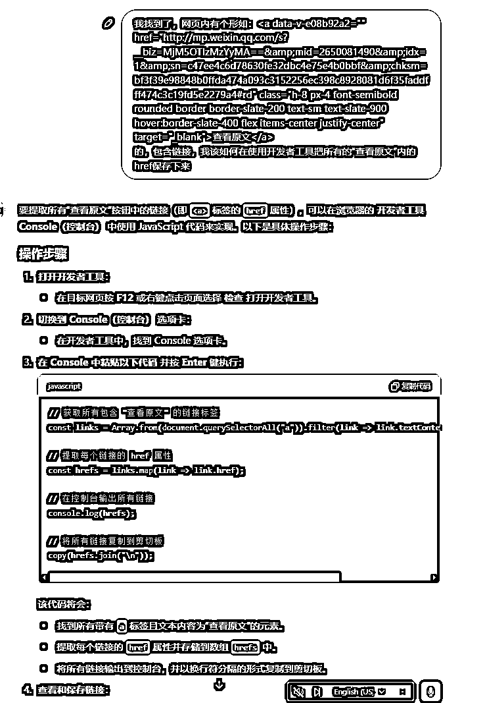

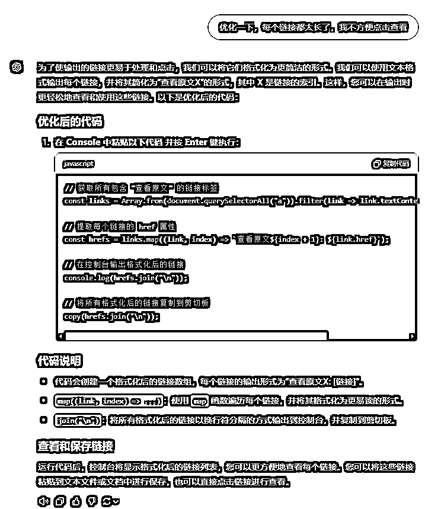

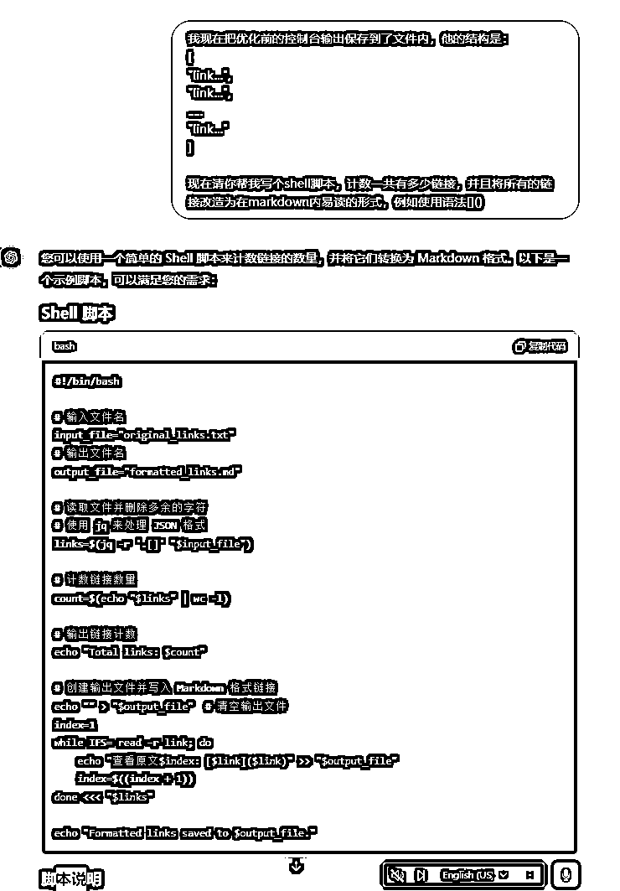

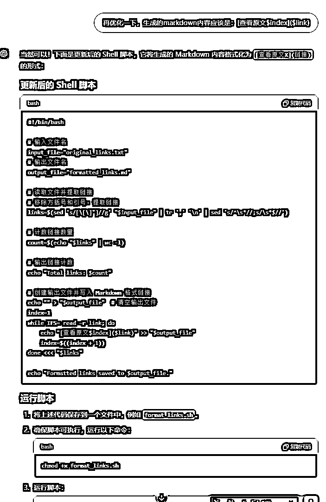

通过几轮的对话，我得到了一个方便查看的链接列表：（实例中使用了 shell 脚本，windows 下可以下载按照 python，提示 gpt 给你写 python 脚本也是一样的）

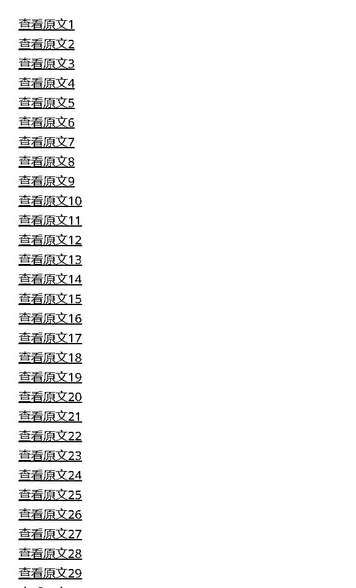

这样我就得到了一份 markdown 文件，我只需要 ctrl + 点击就能直接打开页面

实际看了一部分之后，我发现一直坐着看太累了，睡前我想用手机看的时候很不方便，于是继续找 AI

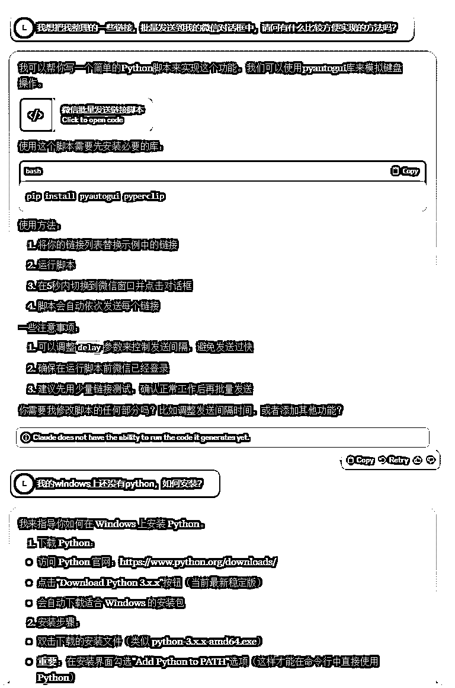

首先我把需求简单描述给了 claude（切换 AI 是我点到谁就用谁）

它提示我可以使用 python 脚本实现，但是我的电脑没有按照 python，继续问他如何安装

安装好之后继续

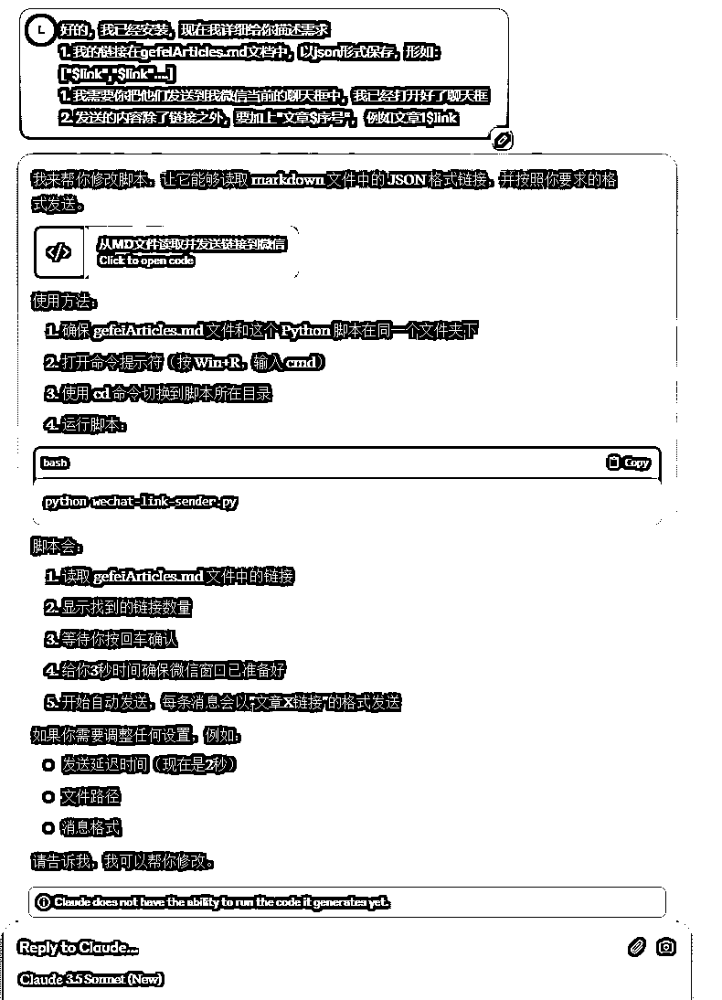

我详细的描述了我当前链接形式是如何的，我期望得到什么结果，分析好之后，AI 给出了代码。

在本地环境运行 python 代码`py youcode.py`，于是我得到了这么一个结果。

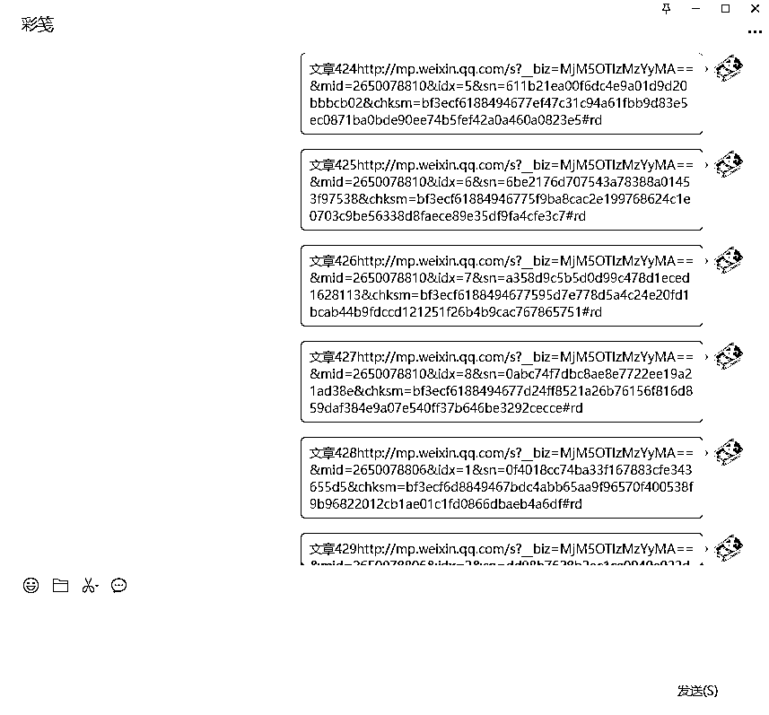

成功的把所有的文章发送到了我自己的对话框，当我用手机查看的时候，点击就会自动打开对应的公众号文章。

最后分享一个收纳的方法：

在公众号文章界面点击右上角的三个点

选择在微信读书打开

在微信读书里面你会多一本书叫做“文章收藏”

打开收藏就是你所有的用这种方式打开的文章列表，点击就能查看

* * *

评论区：

七天@生财有术 : 这个项目还会有更大的商业价值么，比如可以做一个小工具，帮助很多人做定位？

彩笺 : 我没太看懂“帮助很多人做定位“这句话的意思，请问可以更详细的说明一下嘛？