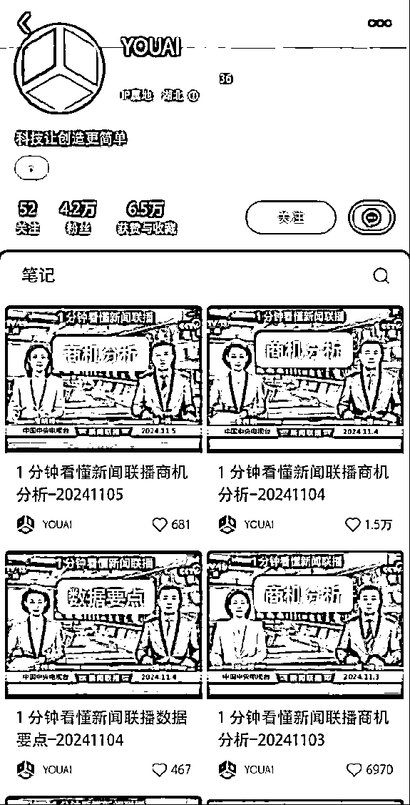
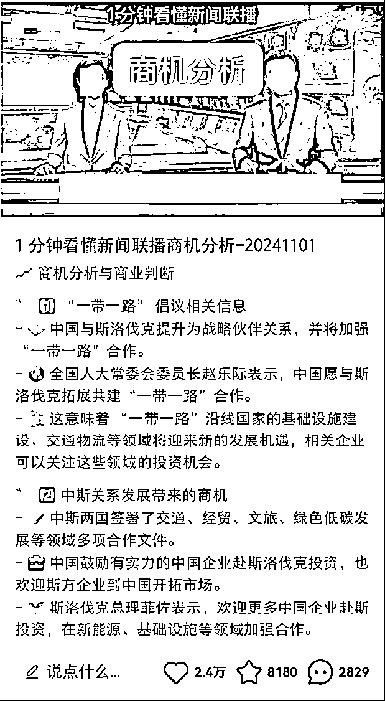
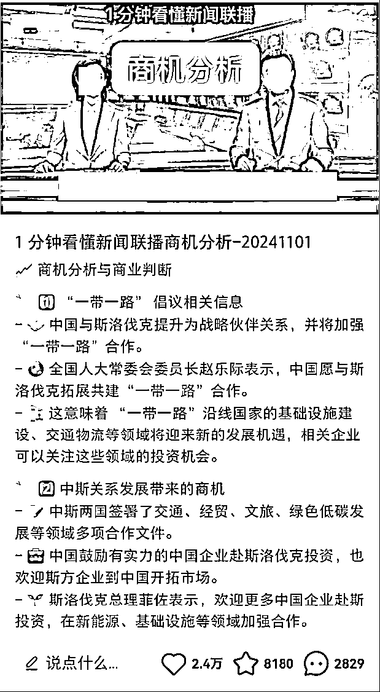
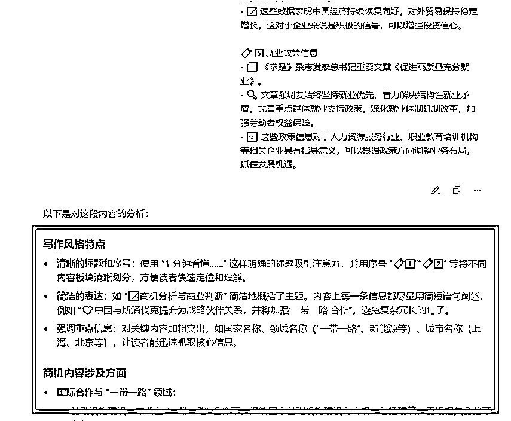
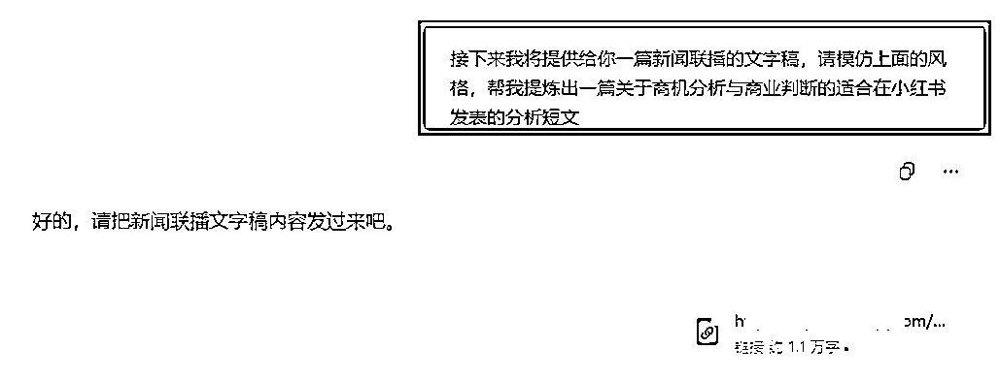
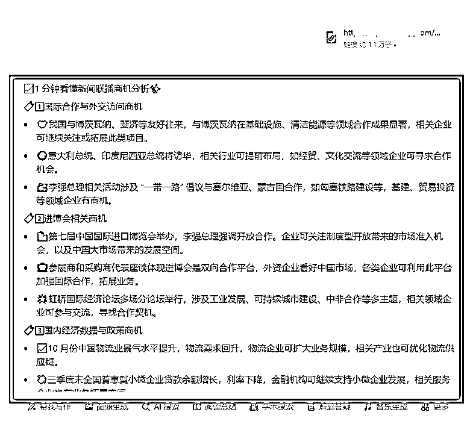
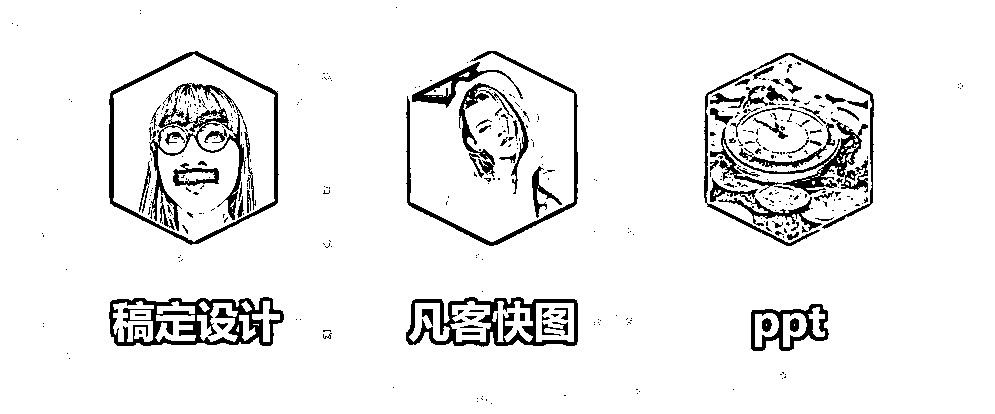

# 新号 9 天暴涨 4 万粉，小红书 AI 新闻解读快速起号玩法，附教程攻略

> 原文：[`www.yuque.com/for_lazy/zhoubao/ypcioumdzum9fnue`](https://www.yuque.com/for_lazy/zhoubao/ypcioumdzum9fnue)

## (19 赞)新号 9 天暴涨 4 万粉，小红书 AI 新闻解读快速起号玩法，附教程攻略

作者： 高鹏

日期：2024-11-07

大家好，我是高鹏。

今天继续分享一个热门玩法。

把当天的新闻联播用 AI 进行商业分析发出来，涨粉太快了，下面这个博主是九天前刚注册的这个号，仅仅发了十多条作品就涨粉四万多。

这是某红书上比较少见的快速起号案例，重点是它的内容全部都是用 AI 自动化完成的，内容的主题都是一分钟看懂新闻联播。

这种图文的作品封面都是固定的封面，可以看一下它的作品的形式，基本上就是一张图，然后下边都是商业分析的总结。

这条作品跑到了 2.4 万的赞，流量非常厉害。

这种号做起来后商业化模式怎么做呢？我给大家总结了四种。

第一种就是可以把流量沉淀到私域，做商机人脉的社群，在里边专门分享一些商机人脉的链接。

第二个就是做趋势研判的社群，发一些关于趋势研判的相关的一些信息。

第三种就是带商业类的一些书籍。

第四类就是给垂直赛道进行铺路，因为某红书它有一个特点，就是这个号不管发了什么内容，它爆了，你后边再发哪怕不一样赛道的内容，它也容易跑出数据。

所以这种作品就非常适合给垂直赛道进行铺路，把这个号权重给快速拉起来，然后再去嫁接其他的内容。

接下来就给大家详细的解读，怎么样做这种 AI 新闻解读的账号。

像刚才那个号的作品形式，其实就是一张首图。然后下边就是商业分析和商业判断的总结提炼。

这张图非常简单，就是截图随便加几行字，这个非常容易搞定。

最关键的是怎么样把当天的新闻联播里，关于商业分析的内容借助 AI 总结提炼出来，这是最核心的一个技术难点。

首先用到的方法就是 AI 投喂法，先给 AI 这样的一段文字：我将提供一段对于一些新闻联播里关于商机有关内容的总结，请深度学习这种某红书的写作风格，以及其提炼的商机内容都是哪些方面的。

然后 AI 回复他说：好的，请把新闻联播有关商业内容的总结发给我吧。

我把对标作品的结果直接发给他，然后就进行了一个分析，说用了一些符号等等，商机内容都涉及哪些方面。

接下来我继续在这个页面上给 AI 投喂指令，我说：接下来我将提供一篇新闻联播的文字稿，请模仿上面的风格，帮我提炼一篇关于商机分析与商业判断的，适合在某红书上发表的分析短文。

然后他就输出了跟咱们对标作品内容非常相似的内容，而且提炼出来的这些都是干货的商机信息。

还有非常细节的，帮你把这种格式完全按照某红书的风格进行了打造，包括前面的符号都帮你添加好了。

我觉得他给到的结果基本上可以直接用，个别的里边感觉不合适的地方稍微修改一下，这篇笔记就可以直接去发表了。

至于这个新闻文字稿怎么搞定？其实有很多地方都把每天的新闻联播视频内容整理好文字稿了。

这个文字稿不用咱们自己去整理，直接拿现成的链接投喂给 AI 就可以了，至于这种文字稿去哪儿搞定，这个我在文章的结尾会给大家提供。

最后就是顶部的配图，这个图片非常简单，一看就知道怎么做了，就是把联播的画面进行截图，然后加上两行字。

很多工具都可以搞定，比如说网页版的稿定设计，凡客快图，包括用 PPT 都可以。

好，今天的分享就到这里了。

关于刚才提到的排版工具，以及每天的新闻联播对应的文字稿，用到的 AI 工具和指令，用到的 AI 工具和指令，统一放到文档里了：[`svj4gxvm0v3.feishu.cn/docx/KSTtdUx79oUwhgx0HzmcVFd4nNh?from=from_copylink`](https://svj4gxvm0v3.feishu.cn/docx/KSTtdUx79oUwhgx0HzmcVFd4nNh?from=from_copylink)

我是高鹏，深耕网创 9 年，这是我拆解的第 686 个项目玩法，平时喜欢拆解各类变现项目，也喜欢广交朋友~

* * *

评论区：

东兴 : 你好 有张图片不显示呢

更绪 : 牛逼

傻傻的 : 你好，我按你的提示词操作，豆包分析新闻联播新闻稿的时候说他无法回答，请问您有遇到这个问题吗？这个得怎么解决呢

黄篁(huáng) : 太牛了

元启 : 怎么链接下

亦仁 : 这种涉政 容易死号 别碰