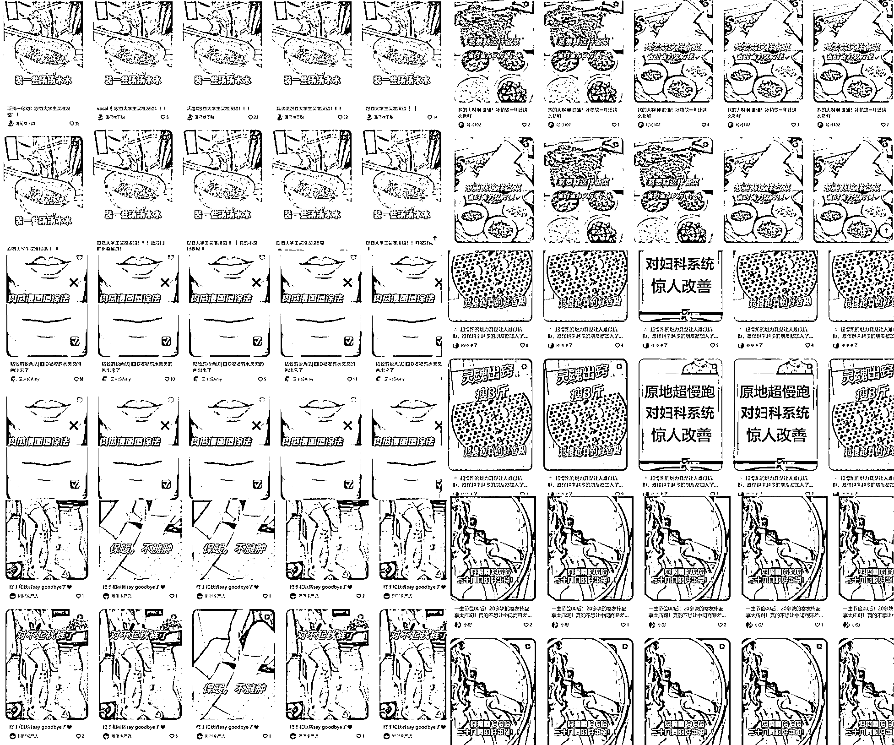

# 小红书店铺近期混剪怼量玩法分析

> 原文：[`www.yuque.com/for_lazy/zhoubao/ag3f0hnh7qkiubq4`](https://www.yuque.com/for_lazy/zhoubao/ag3f0hnh7qkiubq4)

## (11 赞)小红书店铺近期混剪怼量玩法分析

作者： 曜文

日期：2024-11-04

哈喽，我是曜文

近期大家是不是有看到非常多的店铺一天 10-30 条笔记，封面标题都一样，一天能出几十上百单

我特地在后台检测了一批账号，并且测试了一下

发现这确实是一种简单粗暴，在平台没有大规模风控的情况下一家店差的一个月能卖个上百单，好的能卖个三五千单。

但，不要冲动， 在平台多次打压批量混剪低质量内容的情况下需要理解其中的逻辑，否则三五天号就被封了

下面我继续给大家拆解一下玩法和避坑点

**先随手截几个号感受一下~**

# 一，为什么这些账号能存活，而有的账号两天就被封号？

批量怼量的内容能够存活取决于几个方面

1.混剪去重参数

常规的去重参数，贴纸、画中画、滤镜、字幕、片段，翻转，镜像，抠像，等，这些参数的数量增加，让内容能够更好的让系统识别不出来，但还是有几率被提示非原创素材，最直接的解决办法就是打上原博主的水印标注转载来源。

2.账号权重相对比较高

在注册账号的时候有些账号本身随便发小眼睛都能跑的很好，而且在前面一周不被查非原创，这种账号抗封能力相对比较强，不容易挑违规，这个取决 IP 环境，如批量在同一个地方即使一机一号注册出初始高权重的账号几率也是偏低。

3.视频内容重复率低

3 秒一个片段混剪成 60 秒到 90 秒的一个视频内容需要大量的搜集素材并且进行分割整理好素材文件进行批量混剪或实时关注 dy 的最新素材进行素材替换。

为什么有的账号频繁出现非原创直接限制流量

这些账号有一部分是之前违规过又恢复流量的容易被查处违规

也有一些账号直接拿原素材直接去重，但去重力度不够导致跳非原创

而有的新号如果出现超过 3 次基本就直接限制流量

要么本身账号权重高，之前没违规过，账号内容不低质，跳多次都不会限制流量

要么是本身账号新注册发几条之后出单了，但视频素材无更新，账号直接 3 次提醒后被限流

还有一个是批量账号都在相近时间发送笔记被系统查处

# 二，行动路径是怎么样的？想要尝试怎么拿到结果？

要知道这种批量操作的方式平台肯定会查，至于什么时候查，可能是双十一后再来清算，毕竟平台也想在双十一期间做出更多数据，而且小红书这个平台不定时抽一下，查处的时候查一批，查完之后又开放，这是经常的事情，所以小红书就像个渣女一样，时不时给你点机会给你点甜头。哈哈

大多数账号都是 1+3 就是一个企业号，加 3 个专业号主理人，通过这三个专业号来怼量，毕竟成本低，只需要一个实名，账号被封了就解绑注销，企业号还是可以一直用，没有丝毫影响。

有几个方向大家可以参考一下：

1.选品，这个产品之前是爆款，而且验证过素材很多，小红书有爆款封面，或者季节性产品，比如现在秋冬，之前的一个爆款身体乳手套，就适合这个季节，而且素材非常多，适合素材更替，或细分赛道的品，这个品关注的人不是那么多，比如，一些爆款二手书，功效类的产品。

2.账号，例如，3 个主理人账号，可选择一个品或者三个品来怼量，一个账号一天分配 5-10 条内容分开时间测试，提升爆款率，但是这个爆款率，每个账号都不一样，取决于几个因素，本身账号垂直度，剪辑素材，选品，和封面标题。

3.行动，准备账号-选品-把素材都拔下来-找到爆款封面爆款标题-剪辑-素材 10 条内重复度低-提升去重参数-测试发送时间-测试爆款封面标题

一旦数据好就每天做好内容批量发送即可，少的话每天十来单，多的话每天百来单，一天一两千单的基本很少很少，这个概率很低，至少我看到监控的账号几乎没有。

这件事情想要拿到结果有几个点：

素材的搜集能力能不能把产品的现有素材搜集并且整理分配好

然后用批量剪辑工具批量剪辑，解决素材问题。

爆款封面和标题 3 个左右验证过的，直接把数量怼上去。

账号多，几率大，20-30%的爆款几率，需要做好 100 篇笔记最少的准备，10-20 天左右的时间。

没了，就这么简单，但是说简单也简单，没有尝到小红书甜头的还是很少人能坚持 20 天，而且也说到了本身存在几率，不一定人人都能成为爆款，但是毕竟做了才有机会。

# 三，平台多次查处混剪低质量内容这种方式还能玩多久？

现在通过这种方式变现还来得及吗？

如果多个账号用这种方式并且有一定的选品经验和剪辑经验是来得及的，如果零基础觉得随便发发就能出单那是不存在的，小红书这个平台没有回到 23 年初，而是他近期想要做好电商数据审核力度降低给一些创作者机会，而被测试出来的一种玩法

账号被限制那是早晚的事情，有可能是一个月后也可能是两个月后，也有可能是你是天选之子，发了 10 条就卖了 1000 单，毕竟自然流存在着一定的随机性。

个人觉得如果本身有多账号并且矩阵在运营，是存在着一定的机会的

如果没有接触过小红书店铺，想要从零开始去搭建矩阵账号很有可能准备好账号设备，这个机会就结束了。

但，混剪还能不能做？任何平台都还存在混剪小红书混剪一定是能做的，只不过需要随着平台的审核提升运营剪辑的方式。

以上，希望能够给到大家一点思路，谢谢大家的阅读~

* * *

评论区：

更绪 : 1+3，3 个主持人账号应该也要实名吧？

曜文 : 是的

wbdlxc : 说的太对了，有些天选号一天 30-40 条视频，而且是同一个视频反复发，平台都不限制[撇嘴]

华龙 : 你看到的表面是同一个视频，其实人家做过深度去重的

藤条儿 : 请问三个主理人账号实名，是需要不同的身份证实名吗？

曜文 : 是滴

wbdlxc : 我不信啥深度去重哈，无外乎它跑起来了，平台不管它罢了