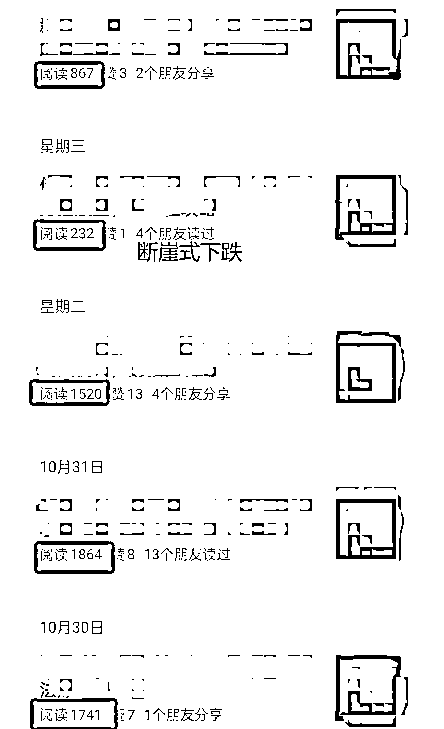
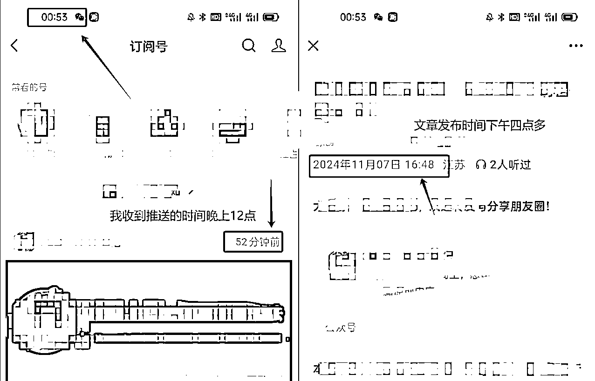
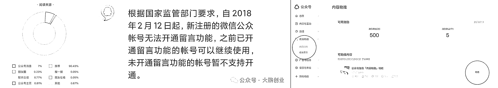
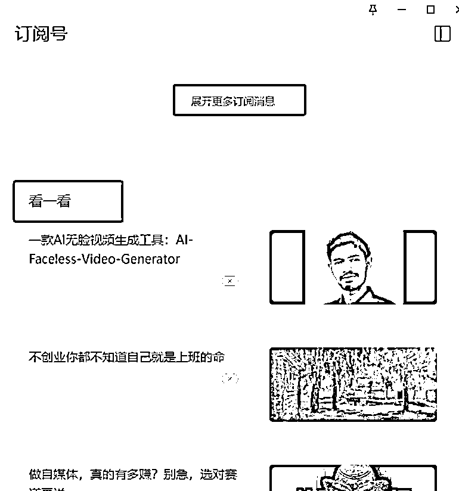

# 公众号流量断崖式下跌，怕不是也出“铁粉机制”了！

> 原文：[`www.yuque.com/for_lazy/zhoubao/oes61y5l1yfnrrmx`](https://www.yuque.com/for_lazy/zhoubao/oes61y5l1yfnrrmx)

## (25 赞)公众号流量断崖式下跌，怕不是也出“铁粉机制”了！

作者： 大鹏

日期：2024-11-08

大家好，我是大鹏。

如果在做公众号的博主应该能感觉得到，最近公众号流量下跌的厉害

拿我自身举例，我自己的公众号有四五万粉丝

之前随便发一篇文章，阅读量怎么都得 1000+，稍微好点的能到 3000+

偶尔有个小波动但也不会太大

但最最近我发现有点不对劲，发一篇文章经常两三百甚至一两百阅读就不增加了

刚开始我还以为是我公众号违规被限流了，后台查了一下并没有任何提示

然后我就观察了一下其他博主，情况跟我差不多，甚至有些十几万、几十万粉丝大佬最近的文章阅读也都在 500 上下，跟他的粉丝体量完全不搭~

我才知道这种情况并不是针对我个人，而是平台大方向上面的调整

至于具体调整成什么样子了，咱也无从得知，毕竟一个平台的内容分发推荐机制不会对外公开

但以我这么多年做互联网的经验，还是让我摸出了一些道道

**✅********公众号的“铁粉机制”**

昨天晚上十二点多我打开手机收到了一条公众号文章推送

我点开看了一下博主是下午四点多发的， *也就是说这篇文章发布之后并没有像之前一样立马向所有粉丝推送，而是分批次推送*

想到这里我脑子里突然蹦出了一个词儿**“铁粉机制”**

**  **

**✅********什么是铁粉机制？**

做过抖音的应该都知道，抖音的**“铁粉机制”**
就是你在抖音发布的作品会首先推送给你的铁粉，如果这部分铁粉看完数据好，就会继续给你流量，如果铁粉看完之后数据不好，这条作品的流量基本就跑不出去了

难道说，公众号也在效仿抖音，搞**铁粉机制** 了？

当你发布一篇公众号文章之后，并不会像之前一样立马给你分发给所有粉丝，而是会先分发给那些经常看你文章的铁粉，然后再根据他们的完读、互动数据再决定要不要进一步推送给更多粉丝~

这样是不是就说通了，我为什么晚了几个小时才收到那个博主文章的推送

当然以上只是我的猜测，只是我个人的揣测和见解，不一定对

不信的就当看个乐呵~

自从公众号从 23 上半年开始开放流量推荐功能以来，就一直在不断加快**公域化** 的步伐

24 年年初，公众号重启了 18 年停止的**留言功能** ，增加内容互动和反馈

24 年 7 月，万粉以下号主**【内容助推】** 开始灰度上线测试，吸引更多创作者入驻。

之前的这些动作只是在原来公众号运营机制的基础上加了点东西，总体来说改动不算大，对一些本身就有很多粉丝的老博主影响不是太大

他们发文章依然会推送到每一位粉丝，基础的打开率和阅读量还是有保障

但是从今年下半年开始，公众号的动作越来越大了

不仅服务号折叠，公众号订阅消息开始大范围折叠了，取而代之的是大篇幅的推荐版块

也就是说你发布一篇文章虽然说推送给粉丝了，如果粉丝不经常看你的文章，就不会像之前一样直接显示在页面上了

要么是塞在订阅号列表内，要么直接不显示，如果不主动搜索的话，就看不到，极大降低了触达率和打开率

用户的时间是一定的，不看你的文章就看别人的文章，看不到你的文章推送，自然会往下滑去看推荐文章

*也就是变相把你的流量分到了别的账号上面去，打破了原来老号大号垄断公众号流量的格局，给了更多新号机会*

**✅********公众号已经公域化**

以上这些动作算是把公众号的流量分配和推荐机制从原来的私域平台转变成了半公域平台

那这次的这个改动我觉得是把公众号彻底变成了公域平台

所有公域平台之所以能够存活、发展的基础就是内容

没有好的内容，平台就留不住用户，没有用户平台就凉凉

显然公众号也深刻认识到了这一点，从而推出了**“铁粉机制”**

像之前的标题党、AI 洗稿玩法在这个机制面前不堪一击

只有点击率，没有完播率、互动数据依然不给你流量

只有好的内容才能不断获得平台流量，才能被更多人看到

不管你是有多少粉丝，你的内容不行，平台就不会给你流量，除非你的粉丝点进你的主页，不然大部分粉丝都不知道你发了文章

之前做公众号，积攒个几万粉丝，只要认真写不瞎搞，就会有持续不断的深度阅读者，完读率很高，这是公众号给予垂直长期博主的一个立命之本。

但是现在，老博主的流量被不断稀释分给了新人博主，而且分发机制彻底改变

**对新人博主是个机会，对老博主来说是个巨大的挑战**

在这个内容为王的时代

能为粉丝持续输出有价值的内容才是一个 IP 安身立命的根本

而不是之前公众号攒个几万粉就能吃一辈子的时候了

面对这种情况，我的建议是，如果你是做私域的，尽可能把粉丝往微信里面导一导

做私域的基础是触达率，如果你把粉丝都放到公众号里面，不能 100%触达粉丝，公众号里面粉丝再多也没啥用

不如导到微信里面，最起码朋友圈还是可以触达到的~

另一方面，作为公众号创作者来说，只有不断输出对粉丝有价值有深度的内容才能做的更长久，也是最符合平台方向的路子~

别再水文章了，再水都没人看了~

* * *

评论区：

Rio : 早说了不要洗稿，不要逆平台，迟早被收拾

大鹏 : 哈哈~