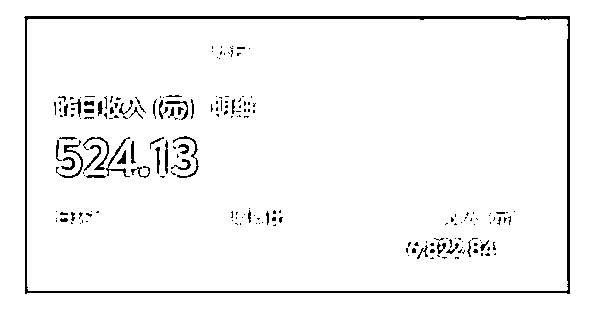
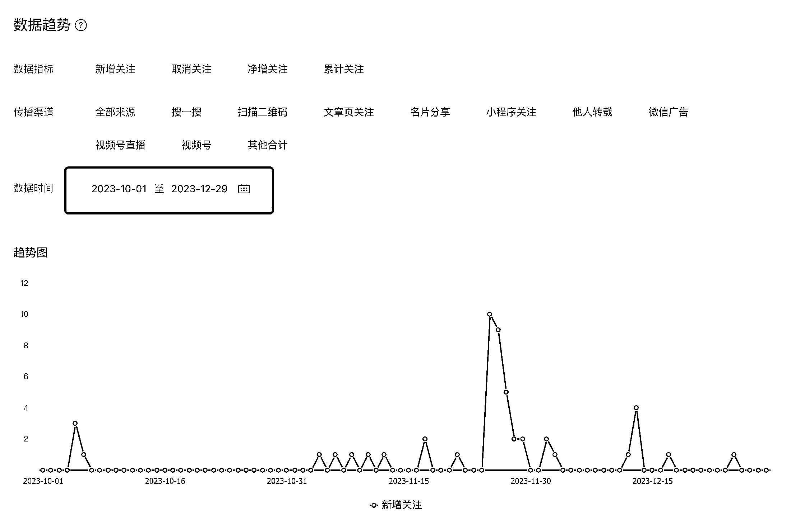
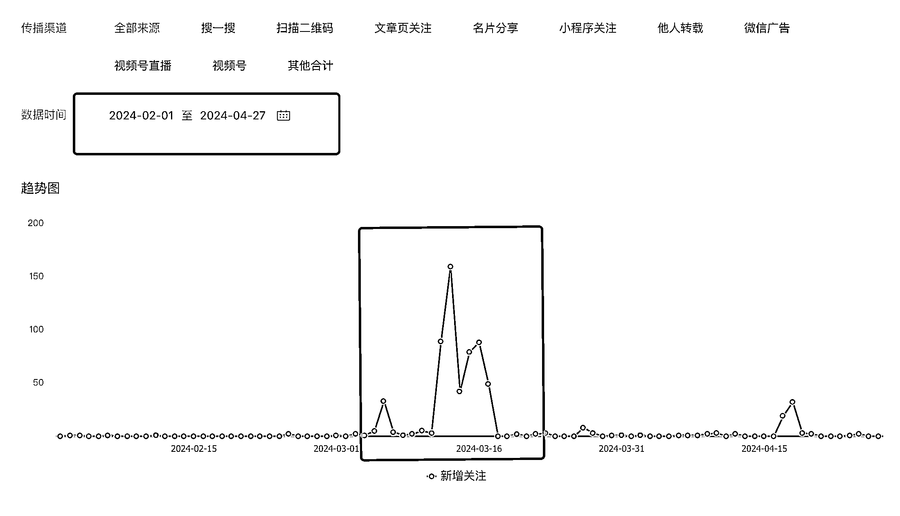
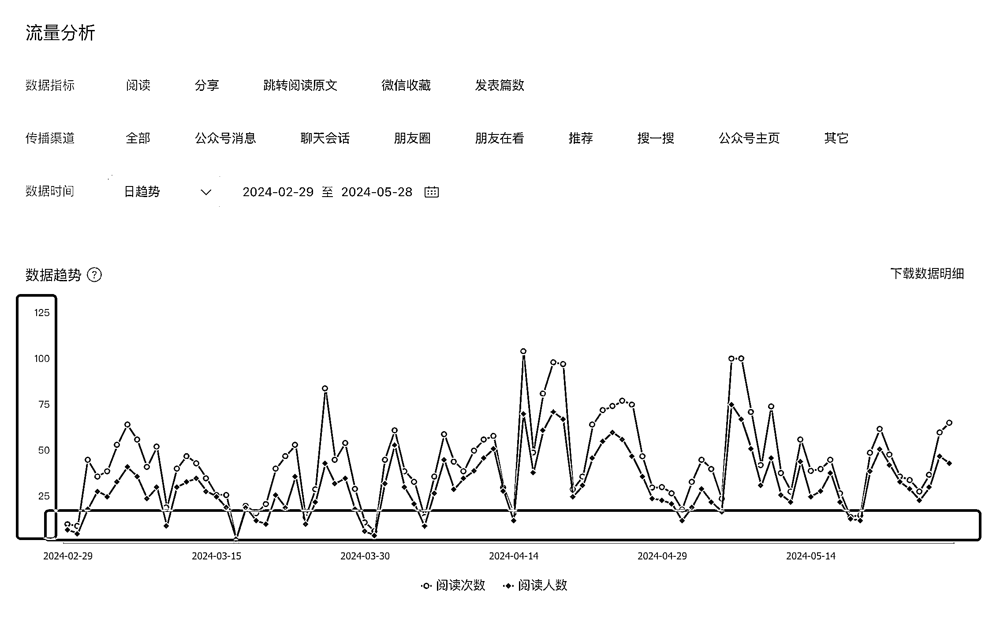
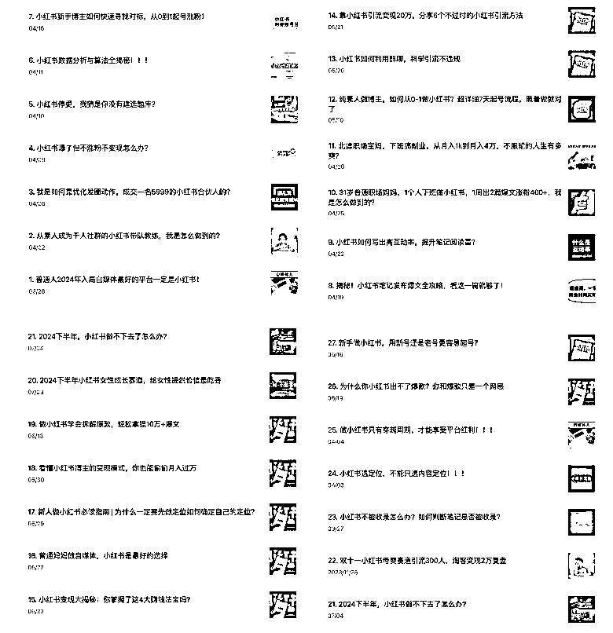
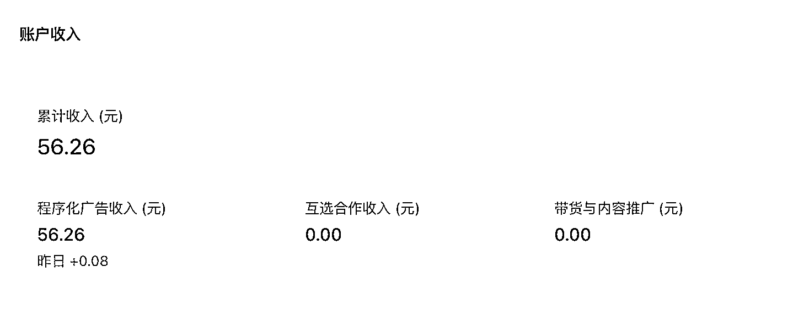
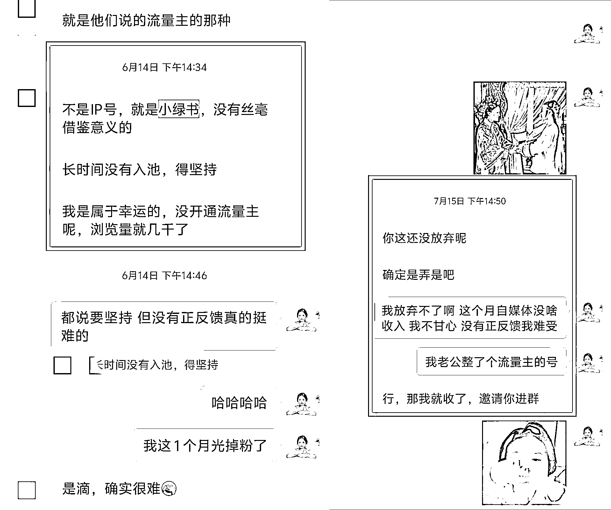

# 公众号流量主：1 个月挣了 6000+，坚持从来不是无意义的重复

> 原文：[`www.yuque.com/for_lazy/zhoubao/akqgq1pzo5ste71t`](https://www.yuque.com/for_lazy/zhoubao/akqgq1pzo5ste71t)

## (22 赞)公众号流量主：1 个月挣了 6000+，坚持从来不是无意义的重复

作者： 董董依依妈

日期：2024-11-07

生财的家人们好呀，自从去年加入生财知道了公众号可以赚钱，但是一直没趟出来，终于在上个月赚到钱了。

10 月份董董流量主的收入达成了 9 月定的月入 5000 的目标。看起来我好像开始做这个项目以后，就是一路开挂，从 8 月份开始做，用了半个多月开通流量主，一直处于高歌猛进，一路赚钱的趋势。

但如果你以为真的是这样，那就错了。我想说的是，在做这个赛道之前，董董经历了大半年的探索，在找适合自己并且起号容易得赛道。

因为去年 11 月份的时候，我就知道公众号流量主是个风口，但是一直不得其所。直到 8 月份遇到一个好赛道，才有了现在的结果。

所以今天想跟大家分享的是：自己坚持与不下牌桌才有结果的故事。

## **1****.** **探索公众号阶段**

自从去年 11 月知道公众号可以通过写文章赚钱以后，我就想着折腾：董董在成长这个号。想着如果做一个 IP 号，既能实现涨粉赚流量主的💰，还能引流私域会很好。

但是做公众号是需要先开通流量主的，你得先有启动资本，也就是 500 粉丝。这个粉丝量虽然不多，但是对于当时的我来说，却觉得遥不可及。

恰好自己进了挺多自媒体圈子的，大家都在做公众号，于是今年 3 月份开始参加一个又一个的训练营，跟大家一起去互关，去做红包拉新活动，就这样来了 1-2 次以后，粉丝达成了 500。

因为也不知道写啥内容，除了月度复盘，其他的也不知道写啥，没成想粉丝不涨反掉了，而且开通流量主并不是说就能实现日入四位数，日入五位数，月入几万，月入十万的。这些只是别人让我们看到的。

更多看不到的，其实是像我这样的，一路懵懵懂懂，慢慢摸索的人，即使没有流量，也在坚持日更，10 天，1 个月，两个月甚至更久的。

那个时候，自己除了会写文章，其他的关于公众号的基础运营知识，如何排版，如何进流量池等等其实了解的都不多。

## **2****.** **更新小红书文章阶段**

过完年我就开始想着今年无论如何都要把公众号给整起来。但是因为不懂排版，我找了个小助理去帮我做排版这件事，我只要输出内容其他的就不管了。妄想通过这种偷懒的方式，赚到流量主的钱。

事实证明，当你不想着去研究平台，去靠外力解决的话，数据会告诉你这条线压根行不通。每次发文章，只有几十的阅读，多的也就 1-200，平台推荐只有 0.1%,0.2%。

说实话挺打击自信心的，那个时候我就想既然推荐流量那么难，那我试试搜索吧。毕竟我还可以从公众号引流人，加入我的小红书相关的课程或者陪跑。

所以我就开始大量更新自己做小红书的心得，小红书的运营知识等等。

虽然这些也没啥推荐流量，但是记录小红书相关的运营知识，确实有给我现在做其他项目带来便利。也算是走对了一步。

就这样一路更新公众号的小红书内容，做到了 6 月份，自己从公众号上的收益只有 2 位数。摸索了半年的流量主，只赚了 2 位数。

这个还不够我团购一天的收入呢，但是我还挺开心的。因为我没有放弃去做这件事，并且我一直相信自己可以的。只是没有找对赛道，我也坚信：凭啥别人可以，我不行。

可能是凭着这股信念，才让我一直坚持到现在吧。

## **3****.** **探索小绿书阶段**

在我一直埋头研究的时候，我的一个私教宝子，去做小绿书，做的风生水起。看的我眼热，她说这个项目简单，每天动动手指，只要做好搬运，一个月能赚到千八百块钱。

我就一直心痒痒，找她问了几次，她也没跟我透露到底做的啥。7 月份就忍不住给她转了 199 的学费，去看看这个项目到底要咋做。

跟着她的课程看了下，发现并不适合我，就是去做搬运小红书的内容，但是赛道什么的都要自己选，我就想着自己反正也在小红书更新育儿相关的内容，那就搬过来吧。

反正也没啥成本，在我做了小 1 个月后，也没啥结果，而且因为是搬运，压根没法保证内容质量，跟我内心做自媒体的标准不符，因为不喜欢这段探索也就结束了。

## **4.正式开始投入做流量主**

时间一晃来到了 8 月份，我的合伙人跑通了自己的文案赛道，跟我说这个赛道起号不难，内容不需要自己写。虽然有一定的门槛，但是跟小红书比起来，这个门槛约等于没有。

她问我要不要来做这个赛道的时候，我就想着之前一路靠自己摸索，都没有结果。既然她已经成功了，我跟着她不会错。

这个时候我开始投入自己的时间去做公众号这个事，排版由之前交给小助理去做，到现在自己摸索秀米，去做自己的排版。

我还记得排版第一个文章的时候，花了我得 2 小时，最后数据也并不好。但是我知道凡事都是先难后易的。前期难是因为我不熟，而不是因为我不会。

凡事多练习几次，熟能生巧，自然也就容易上手啦。事实证明这话没毛病，现在我一篇文章只要 10-30 分钟就出来了，排版也都是沿用之前的，自己现在只要专注内容就好啦。

而且我也坚信一句话：你走的每一步都算数，摸索的时间虽然长，但是好在我没放弃才有了现在。我老公看到我做公众号的这段历程，他说：你真的很能坚持。

是啊，无论是做公众号，还是从我 20 年开始想做副业，都是靠坚持才走下去的。坚持从来不是无意义的重复，是奇迹的宠儿。

因为坚持，我才熬过了公众号的探索期，熬过了更新小红书赛道也没流量的日子，熬过了小绿书的阶段。才有了现在文案号的上岸。

所以选对赛道，跟对人，可以让你少走很多弯路，也能让你更快变现。我不觉得这一路走来难，反而是庆幸自己这一路都在前进，没有因为路上的某个困难而把我打败。未来可能还会遇到各种各样的问题，但是董董始终相信：打不倒我的终将使我强大。

最后祝大家都能通过生财，找到自己感兴趣的项目，一起掘金，让我们一起生财有术。

* * *

评论区：

旭宏 : 感谢分享！生财需要更多这种接地气但真实的分享[强]

大钟 : 能重点聊聊怎么做到一个月 6000+流量主收益吗？？？从头到尾找了三遍都没看到