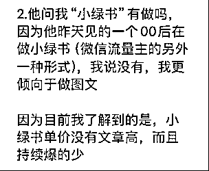
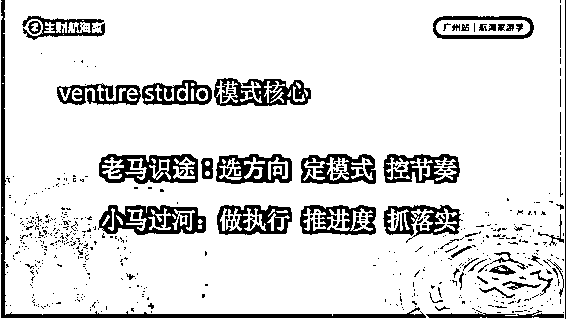
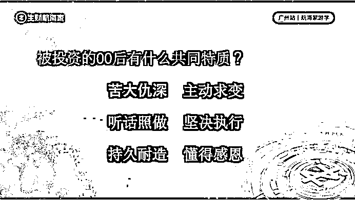
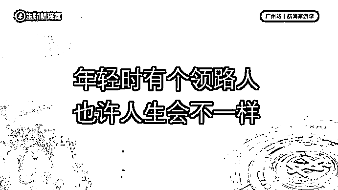

# 从生财到生才——我的生财创投笔记（一）

> 原文：[`www.yuque.com/for_lazy/zhoubao/hdu7kc0d73a3dcwu`](https://www.yuque.com/for_lazy/zhoubao/hdu7kc0d73a3dcwu)

## (精华帖)(100 赞)从生财到生才——我的生财创投笔记（一）

作者： 张昭

日期：2024-11-06

# **一、我是谁？**

作为一个 20 年的创业老兵，做过牛逼的事情——把黄焖鸡米饭打造成国民级小吃，单品类多品牌矩阵门店量突破 10000+，是国内少有的操盘过万店连锁项目的操盘手；也有过傻逼的经历——被合伙人背刺，损失超过亿元人民币；曾经遭遇过强烈的价值观冲击——是不是人只有变坏才能挣到钱；也从至暗时刻中爬出来——从白手起家到成为百亿产业基金的创始人。

我之前的身份是连续创业者，这个身份在 2018 年之前我很喜欢。因为可以亲自下场，去主控很多事情，看着事情按照既定的节奏不断向前推进，实现各个里程碑事件，有一种成就感和满足感。

我现在的身份是创业制片人（venture
studio），这个身份我更喜欢。因为我找到了另外一种参与创业的角色，可以同时横跨数十个领域，不断地和各个领域优秀的创业者去接触和交锋，这种快速汲取养分、教学相长的状态，既能感受到创业的乐趣，又能够领略到更多的风景，可以让我把 20 年亲自实战的创业经验源源不断输出的同时，还能激发出更多的无限可能，这种双重叠加的不确定性，更富有激情和挑战。

# 二、为什么写这篇文章？

创业制片人是一种新的创投模式，近年来流行于硅谷。这种模式的核心在于，投资人不仅仅提供资金的支持，更需要深入地参与到创业公司的创建和运营过程中，类似于电影制片人在电影制作中的角色，因此被形象地称为“创业制片人”。经过硅谷多个大佬和创投机构的实操，证明了这是一种全新的、能够有效激发创业者活力和动力、有效提高创业成功概率的一种模式。从 2018 年开始，我在全国各地各种平台，与不同行业的创业者进行磨合，最终在生财实现了这种模式本地化的最佳实践。

创业者的宿命大概有四种：1、创业上瘾，成为连续创业者，比如雷军、李想、王兴；2、创业失败，不下牌桌，誓要翻身，比如：罗永浩、贾跃亭；3、创业失败，一蹶不振，就此销声匿迹，这是绝大部分人的归属；4、创而优则投，比方说段永平、吴世春。我属于最后这一卦。

一个好的创业者，在经历过自主创业的那种高强度的生活以及聚光灯下的耀眼光环之后，体内的激素水平和一般的牛马是不一样的，他们需要不断地高强度的刺激，才能感受到自己还活着，所以，类似于俞敏洪、王健林这样的人，是不会有退休这个概念的，也才有了“哥虽然不在江湖，但江湖仍然有我的传说”这样的说法。

我不是一个严格意义上的成功创业者，在知名度方面相差甚远，但从赤脚泥腿走到今天，多多少少还是有些积累和认知的。自 2018 年下定决心从创业者转型做投资人，到 2022 年了解到创业制片人模式，然后开始实操，走到 2024 年 10 月，做完慧基创投第一个真正意义上的创业制片人创投案例，这 6 年的时间，有不少心得体会。因为第一个完整案例的被投对象来自于生财有术，所以，把创投笔记的处女作献给生财，以作回馈。

# 三、我与生财：从不屑一顾到相见恨晚

“一千个人有一千个哈姆雷特”，这句话用在生财有术也是妥帖的。

每个圈友加入生财的诉求和目的各不相同，所以，对于每个人而言，生财的打开方式也各有不同：有人是想找项目，有人是想拉平信息差，有人是想激发自我思考，有人是想找人脉......各种基于对金钱的渴望，幻化成了各种不同的行为，于是有了生财有术的欣欣向荣和蓬勃发展。而生财有术对于我的意义，略有不同。前后经历了两个阶段的对比，才找到了正确的打开方式。

最开始接触生财的时候，我有点抵触和排斥，因为当时我还站在资深创业者和初级创投者的角度去看待生财：

## 资深创业者角度

当我用资深创业者角度去看待生财上面的商机的时候，我发现，这些项目绝大部分是短平快的，没有太强的壁垒和核心竞争力，且生命周期有限，不足以基于此去构建一个相对平稳的生意模型，让创业者可以由此开启一段相对长期的创业旅程。

## 初级创投者角度

当我用初级创投者的角度去审视圈友的组成和从事的行业的时候，我发现，绝大部分的圈友不具备较高的商业认知，完全凭借着一股热情，在创业的暗黑森林里面无头苍蝇般的四处乱撞；并且绝大部分的项目不具备走资本市场的商业价值，天花板较低。

正因为上述的原因，我对生财有术这个平台提不起兴趣，对上面的信息、项目以及活动的参与度都极低。

## 思维转变带来改变

但，我有个好的合伙人。她理解我的想法，并没有强制性的灌输，而是不断地分享一些她认为好的 idea，还用生财日历潜移默化的影响我，直到一个很偶然的机会，我终于找到了一个全新的打开生财有术的正确姿势：

作为创业者，贯彻始终的最重要的三件事情是：找人、找钱、找方向。这三个要素决定了创业的成功概率。

生财有术平台上汇聚了大量的热血“生粉”（生财有术的铁粉），他们热情高涨，激情满满，有想法，有胆识，有魄力，有行动，缺少的是合适的引导、是商业认知和经验、是资源加持和人脉赋能。如果给他们一个正确的方向，再加上一个老司机在旁边打辅助，给予正确的指导，那是不是会产生意想不到的化学反应呢？

直到这时，我发现，生财还是那个生财，只是我的思维没有转变过来，而当我找到了正确的角度，生财顿时就变成了一个巨大的宝藏和富矿：

生财是一个巨大的人才库，通过收费筛选掉那些没有冒险精神和敢于投资自我的人。绝大部分的圈友虽然没有商业认知，但更容易按照正确的航线图进行重新定义和规划；没有社会经验，但更容易被灌输正确的商业伦理和价值观；没有拿到结果，但更容易被一个个切实可行的阶段性目标而驱动......

是的，**
_ 生财是一个好的商业育种基地，它筛选了优秀的基因，再加上“袁隆平”式的呵护和精心培育，这些圈友会慢慢长成优秀的样子，他们的商业价值将会成倍的释放出来。__**

# 四、第一个项目的进展

所有的东西都没变，只有转念一瞬间。正因为有了起心动念，上天很快就给予了回应，机会带着伪装就出现了，我也误打误撞的开始了生财创投的第一个项目。

这个项目截止到目前共耗时 20 个月（2023.3-2024.10），我作为创业制片人，全程参与、全面赋能，在充分发挥被投对象的主观能动性和超强执行力的同时，适时提供战略规划、节奏指导、方向纠偏等等，确保项目按照既定节奏达成所有阶段性目标，**最终实现：应届毕业生，一年双百万的战略目标。**

目前，该项目已经全面进入下一个业务阶段，而被投的那 *个 00 后双非本科小女生* ，也从一个当时还没有毕业、兼职月收入 2000+的大四学生蜕变成了佳文玉成 ai 写作项目主理人、慧基创投 aigc 项目投资经理，接下来的业务方向会主攻 ai 自媒体，同时以自己为蓝本筛选具有投资潜力的圈友，参与一定程度的投资。

# 五、《安七变形记》

下面进入我的生财创投笔记系列（1）——《安七变形记》

## 缘起

安七找到我的时候是 2023 年 3 月份。那时候的她和男友凳子正在渡劫——因为某些原因，陷入了人生低谷期，所以他们到了广东的丰顺去散心。在丰顺的时候，安七突发奇想，想开个黄焖鸡米饭的店。（因为她喜欢吃鸡，所以想开个这样的店。很多人创业就是这样，只想做自己喜欢的，不考虑能不能挣钱。而正确的创业态度是：虽然我不喜欢，如果能挣钱，我会让自己慢慢喜欢上。等到有了资本，再选择既能挣钱，自己又喜欢的。要始终牢记：** *创业的第一目的是挣钱，把个人喜好往后面放放***** *。* ）

有时候，你不知道人生低谷期到底是不是好事，或许大概率是好事。因为他们通过生财遇到了我，从此走上了另一条道路。

后来跟安七熟悉了之后，她说，当时她都已经咨询了山东济南的几家公司，准备去实地考察了。但是，她不放心，就到生财上面去搜索跟黄焖鸡米饭相关的词，然后就搜到了我曾经发的精华帖，接着就和我取得了联系。（**生财的用途，第一顺位一定是帮你省钱避坑，其次才是帮你挣到钱。** 因为省钱会很快速的拿到结果，而挣钱是需要时间、资金投入和成功概率的，所以，对生财的使用方法要进行调整）

安七简要说明了她的想法，我当时就给她下了判断：你们不适合做黄焖鸡米饭这个项目，不建议轻易尝试，如果一意孤行，只会让自己赔的底儿掉。我在给出否定答案的时候，我觉得她这个人还行，有胆子，敢为了一些事情去尝试求助，这一点挺难的。我知道的中国人，绝大部分情况下是不会求助的，害怕给别人添麻烦，殊不知，这种想法十分不成熟，还有可能会让自己走很多弯路。**有时候过来人的一句话，足够你节约大量的时间、资金和精力，更重要的是避免了你因为失败导致的不自信和心力消亡。** 鉴于此，我跟安七说，如果你们确实想做一点事情，就来广州一趟，我们当面聊聊，说不准我可以给你一些指导和帮助。

安七的执行力还不错，和凳子商量之后，很快给出了答复，并且买好了到广州的火车票。其实，我有点怀疑：如果她俩是在离广州很远的城市，比方说东北，是否还会有这样的决心和动力？会不会因为考虑到出行成本的问题，就放弃了这次见面的机会呢？这些都不得而知。

事情就是这么凑巧，他们刚好就在广东省内，而且离得不远（很多时候机会是会伪装的，让你觉得很纠结，到底要不要做这件事情。这时候，判断就尤为重要。** *如果下行风险很小，上行收益很大的事情，不要多想，干就是了；如果下行风险很大，但上行收益很小的事情，能不干就不干吧*_** ）

## 波折

安七和凳子不太懂人情世故，这一点，在第一次见面的时候就暴露出来了。毕竟是两个还没有毕业、不知道社会运行规律的学生，不谙世事是大概率的情况。当时，他们不光迟到了、还为自己不能准时到达约定地点，撒了谎。这种耍小聪明的行为，我很不喜欢。所以，我跟我的合伙人说，这两个人人品不咋行，有什么话实事求是就好，我也不是不通情达理的人，这么搞，心里不爽。我一点都不想浪费宝贵的时间在他们身上。但我的合伙人劝我，两个小朋友也不容易，大老远来一趟，能见就见吧。所以，不管他俩能力如何，至少他俩运气还不错，有一个人在莫名其妙的帮助他们。（很多时候我们考虑问题，总是站在自己认知视角里面去看待这个问题，殊不知，当你走在正确的路上的时候，你不知道谁会出现，成为你改变命运的变量，而这是你预想不到的。所以，** *你只需要确保你走在正确的路上，剩下的交给命运，努力的人，命运会有盲盒馈赠*_** ）

## 面谈

第二天见面，前后花了 3 个小时，很认真的聊了一下他们的情况。安七的背景是：国内某双非本科学校、马哲学院、大四未毕业、不想考研、不想当老师，上学期间给一个博主当小助理，勤勤恳恳、兢兢业业，一个月开 2000+的工资。当时的安七非常迷茫，选择也很有限：同学们的出路无非是考研当老师、或者上班当牛马，她都不乐意，给自己的规划是开个黄焖鸡米饭的店，或者去上海给博主继续搬砖，不管哪个选项，似乎都不是心中所想。

我听完她的表达之后，深挖了一下她的优势和擅长点，似乎都集中在文字方面。于是给了她一个建议：或许有可能在文字方面做一些事情，看是否能够拿到结果。（这是我后续跟其他被投对象合作的基础，**所有的被投对象都会在我对其优势深度挖掘的基础上，给予全新的商业模式的设计** 。有时候我给出的方向，或许对方听都没听过，因为他们的见识和认知有限，所以做出的选择也未必正确，但是，**在我的引导下，他们把自己在某个方面的能力和优势迁移到另一个正确的赛道上，做起事情来，会更加轻松自在、得心应手，也会更容易拿到正反馈，而且会形成正向飞轮，不断强化自己的信心** ）

## 抉择

这次的沟通，效果比较理想，也帮助安七和凳子找到了适合的方向。但，安七从未创过业，这对之前当惯了牛马的人来说，是恐惧的。因为他们习惯了被别人安排工作，习惯了被牵引的感觉，所以，让他们下定决心去创业，是有难度的。

于是，为了能够坚定他们创业的决心，同时考验他们是否真的有战斗意志，我提出了我的合作条件：

1、必须搬到广州来，我近距离指导，这样互动会更容易，反馈会更及时；

2、必须注册公司，不能以自由职业者或者个体户的方式去做业务，不正规，像个草台班子；

3、必须缴纳一定的费用，在这里没有免费一说。

4、必须听话照做。不能按照自己的想法，随意而为。需要按照我规划的方向、制定的路线和业务节奏，想尽一切办法，在既定的时间内达到预期业务节点，只有这样，我才能保证最终的结果皆大欢喜。

以上四条，能够答应的话，就可以过来了。（我跟很多人分享过我为什么要这么做，目的只有一个：这么做可以增加他们的沉没成本，让他们没有那么容易放弃。人的心理就是这样，**为了挽回损失，总是不自觉的继续往里面投入，所以及时止损才显得难能可贵。** ）

庆幸的是，他们两个还不错，有不错的决心和执行力。沟通结束之后，立刻开始着手来广州的事情，这一点，胜过了很多人。（**我见过太多有想法但没有胆量和执行力的人，总是说自己想创业、想做什么事情，但总是瞻前顾后，畏畏缩缩，决心不足导致事情半途而废** ）

## 前期准备

找到合适的人，因势利导、因材施教，量身定制创业项目和商业模式，用我的商业认知和经验，加上他们的执行力，一种新的创投模式应运而生。

### 找人

投资最难的就是筛选合适的人，只要人合适，哪怕做的事情短时间内不成功，也可以实时调整方向，最终拿到结果。但是人如果选错了，再好的事情，也不可能做成。所以，我每一次和被投对象的沟通，都是精心准备的一次对话。在沟通中，所有的问题都是为了挖掘出对方是否有我值得下注的闪光点。经过多年的训练，**现在我基本上可以做到识人的准确率 95%以上** 。并且沟通的时间越来越短：基本上 00 后不会超过半个小时；90-80 后不会超过 1 个小时；阅历再丰富一点的，也不会超过 2 个小时。这是对自我的要求和刻意练习的结果。

### 找方向

鉴于安七之前给博主做过小助理，文字功底尚可，另外也做过社群运营，把她之前积累的经验串联起来之后，给安七确定的第一个创业方向是：公众号爆文。

公众号爆文的商业模式很简单，通过给微信平台供给优质的内容，去获取流量主收益。由此演化出了两种合作模式：一种是学员自己写，另一种是学员提供账号，给他们供文，由学员排版上传后获取流量主收益，进行分润。

### 定模式

这个模式本身没什么难度，难点在于：怎么给一个从来没有创过业的人，设计一个不需要前期投入、后期收益还稳定增长、且又没有超出其个人能力边界的业务，这个是需要思考和设计的（其实，有很多项目操作起来并不复杂，只要按照步骤推进，是一定会有效果的。但是往往有一些劣根性导致了事情的半途而废，比方说环节一多，就觉得烦躁、比方说一用到新的工具，觉得又需要学习，给自己增加了压力，各种小的说不上来的问题，都有可能导致一段创业的终止）**尤其是新手创业，怎么找到一个小的切口，在自己能力半径以内，且风险小、回报相对超出预期，并且能够在 1-3 个月内拿到正反馈，对建立创业自信、提高心力和构建内核有很大的帮助** 。

创业实际上是内在动力和外在消耗抗衡的一场战斗。从创业开始的那一刻，你的心力就如同筛子一样，千疮百孔，漏洞百出，心力在一点点消耗。任何一点事情，都需要你付出心力去应付。你能够做的就是，通过不断地胜利，不断地拿到结果，去自我巩固内核，让心力的沉淀和还原速度快于消耗的速度。这样的话，你的心力账户就是正的，且不断有积蓄和存款。

**创业就如同一场战斗，战斗结束的标志，从来不是举手投降，而是以一方失去战斗意志为结束** 。当你失去继续战斗意志，即便是你还有大量的人员和物资，你依然没有取胜的可能。

## 项目启动

创业方向定下来之后，最关键的问题就是项目启动。一个项目的启动分两种：有钱的打法和没钱的打法。这两种打法我都操作过，说一下两者的区别。

很多创业者认为这两种打法唯一的区别是有钱还是没钱。其实，项目的启动，钱不是最关键的因素。有钱就多花，没钱就少花。问题是你怎么根据你的资金情况来选择最合适的启动方式，这种以终为始、财务和业务相关联的动态思维才是最关键的部分。

当你知道自己没钱的时候，你就会穷尽一切可能，尽量不用钱解决问题，但是当你有钱的时候，你还能克制自己花钱办事的心态，那就难了。所以，创业其实一直在解决四个问题：没钱怎么办；有钱怎么办；有钱不花能不能办；没钱需要花钱怎么办。

我是白手起家的创业者，所以，向来主张能不花钱的尽量不要花钱，一旦养成了凡是都靠钱来解决问题的习惯，那你后续遇到资金紧张的时候，肯定不会打仗了。就如同国共两党战斗期间，我党掌握的是没钱办事、没钱办大事的能力，一旦有钱，能力就指数级放大；国民党一直被培养的是有钱才能办事的思维，一旦没钱了，连仗都不会打了，这就是最大的差别。

安七项目的起盘极其简单粗暴，就是在朋友圈里面发招募广告。凭借着一张海报，和自己之前写出的一些数据还不错的公众号文章和流量主收益，慢慢的滚动起来。（**创业者千万不要忽略任何一个过往经验的积累和沉淀，说不定，你的创业破局点就在那里。** 很多创业者总是觉得自己的起点很低，什么都没有。事实上不是的，是你看不到，或者说看到了也没办法去放大它的商业价值。如果安七只是把自己之前写的那些文章，用作去求职，那最多只能换来一份月薪 2000+的工作，但换成了自我能力的说明，那就是价值百万。所以，不是没有价值，是需要有人能够识别它的价值）

## 挑战初现

对小白创业者而言，对自己的产品和服务怎么定价和收费是一个很难突破的门槛。他们之前没有通过这种商业手段验证过自己的价值，往往不自信或者盲目自信。不自信的人，收一块钱也觉得会不会没人买；盲目自信的人，动不动就敢搞出个天价来，这都是不客观的表现。

安七之前定价的时候，很胆怯，担心定高了，没人买怎么办。毕竟她自己也才一个月挣 2000+，收别人几百、上千块，非常担心会不会颗粒无收，无功而返。关于这个问题，我跟她反复掰扯了很多次，后来归纳了以下几点：

（1）坚决不免费，哪怕只收一块钱，也得收。

免费用户和付费用户是两个群体，他们有天然的鸿沟：免费的用户是可以牺牲自我的一些利益去换取额外的价值，他们认为自己已经付出了，所以一定会让你给予回报。而这种回报是否能够满足预期，只存在他们自己的内心。这种不公平对等的交易，不能做。但付费用户自己本身就接受了商业交换，他们的思维底色是一分钱一分货，有什么样的货，付多少代价和成本，是天经地义的。所以，我们要去服务付费用户而不是免费用户，因为商业的目的是创造价值。

（2）定价高低，不取决于你的产品本身，而取决于供求关系。

商业行为是一种交换，用我有的换你有的，这就是最简单的供求关系。如果市面上供给不够，需求旺盛，即便是你的产品存在一定的瑕疵，那你依然可以售卖高价（这里面只讨论相对公平合理的市场交易，对那些以次充好的不良行为，不再讨论之列）。但如果供给过剩，你就算再好的产品，想卖出很高的价格，也是很难的。因为用户会用自己的评判标准去衡量你的东西是否值这个价格。

（3）定价不会一成不变，整个价格体系会随着你的品牌知名度、体验感、后端交付成本等变动而上下波动。

如果一个产品的价格一直维持不变，会有几种结果：①你成为了行业龙头，通过压缩成本，维持定价不变，利润还有所增长，用户会很开心；②你的规模一直没有起色，无法通过改变上下游成本结构，来实现价格调整；你的用户会不开心，因为买了你的东西，自己没有享受到品牌溢价或者情绪溢价带来的快感；③如果各项成本都在波动，而你定价不变，用户会觉得你是不是在偷工减料或者价值缩水的方式，来维持价格不变，用户会觉得这个品牌没有突破性，从而抛弃。** *所以，有时候涨价，不是单纯因为成本变了，而是因为涨价本身就是一种销售手段***** *。*

（4）价格不会一直涨下去，当价格到达一定的程度之后，用户就主动判定这个东西就值这么多钱，再涨价，那就只能舍弃。

初期定价取决于供求关系，末期定价取决于用户心理。任何时候，定价都不仅仅取决于用户的钱包深浅。最终，安七的公众号爆文项目从 499 元起步，后续一直涨价到 1999 元。整个过程中，项目从没有免费，也没有打折。

# 六、创业十宗罪

随着合作的深入，挑战越来越大，暴露出的问题越来越多。以目前团队正在操作的小绿书项目为例进行说明。

9 月 25 日，生财负责投资孵化的许老师去广州和我投资孵化的几个 00 后交流。期间提到了小绿书项目。安七因为一直都在做公众号爆文的项目，流量主收益比较稳定，且当时小绿书确实还没有发力，流量主收益明显要比带货的收益要大，所以安七并未放在心上，只是在和我的交流中，简单提到了这个事情。并且也没有深究小绿书到底是什么，直接就下了结论。但我看到这个信息之后，立马意识到微信将有大动作。

9 月 26 日，安排安七开始测小绿书的玩法；

9 月 27 日，产生第一笔订单，这种反馈速度，让所有人始料未及。于是，我立即安排团队所有人及时跟上。

为了加强整个团队对这个项目的重视程度，我史无前例的开始强行推进业务进度。国庆期间，每天不低于 4 通电话，向他们强调这个机会的重要性。因为微信的生态太稳定了，张小龙太克制了，这么久才出现这么大的机会窗口，如果错过，后续很难再有类似的机会。

因为是个新的项目，大家都没操作过，所以对未知的东西有恐惧感。我能做的事情就是不断地给他们打鸡血，强调项目的重要性，安排他们去全方位的试错。

项目开始初期，团队对整个项目的重要性达成共识是最难的。安七甚至在一开始并没有意识到，这对她来说是个打开流量缺口的非常好的方式。从最开始写小绿书只有几千的阅读，到 10 月 23 日，有一篇文章被微信官方强推，不到 4 天就破了 10w+，目前还在增长中。基于团队前期在公众号爆文和电商方面的积累，所以很好地捕捉到了这次机会，截止到目前，用时一个月，流量侧获取私域超过 4000+，小绿书出单量超过 1500+，完美实现了第一阶段的战略目标。

在整个推进过程中，团队从无意识到慢慢达成共识、再到开始全身心投入到该项目，中间不断重复犯错，对方向的质疑、执行力不到位、内心不够坚决、对自己太好等等问题，不断出现，搞得我也很头大。

因为“时不我待”的紧迫性，为了紧抓红利，我破天荒的要求整个团队不能放假，减少休息，爆肝，强行超车，从一开始就强力介入和干预，避免团队出现类似的问题，才在整个团队的配合下，拿下了不错的战绩。安七虽然目前还不是航海家，但因为在小绿书上的表现比较突出，已经受邀参与生财准备的线下航海家活动做主题分享了。

项目顺利起盘运行至今，共计耗时 20 个月，小绿书项目上出现的问题屡见不鲜，大致体现在以下方面，被我提炼成“创业十宗罪”（应该还会有其他的问题，但在安七身上没有体现出来，在其他的被投对象上表现的比较明显，后续系列会逐步完善）：

## 1、对战略方向的质疑。

创业方向的选择是一个战略性问题，一旦选择错误，越努力，失败的结果会越惨痛。

安七在找到我之前，既定的方向是开一家黄焖鸡米饭的小店，既满足了自己吃鸡的愿望，又可以挣钱，看起来挺美好的。但他们忽略了一个问题：两个还没毕业的学生，从未经营过餐饮门店，就单凭自己的爱好，投入近十万元，真的能够把生意做起来吗？当时我否掉了他们的创业方向，他们第一时间不能接受。因为他们觉得这个事情，是他们脑海中能够想到的、且自己能够够得到的唯一解决方案，现在否掉了，整个人是蒙的，失去了方向感。

人就是这样的，对自己的选择坚信不疑，哪怕是错的，也会固执的坚持下去。不过，好的地方是，他们听进去了我的建议：**围绕自己的优势和过往的积累，重新选择方向** 。

但麻烦出现了：因为新的方向不是他们的第一选择，所以当新的选择出现的时候，他们的第一反应变成了：这个方向能行吗？由此产生的质疑扑面而来：即便是方向行了，我能做吗？真的要做的话，这个事情能做多久？能干多大？我能不能驾驭的了？

我见过太多这样的情形：做选择的时候十分草率，做完了决定之后，又开始拼命的找补，找各种支撑材料，来验证自己的选择是对的。而不是从一开始，就认真思考自己的选择到底对不对。如果源头都不对，那你的论证逻辑再完美，那也只是一个错误的验证过程罢了。

当一个从未考虑过的选择出现在选项列表里的时候，她需要有一个接受的过程，然后去试错。因为不是他们自己的选择，所以他们会觉得心不甘情不愿，不愿意拼尽全力去尝试，而是犹犹豫豫、磨磨蹭蹭的去试探，结果反倒不好。他们不知道的是，在当时的条件下，相较而言，这个选择对他们才是最好的：

黄焖鸡米饭作为餐饮行业，是个勤行，既劳心更劳力，每天需要起早贪黑，十分辛苦；每天进菜、洗菜、加工，全都是机械的重复劳动，并且夏天很热，冬天很冷，坚持下来的人，都是能够吃苦耐劳的人。除此之外，还需要前期较大的投入，再加上 2023 年整个餐饮行业的竞争异常激烈，从来没有干过餐饮的小白很难有赚钱的机会；

相比之下，公众号爆文项目不需要前期投入，且收益见效很快，并且安七在文字方面有优势，在这方面又有一定的私域积累，可以直接开始进行商业变现，拿到正反馈的速度会很快，非常符合“下行风险很小，上行收益很大”的选择标准。

事后证明我的判断是对的。据相关媒体报道，2023-2024 年黄焖鸡米饭这个类目的门店闭店率 26.3%。假如安七投资了黄焖鸡米饭，门店形成亏损，加上浪费的时间以及在新业务上可能获取的投资回报，大概率会造成 40 万左右的损失。这对一个还没有毕业的学生的打击是巨大的。所以，** *听劝也是一种能力，可以省不少钱***** *。*

但这毕竟是个新的选择，所以，从接受到出成绩还需要时间。在此期间，就是各种质疑，不相信这个方向是对的，不相信在这个方向上能够拿到预期的结果。越是质疑，越不会拼尽全力，越会让好的结果到来的时间拉长，从而进入恶性循环。最正确的选择是：** *一旦认定一个方向，只要战略正确，就应该全力以赴，不死不休***** *。*

## 2、因不自信导致的执行变形。

项目在经过初期的冷启动之后，慢慢有一些意向用户开始咨询课程并希望购买服务，这时候，问题又发生了：因为担心交付，所以迟迟不敢成交。原本很丝滑的变现通路，因为莫名其妙的担心和自己的不自信，结果让整个执行路径发生了严重变形。

创业小白通常会犯一个致命的错误：完美主义作祟。总觉得我的产品不完美，我不敢卖。我要让我的产品经得起考验之后，才敢面向市场。如果是这样的话，我奉劝你：千万不要去创业。因为**这个世界上就没有完美的产品** 。

我经常跟被投对象说，你觉得自己很完美吗？那你为什么敢开口要那么高的彩礼？敢跟自己的对象提那么高的要求？你也没觉得自己这个产品有瑕疵呀，你那种莫名其妙的自信从何而来？你如果能把这种状态用在创业上，你肯定是个好的创业者。

这个世界本来就是残缺不全的，无论你怎么打磨你的产品，都不会让所有人满意，你要做的就是找到欣赏和接受产品的人，然后在交付的过程中，进一步优化和完善。你只是制造了这个产品，你不是真正的用户，你怎么就知道你的东西不行？会不会有时候你所谓的完美主义，对你的用户来说，是个负担呢？你看看之前的遥控器，上面那么多按钮，现在的遥控器，几个按钮完活了，到底哪种产品才是用户更需要的，你知道吗？

**你要做的是把你的产品扔到市面上去，让用户去体验，然后根据用户的反馈去进行针对性的调整，而不是一直活在自己的世界里。** 即便是强如乔布斯的产品狂人，不在乎用户的意见，但他听到更好的建议的时候，他也会改进。你太把自己当回事了吧？

## 3、因盲目自信导致的战略偏移。

人是一种特别复杂的动物，当你什么都没有的时候，你会很自卑；当你有了一些东西的时候，你会开始膨胀和自负，这时候你会做出一些脱离实际的行动，来给自己撑门面，往往这时候死的最快。

自卑和自负是一对孪生兄弟，也是一个人状态的两极，而中间点是自信。一般自卑的人到了一定的阶段会很自负，往往自负的人背后又很自卑。自卑的人取得了一些成绩之后，会觉得自己的能力有所成长和进步，开始膨胀和目中无人。自负的人，往往很张扬，但是他们的内核不稳定，当别人不买账的时候，就会开始陷入自我怀疑。

当项目发展比较顺利，取得了阶段性的比较大的成绩（一个人实现单月营收突破 12w+），安七提出了要涨价的想法。我一下子懵了：这才过了两个月的好日子，就忘了前两个月那种畏畏缩缩、怯怯懦懦的感觉，敢开始收高价了？我是真的不知道她这种底气和自信从何而来，是因为看到了有成绩，变得自信了？

我思考过后，把安七的这种想法否掉了。我认为安七根本不足以支撑更高客单价的业务。我跟安七说，我作为你的投资人，你涨价对我而言是有利的，我完全可以让你盲目涨价，收割完，我拿到回报就好了，剩下的事情你自己解决。但是，你有没有想过，当你涨价之后，你面对的是用户更高的要求，如果只是单纯的交付标准的提高，这个好解决，花钱请人就好了；但是客诉会不会变多？你的心力有没有富余来应对这个问题？如果你做好准备了，我不介意多挣点钱。

当我把问题的核心摆在安七面前，她才开始沉下心来去思考：如果涨价了，新的客户从哪儿来？客户的需求会产生什么变化？后端是否能够交付？交付的流程是否需要重造？客诉增加了之后，自己是否能够支撑？这一系列的问题下来，安七放弃了因自己盲目膨胀准备涨价的打算，继续回到了之前的路线上来。

## 4、因不及时沟通导致的盲目试错。

国内的家庭教育导致了很多人没有养成积极主动沟通的习惯，无论是在家里还是在职场，总是被动等待。在合作的过程中，曾多次出现过，因自己不好意思或者担心挨骂，而不愿意主动沟通，结果导致走错路线，无功而返，不但浪费了时间，更浪费了宝贵的创业心力。

___***在整个创业过程中，最难的不是执行，而是无处不在的决策和选择。*****_**

当做了最大的战略选择之后，在业务推进的过程中，会存在很多的岔路口，而每个岔路口的出现，都意味着一次选择，这个选择的好坏决定了你是否能够找到最佳路线去拿到结果。有时候的选择不那么致命，走错了，回过头来就好，无非是浪费点时间和金钱，但有些选择一旦选错，可能导致之前所有的努力全部白费，化为乌有。而及时沟通，就成为了避免致命性打击出现的最佳解决方案。

当你面临选择的时候，你经过自己的思考，在认知范围内做出了最佳选择，如果你有导师或者商业教练，最好的方式就是主动去问问他们的意见，因为他们会有不同的视角和人生体验，会告诉你选项之外还有哪些选择。但是你要知道，如果你不说明你的情况，他们是无从得知你的处境，也无法主动向你提供帮助。所以，**克服掉自己不愿意麻烦人的心理障碍，主动寻求帮助，会让你事半功倍** 。

当然，如果你想心安理得一些，那你最好是给予对等的回报，这样的话，你会觉得是等价交换，合作关系也会维持的久一些。

因为知道安七存在这样的问题，事后建立了写日报的机制。他们每天都会把当天的一些重要事项进行同步，而我会则根据日报中提到的情况来帮助他们调整事情的优先级。

写日报的好处在于，他们可以没有心理负担，我可以及时掌握动态，平时我只看不说，只有遇到特别重要的节点或者战略机会，才会主动干预，比方说小绿书这样的战略级项目。后面会详细描述整个团队如何把握住小绿书这个风口项目的全过程。

## 5、因个人心力不够导致的团队内耗。

我对创业者没有性别歧视，但是现实中，女性创业者确实会存在比男性创业者面临更大的挑战，其中之一就是心力不足导致的团队内耗。

创业是高强度的挑战，很多男生都未必能够胜任，对女生而言，则因为身体机能、激素分泌、生理周期等原因，会更容易导致情绪不稳定、压力过大带来的身体状态不良，无法很好的迎接各项挑战。创业随时会面临战略调整、团队离职、竞争对手恶意挑衅等突发情况，这时候，就需要有强大的心力做支撑，来及时调整策略去应对。

合作期间，每当遇到一个新的机会点或者机遇窗口，我对安七提出要求的时候，她的第一反应总是对抗，因为每一次调整都意味着舒适圈的打破，都意味着重构，她对未知的挑战充满了恐惧，所以出现了固定的循环：我告诉她一个新的机会，她排斥，我强压，她抵触，我骂她，她 emo，我强推，她执行，拿到结果，她慢慢认可了这个方向，直到这件事情走上正轨，这轮拉扯才算结束。

合作了这么久，尽管每次我的判断都是对的，她也验证过很多次，但每次有新的机会出现的时候，还是一样的轮回，搞得大家都很不开心。即便是她已经验证了很多次我的战略前瞻性，但只要遇到新的事物，她的应激反应就是对抗，这导致大家都很受伤，严重内耗。

** *我真的很希望她能很痛快的回应一句：我不会，但是我可以学*_** 。如果有了这个态度，再少一些拉扯，我相信大家的合作会更加愉快，效率会更加高效。

## 6、因遇到困难导致的战略摇摆。

随着业务的推进，对安七前期积累的私域开发达到了一定的程度，慢慢出现了流量跟不上的情况，这时候，安七的判断是：这个方向是不是不行了？要不要换个产品试试？我一下子懵逼了。我问安七，你是怎么做出这个判断的？她说最近业务推进有难度，客户成交变少了。

我说客户变少了，就一定是产品的问题？难道不是因为你的流量口子没打开，把之前积累的客户都消化的差不多，才导致的这种情况吗？你有没有真的站在平台的立场，站在微信生态以及张小龙的立场上去思考过整个问题？微信作为国民级的应用，张小龙这么克制，微信公众号这个产品这么稳定，为什么会被取消掉？微信会消失吗？微信公众号扮演的角色是什么？它因为什么原因会被取消掉？

我最终的判断是：微信公众号承载着巨大的历史使命，不会因为用户的不足轻重的评判就影响到微信公众号的调整。既然这个产品不会变动，那么围绕这个生态贡献优质的内容，是一定可行的。我们不应该放弃产品，而应该去努力打开公域流量缺口，扩大获取流量的基数，这样才能够实现新的业务增长。如果贸然更换产品，那么之前的积累就全部白费了，得不偿失。事后证明我是对的。

## 7、因不愿打破舒适圈导致的业务停滞。

** _ 人的天赋就是人的桎梏，换句话说，人的优点就是人的缺点。__**
这句话用在创业者身上，特别合适。当你的优点越突出越明显，你用起来越顺手的时候，你就会形成路径依赖，而不会主动打破这种状态。所以，创业者的主动学习能力才尤为重要。

当安七的业务遇到流量瓶颈之后，我让其尝试多种方式去打破这个瓶颈，毫无疑问，又遇到了之前的问题：因为自己从来没有做过，第一反应就是觉得自己做不了，虽然后续也做过视频号直播，还去济南学过不露脸直播，但都因为内心中已经设定了自己就不擅长这个事，最终无疾而终。

因为合作的时间比较长，我对她的能力边界非常了解，并且知道她的心力承受阈值在哪里。所以，在给她设计商业模式、获客方式以及变现路径的时候，都在不断地调整下限。对于一个合格的创业者，遇到困难，迎接挑战，不会的东西主动去学习，这是一个基本功，但对于没有主动学习能力的人，还要继续推进业务的话，就只能不断地压缩选择的多样性，去找到更适配的方式和途径。这很难。

在经过多轮的尝试和摸索之后，最终舍弃掉很多选项，还是回归到了安七最擅长的写作上面。最近小绿书项目非常火爆，通过微信公众号分享搞钱项目的方式，安七找到了新的获取流量的通路：**抓热点创业项目，进行实操分享，平台推流曝光，从公域转化到私域，再进行深度的商业变现，实现了新的闭环** 。虽然找到了新的方式，但是因为缺乏学习能力舍弃了更大公域流量，其实是一个巨大的损失，这是退而求其次的解法。

## 8、对战略机会的把握不够坚决。

创业过程中，会不断冒出一些机会，这些机会有大有小。有些小的机会错过了，无伤大局，错过也就错过了。但有些机会属于战略级的机会，一旦错过，有可能你这辈子都不会再遇到这么好的机会。

合作初期，安七只是生财一个普通的圈友，在生财里面没有太多的曝光。合作之后，我有意将安七打造成生财有术平台纯小白创业者商业进阶的标准范本，所以，生财有术成为了安七的战略机会。

为了更好地实现这个战略目标，在安七做业务的过程中，我不断地叮嘱安七去参与生财的活动、将业务进展和心得在平台上进行同步更新，让尽可能多的圈友看到安七的成长。在不断地推动下，安七实现了从小白到航海教练、精华帖作者、优秀 00 后创业者的不断进阶和蜕变。在 615 航海家广州游学活动以后，我们内部成立了一个“生财航海家见证群”，目的就是为了将我在广州孵化器的被投对象全部培养成合格的航海家。

在整个进阶过程中，安七不能很好地理解战略意图，有时候对我安排做的事情会有迟疑，又或者因为业务冲突导致这些事情会失去业务优先级。尤其是在我强力推动下才写的某些文章，成为了安七获得平台认可的关键节点。这些都显示了对战略机会的把握不够坚决。

在多次提点和磨合之后，现在基本上形成了一种良性循环，通过自己的实操拿到结果，第一时间分享给圈友，很好地回馈了平台也帮助了有需要的圈友，终于走上了正轨。

## 9、因商业认知薄弱导致的伪善。

很多创业者有一个朴素的商业认知：我要对我的用户无限度的好。我不能说这个认知是错的，我只能说这个认知违反客观规律。

这个世界上，** *凡事不可绝对，凡事也不可过度*_**
。创业者作为商业从业者，要做的事情就是提供对等的、可实现的服务。无限度这件事情，会让你盲目追求用户认可而迷失自我。

商业的客观规律是：一定会有人挣钱，一定会有人赔钱，并且赔钱的是大多数。如果你盲目的追求我要让我所有的用户都挣钱，那本身就不现实。这如同医院的宗旨是救死扶伤，所有的医生都希望自己的病人康复且顺利出院，但客观现实是，医院是有医疗事故致死率的，这个是客观允许存在的。而且越有名的医生争议越大，因为会出现“干得多错的多”的情况。

创业者如果一味追求所谓的“过度良知”，那么大概率会出现：**本来有良知的创业者不好好努力，被无良的创业者趁虚而入，大肆收割，结果导致劣币驱逐良币，本来很好的商业环境因为自己所谓的道德感而被破坏掉，那其实算是助纣为虐** 。

这也就是我经常提到的：你为了自己那点可怜的自尊心，而不愿意去做对抗不良势力的人，虽然你收获了心安理得，但是你也让更多的人无法享受更好地商业服务，你这就是伪善。

## 10、创业的时候对自己太好。

很多创业者没有经历过完整的创业周期，所以不能深刻的意识到：创业并不是有很多机会，关键的机会只有那么一两次，尤其是**战略级的机会，大概十年才会出现一次** 。如果抓不住，那就再也没有了。所以，**当战略级机会出现的时候，一旦上车，就不要轻易下车，无论挑战多大，都要咬紧牙关呆在车上** 。

有很多创业者创业的初衷和动机有问题，尤其是认为创业之后很自由，想几点上班就几点上班，想干就干，不想干就放假，这种错误的想法会导致很多创业者对自己下不了狠手。在上班的时候，很多人都是摸鱼混日子的主儿，忽然间开始创业了，压根就不知道自律和自驱的重要性。遇到好的机会了，挣点钱，就开始给自己放羊，还美其名曰：创业不就是为了享受生活吗？

没错，创业的目标确实是为了享受生活，但是，你的积累真的足以支撑你去这么干吗？有时候好不容易抓到了一个风口机会，干一会歇一会，三天打鱼两天晒网，等到事后想努力的时候，风口早过去了。

** __*******好的创业者知道什么时间该干什么事情***
，该玩的时候好好玩，不想工作的事情；该干的时候死命的干，把能够抓到的红利吃干榨尽，不放过一丝一毫的机会。否则，等你想努力的时候，红利已经被别人吃干净了，你连渣渣都吃不上。

# 七、相容相生，相互成就

上面提到的“创业十宗罪”，任何一个都有可能导致双方的合作寿终正寝、无疾而终，但最终都一一化解。虽然合作中会有磕磕绊绊，但最终结果是好的，究其原因，就不得不提到安七的个人状态以及我们的相处模式。

## 优缺点分析

从某种意义上来说，安七是个非典型创业者，她本身是不想创业的，只是因为某些原因被逼走上了创业的道路。她自身会因为心力不足而产生非常大的内耗，抗压能力也比较弱，动不动会因为一些莫名其妙的困难而打败，从骨子里面是不太乐意去挑战自我的舒适圈。

除此之外，她还不太喜欢思考问题，也会有一些不知出处的坚持，固执的时候，真的挺让人上火，我已经记不清说过多少次要终止合作了。甚至她已经拿到了比同龄人好很多的结果，依然会没来由的质疑我的决定。我说过很多次“你可以不自信、你可以怀疑自己，那是你的自由，但不要用你的认知来衡量我的决定。你看起来是在怀疑自己的能力，归根结底，你是在怀疑我的眼光、我的决策和我对你的判断”，你有什么资格来质疑我？我最怕的一种情况是“脑子不好使，还随便想问题，结果搞的一地鸡毛，大家都很累”。

但双方的合作终究还是继续下来，这取决于相互适应和共同成就：

虽然安七存在一些问题，但好的地方在于：她有写作的优势，有些私域的积累、知识付费方面的沉淀，加上自身的执行力和湖南人特有的“霸蛮”韧性，有时候，她虽然不理解我的安排或者事情的底层逻辑，她会去执行，并且尽可能的执行到位，这一点很难得。

很多人无论在职场上还是在创业中，总是摆出一副凡事都要知行合一的样子，我就很烦这一点。如果你的认知到位，你能理解，那还好；如果你的认知不够，那我是不是就要停下来等着你，等你理解了，再去执行？那样的话，战机就错过了，还轮得到你挣钱？

之前一直都有个说法，说商机出现之后的四个阶段：看不见、看不起、看不懂、跟不上。事实上，根本不会有四个阶段，最多就两个阶段：一个是看不见，一个是看不起，无论是哪个，都证明你的认知不到位，只要你的认知不到位，你又不愿意听别人说或者别人说了你也听不进去，那么，这个机会就跟你无关了，这才是真相。

另外，安七会摆正自己的位置，也具备一定的空杯心态，她知道自己脑子不好使，也不乐意去思考，就把需要动脑的部分交给我，她去狠抓执行，把事情做好即可。所以，即便是非典型的状态，在合适的指导下，依然拿到了不错的结果。

## 我的感受

我要感谢安七，正因为她的非典型创业状态，激发了我很多思考，让我不得不把很多创业老炮习以为常的东西重新思考一遍，尽可能的转化成创业小白能够理解的语言和逻辑。对安七辅导和赋能的整个过程，是我一次全新思考和学习的过程，是一次教学相长的过程。我们双方的合作，不仅仅收获了金钱上的回报，更重要的是得到了各自思想上的提升和能力的完善，这个意义更大。

这就是《安七变形记》：一个尚未毕业的大四女生耗时 20 个月在生财平台上的成长历程，最终实现了比同龄人 10 倍速的成长。

# 八、创业制片人模式解释

通过对安七的孵化，我验证了一种模式：一个老炮带一个菜鸟联手打怪，要比一个老炮下场亲自实操产生的商业价值更大，也比一个菜鸟单打独斗去创业，成功概率更高，这种模式可以更好地释放老炮的创业经验，也可以更好地帮助菜鸟完成初期的商业摸索，真正的实现“扶上马、送一程”。

创业制片人的创投模式，双方的相处可以参照《飞驰人生》这部电影：主驾和副驾是一对创业搭档，主驾负责操纵方向盘、油门和刹车；副驾驶负责看方向、读路书、告知主驾什么时候加速、减速、转向等等操作，确保赛车在比赛期间，尽可能低风险、全速度的抵达终点。也可以理解成老马和小马相伴而行，老马识途找到方向，小马过河，一往无前。

为了尽快完成磨合、通过拿到正反馈的方式增强彼此的信任程度，在合作初期，副驾更为强势，需要主驾提高执行力，而不需要太动脑子，否则会出现战略冲突，这时候需要做大量的说服和教育工作，就成了内耗。所以，从一开始，就要讲清楚合作规则，是有效避免内耗、提升战斗效率的最佳解决方案。如果不认同，那么就不合作。

合作开始之后，随着阶段性结果的达成以及磨合，验证了双方的能力边界，这时候副驾就开始逐步放手，由主驾全程接管方向盘和掌控节奏，副驾只需要根据实际情况不断告知主驾速度和进展，以及预判未来的方向和防范创业风险，最终达到一种平衡：平时互不打扰，主驾安心驾驶；副驾一旦进行预警，主驾立即响应，提高战备等级，充分把握战略机会，调集一切可用资源，强突猛攻，直到实现战略目标，然后回归平静，一切按部就班，静待下一次机会的到来。

# 九、孵化标准

截止到目前，我累计在生财发掘了 20 多个具有潜力的圈友，并尝试用创业制片人的模式达成合作，就目前得到的反馈来看，效果要远好于他们独立作战拿到的结果。如果配合到位，基本上都会取得不错的成绩，所以，我立了个 flag：3 年孵化 1000 个项目。

我在 615 航海家游学广州站的时候分享过我的孵化标准：

## **苦大仇深**

是指你的出身和背景可以不是很好，甚至可以很差，这种人会滋生出一种改变命运的动力，他们往往起点很低，但是韧性很足，有强烈的自驱力去驱动自己做很多事情，一旦有机会出现，往往可以拼尽全力去争取，而不用别人去督促。一般家庭条件比较好的人，有可能会有很多退路，从而导致专注度不够，没办法全力以赴。（不过，我现在对条件比较好的人找到了新的解决方案，所以也不排斥和这类人的合作。比方说可以去做出海研学、二手奢侈品等项目，这些项目的主理人本身就需要具备一定的生活阅历和审美品味。）

## **主动求变**

是你自己想改变，而不是别人强加给你。如果你自己不想变好，那么别人是没有义务和责任帮你变好的。如果你寄希望于别人，那我奉劝你不要开始。跟我合作的人，我说的最多的一句话是：这是你自己的项目，你自己决定。你千万不要指望我来挽留你，如果你想搞，那就接着搞，如果不想搞，立马撤摊子，我绝对不留。所以，如果不是自己发自内心的去改变的人，我一般都建议去上班搬砖。

## **听话照做**

这个要求太重要了！很多人口口声声说我最听话了，结果轮到事情上，压根不是这么回事，全都是自己的一堆错误想法。而且还总是拿着错误的尺子去衡量和质疑你的决策，就搞得心态很崩溃。我经常问他们的一句话：如果你的想法是对的，那么为什么你的口袋里面没有你想要的？

还有一些人更扯淡，拿着自己的问题，去征求很多人的意见。如果你不信某个人，你压根就没有问的必要，问了就要听，否则就别问。你问了 A，有一个结果，又问 B，还有一个结果，那你听谁的？其实 A 和 B 都对，因为他们都拿到了结果。唯独你这个蠢人，用自己早就想好的一个答案，去衡量。如果哪个人的答案，跟自己的接近，就听哪个人的。那你压根不用征求意见，就按自己想的去办，哪怕到最后错了，你也知道是自己的愚蠢导致的，而不会怪罪到别人头上。

## 坚决执行

是最看重的品质，这也是双方合作你唯一能拿出来交换的东西。如果连执行力都要打折扣，那你在这场合作中，还有什么价值呢？这就相当于你拿了你的执行力出资入股，你的执行力打折，就意味着你在抽逃出资，从法律意义上来讲，你是违法的。

一说到执行力，很多人说我的执行力超强，只要领导安排的事情，我都想尽一切办法去实现。我说你那不是执行力强，你那是因为害怕扣工资。真正的执行力强，是即便没有人鞭策和督促，你依然会为了把这件事情做成，而不遗余力。你会为了在某个阶段拿到重要的结果，而忽略掉外界的一切，有可能需要你连续直播 100 个小时，有可能需要你睡在办公室，有可能需要你放弃掉你看重的爱情......因为是你自己的事情，你为之付出一切，都应该心甘情愿。如果没有超强的执行力，怎么可能抓住转瞬即逝的战机？

## 持久耐造

实际上是对心力的要求。创业从来都不可能一蹴而就，有可能会一而再再而三的折腾你，直到你眼瞅着活不下去的时候，再给你来个峰回路转、柳暗花明。但是，你撑不下去的话，那光明的未来，绝对不属于你。

商场如战场，很多关键的战机稍纵即逝，所以为了把握机会，提高快速反应能力，有时候就需要副驾的强力干预。我经常跟被投对象说，我最擅长的就是骂人，你们能不能受得了？我的骂不牵扯到人身攻击，完全是就事论事，是为了引起对事情的高度重视，是为了快速推进业务进度。我很喜欢乔布斯说过的一句话：A 类人才的自尊心不需要呵护。我能够帮助你挣钱，但不要指望我给你提供情绪价值。等你有钱了，你有的是地方去寻求情绪价值。

就算我具备点石成金的能力，不要求你是块璞石，最起码你是一块石头而不是土坷垃吧，否则还没怎么捏，你就碎成灰了，那还搞毛线？

## 懂得感恩

我不要求你感恩戴德，只希望你明白一件事情：不懂感恩的人，走不长久。我不想耗费了大量的心血，结果培养了一只白眼狼。有那功夫的话，我宁可去睡觉。

你可以以安七为对标，看看自身具备的条件和优势。如果满足，欢迎和我聊聊。再送给所有圈友一句话：

# 十、从生财到生才，未来可期

转眼间，我在生财有术呆了近两年，越来越强烈的感受到生财有术正在向生才有术这个方向进化，通过初级的项目和活动去筛选优秀的人才，逐步培养和赋能，帮助他们成长为某个领域的领军人物，再反哺到平台，带领更多的圈友实现“赚到人生第一块钱”的目标，正在不断地往创业人才孵化和培养方向去进化，未来的商业空间和想象力不可限量。

随着生财有术的不断迭代和优化，相信会有更多的人加入进来，一起生财有术！

* * *

评论区：

大仙 : 文中这句话很有感触：创业实际上是内在动力和外在消耗抗衡的一场战斗。从创业开始的那一刻，你的心力就如同筛子一样，千疮百孔，漏洞百出，心力在一点点消耗。任何一点事情，都需要你付出心力去应付。你能够做的就是，通过不断地胜利，不断地拿到结果，去自我巩固内核，让心力的沉淀和还原速度快于消耗的速度。这样的话，你的心力账户就是正的，且不断有积蓄和存款。

忧愁小松鼠 : 一边吃饭一边看完了老师这篇文章。 没看这篇文章之前我就一直在思考我身上到底是有什么品质是跟挣钱能正相关的。
看了文章之后感觉身上确实没有什么特质跟挣钱有什么关系。 是高中做体育生训练三年最后体考没过线的高中生？
还是大专学计算机每天听老师的话能一步一个脚印来学习，考证。
还是专升本一年每天五点半起床，晚上十点回寝室励志改变人生的专升本考生，高数从之前的 7 分到最后考试的 116 分，感觉当时自己牛逼大了，真的考上本科后又开始迷茫。
又或者是考上本科后每天不去上课在自习室里每天在 b 站自己学习只为了找到一个好工作，然后在最后一学期突然换了别的计算机方向导致跟之前学习的所有内容都没那么强相关。
还是现在工作一年后做着自己不喜欢的工作每天都在思考人生一遍遍的告诉自己现在这样的生活不是自己想要的。 到底什么才是优势，听话照做？执行力强？
从小到大不知道自己喜欢什么，对什么感兴趣，家里的第一个大学生。 没有方向，没有引导，一步步走到现在，在上海拿着一个月到手六千的工作。
有时候也在思考活着到底是为了什么，是不是我这辈子就这样了，等着被裁员然后灰溜溜的回到老家找个离家近点的工作然后娶妻生子。
但是我想要的生活不是这样的，虽然我不清楚我到底想过什么生活，可我知道现在的生活不是我想要的。
今年 8 月份加入生财后更加的迷茫，焦虑，每天都在看别人发挣多少钱怎么样怎么样，我感觉自己之前的人生都是狗屎哈哈。
我不想要一辈子循规蹈矩，我期望每天的人生都不一样，每天都可以走不同的路。 我想挣钱，想追寻世俗的自由。

♻️李拜五💥 : 精华准备

张昭 : 没那么悲观，你的优势只有你自己看不到。身边的人可是明镜似的。

张昭 : 前几天在看《上甘岭》，秦基伟和范弗利特的心力较量：没有谁比谁容易，只不过比对方多了一口气。现在的中美较量也是如此。

周无限 : 张昭老师写的太棒了[强]

拾一 : 精彩！

希行 : 生财布道师[强]，张昭老师，写的太好了有很多启发，整篇打印下来慢慢看