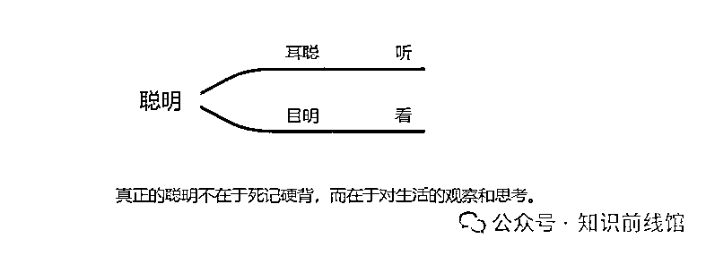
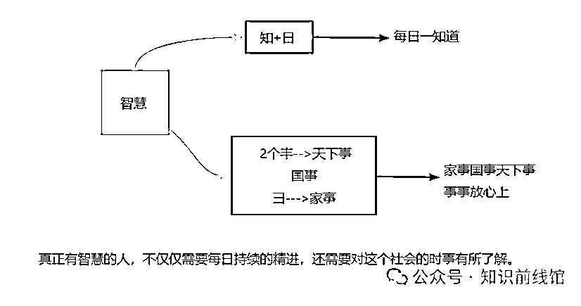

# 高效的学习力：真正的聪明人都是怎么学习的？

> 原文：[`www.yuque.com/for_lazy/zhoubao/gqkd2gelx6kbn6zi`](https://www.yuque.com/for_lazy/zhoubao/gqkd2gelx6kbn6zi)

## (17 赞)高效的学习力：真正的聪明人都是怎么学习的？

作者： 馆主

日期：2024-11-04

本篇文章主要探讨了 21 世纪的成功特点、5G 时代的意义以及聪明和智慧的内涵，强调了 21 世纪学习力的重要性。馆主这里问一下小伙伴们，什么是聪明、什么是智慧？哈哈！馆主这里先不给小伙伴们解答这些问题，我们先来讲一讲两件事：

## **第一件事情：什么是 21 世纪的成功？**

这个世纪对比我们的父母或者爷爷奶奶的那一代人，我们这一代人有什么样的特性和特质呢？

馆主这里总结了 4 点，关于 21 世纪成功的独特性，这是馆主的**个人观点** ，务必争吵。

1、不可预测

当前社会变化快速，信息传播、发展的速度都很快，导致未来的预测能力大大降低。例如，职业的淘汰数目不断增长，编程等热门职业可能很快被淘汰，因此不能根据今天成功的可能性去选择未来的职业。

我们举几个例子：

假如说今天的潮流是这个，那么明天可能就会变得很土了。

馆主想问问小伙伴们，在 80 年代的时候，当时最热门的职业是什么、还有工资相对来说更高的职业又有哪些？嘿嘿嘿，屏幕前的年轻小伙伴们是不是想不出来呀，可能有个别大一点年纪的伙伴们就知道了，这个最热门工资相对来说很高的职业（工作）叫做卡车司机，在当年卡车司机是一个非常受人尊敬的职业，收入可以随随便便过万的，因为在那个年代会开车是件非常了不起的事情，看到这里可能就会有小伙伴们问了，会开车有什么了不起的，现在不都是人人都有一本驾照吗？那是在当时的年代，你要是现在拿着一本驾照去应聘说我要月入过万，看别人不笑死你，哈哈哈。

我们来往前推个 20 年，在 00 年左右的时候，小伙伴们知道在当时最受欢迎的职业是什么吗？馆主直接说了，叫做会计师。那么我们现在这个社会会计师还能够赚到很多钱吗？答案是可能性不大，当然也有个别能赚到钱的哈，我只是说大部分会计师小伙伴们是赚不到钱的。

那么还有哪些热门职业？还有从事金融精算，额额额....再到现在我们学习编程，做一名程序员，钱确实能赚不少，但是头发会秃，找对象难找一点。

不知道小伙伴们有没有发现，每一年，淘汰职业的数目都是在不断的增长中，这件事情告诉了我们什么道理，比如说编程在当下是一个非
常火爆的职业，但是我们可以预测它用不了就会被淘汰掉，为什么这么说呢，现在哪些微软、谷歌等大型顶尖科技公司的程序员能够写一行代码，然后让代码自己写代码，机器替代了我们人类的行为。

如果这个社会在不断的快速变革，那么我们就会对未来的预测能力大大的降低了。可能有些小伙伴不太理解这句话，比如说今年这个编程职业好，能赚钱，我要让我的孩子去学习编程，但是还没等你孩子大学毕业，他就已经失业了。

2、无法复制

什么是无法复制？意思就是说：这已经不再是馆主成功了，以后就能有一百个馆主都能成功的时代了。

举个例子：

馆主相信很多小伙伴都会有一个歧途，假如说你看到这个人事业成功了，那么此刻你们的第一个反应就是要来他的作息时间表。

从前有一个很有名的学霸叫张三，他写了一本书，这本书叫做《我的学霸之路》，这本书写出来之后，很多家长朋友都把他买回来，那么买回来的第一件事是把学霸张三的作息时间表一字不落的抄在墙上，然后哪些家长们就会逼着自己的孩子严格按照这个作息表去执行去学习，可是学到最后能学出来一个学霸？答案是没有，为什么呢？因为小伙伴们如果你只去学习成功人士表象的行为，而没有深入的去研究它人背后的思考和逻辑，那么是永远都学不会的，咱们每个人都是不一样的，都有自己的特点和特长，假如说你明明没有商业头脑，非得要去做马云，你明明长得不漂亮，且非得要去学明星，那你这样是永远都不成功的。

我们应该思考他人行为背后的原因，努力找到自己的特点和特长。

3、百花齐放

什么叫做：百花齐放？意思就是说：当前是一个最好的时代，因为每个人都有做梦的可能和权力，优秀的标准不再单一了，只要你够搞笑，你长的像王宝强一样，那么你可能也会成为一名电影明星，你只要有商业头脑，你可能卖口红，分分钟钟就能卖出几百万的业绩，这个时代给了我们各式各样成功的可能性，但这也意味着我们要找到自己的特点和特长，这就叫做“百花齐放”。

优秀的标准不再单一：只要有一技之长，每个人成功的可能性是非常宽的。

4、难以跨越

什么是难以跨越，难以跨越不仅仅是阶级上的难以跨越，我们往深层次讲叫做思维上的难以跨越。

举个例子

屏幕前的小伙伴们假如你去看看很多山里的孩子，我们是不是会觉得为什么山里的孩子，现在越来越难成功或走不出来呢？有一个很大的问题在于他们的父母可能在当下纠结的是：孩子能够为这个家庭带来多少的经济效益，你不要学习了，出去打工吧！你每个月还能给家里面打几百块钱生活费呢？又或者说，好好学习吧！考个好点的大学，拿到一个好的文凭，然后去当老师或考公，拿一个铁饭碗。其实每个人他对自己的上限都有一个天花板，很多小伙伴们不是不敢做，而是想都不敢想。这就是思维的难以跨越性。

## 小小结：

我们想一想自己是否还停留在 19 世纪的标准，我们过多的纠结于知识内容本身的记忆，过多的关注如何模仿成功人士的行为，过少的去忽略学习背后的思考和思维逻辑，那么 21 世纪的学习力是对于知识、内化和运用，了解自己的特点和特长并且加以发挥的学习力。

## **第二件事情：5G 时代意味着什么？**

我们来聊一聊当前社会上一个非常热点的话题，有很多小伙伴们都不太了解或者深入了解什么是“5G”，馆主问小伙伴们一下，5G 到底是什么？5G 对于人类生活带来哪些影响，5G 为什么值得中国和美国不惜来一场没有硝烟的战争呢？很多小伙伴可能跟馆主之前一样觉得 5G 不就是比 4G 快一点点嘛，比如说打游戏、刷短视频网络不卡而已，但是馆主告诉你们这只是它的冰山一角，5G 时代的来临，有一个很重要的标注，对于我们学习者来说信息的本事不再重要了，因为比速度、比信息的存储量我们是永远比不过机器的。那我们在这个 5G 时代比的是什么呢？用一句话解释：掌握信息本身不再重要，高效的去归纳、总结，甚至创造知识的能力更为重要。

举个例子

假如说今天作为老师，这位老师花一年的时间重复的去讲一模一样的课件，可是时间久了大家都听倦了、听烂了，如果这位老师没有创新能力的话，那么很快就会被这个社会所淘汰了，所以呢小伙伴一定要记住：5G 时代是很快的。我们不要兴奋自己的记忆多好，我能够记住多少个知识点，当然这些也很重要，但是我们应该要拿出更多的时间去研究记住之后的下一步内化和输出。

**我们回开头的两个问题，什么是聪明、什么是智慧。**

我们把聪明这两个字拆开来看看：

我们把聪明拆解出来不就是耳聪目明是吧！那什么叫耳聪目明，耳朵就是听，目明就是看，这也说明了学习力最基础的部分就是不在于死记硬背，而是你如何听和如何看，还有你对生活的观察和体悟。馆主这里强调一下，真正的学习一定是来源于生活的，它不是在埋头苦读中，而且对于生活的观察和体悟中。

现在有个聪明叫假聪明，我耍小聪明，怎么样才能把考试给蒙混过关呢？又或者说我应该怎么样才能够在工作的环境中拉拢人心，这些都是假聪明。

聪明的上一层叫做智慧，馆主把智慧拆开来：

每日一知道：我们每天需要不断的去增长自己的见闻和知识，保持着一种日益精进的学习态度，活到老学到老。

家事国事天下事，事事放心上：“两耳不闻窗外事，一心只读圣贤书”的状态在现代已经不适合使用了，因为真正有智慧的人，每天都要掌握和了解这个社会的时事，这样的人才能拥有智慧。

## **

**

## **小结**

馆主：主要讲述了 21 世纪成功的独特性（包括不可预测、无法复制、百花齐放、难以跨越）、5G 时代的意义（信息本身不再重要，高效归纳总结和创造知识的能力更重要）以及聪明和智慧的内涵（聪明在于对生活的观察和思考，智慧需要每日精进并了解社会时事），强调了 21 世纪学习力的关键在于对知识的内化和运用，以及了解自身特点并加以发挥。

嘿嘿嘿，看完本篇文章后，小伙伴想一想，如何才能够变得更加聪明？评论区把你的答案写出来吧！跟大家一起分享分享。

* * *

评论区：

林一 : 保证每天阅读精华帖的数量以及培养观看国家新闻实事的习惯，我一定可以做到的！

馆主 : 很棒[强][强]