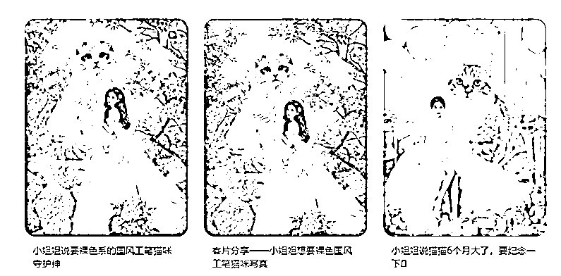

# 先用“生财”赚回门票，再用“生财”生财（菜鸟看）

> 原文：[`www.yuque.com/for_lazy/zhoubao/ufka64qnls91scx0`](https://www.yuque.com/for_lazy/zhoubao/ufka64qnls91scx0)

## (21 赞)先用“生财”赚回门票，再用“生财”生财（菜鸟看）

作者： 领飞懂运营

日期：2024-10-31

大家好！我是领飞！（不介绍了）

这篇文章，老鹰可以略过了，老鸟可以略过了。

**直接进入正题：**

**  **

“生财”要兼顾“菜鸟寻项目，老鸟来赋能，老鹰获借势”这三类人的体验，人聚集多的地方，就代表着“事非”多，做不到完美，只能追求完美。

所以，不要极端的追求收获（必要赚到），利用好生财更重要。

近期三个月生财优化了很多地方：去无良引导，增超级标，灯塔指路，布道者奉献，传术者聚焦。

这一系列的动作，都在为去“事非”两字，平衡三者之间的关系。

近 3000 的门票，菜鸟是血液，老鸟是灵魂，老鹰是骨架；每一个阶段都是可以在生财晋级的过程。

我不是老鹰，我只是一个老鸟，所以我用老鸟的角度来分析，**菜鸟怎么寻求项目？**

**首先思考一个问题：项目重要，还是高手重要？**

对于菜鸟而言，“项目”肯定重要，你因为你要先赚到，生财发精华帖人，每一个都是带项目的老鸟。

这么多的老鸟你学的完吗？

千万别让自己爽，看成功案例就是爽，和你躺下刷抖音一天，爽一天一个道理，对你当下阶段没有任何意义。

就拿“AI 公众号爆文”这个项目来说，有多少个老鸟在分享；

就拿“小红书卖虚拟资料”这个项目来说，有多少个老鸟在分享；

。。。。。。太多了，项目太多了。

所以啊！闭着眼睛选一个就行了，不要想着发财，不要想着多么长久，老鸟在做的事情，你做就行了。

先赚到更重要！先把门票赚回来更重要。

**选一个项目**

你就在生财只关注一个项目，把其他信息都过滤掉，你就会发现这个项目 1000 种解法和精进。

这个项目的老鸟你找到了，可以看到他们怎么做，学人赚钱。

这个项目的汇总你获取了，可以锤爆同行怎么做，学人赚钱。

所以啊，项目只是一个支点，撬动地球也只需要这一个支点。

**生财航海**

菜鸟不用多想，跟着航海家死心塌地的做就行了；

因为，生财已经给你把关鉴宝了，他是不是宝贝（项目是宝贝，航海家是宝贝）。

跟进，梭哈，就可以；义无反顾的冲，就可以。

**选择小项目，做为支点**

老鸟玩套路，老鹰玩阳谋，菜鸟选项目，选什么项目？

就是那些，没有任何商业大系统，发内容就能赚钱的小项目。

**如：**

小红书发内容就能涨粉赚钱，卖广告，卖资料，卖课程

公众号发内容就能有阅读量，赚流量主，赚合作分润

最多加一步，引流微信成交。

说白了，就是变现的过程中路径越短越好，赚钱也就简单。

**选小项目的标准：** 那种能给粉丝提供服务、交付一个产品的小项目。

比如：

用 AI 技术制作写真图片

用 AI 技术制作音乐歌曲

用 AI 技术制作绘本故事

用 AI 技术制作老师课件

。。。。。。等，能提供交付服务的变现，能满足人们需求的变现。

这样的小项目，先赚到后，会有无限放大的机会。

就拿上面这个小项目来说吧：**【AI 写真图片】小红书 AI 萌宠写真项目**

你在生财关注这个赛道，航海也好，看帖也好，总归是能学会这门技术，哪怕链接一个老鸟都行。

有一个圈友，这样跟我交流：

她告诉我：

她学这个项目走了不少弯路，她花了三千块钱，学了操作两个月，最后挣了四千。

虽然挣了四千，但她觉得这个过程很艰难，很痛苦，因为她一个人要承担推广、沟通、交付，三个角色。

一个人干了三个人的活，当然辛苦，收入和付出也不成比例。

她产生了焦虑，觉得自己比不过同行，担心 AI 写真项目不能长久，不能赚到更多的钱。

想比很多菜鸟都有这样的经历，选择过后的彷徨。

想想看，以前的线下影楼，拍写真需要场地、摄影师、后期处理等等。

但 AI 技术的出现，让这一切都变得简单了，你只需要学会 AI 技术，就能完成这一切。

网上很多人说 AI 改变了人们的生活，改变了未来的就业，这是事实。

但人们对写真照片的需求一直存在，对不对？

宠物和主人的写真，我们还可以拓展到动漫卡通形象写真、二次元形象写真，甚至换背景换场景写真等等。

这个需求一直在，所以这个项目完全能长期做下去。

**至于担心：干不过同行**

你一个人 2 个月挣了 4000，如果你一天发布的内容增加十倍，你的收入是不是也能翻几倍呢？

这意味着，不管你的同行有多少粉丝，只要你能发布更多的内容，注册更多的账号，你也能获得同样的流量。

既然拿到了结果，就是放大的过程，你钱挣多了，你还焦虑啥。

无非就是，不会放大，不会优化。

**如何将小项目做大？**

如何通过“合作和教学”来放大你的成果？

**合作**

如果你忙不过来，可以跟别人合作。

比如，有人付钱给你之后，你根据客户的要求提给同行；你收 150，同行收 100，你挣 50，这样不也挺好吗？

**收学员**

你在引流的过程中，顾客即是学员。

你可以收徒，比如：收 980，告诉他们如果两个月不赚钱，我退给你。

**这个逻辑是：** 你在拼命做流量，多多发布内容，流量就会越大。

但你没有那么多账号，这时，你可以借用你的学员的账号去发，把你做好的内容让他们去发。（不用他们懂脑子）

你怎么发的，就让他们怎么发。

一开始你自己只有三五个账号，现在你有了十个学员，可能就变成了 30 个账号，流量是不是更大了呢？

你告诉我，哪个同行能干过你？

流量来了，自然就能承接流量，就可以变现。

你甩给同行挣个差价，同时也分给学员也挣了，对吧？

如果有 50 个学员，有 10 个学员做得不好，账号也没流量，没关系，你就教给他们怎么做写真图片，把同行的活自己干了，让学员挣钱。

然后剩下的 40 个学员引来的流量，承接交付，你给这 10 个学员，让他们去做图片。

最终，你就成为了一个管理者，这就是超级个体，这就是个人云创公司。

**这个项目还小不小？**

很小，就是你用了 2 个月时间挣了 4000 块钱，这个过程实践过来，你挣到了。

**你挣钱的原理就三个：**

你发了内容，你引来了流量，你又给他们做了交付。就这三个过程，你用了 2 个月的时间跑通的，这很值得。

**这里又产生一个疑问了？**

你说的轻巧，看似很简单，但是不可能一下成型啊！

你好笨啊，你拿到了 4000 块钱之后，就是验证了结果；

之后，你就专注多做几个号只怼流量，流量先进来，你那变现的后端交给了别人，精力留给了营销，流量就会越多。

这个流量起来了，你是不是有更大的可能收到徒弟？这不就把徒弟的问题也解决了吗？

你以前一人干三个人的活，这就是焦虑的原因。

每个阶段我们要有取舍，取舍过后就是一步步的去实施，去完成这个框架而已。

**我们选择哪一类 AI 去做，能明白吧？**

选那种能够交付给别人服务项目，类似这种 AI 项目，你就能实现像今天讲的这样翻十倍的利润。

**这个事情难吗？**

它不难，它就是一门技术，把这门技术你学会了之后，你去运用它去发，就会拿到结果，只要有结果，你就可以去逐步的把它放大。

很多时候，我们看生财的内容，都是大格局，大项目，大发财。

大家没法儿入手，存在这样的情况，那我们就说把这个范围缩小一点儿，缩成一个点，一个小小的项目，最终你再结合大格局思路，你就能把它变成一个大大的项目。

先赚到更为的重要，先赚到了这件事儿，你看似觉得简单，但是也得去熬呀，也得去动手，也得去找运营的感觉呀，只要你能够赚到一个小结果，那么【生财】老鸟和老鹰发的内容就跟你相关了。

你也就不是菜鸟了，你也要像老鸟一样发内容了，像老鹰一样借势了。

**总结一下：讲的核心是什么呢？**

就是选择小项目的时候，一定要选择有后端价值的事情，能给人做交付的事情。

如果说你选择的是那种撸流量，无货源带货，二手电商等类似这样的项目，你前期拿结果会相对难一点儿，你想快速放大，也相对难一点儿。

所以说呢，“靠技术赚钱”这件事儿，也是我今天讲的核心。

商业思维不懂吗？那我们就拿技术赚点儿钱不行吗？

**什么技术呢？**

现在最流行的技术就是这个 AI 技术，各种场景的应用，越研究越深，这门儿技术越研究，你就会做的越好。

拿着技术去应用，到场景去变现，一个点就行。

就像做这个写真图片儿，就是一个点；

去做这个 AI 音乐，就是一个点；

去做这个 AI 绘画就是一个点；

就这一个点，运用好这个技术，你就能够去赚一个小小的结果，也就先赚到了。

之后就是个人商业思维，做生意的思维也就成长了，就这么简单！

**以上，仅个人观点，不喜勿喷**

**（完）吹牛皮的老师千篇一律，生财价值仅此一瓢。**

**领飞，往期生财加精文章：**

[0、【倒爷（中介）发财术】合作别人才有意思，大家一起分钱](https://articles.zsxq.com/id_wus55cjxodtw.html)

[1、如何通过【创业知识博主】原始积累 800 万](https://articles.zsxq.com/id_sckk8imjgqgi.html)

[2、【长期暴利项目】中介思维极致，年入百万项目方法](https://articles.zsxq.com/id_cd7wutqqqa61.html)

[3、【卖服务+卖产品】个人轻资产运营，价值“百万”商业模式](https://articles.zsxq.com/id_msepc8pc7r5m.html)

[4、五年用闲钱买房赚了 50 万，小城市房产投资经验，纯干货！！！](https://articles.zsxq.com/id_s0n9vvaawd1j.html)

[5、【先拼数量，再保质量】一个素人做 IP 写小作文，108 营销方法论](https://articles.zsxq.com/id_2q75vclbo9rx.html)

[6、如何用你的“热爱”，选择创业项目方向](https://articles.zsxq.com/id_vcqr0bwozsqa.html)

[7、【中介思维赚钱术】卖人，卖项目，链接高手一起卖](https://articles.zsxq.com/id_n2uw328j6swl.html)

[8、【大龄职场破局副业】6 个入局赛道解析，长期的搞钱策略（2 万字）](https://articles.zsxq.com/id_n3ddt25tm66o.html)

* * *

评论区：

sunyue : 确实，生财很多大格局，大项目，缩成小点选好项目去放大，有启发[强][强][强]
流量和产品交付，通过合作和收学徒，放大流量和解放交付压力，都可以很好的放大收益。 谢谢分享，菜鸟悟了～

领飞懂运营 : 技术型小项目，交付最好

半月 : 有道理，我就是处于菜鸟阶段