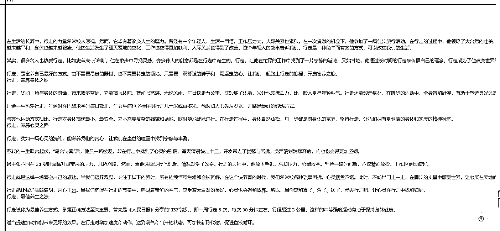
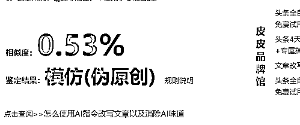
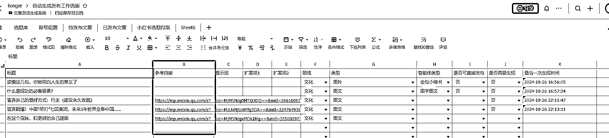
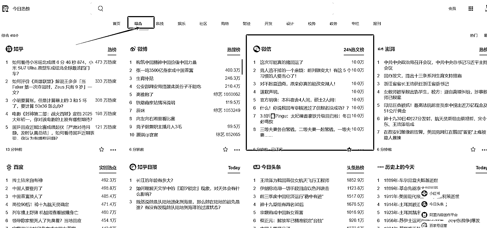
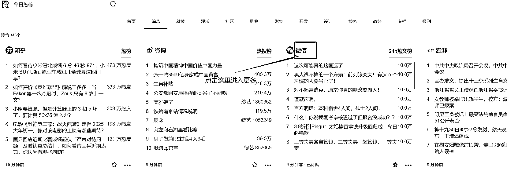
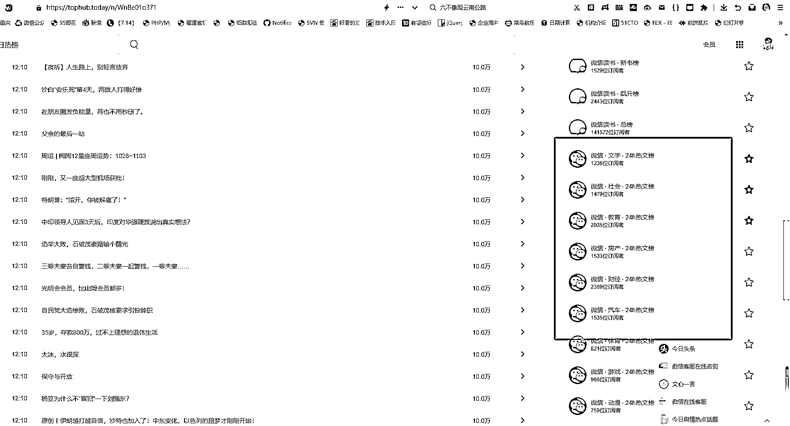
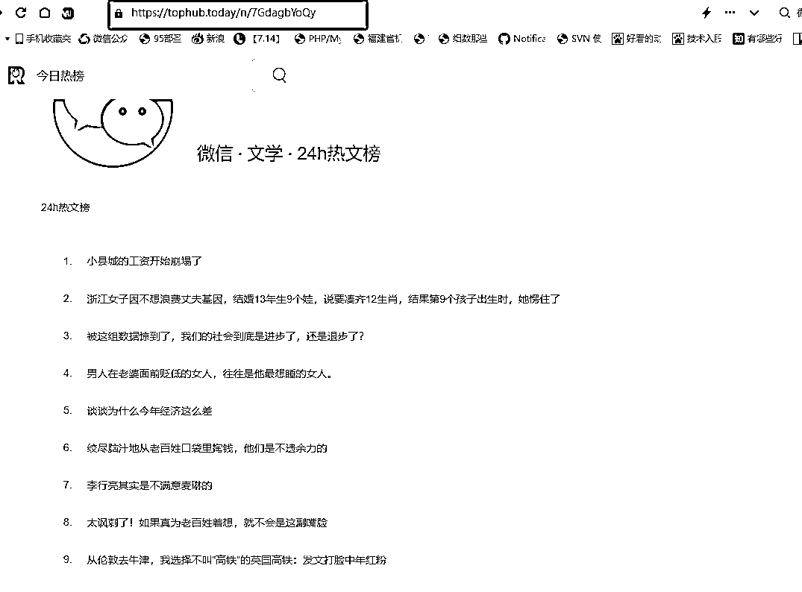
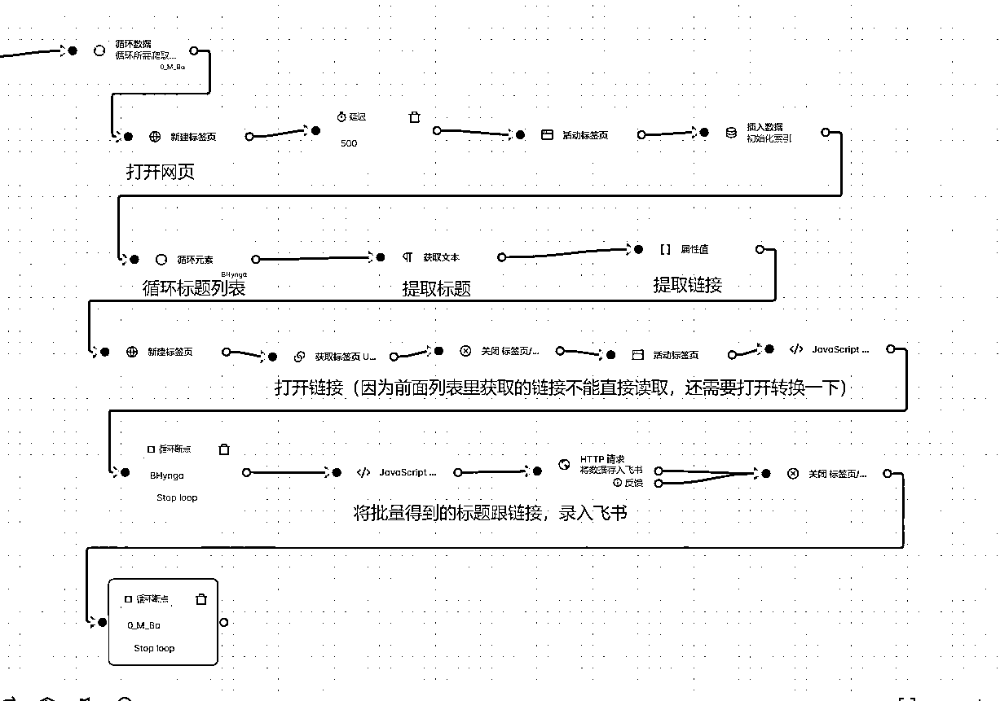
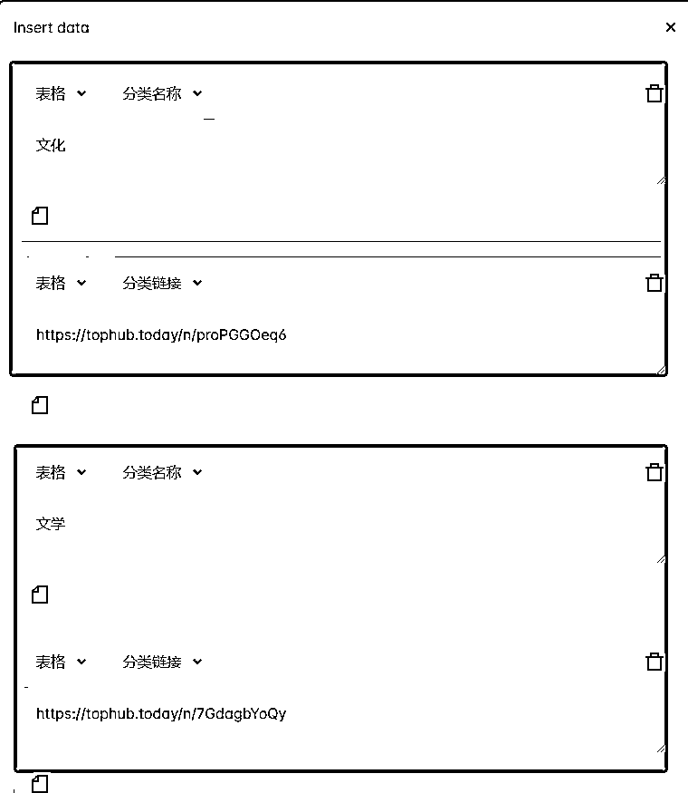

# 解放人力！实现自动爬取热点+自动仿写+自动配图+自动发布。

> 原文：[`www.yuque.com/for_lazy/zhoubao/xhl6d6r0k6k3uk8v`](https://www.yuque.com/for_lazy/zhoubao/xhl6d6r0k6k3uk8v)

## (23 赞)解放人力！实现自动爬取热点+自动仿写+自动配图+自动发布。

作者： 陈序员大康

日期：2024-10-30

上一篇文章：[终于实现了，同时支持公众号文章、小绿书的一键生成+自动配图+自动排版+自动发布（附：最新 RPA 脚本）](https://b121w2zgwyx.feishu.cn/docx/ZRROd7bhBoYoYUxlUbOcAYMBnRh) 我将公众号文章、小绿书两种类似的自动化给合并到了一起。但是由于只支持 国学文章，和金句小绿书的生成。导致不一定满足大家的需求。

因此！这两天我多掉了几根头发，新增了个文章仿写工作流。**这样，一个批量内容生产机器就诞生了** 。以下是工作流仿写的结果：

经过查重网站检查，相似度只有 0.53%，还是可以的，而且内容读起来，AI 味没有非常重

接下来，分享一下如何使用这个仿写功能。

需要飞书查看的可以跳转查看 [`b121w2zgwyx.feishu.cn/docx/XtXedp3Kto7MUpx5xl7cX6JYnhh`](https://b121w2zgwyx.feishu.cn/docx/XtXedp3Kto7MUpx5xl7cX6JYnhh)

# 一、部署 RPA 脚本

首先、前提前提，先按照 [终于实现了，同时支持公众号文章、小绿书的一键生成+自动配图+自动排版+自动发布（附：最新 RPA 脚本）](https://b121w2zgwyx.feishu.cn/docx/ZRROd7bhBoYoYUxlUbOcAYMBnRh)

部署一下脚本。

# 二、仿写功能的使用

如上图，飞书表格中，有一列为参考链接。
大家填写标题之后，如果有需要仿写的，提供一下仿写文章的链接（目前支持公众号链接，其他的没试过）。只有填写了参考链接，工作流就会认为是仿写，会自动调用链接进行仿写和生成。

同样的， **领域、和类型** 是必填的，否则后续会对应不到账号。

# 三、RPA 爬取热点自动录入选题

是的！
有的时候，某些单独的文章，需要自己找链接。可是大多数情况下，大家如果自己去找就很累了，因此我也写了一个 RPA 脚本，可以自动爬取热点文章标题和链接，直接录入选题中，**这样我们连选题都不用自己填了。只要脚本一直跑，就有文章一直生成了。**

我把这个脚本的思路分享给大家一下。

## 1、首先我们用到了今日热榜

网址如下 [`tophub.today/c/news`](https://tophub.today/c/news)

进入之后，我们点击“综合”可以看到，有一个微信的 24 小时热榜

## 2、进入微信热榜，寻找详细领域的热榜

点击微信两字，进入更多的热榜内容页

接着，我们往下拉，看右边，可以找到细分领域的热榜，这就是我需要的了。

## 3、点击进入细分领域热榜，把网址记录下来

记下这个网址，我们接下来就用脚本爬取这个网页内容。

## 4、rpa 爬取脚本大致流程

总体还是比较简单的了。

可以根据这大致思路，爬取自己想要的内容链接，让 AI 仿写。

# 四、脚本配置

社群成员拿到脚本后，同样的进入“插入数据”节点配置一下你需要的爬取的领域类型。

**注意了，一定要成对配置，一条分类名称，一条是分类链接，分类名称，会跟飞书表格里的****领域****对应**

**还有，如果需要爬取更多的，就按照这个格式添加更多的就行了，跟之前不同的是，这个地方用的是表格，不是变量**

好了，快去试试吧！

* * *

评论区：

夏开心支棱起来 : 你好，可以发下这个自动爬取脚本吗？