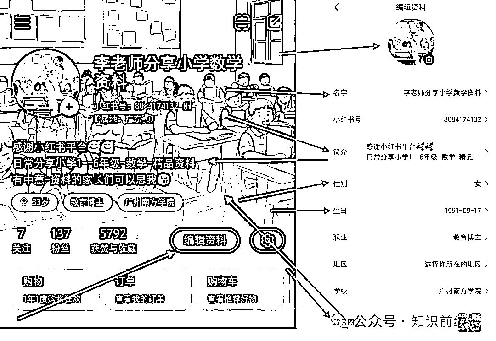
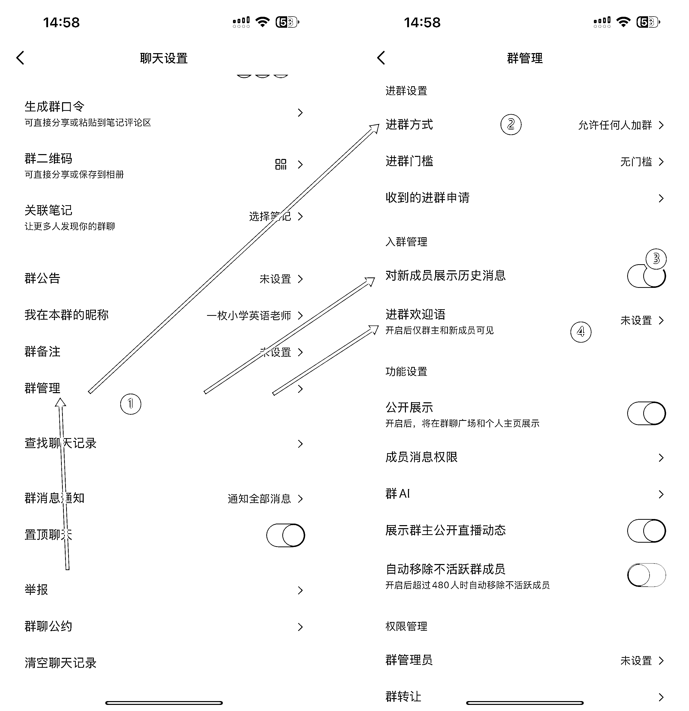
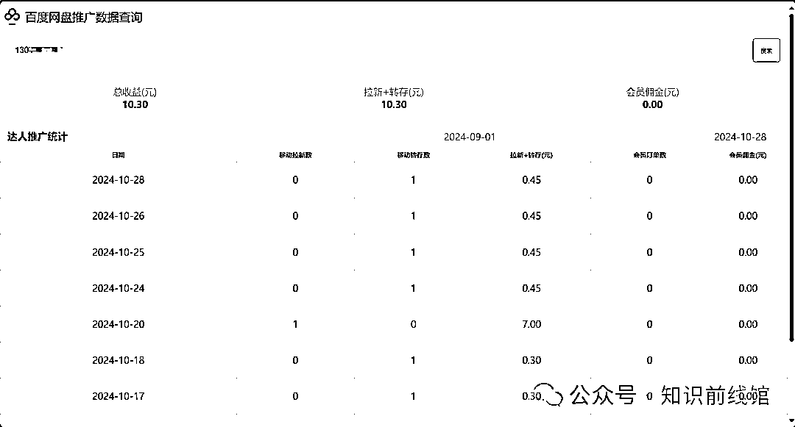

# 小红书引流-虚拟资料（K12 教育），售卖资料-网盘拉新，小白可快速上手！

> 原文：[`www.yuque.com/for_lazy/zhoubao/gx7pg5ood6r7htyk`](https://www.yuque.com/for_lazy/zhoubao/gx7pg5ood6r7htyk)

## (73 赞)小红书引流-虚拟资料（K12 教育），售卖资料-网盘拉新，小白可快速上手！

作者： 馆主

日期：2024-10-30

你好呀！屏幕前的小伙伴们，我是你们的：**馆主 _** ，今天馆主给小伙伴们带来的项目是：小红书引流-虚拟资料

**什么是小红书引流？**

就是通过在小红书发布引流笔记，吸引粉丝联系你，然后你通过一些话术手段，引导用户加你的第三方平台账号：微信或 QQ....

**什么是虚拟资料？**

商品分为两种：实体商品和虚拟商品，而我们这里的虚拟资料就是我们的虚拟商品，虚拟商品说白了就是只能看不能摸的商品（电子资料）。

**那怎么变现呢？**

变现的方式有两种：卖资料//免费送资料--网盘拉新（赚佣金）

好了，项目简介就说到这里了，咱们接下来进入正题！

**项目的全路径：****  **

**  **

## **一、确定赛道**

不过我们做什么赛道之前，第一步就是先了解赛道，然后再细分赛道。

这里咱们讲的是 k12 教育赛道（虚拟资料），可是 k12 是一个很大很大的赛道，我们可不可以把 k12 赛道拆开来选择小赛道，答案是可以的。

k12 教育赛道：幼儿园、小学、初中、高中

从以上的选一个你自己喜欢的赛道，这里馆主选：小学赛道

那（小学）赛道里面可不可以再细分出赛道呢？可以的

我们先来想想，小学一共有几个年级呢？有几个科目呢？

小学一共有六个年级，主要科目有：语文、数学、英语

我们把信息都列出来，就很好地选择赛道了。

咱们可以使用组合方法选择赛道，比如说：你想选 4 年级的英语赛道、你想选 6 年级的数学赛道、你想选 1-3 的语文赛道，等等.....

这里馆主选的是：小学 1-6 年级的数学赛道，但是这样是不是有点太泛了，我们还可以再细分出新赛道吗？可以的

我来考考屏幕前的小伙伴们，咱们读小学的时候，数学一般会用到什么资料呢？列：单元测试卷、期中/期末测试卷、口算练习题、奥数应用题...

嗯嗯，但是这里有一个新的问题？不同地区的数学版本是不一样的，我们不可能把所有地区的数学版本的资料都整理了吧，这是不现实的，那怎么办呢？咱们可以选择通用的，口算通用？肯定通用啊！不就是 0-100 的加减乘除嘛！奥数应用题通用？不就是出几个鸡兔钱..的应用题嘛？

考虑了不同地区的问题，馆主这里选择：小学 1-6 年级数学的口算/奥数应用题赛道。

## 

## **二、整理产品（搭建资料库）**

如何整理产品呢？我们要先看我们确定的是哪个赛道，比如说馆主的赛道是小学 1-6 年级的口算练习题和奥数应用题，那么馆主就要去 pdd 或者淘宝进行搜索购买别人的

演示：口算练习题，奥数应用题也是这样搜索

但是这样找的资料很乱，我们需要筛选，我记得我当初购买后，整理了三天时间，为什么花这么久呢？因为我要把别人 PDF 文档的水印去掉，然后把 pdf 转换成图片，因为后期咱们要拿来发笔记。

**如果你们不想自己动手整理的话，可以找我拿哈！**

**  **

## **

**

## **三、搭建账号**

看到这里可能很多小伙伴就会问，搭建账号都需要说吗，我想说的是，这很重要，好的包装，可以让用户获得信任感，可以让我们的后期成交转化帮助很大。

你是做什么不重要，但是你看起来像是做什么很重要！我们需要两个平台的账号：

第一个是小红书的账号

1、下载小红书，安卓打开【应用商店】--苹果打开【App Store】搜索【小红书】

2、登录，手机号码/QQ/微信都可以，不过一般都是手机号码 images.zsxq.com/FqPwEno5JN0hbmJDwGncEFwGDZP0)

**ps：注意注意：：**

注册好后，就到养号环节了，刚注册的账号不能直接发布笔记，要先活跃 2 天，那么在这两天我们可以干嘛呢？在小红书搜索框：

小学口算练习题///小学奥数题

看看同行他们发的笔记，多看多刷，如果你觉得那篇笔记好了，就收藏起来，收藏 100 篇笔记，这样可以培养我们的网感

账号注意事项：一机一号一 IP

什么意思呢，就是一台手机只能登录一个小红书账号，设备的网络最好是流量，不能频繁的切换网络，会被平台判断你为营销号。

如果你是家用 WiFi，而你只有几台手机，那么可以共连一个 WiFi，没问题

3、包装，账号主页的包装

点击-我-界面，然后点击-编辑资料，这里我们主要修改的是哪些资料呢？

头像、名字、简介、性别、生日、身份、背景图

先从头像说起吧，我们在小红书搜索：教师头像，然后把图片保存到手机上，然后在编辑资料里面上传我们保存好的图片制作成头像

名字，咱们一般都是说：黄老师分享小学数学资料、李老师分享小学数学重点资料、赵老师分享小学奥数题，等等......

简介，这个咱们可以去看看同行怎么写，照着抄就行了，找不到，抄我的也可以。

性别，这里咱们选择女性

生日，这个很重要，馆主这里教你们一个免费领取官方的 1000 流量优惠劵，比如说：你注册这个账号的时间是 2024/10/30，那么我们可以把生日设置比这个时间点多 4 天，也就是 11/4 号，因为我们刚注册的账号不能发笔记，领取太快也是浪费。

身份，这个咱们可以选择教育博主，可选可不选

背景图，去小红书搜索：教室背景图，直接保存图片，然后上传到编辑资料里面就行了。

第二个是微信的账号

如果你有两个微信号，可以直接使用某一个来假装老师微信，如果你只有一个微信，那么如果你不怕影响到你的生活也可以直接，但是馆主建议还是拿小号来玩，没有就去注册一个。

微信我就不讲的那么详细了，毕竟人人都玩微信，你们玩的比我还 6。

主要修改几点：头像、名称、个人简介、朋友圈背景图，朋友圈

头像这个我们直接使用小红书的头像就行了

名称也是使用小红书的名称就行了

朋友圈背景图，可以使用小红书的背景图也可以使用一些生活号的朋友圈背景图，朋友圈更新，生活日常，如果你是男孩子但是你的人设是女孩子，你们可以到小红书上面搜索：教师的朋友圈，偷别人的图来发就行了。

个人简介：一名数学老师，爱整理爱分享

重点来了，重点来了!!!!!!!!!

微信号，我们一定要设置好记得微信号，字母+数字，最好不要超过 8 位数，但是同行都是这样弄的，但是馆主不一样，我直接把微信号设置得很乱，因为这样可以过滤一些不想加你的人，特别是白嫖的人。

看图：

## **

**

## **四、制作作品(爆款+引流)**

我们刚注册的小红书账号是没有权重和标签的，那么我们就需要一些手段快速的让平台给我们的账号打上标签和加重我们的权重，这里我们就需要使用到爆款作品。

爆款笔记：干货笔记//（大字报封面）鸡娃话题笔记

什么是干货笔记呢？就是你的笔记能给你当前赛道人群一眼看到，学到东西的笔记，就叫做干货笔记，说了这么多，不如直接上图演示：

什么是（大字报封面）鸡娃话题笔记，就是一种家长共鸣讨论性笔记 images.zsxq.com/ljNVzsd4eskjf9JIcxoJFRuX0wmN)

这是馆主推荐的爆款笔记制作方法，但是这种笔记只是给你的账号打上标签和权重，没有引流属性，不过这样也有好处，假如你某篇笔记爆了几十万小眼睛，你下一篇发引流笔记，那么这篇笔记会推送到看过你爆款笔记的家长面前，这就是标签的推荐机制。

什么是引流笔记/转化笔记呢？

引流//转化笔记以展示为主，切莫过多营销性质的引导赛道目标人群看到懂的都懂。

说白了，就是截图你的资料文档，发布到小红书上，让需要这份资料的家长联系你。

## **

**

## **五、引流私域**

关键步骤来了，看上图，粉丝在下方评论：求分享、求分享，那么我们怎么引导粉丝加我们的微信呢？还有就是小红书不能发微信，一发就封号。

我们可以有几个方法来解决：都是以群聊为主

第一步：创建群聊

群名称咱们可以写：小学生数学资料库，简介可以写：专注分享小学 1-6 年级的数学资料，家长可以进群领取。

第二步：设置--群管理

点击--右上角...，如何点击--群管理，进群方式（允许任何人加群），把新人入群可以观看历史消息打开（很重要），把进群欢迎语（关闭）

第三步：关联笔记，生成群口令，粘贴到评论区

什么是群聊-关联笔记呢？就是说把该群聊和某篇笔记进行一个绑定，用户观看你的笔记时候，可以看到群聊入口。

但是有些用户不懂怎么办，还在评论区里面叫：求分享，求分享，那么我们就可以把该群生成一个口令，发到该笔记的评论区，粉丝点击就可以加入。

粉丝进群了，怎么办，这就到关键步骤了，这也是核心技术，关系到你能不能引流粉丝加你的微信，由于小红书不能发微信号，那我们怎么让粉丝加到我们的微信呢？馆主这里提供几种方式：

第一种就是，把小红书号，设置成你的微信号

那么我们的话术怎么说呢？

家长们，由于红薯发不了文件，需要领取资料的可以看我主页红薯号，是我的 v 号。(这样家长就会去你的主页查看你的小红书号，然后加你的微信)

第二种是，截图微信号，然后制作成 3 秒视频。看图片，演示：

第三种：投票引流

好了，引流的方式多种多样，馆主目前只使用这些引流技巧，你们也可以去看看同行他们是怎么引流你的，学一下哈。

**同行是最好的老师，而我只是你的小助理，辅助你入门而已。**

## **

****六、成交转化（变现）**

粉丝加你微信后，你怎么转化变现呢？变现的方式有哪些呢？

馆主这里提供了，两种变现方式：直接卖资料||开通网盘拉新（送资料）

先来看第一种：售卖资料

我们先准备好话术，怎么去卖我们的资料，你们先去加几个同行看看别人是怎么卖的，当然这里馆主是不按照别人的方法来的，我都是自己编辑的话术，我感觉我的销售能力还不错，好了，先看我的话术吧！

第二种：网盘拉新（百度网盘，夸克网盘）

先把资料上传到网盘里面，然后复制下方的链接，浏览器打开，注册账号

[`dt.bd.cn/#/pages/index/components/detail?appId=649&invite_code=831247`](https://dt.bd.cn/#/pages/index/components/detail?appId=649&invite_code=831247)

点击-右下角的【申请推广码】，点击-【去登录】，点击-【去注册】

名称、手机号码、验证码、密码，填写好之后，就点击-立即注册

如何开通推广权限

1、获取 UK 码，使用你的百度网盘扫码如下二维码，进行渠道关系绑定(如扫码出现无法参与/绑定失败、则需换其他网盘账号扫码绑定。)，由于生财不能放所以二维码，大家哪里看不懂的可以来咨询我。

2、复制 UK 码+绑定成功截图，温馨提示:度盘联盟是平台机构名称，请复制 K 填写报备 UK 号码，报备 K 填错将影响您的结算

3、填写报备信息，我们如果还没进入报备信息，就点击-右下角的申请推广码 images.zsxq.com/FhuXEJLgX-dGy_3zFF9Hn-u6wMa6)

这里拆解一下信息填写，手机号码和姓名默认即可，网盘 UK 就是我们刚刚扫码绑定的那个 UK 码，复制粘贴即可，领域咱们选：资料，分享方式：小红书，媒体账号主页截图，我们把我们的小红书主页截图即可，账号绑定成功图，就是我们刚刚用百度网盘扫码的那个成功图，馆主刚刚叫你们截图了，粉丝数量，咱们的小红书粉丝有多少写多少。

重点来了，重点来了，分享链接，这个咱们把我们百度网盘的资料分享链接粘贴进来即可，只需要公开链接，不需要文字。选一条网盘资源链接，网盘内得其他链接也可以推

咱们来看看效果图：

收益图：

刚开始的，由于百度网盘的老用户比较多所以都是转存收益，不过现在我开始推广夸克网盘，我相信很多家长都没有使用过。

百度网盘的佣金价格表：

夸克网盘的推广链接：[`dt.bd.cn/#/pages/index/components/detail?appId=90&invite_code=831247`](https://dt.bd.cn/#/pages/index/components/detail?appId=90&invite_code=831247)

算了，馆主这里也叫小伙伴们怎么开通夸克网盘推广权限吧？

1、下载好夸克，然后注册登录，返回到本篇文章，复制以下链接到夸克[`b.quark.cn/apps/c3qMkYerj/routes/J1bMu5GVq?uc_param_str=dsdnfrpfbivesscpgimibtbmnijblauputogpintnwktprchmt&uc_biz_str=S:custom|C:titlebar_hover_2`](https://b.quark.cn/apps/c3qMkYerj/routes/J1bMu5GVq?uc_biz_str=S:custom|C:titlebar_hover_2&uc_param_str=dsdnfrpfbivesscpgimibtbmnijblauputogpintnwktprchmt)

用夸克打开，绑定服务商为任推邦(标识必须为:1002)，非常重要，绑定成功才能归因数据!(绑定后不可解绑,解绑无法出数据，同时该 UID 无法再次绑定。)

1.绑定成功页面需截图备用

2.绑定时会显示您的夸克 UID，可以复制好，申请推广码填报备信息时要提交

3.如果忘记截图可重新点链接截取，一定不能点解绑

点击-申请推广码，看说明填写好信息，点击-【立即申请】,等待即可

夸克网盘的佣金价格表：

这里馆主跟小伙伴们聊聊模式，之前我在想资料直接卖，一单是 19 块钱，但是我引流了 100 个人就成交了 30 个人，赚了 600 块钱，然后我就在想如果我网盘拉新，一单 7 块钱，100 人有 80 人推广到，可能有 70 人是新用户，那么就是：70*7=490+转存 49=500~，但是我现在一天能 20-30 人，一个月就是：600 人，可以说是很香的，网盘拉新减少了我们的运营时间成本，可以让我们去研究更换的项目。

偷偷的跟你们讲，馆主就一个小红书号跑而已，你们想想我用十台手机跑这个赛道会是什么样子，为什么不扩大，这里原因就不想说了，一个字，看不上，想赚大钱！！！哈哈哈哈。

## **小结**

感谢大家耐心的看完我本次的项目拆解，这里是：知识前线馆，我是你们的：馆主，后续馆主折腾出新项目，也会第一时间拆解给小伙伴们！

如果你觉得本文对你有帮助，下方：点赞/收藏/评论，安排起来！

* * *

评论区：

馆主 : 这篇文章可是花了我几个小时才写出来的，细节馆主已经尽力的描述出来了，全文 5k 字，没有废话。想理解副业的项目可以看看，我个人感觉很适合的一个副业项目，细节毫无保留的描述出来了，感谢生财提供的圈子[呲牙][呲牙][呲牙]，我第一期的航海项目，已经可以写作分享给别人了[呲牙]

源 : 给你点个赞

君の名は : 谢谢你，每次你发的文章我都会仔细去看，然后做成思维导图或者大纲，每次看一遍都会收获很多

馆主 : 太棒了，圈友[强][强]，群里面有小伙伴需要思维导图的可以跟这位圈友交流哈。

李昊 : 太牛啦

李昊 : 沟通一下

未央 : 你好，求分享资料

馆主 : 复制这个链接，去微信上找你的鱼丸，对接就行了